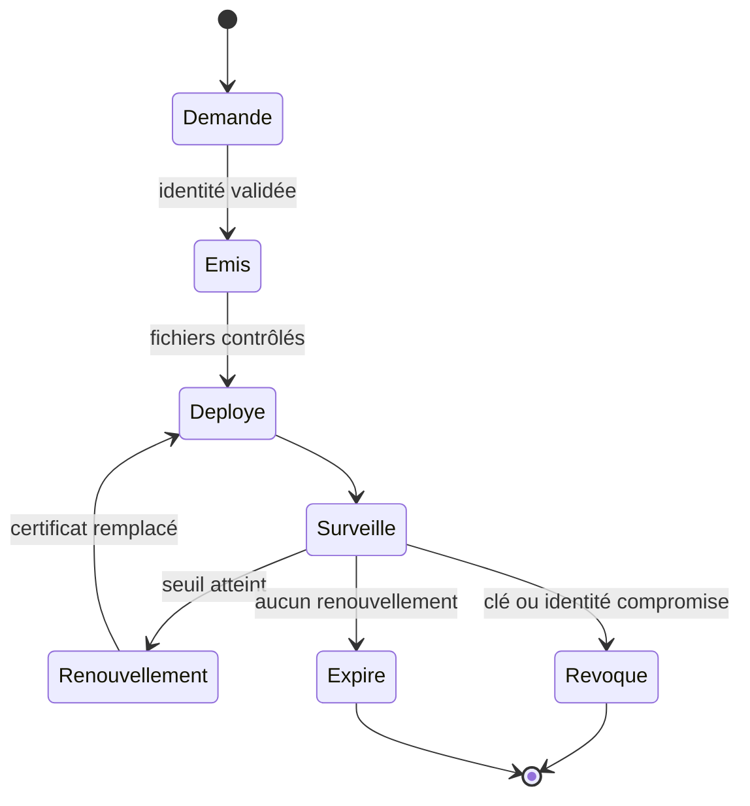
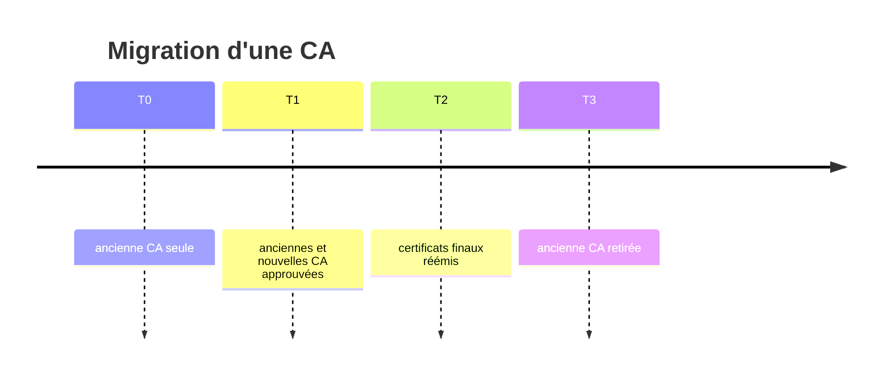

# Chapitre 7.6 — Renouveler et révoquer les certificats

> **Campagne 7 — TLS et PKI**

> *« Un certificat qui fonctionne aujourd'hui est un état temporaire ; l'exploitation commence quand on prépare son remplacement. »*

## Vous êtes ici

```text
PARTIE I — Construire un socle sécurisé

Campagne 7

  7.1 Comprendre la cryptographie appliquée ✔
  7.2 Lire et vérifier les certificats X.509 ✔
  7.3 Construire une autorité de certification ✔
  7.4 Authentifier les deux extrémités avec mTLS ✔
  7.5 Préparer l'intégration à FreeIPA ✔
► 7.6 Renouveler et révoquer les certificats
  7.7 Sécuriser Sentinel avec TLS
```

## Objectifs pédagogiques

À l'issue de ce chapitre, vous serez capable de :

- distinguer expiration, renouvellement, remplacement de clé et révocation ;
- surveiller la durée de validité restante avec OpenSSL ;
- préparer un remplacement atomique et un redémarrage contrôlé de Sentinel ;
- concevoir une période de chevauchement des ancres de confiance ;
- expliquer les limites opérationnelles des CRL et d'OCSP.

## Pourquoi ce chapitre existe

Un certificat à durée limitée réduit le temps pendant lequel une identité compromise reste utilisable, mais crée une échéance certaine. Si le renouvellement n'est testé qu'au dernier jour, cette protection devient une cause de panne.

À l'inverse, renouveler automatiquement un fichier sans faire recharger le service donne une illusion de sécurité : le disque contient le nouveau certificat tandis que le processus présente encore l'ancien.

## Le cycle de vie complet



| Opération | Déclencheur | Conséquence |
| --- | --- | --- |
| renouvellement | échéance approchante | nouveau certificat, identité généralement stable |
| rekey | politique ou suspicion sur la clé | nouvelle clé privée et nouveau certificat |
| révocation | compromission, erreur d'émission, retrait | certificat déclaré non valable avant sa date de fin |
| expiration | date de fin atteinte | refus par un client qui vérifie correctement |
| remplacement de CA | cycle de vie ou incident de l'autorité | migration des ancres et des chaînes |

## Surveiller avant l'urgence

Affichez les dates :

```bash
openssl x509 -in /etc/sentinel/tls/server.crt -noout \
  -subject -issuer -serial -dates
```

Testez une fenêtre de trente jours :

```bash
if openssl x509 \
  -in /etc/sentinel/tls/server.crt \
  -checkend 2592000 \
  -noout; then
  echo 'certificat valide au-delà de 30 jours'
else
  echo 'renouvellement nécessaire dans moins de 30 jours'
fi
```

Le seuil doit être supérieur au délai nécessaire pour détecter, émettre, déployer et corriger un échec. Une alerte à vingt-quatre heures est trop tardive pour une procédure humaine.

Avec `certmonger` :

```bash
sudo getcert list
sudo journalctl -u certmonger --since today
```

Surveillez au moins : état de la demande, date d'expiration, dernier échec, chemin cible et identité demandée.

## Renouveler sans créer une panne

Une procédure fiable sépare quatre étapes.


### 1. Valider hors ligne

```bash
openssl verify \
  -CAfile /etc/sentinel/tls/clients-ca.crt \
  -purpose sslserver \
  -verify_hostname sentinel.sentinel.lab \
  /etc/sentinel/tls/server.crt.new

openssl x509 -in /etc/sentinel/tls/server.crt.new -noout \
  -subject -issuer -dates -ext subjectAltName
```

Comparez aussi la clé publique du nouveau certificat avec la clé privée cible, comme au chapitre 7.2.

### 2. Installer avec des métadonnées explicites

```bash
sudo install -o root -g sentinel -m 0640 \
  /etc/sentinel/tls/server.crt.new \
  /etc/sentinel/tls/server.crt.next

sudo restorecon -v /etc/sentinel/tls/server.crt.next
```

Un outil de gestion de certificats peut écrire directement le fichier final de manière sûre. Si une procédure maison est utilisée, évitez l'écriture partielle et conservez une copie de retour arrière protégée.

### 3. Faire charger le nouveau certificat

Sentinel `0.5.0` charge le contexte TLS au démarrage et n'implémente pas de rechargement sur `SIGHUP`. Il faut donc redémarrer le service :

```bash
sudo mv /etc/sentinel/tls/server.crt \
  /etc/sentinel/tls/server.crt.previous
sudo mv /etc/sentinel/tls/server.crt.next \
  /etc/sentinel/tls/server.crt
sudo restorecon -v /etc/sentinel/tls/server.crt
sudo systemctl restart sentinel
```

Cette courte interruption est un choix explicite du jalon pédagogique. Un futur service à haute disponibilité utiliserait plusieurs instances ou implémenterait un rechargement testé.

### 4. Prouver le résultat

```bash
systemctl is-active sentinel

openssl s_client \
  -connect sentinel.sentinel.lab:8443 \
  -servername sentinel.sentinel.lab \
  -CAfile /etc/sentinel/tls/clients-ca.crt \
  -cert /etc/sentinel/tls/healthcheck.crt \
  -key /etc/sentinel/tls/healthcheck.key </dev/null \
  2>/dev/null \
  | openssl x509 -noout -serial -dates

sudo -u sentinel /opt/sentinel/sentinel \
  --config /etc/sentinel/sentinel.conf \
  --healthcheck
```

Vérifiez le numéro de série présenté, pas uniquement le contenu du fichier sur disque.

## Préparer le retour arrière

Si le redémarrage échoue :

```bash
sudo journalctl -u sentinel -n 50 --no-pager
sudo mv /etc/sentinel/tls/server.crt \
  /etc/sentinel/tls/server.crt.failed
sudo mv /etc/sentinel/tls/server.crt.previous \
  /etc/sentinel/tls/server.crt
sudo restorecon -v /etc/sentinel/tls/server.crt
sudo systemctl restart sentinel
```

Le retour arrière n'est valide que si l'ancien certificat n'est ni expiré ni révoqué et si sa clé n'est pas compromise. Dans un incident de clé, revenir à la clé suspecte serait dangereux.

## Révoquer n'est pas supprimer

Supprimer un fichier sur le serveur empêche ce processus de l'utiliser, mais les copies existantes restent cryptographiquement valides jusqu'à expiration. La CA doit publier le retrait avant terme.

Deux mécanismes sont courants :

| Mécanisme | Principe | Limite opérationnelle |
| --- | --- | --- |
| CRL | liste signée des numéros révoqués | téléchargement, fraîcheur et taille |
| OCSP | interrogation d'un répondeur pour un certificat | disponibilité, cache et confidentialité |

Le client TLS doit effectivement consulter et valider cette information. Publier une CRL ne protège pas un service dont la bibliothèque n'est pas configurée pour l'utiliser.

Le checkpoint Sentinel `0.5.0` valide la chaîne avec la bibliothèque Python, mais ne configure pas encore explicitement CRL ou OCSP. La révocation reste donc une limite documentée du jalon, compensée dans le laboratoire par des certificats clients courts et le retrait de la CA ou de l'identité autorisée lorsque cela est nécessaire.

## Faire évoluer une ancre de confiance

Pour remplacer une CA sans interruption :

1. distribuez un bundle contenant ancienne et nouvelle racines ;
2. vérifiez que les clients approuvent les deux ;
3. déployez les certificats signés par la nouvelle hiérarchie ;
4. observez tous les consommateurs pendant la période de chevauchement ;
5. retirez l'ancienne racine à une date annoncée ;
6. prouvez qu'un ancien certificat est désormais refusé.



Le bundle temporaire est une migration, pas un état à conserver indéfiniment.

> **Regard sécurité — Automatiser aussi la preuve**
>
> Une tâche qui remplace un fichier sans vérifier le nom, l'EKU, la chaîne, les permissions, le contexte SELinux et le certificat réellement présenté automatise seulement le risque. Le test post-déploiement appartient au processus de renouvellement.

## Synthèse

- l'expiration est prévisible et doit être supervisée suffisamment tôt ;
- renouveler le fichier ne suffit pas : le processus doit charger le nouveau certificat ;
- Sentinel `0.5.0` nécessite un redémarrage contrôlé ;
- le retour arrière dépend de la raison du remplacement ;
- une révocation doit être publiée **et vérifiée** par les pairs ;
- une migration de CA utilise une période de chevauchement bornée et testée.

## Pour aller plus loin

Le dernier chapitre assemble la PKI, mTLS, systemd, SELinux et les tests cumulatifs dans Sentinel `0.5.0`. Les principes généraux de gestion de clés sont détaillés dans la [recommandation NIST SP 800-57 Part 1 Rev. 5](https://csrc.nist.gov/pubs/sp/800/57/pt1/r5/final).
