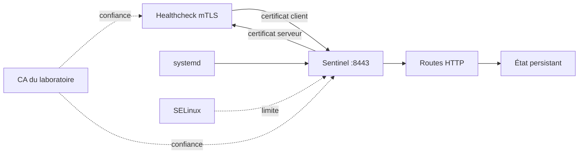
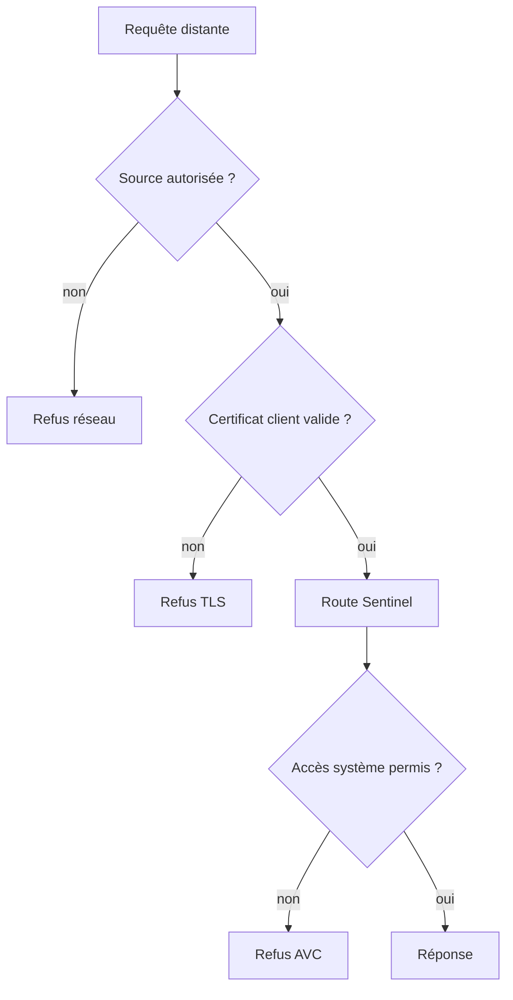

# Chapitre 7.7 — Sécuriser Sentinel avec TLS

> **Campagne 7 — TLS et PKI**

> *« Une protection TLS n'est terminée que lorsque les bons pairs communiquent, que les mauvais sont refusés et que le prochain renouvellement est prévu. »*

## Vous êtes ici

```text
PARTIE I — Construire un socle sécurisé

Campagne 7

  7.1 Comprendre la cryptographie appliquée ✔
  7.2 Lire et vérifier les certificats X.509 ✔
  7.3 Construire une autorité de certification ✔
  7.4 Authentifier les deux extrémités avec mTLS ✔
  7.5 Préparer l'intégration à FreeIPA ✔
  7.6 Renouveler et révoquer les certificats ✔
► 7.7 Sécuriser Sentinel avec TLS
```

## Objectifs pédagogiques

À l'issue de ce chapitre, vous serez capable de :

- faire évoluer Sentinel `0.4.0` vers le checkpoint `0.5.0` ;
- déployer séparément code, configuration, certificats et clés privées ;
- activer TLS puis mTLS sans casser le service systemd existant ;
- valider la chaîne, le nom DNS, la disponibilité et les refus attendus ;
- documenter les limites du jalon et préparer son intégration à FreeIPA.

## Pourquoi ce chapitre existe

Les chapitres précédents ont étudié les objets séparément. Sentinel doit maintenant les réunir sans perdre ce qui a déjà été acquis : état persistant, routes de santé, arrêt propre, journalisation, sandbox systemd et confinement SELinux.

Le nouveau code reste volontairement petit. La difficulté pédagogique se trouve dans le contrat entre le programme, les identités X.509 et le système Linux.

## Architecture cible



Les responsabilités restent distinctes :

| Couche | Responsabilité |
| --- | --- |
| Firewalld | limiter les sources réseau capables de joindre `8443/tcp` |
| TLS | protéger le transport et authentifier les certificats |
| Sentinel | servir les routes et, dans une version ultérieure, autoriser l'identité |
| systemd | gérer le cycle de vie et le healthcheck |
| SELinux | limiter les fichiers et opérations accessibles au processus |
| PKI | émettre, renouveler et révoquer les identités |

## Découvrir le checkpoint `0.5.0`

Depuis la racine du dépôt de formation :

```bash
cd sentinel/labs/sentinel-app/checkpoints/0.5.0
find src -maxdepth 1 -type f -printf '%f\n' | sort
```

À partir de cette version, `sentinel.py` est une façade exécutable. Les responsabilités introduites au fil des campagnes sont séparées :

```text
src/
├── cli.py
├── configuration.py
├── diagnostic.py
├── logging_support.py
├── runtime.py
├── sentinel.py
├── state.py
├── tls_support.py
├── version.py
└── web.py
```

Le module `tls_support.py` sépare les deux extrémités du canal :

- contexte serveur chargé par `web.py` ;
- contexte client chargé par le healthcheck dans `runtime.py`.

La configuration refuse de démarrer en mode TLS si un fichier requis manque. Un échec fermé est préférable à un retour silencieux en HTTP.

## Étape 1 — Valider le checkpoint hors du service

```bash
python3 -m unittest discover -s tests -v
python3 src/sentinel.py --version
python3 src/sentinel.py --config config/sentinel.conf --check-config
```

Le fichier de référence garde `enabled = false` afin que les tests de base restent exécutables sans secret dans Git. Les tests incluent toutefois une PKI éphémère et une connexion mTLS réelle lorsque la commande `openssl` est disponible.

## Étape 2 — Installer le code complet

Depuis le checkpoint :

```bash
sudo install -d -o root -g root -m 0755 /opt/sentinel

sudo install -o root -g root -m 0755 \
  src/sentinel.py /opt/sentinel/sentinel

sudo install -o root -g root -m 0444 \
  src/cli.py \
  src/configuration.py \
  src/diagnostic.py \
  src/logging_support.py \
  src/runtime.py \
  src/state.py \
  src/tls_support.py \
  src/version.py \
  src/web.py \
  /opt/sentinel/
```

Ne copiez pas uniquement `sentinel.py` : le lanceur importe les modules voisins. Le code appartient à `root` et n'est pas modifiable par le compte de service.

```bash
sudo -u sentinel /opt/sentinel/sentinel --version
```

Résultat attendu :

```text
sentinel 0.5.0
```

## Étape 3 — Installer les matériaux TLS

Réutilisez les fichiers construits au chapitre 7.3 :

```bash
sudo install -d -o root -g sentinel -m 0750 /etc/sentinel/tls

sudo install -o root -g sentinel -m 0640 \
  ~/sentinel-pki/issued/sentinel-server-chain.crt \
  /etc/sentinel/tls/server.crt

sudo install -o root -g sentinel -m 0640 \
  ~/sentinel-pki/private/sentinel-server.key \
  /etc/sentinel/tls/server.key

sudo install -o root -g sentinel -m 0640 \
  ~/sentinel-pki/issued/clients-ca-chain.crt \
  /etc/sentinel/tls/clients-ca.crt

sudo install -o root -g sentinel -m 0640 \
  ~/sentinel-pki/issued/healthcheck-client-chain.crt \
  /etc/sentinel/tls/healthcheck.crt

sudo install -o root -g sentinel -m 0640 \
  ~/sentinel-pki/private/healthcheck-client.key \
  /etc/sentinel/tls/healthcheck.key

sudo restorecon -RFv /etc/sentinel/tls
```

Vérifiez les métadonnées sans afficher le contenu des clés :

```bash
sudo stat -c '%U %G %a %n' /etc/sentinel/tls/*
sudo ls -lZ /etc/sentinel/tls
sudo -u sentinel test -r /etc/sentinel/tls/server.key
sudo -u nobody test ! -r /etc/sentinel/tls/server.key
```

Le dernier test peut varier selon les protections du système, mais un compte sans relation avec Sentinel ne doit pas lire les clés.

## Étape 4 — Activer mTLS dans la configuration

Créez `/etc/sentinel/sentinel.conf` :

```ini
[server]
listen_address = 0.0.0.0
listen_port = 8443

[storage]
state_directory = /var/lib/sentinel

[logging]
level = INFO

[tls]
enabled = true
certificate = /etc/sentinel/tls/server.crt
private_key = /etc/sentinel/tls/server.key
client_ca = /etc/sentinel/tls/clients-ca.crt
require_client_certificate = true

[healthcheck]
server_name = sentinel.sentinel.lab
certificate = /etc/sentinel/tls/healthcheck.crt
private_key = /etc/sentinel/tls/healthcheck.key
```

Installez les permissions attendues :

```bash
sudo chown root:sentinel /etc/sentinel/sentinel.conf
sudo chmod 0640 /etc/sentinel/sentinel.conf
sudo restorecon -v /etc/sentinel/sentinel.conf
```

Le nom `sentinel.sentinel.lab` doit se résoudre vers l'hôte depuis le contexte réseau du service. Il sert à vérifier SAN, tandis que `0.0.0.0` indique seulement où écouter.

Validez avant de toucher au service actif :

```bash
sudo -u sentinel /opt/sentinel/sentinel \
  --config /etc/sentinel/sentinel.conf \
  --check-config
```

## Étape 5 — Conserver le contrat systemd

L'unité construite en campagne 5 continue d'utiliser :

```ini
ExecStart=/opt/sentinel/sentinel --config /etc/sentinel/sentinel.conf serve
ExecStartPre=/opt/sentinel/sentinel --config /etc/sentinel/sentinel.conf --check-config
ExecStartPost=/opt/sentinel/sentinel --config /etc/sentinel/sentinel.conf --healthcheck
```

Si le healthcheck local démarre avant que le DNS ne soit disponible, corrigez l'ordre de démarrage ou la résolution ; ne désactivez pas la vérification du nom.

Rechargez l'unité uniquement si son fichier a changé, puis redémarrez :

```bash
sudo systemctl daemon-reload
sudo systemctl restart sentinel
sudo systemctl status sentinel --no-pager
sudo journalctl -u sentinel -n 50 --no-pager
```

La première preuve est que le service devient actif. Elle ne suffit pas à valider TLS.

## Étape 6 — Prouver les connexions

### Vérifier le certificat présenté

```bash
openssl s_client \
  -connect sentinel.sentinel.lab:8443 \
  -servername sentinel.sentinel.lab \
  -verify_hostname sentinel.sentinel.lab \
  -verify_return_error \
  -CAfile ~/sentinel-pki/root/root-ca.crt \
  -cert ~/sentinel-pki/issued/healthcheck-client-chain.crt \
  -key ~/sentinel-pki/private/healthcheck-client.key </dev/null
```

### Vérifier `/ready`

```bash
curl --fail-with-body \
  --cacert ~/sentinel-pki/root/root-ca.crt \
  --cert ~/sentinel-pki/issued/healthcheck-client-chain.crt \
  --key ~/sentinel-pki/private/healthcheck-client.key \
  https://sentinel.sentinel.lab:8443/ready
```

Résultat attendu :

```json
{"status":"ready"}
```

### Prouver le refus sans certificat client

```bash
curl --fail-with-body \
  --cacert ~/sentinel-pki/root/root-ca.crt \
  https://sentinel.sentinel.lab:8443/health
```

La négociation doit échouer. Une réponse `200` indiquerait que le certificat client n'est pas réellement obligatoire.

### Prouver le refus d'une mauvaise CA

```bash
curl --fail-with-body \
  --cacert /etc/pki/tls/certs/ca-bundle.crt \
  --cert ~/sentinel-pki/issued/healthcheck-client-chain.crt \
  --key ~/sentinel-pki/private/healthcheck-client.key \
  https://sentinel.sentinel.lab:8443/ready
```

Le client doit refuser la CA privée absente de son magasin générique. N'ajoutez pas la racine de laboratoire au magasin global uniquement pour ce test ; `--cacert` maintient la confiance locale au besoin.

## Étape 7 — Revalider réseau et SELinux

TLS ne remplace pas la matrice de flux :

```bash
sudo ss -ltnp | grep ':8443'
sudo firewall-cmd --list-all
sudo ausearch -m AVC -ts recent
```

L'écoute doit être limitée par la politique Firewalld définie en campagne 3. Le domaine SELinux de Sentinel doit pouvoir lire les fichiers TLS prévus, sans recevoir un accès général à `/etc`.



Chaque refus est attendu à une couche différente. Les journaux et outils de diagnostic doivent permettre de le localiser.

## Jalon Sentinel

### État de départ

Sentinel `0.4.0` fournit le serveur HTTP, `/health`, `/ready`, `/api/v1/status`, l'intégration systemd, les journaux structurés et l'arrêt propre. La campagne 6 a ajouté le confinement SELinux sans modifier le code.

### Besoin

Le réseau ne doit plus pouvoir observer ou modifier les diagnostics en clair. Le serveur doit présenter une identité vérifiable et pouvoir refuser un client qui ne possède pas de certificat approuvé.

### Modification

Le checkpoint `0.5.0` ajoute :

- les paramètres `[tls]` et `[healthcheck]` dans la configuration ;
- `tls_support.py` pour les contextes serveur et client ;
- l'enveloppement TLS de la socket HTTP dans `web.py` ;
- le healthcheck HTTPS avec certificat client dans `runtime.py` ;
- la validation des matériaux TLS avant le démarrage.

### Migration

Les anciennes options et routes sont conservées. TLS reste désactivé par défaut dans le fichier de référence pour permettre les tests sans clés. L'exploitation active explicitement TLS après installation des certificats.

### Preuves

- tests cumulatifs Python réussis ;
- configuration valide sous l'identité `sentinel` ;
- chaîne et nom serveur vérifiés ;
- `/ready` accessible avec le certificat client ;
- certificat réellement présenté et date d'expiration observés ;
- absence d'AVC inattendue.

### Échecs attendus

- démarrage refusé si un fichier TLS requis est absent ;
- connexion refusée sans certificat client ;
- connexion refusée avec une CA ou un nom DNS incorrect ;
- healthcheck en échec si l'identité cliente n'est plus lisible.

### Livrable

Le checkpoint `0.5.0`, sa configuration d'exploitation, la procédure de renouvellement et les preuves de tests deviennent l'entrée de la campagne 8.

## Limite volontaire du jalon

Sentinel `0.5.0` accepte tout certificat client dont la chaîne remonte à `client_ca` et dont l'usage est compatible. Il n'interprète pas encore le SAN pour décider si cette identité précise est autorisée.

La campagne 8 fera évoluer l'application en `0.6.0` : validation TLS d'abord, extraction d'une identité gérée par FreeIPA ensuite, autorisation explicite enfin. Ne présentez donc pas la possession d'un certificat valide comme une autorisation complète.

## Synthèse

- le code, la configuration, les certificats et les clés ont des propriétaires distincts ;
- `sentinel.py` reste la façade stable tandis que TLS est isolé dans son module ;
- la configuration échoue de manière fermée si les matériaux requis manquent ;
- un test réussi et plusieurs refus attendus prouvent le comportement ;
- Firewalld, TLS, systemd et SELinux restent complémentaires ;
- `0.5.0` authentifie une chaîne cliente, tandis que `0.6.0` ajoutera l'autorisation d'identité.

## Pour aller plus loin

La campagne 8 remplace progressivement la PKI manuelle par FreeIPA, Dogtag et `certmonger`, puis autorise les identités clientes dans Sentinel. Conservez les preuves de cette mission : elles serviront de comparaison lors de la migration.
