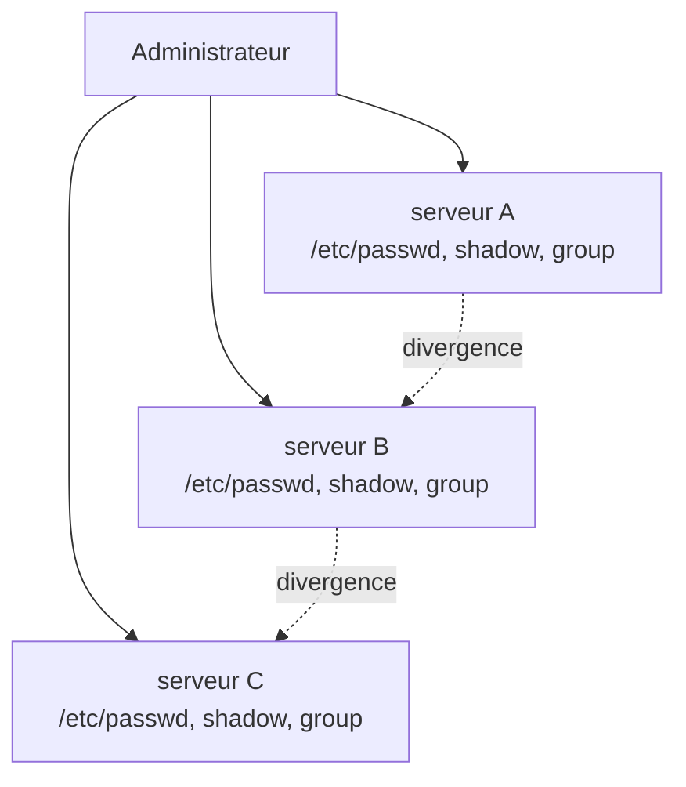
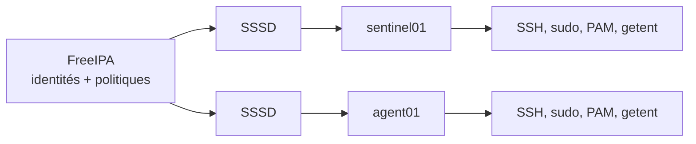

# Chapitre 8.1 — Découvrir FreeIPA et la gestion centralisée des identités

> **Campagne 8 — FreeIPA**
>
> *« Une identité copiée sur cent machines devient cent problèmes de cycle de vie. »*

## Vous êtes ici

```text
Partie II — Industrialiser la sécurité

Campagne 8 — FreeIPA

    ► 8.1 Présentation de FreeIPA
      8.2 Architecture interne
      8.3 Installation du serveur
      8.4 Gestion des utilisateurs
      8.5 Groupes et rôles
      8.6 Politiques sudo
      8.7 Hôtes et règles HBAC
      8.8 Certificats
      8.9 Intégration de Sentinel
      8.10 Mission d'administration
```

## Objectifs pédagogiques

À la fin de ce chapitre, vous serez capable de :

- expliquer les limites des comptes locaux dans un parc ;
- décrire les services centralisés par FreeIPA ;
- distinguer identité, authentification et autorisation ;
- comprendre ce qui reste local sur un client AlmaLinux ;
- situer FreeIPA dans l'évolution de Sentinel.

## Pourquoi ce chapitre existe

Les campagnes précédentes ont sécurisé un serveur. Une entreprise doit cependant gérer le départ d'un utilisateur, une clé SSH, une délégation `sudo` ou un certificat sur des dizaines de machines. Répéter les mêmes modifications localement crée des écarts et rend les preuves difficiles.

FreeIPA, appelé **Identity Management** ou **IdM** dans la documentation RHEL, fournit un domaine d'identités et de politiques pour les systèmes Linux.

## Le coût des identités locales

Avec des comptes uniquement locaux, chaque hôte possède sa propre vérité :



Les difficultés ne concernent pas seulement la création :

- le même identifiant numérique doit rester cohérent sur des partages de fichiers ;
- le changement ou le verrouillage d'un mot de passe doit atteindre tous les hôtes ;
- les clés SSH et groupes secondaires vieillissent différemment ;
- les règles `sudo` locales deviennent difficiles à comparer ;
- le départ d'une personne exige de retrouver toutes ses traces.

Un outil d'automatisation peut recopier des fichiers, mais il ne transforme pas ces copies en véritable service d'identité avec authentification, politiques et cycle de vie.

## FreeIPA : un domaine de confiance Linux

FreeIPA assemble plusieurs services éprouvés derrière une API, une ligne de commande et une interface Web communes.

| Besoin | Capacité FreeIPA |
|---|---|
| utilisateurs et groupes | annuaire central |
| authentification forte | domaine Kerberos |
| résolution d'identités sur les clients | SSSD, NSS et PAM |
| machines et services | principaux et objets d'hôtes |
| délégation administrative | permissions, privilèges et rôles |
| accès aux hôtes | règles HBAC |
| commandes privilégiées | règles `sudo` centralisées |
| certificats | autorité Dogtag et suivi `certmonger` |
| découverte de services | DNS et enregistrements SRV |



FreeIPA n'est donc ni « un LDAP avec une interface » ni un gestionnaire de mots de passe. L'annuaire stocke des objets, Kerberos authentifie, les politiques décident d'un périmètre et les clients consomment ces services.

## Identité, authentification et autorisation

Ces trois notions répondent à des questions différentes :

| Notion | Question | Exemple |
|---|---|---|
| identité | qui est présenté ? | `alice`, `sentinel01`, `HTTP/sentinel01...` |
| authentification | comment cette identité est-elle prouvée ? | mot de passe Kerberos, `keytab`, certificat |
| autorisation | que peut-elle faire ici ? | ouvrir une session, relancer Sentinel, appeler l'API |

Une authentification réussie ne donne pas automatiquement accès à tous les hôtes ni à toutes les fonctions. Cette séparation sera centrale dans Sentinel `0.6.0` : TLS validera le certificat client, puis l'application décidera si son identité DNS est autorisée.

## Le domaine DNS et le royaume Kerberos

Le laboratoire utilisera :

```text
Domaine DNS : sentinel.example.test
Royaume     : SENTINEL.EXAMPLE.TEST
Serveur IdM : ipa01.sentinel.example.test
Serveur app : sentinel01.sentinel.example.test
Client      : agent01.sentinel.example.test
```

`.test` est réservé aux exemples et convient à un laboratoire fermé. En production, utilisez un sous-domaine stable que l'organisation contrôle. Le royaume Kerberos est traditionnellement écrit en majuscules ; domaine et royaume sont liés, mais ce ne sont pas le même objet.

## Ce qui reste local

Rejoindre un domaine ne supprime pas les comptes nécessaires au démarrage : `root`, les comptes techniques de la distribution et le compte système `sentinel` restent dans les fichiers locaux.

```bash
getent passwd root
getent passwd sentinel
getent passwd alice
```

`getent` interroge les sources configurées dans NSS : la sortie ne révèle pas à elle seule si l'identité vient d'un fichier ou de SSSD. Utilisez ensuite `sssctl user-checks`, `id` et les outils FreeIPA pour établir son origine.

Le maintien d'un accès local de secours est une décision d'exploitation. Ce compte doit être contrôlé, protégé et testé ; il ne doit pas devenir une voie d'administration quotidienne contournant le domaine.

## Le mode déconnecté n'est pas une seconde source de vérité

SSSD peut mettre en cache certaines identités et informations d'authentification. Cela permet parfois à un utilisateur déjà connu de se connecter lors d'une coupure courte.

Le cache n'est toutefois ni une réplication complète de FreeIPA ni une garantie éternelle :

- une première connexion nécessite généralement le domaine ;
- les politiques nouvelles ne sont pas disponibles avant rafraîchissement ;
- une révocation centrale peut ne pas être immédiatement observable hors ligne ;
- l'expiration du cache et la configuration du client déterminent le comportement.

La résilience réelle vient de plusieurs serveurs IdM et DNS, de sauvegardes testées et d'une supervision, pas du seul cache d'un client.

## Culture technique — FreeIPA et Active Directory

FreeIPA vise un domaine Linux natif fondé sur des standards comme LDAP, Kerberos et X.509. Active Directory combine lui aussi annuaire, Kerberos, DNS et politiques, avec un modèle et des interfaces propres à l'écosystème Microsoft.

Les deux peuvent établir une relation de confiance. Il est souvent préférable d'organiser cette intégration plutôt que de synchroniser aveuglément tous les mots de passe ou de créer deux comptes humains indépendants.

## Regards sécurité

### Côté architecte

Centraliser augmente la cohérence, mais concentre aussi la criticité. Le plan doit couvrir réplication, DNS, temps, sauvegarde, comptes de secours et séparation des rôles administratifs.

### Côté attaquant

Un compte de domaine compromis peut atteindre plusieurs hôtes ; un serveur IdM compromis touche la racine de confiance. Le moindre privilège, la journalisation et l'authentification forte restent indispensables.

### Piège classique

> Centraliser tous les utilisateurs puis leur accorder les mêmes droits partout reproduit le problème à plus grande échelle.

La centralisation rend les politiques applicables ; elle ne remplace pas leur conception.

## Mise en pratique — inventorier avant de centraliser

Sur `sentinel01`, relevez l'état actuel sans encore installer FreeIPA :

```bash
hostname --fqdn
getent passwd sentinel
getent group sentinel
sudo -l
systemctl status sentinel --no-pager
find /etc/sentinel -maxdepth 2 -printf '%M %u:%g %p\n'
```

Construisez ensuite une matrice :

| Élément | Local ou domaine ? | Responsable futur |
|---|---|---|
| compte du processus `sentinel` | local | paquet ou administrateur système |
| opérateurs humains | domaine | FreeIPA |
| droits de redémarrage | domaine + client | règle `sudo` FreeIPA via SSSD |
| accès SSH aux hôtes | domaine + client | HBAC via SSSD |
| certificat TLS | service du domaine | Dogtag et `certmonger` |
| rôles métier de l'API | application | Sentinel |

Cette frontière évite de transformer FreeIPA en base métier ou Sentinel en annuaire.

## Impact sur Sentinel

La campagne 7 a livré Sentinel `0.5.0` avec mTLS. FreeIPA apportera le cycle de vie des certificats et l'identité des hôtes. Sentinel conservera cependant la décision applicative : un certificat valide prouve une identité, il ne prouve pas que cette identité peut utiliser l'API.

## Synthèse

- les comptes locaux ne passent pas à l'échelle sans dérive ;
- FreeIPA centralise identités, hôtes, politiques et certificats Linux ;
- identité, authentification et autorisation restent trois décisions distinctes ;
- les comptes système et un accès de secours maîtrisé restent locaux ;
- SSSD intègre le client et fournit un cache, sans devenir la source de vérité ;
- la centralisation augmente à la fois la cohérence et la criticité du domaine.

## Infographie de révision

```text
AVANT                         APRÈS

hôte A ─ comptes locaux       utilisateurs ─┐
hôte B ─ comptes locaux       groupes ──────┼─ FreeIPA ─ SSSD ─ hôtes Linux
hôte C ─ comptes locaux       politiques ───┤
                              certificats ──┘

Une identité centralisée ne donne pas tous les droits :
IDENTIFIER → AUTHENTIFIER → AUTORISER
```

## Pour aller plus loin

Le chapitre suivant ouvre cette boîte noire et suit une authentification à travers DNS, Kerberos, l'annuaire et SSSD.

[Continuer vers le chapitre 8.2 — Architecture interne de FreeIPA](8.2-architecture-interne-freeipa.md)

Référence : [Red Hat Enterprise Linux 9 — Planning Identity Management](https://docs.redhat.com/en/documentation/red_hat_enterprise_linux/9/html/planning_identity_management/).
