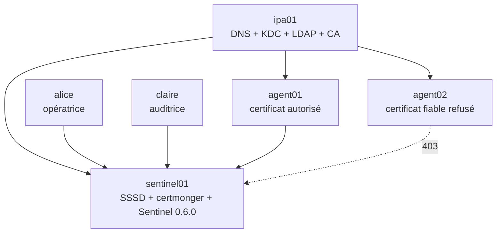
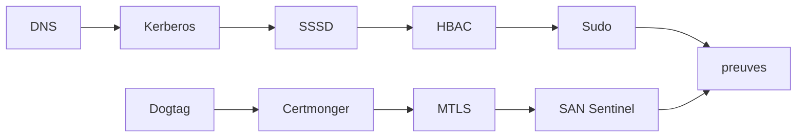

# Chapitre 8.10 — Mission : administrer Sentinel avec FreeIPA

> **Campagne 8 — FreeIPA**
>
> *« Une intégration est terminée lorsque ses succès, ses refus et son retour arrière sont tous reproductibles. »*

## Vous êtes ici

```text
Partie II — Industrialiser la sécurité

Campagne 8 — FreeIPA

      8.1 Présentation de FreeIPA
      8.2 Architecture interne
      8.3 Installation du serveur
      8.4 Gestion des utilisateurs
      8.5 Groupes et rôles
      8.6 Politiques sudo
      8.7 Hôtes et règles HBAC
      8.8 Certificats
      8.9 Intégration de Sentinel
    ► 8.10 Mission d'administration
```

## Objectifs pédagogiques

À la fin de cette mission, vous serez capable de :

- construire un domaine FreeIPA de laboratoire documenté ;
- intégrer hôtes, utilisateurs, politiques et certificats ;
- exploiter Sentinel `0.6.0` sans stocker de secrets dans Git ;
- démontrer des cas passants et des refus à chaque couche ;
- remettre un dossier exploitable par la campagne Ansible.

## Pourquoi ce chapitre existe

Les chapitres précédents ont isolé chaque mécanisme. Cette mission ne donne pas une seconde procédure exhaustive : elle exige de choisir, appliquer, vérifier et documenter l'architecture complète.

Une capture d'écran de l'interface Web ne suffit pas. Les preuves doivent montrer l'état central, la consommation côté client et le comportement réel de Sentinel.

## Contexte

L'équipe doit livrer Sentinel à trois acteurs :

- `alice`, opératrice autorisée à vérifier et redémarrer le service ;
- `claire`, auditrice pouvant consulter les preuves sans administrer ;
- `agent01`, client mTLS autorisé à appeler l'API.

Un certificat `agent02` signé par la même CA sert de témoin non autorisé.



## État de départ

- trois ou quatre VM AlmaLinux sur un réseau isolé ;
- Sentinel `0.5.0` installé sur `sentinel01` ;
- politique SELinux de la campagne 6 et mTLS de la campagne 7 disponibles ;
- aucun domaine FreeIPA supposé fonctionnel ;
- console de secours pour chaque manipulation d'accès.

## Contraintes

- domaine de laboratoire : `sentinel.example.test` ;
- royaume : `SENTINEL.EXAMPLE.TEST` ;
- SELinux reste `Enforcing` et Firewalld actif ;
- aucun mot de passe, `keytab`, certificat privé ou clé privée dans Git ;
- le compte système local `sentinel` reste non interactif ;
- `allow_all` HBAC ne peut être désactivé sans voie de secours testée ;
- aucun droit `sudo ALL` pour les opérateurs ;
- chaque identité cliente possède sa propre clé ;
- une configuration n'est acceptée qu'avec un test positif et un refus attendu.

## Architecture et matrice de confiance

Complétez avant de commencer :

| Source | Cible | Mécanisme | Action autorisée | Refus attendu |
|---|---|---|---|---|
| `alice` | SSH `sentinel01` | HBAC | ouvrir `sshd` | autre service PAM |
| `alice` | systemd | `sudo` | opérations Sentinel prévues | SSH ou shell root |
| `claire` | preuves | groupe + droits fichiers | lecture | modification |
| `agent01` | API Sentinel | mTLS + SAN | `/health`, `/ready`, statut | route inconnue |
| `agent02` | API Sentinel | mTLS + SAN | aucune | HTTP `403` |
| anonyme | API Sentinel | TLS | aucune | échec de négociation |

## Lot 1 — Construire et valider le domaine

Livrez :

1. plan FQDN, adresses, domaine, royaume, zones directe et inverse, autorité et délégation DNS ;
2. vérifications d'heure, ressources, SELinux et pare-feu ;
3. installation de `ipa01` avec DNS et CA ;
4. inventaire des zones et preuves SOA/NS/A/PTR/SRV, `ipactl`, `kinit`, `ipa ping` et certificat Web ;
5. limites de la topologie à un serveur et plan de réplication théorique.

Échec attendu : modifiez temporairement la résolution d'une VM témoin et montrez que la découverte échoue sans altérer le serveur IdM.

## Lot 2 — Créer les identités et responsabilités

Créez :

```text
alice  → sentinel-operators
claire → sentinel-auditors
sentinel-admins
sentinel-servers (groupe d'hôtes)
```

Livrez :

- convention de login et plage d'identités ;
- attributs et groupes des utilisateurs ;
- preuve du premier changement de secret ;
- matrice des propriétaires et revues de groupes ;
- cycle de désactivation et préservation testé sur un compte témoin.

Échec attendu : un compte désactivé ne doit pas obtenir un nouveau ticket Kerberos.

## Lot 3 — Enrôler les hôtes

Enrôlez `sentinel01`, `agent01` et, si disponible, `agent02`.

Pour chaque hôte, prouvez :

- FQDN, DNS et heure ;
- objet hôte et appartenance ;
- `keytab` présent, protégé et non exposé dans les preuves ;
- domaine SSSD en ligne ;
- résolution des utilisateurs et groupes attendus.

Échec attendu : `hbactest` refuse un utilisateur, un hôte ou un service hors matrice.

## Lot 4 — Déployer HBAC et sudo

Construisez une règle HBAC pour `sentinel-operators × sentinel-servers × sshd` et une voie d'administration de secours distincte.

Construisez une règle `sudo` qui permet à Alice :

```text
systemctl status sentinel.service
systemctl is-active sentinel.service
systemctl restart sentinel.service
```

Prouvez que les commandes suivantes restent interdites :

```text
systemctl restart sshd.service
/bin/bash
systemctl edit sentinel.service
```

Claire ne reçoit aucun redémarrage. Si elle doit lire les journaux, concevez un mécanisme de lecture spécifique plutôt que de l'ajouter aux opérateurs.

## Lot 5 — Émettre et suivre les certificats

Créez les objets de service nécessaires puis demandez, sur chaque hôte concerné :

- certificat serveur `sentinel01` avec `serverAuth` ;
- certificat healthcheck avec `clientAuth` ;
- certificat `agent01` avec `clientAuth` ;
- certificat témoin `agent02` avec `clientAuth`.

Pour chaque certificat :

- demande `certmonger` en état `MONITORING` ;
- chaîne, SAN, usages, dates et correspondance de clé vérifiés ;
- clé privée lisible uniquement par le service prévu ;
- contexte SELinux correct ;
- procédure de renouvellement et rechargement ;
- procédure de révocation et remplacement.

Échec attendu : une clé ou un SAN incorrect doit faire échouer le contrôle avant le démarrage ou pendant TLS, sans recours à des permissions larges.

## Lot 6 — Migrer Sentinel vers `0.6.0`

Déployez le checkpoint puis ajoutez :

```ini
[identity]
allowed_dns_names = healthcheck.sentinel.example.test, agent01.sentinel.example.test
```

Validez avant redémarrage :

```bash
sudo -u sentinel /opt/sentinel/bin/sentinel \
  --config /etc/sentinel/sentinel.conf --check-config
sudo systemctl restart sentinel.service
systemctl status sentinel.service --no-pager
```

Exécutez les tests du dépôt :

```bash
python3 -m unittest discover \
  -s sentinel/labs/sentinel-app/checkpoints/0.6.0/tests -v
```

## Campagne d'acceptation

| Test | Résultat attendu | Couche prouvée |
|---|---|---|
| `kinit alice` | TGT obtenu | Kerberos |
| `id alice` sur `sentinel01` | identité et groupes | NSS/SSSD |
| `hbactest` Alice + SSH | autorisé | HBAC |
| `sudo -l` d'Alice | seules opérations Sentinel | sudo/SSSD |
| restart Sentinel | réussi et journalisé | délégation système |
| restart SSH | refusé | moindre privilège |
| client sans certificat | échec TLS | mTLS |
| `agent02` signé | HTTP `403` | autorisation Sentinel |
| `agent01` signé | HTTP `200` | identité autorisée |
| état Sentinel absent | `/ready` retourne `503` | disponibilité |
| recherche AVC | aucun refus inattendu | SELinux |
| `getcert list` | demandes suivies | cycle de certificat |



## Diagnostic imposé

Choisissez un échec réel et produisez une fiche :

```text
heure et commande :
symptôme :
composant supposé :
preuve qui confirme ou réfute :
cause racine :
correction minimale :
test après correction :
retour arrière :
```

Les corrections interdites sont : désactiver SELinux, arrêter Firewalld, activer `allow_all` durablement, accorder `sudo ALL`, rendre une clé privée publique ou ajouter tous les certificats à la liste.

## Livrables attendus

```text
campagne-08/
├── architecture.md
├── matrice-identites-acces.md
├── inventaire-sans-secrets.md
├── commandes-rejouables.md
├── preuves/
│   ├── domaine/
│   ├── clients/
│   ├── politiques/
│   ├── certificats/
│   └── sentinel/
├── incidents/
│   └── diagnostic.md
└── retour-arriere.md
```

Ne placez pas ce dossier dans un dépôt public s'il contient des noms, journaux ou certificats réels. Les preuves sont minimisées et expurgées sans perdre leur valeur.

## Critères de réussite

- chaque nom et adresse appartient au plan ;
- les zones faisant autorité, leur délégation et la cohérence directe/inverse sont explicites ;
- chaque humain et machine possède une identité distincte ;
- groupes, HBAC et `sudo` expriment la matrice ;
- le `keytab` et les clés privées restent protégés ;
- les certificats sont suivis et renouvelables ;
- Sentinel `0.6.0` distingue authentification et autorisation ;
- les sept tests automatisés passent ;
- les refus attendus sont observés à la bonne couche ;
- aucune protection des campagnes précédentes n'a été neutralisée ;
- un autre administrateur peut relire et rejouer la procédure.

## Retour arrière

Le plan doit préciser l'ordre inverse :

1. restaurer ensemble code et configuration Sentinel `0.5.0` ;
2. retirer les identités autorisées et arrêter le suivi des certificats concernés ;
3. désactiver les règles `sudo` et HBAC avant de supprimer leurs groupes ;
4. désenrôler les clients selon la procédure IdM ;
5. conserver ou supprimer les objets selon la politique de rétention ;
6. ne désinstaller le serveur que dans le laboratoire détruit en connaissance de cause.

Un retour arrière ne signifie pas réactiver des accès larges. Il restaure le dernier état de confiance connu.

## Grande synthèse de la campagne 8

FreeIPA apporte une source de vérité et plusieurs services spécialisés :

| Couche | Résultat acquis |
|---|---|
| annuaire | utilisateurs, groupes, hôtes et services |
| Kerberos | identités authentifiées par tickets |
| SSSD | intégration NSS, PAM, HBAC et `sudo` |
| politiques | accès et délégations centralisés |
| Dogtag | certificats liés au domaine |
| `certmonger` | renouvellement local suivi |
| Sentinel | autorisation des identités clientes mTLS |

Le progrès essentiel n'est pas que « tout passe par FreeIPA ». Chaque responsabilité appartient au composant capable de la gérer et de la prouver.

## Synthèse

- une infrastructure d'identité se valide de bout en bout et par composant ;
- les groupes stabilisent les fonctions, HBAC contrôle l'entrée et `sudo` l'élévation ;
- hôtes, services et utilisateurs possèdent des identités distinctes ;
- clés privées et `keytab` restent hors des livrables ;
- `certmonger` rend le renouvellement observable ;
- Sentinel `0.6.0` autorise une identité après mTLS sans copier l'annuaire ;
- cas passants, refus et retour arrière forment ensemble la preuve.

## Pour aller plus loin

La campagne 9 automatise cette architecture avec Ansible. Elle devra produire les mêmes états et les mêmes preuves, de manière idempotente, sans transformer les secrets en variables en clair.

[Continuer vers la campagne 9 — Déployer avec Ansible](../campagne_09/9.1-architecture-ansible.md)

Références : [Installing Identity Management](https://docs.redhat.com/en/documentation/red_hat_enterprise_linux/9/html/installing_identity_management/), [Managing IdM users, groups, hosts, and access control rules](https://docs.redhat.com/en/documentation/red_hat_enterprise_linux/9/html/managing_idm_users_groups_hosts_and_access_control_rules/) et [Managing certificates in IdM](https://docs.redhat.com/en/documentation/red_hat_enterprise_linux/9/html/managing_certificates_in_idm/).
