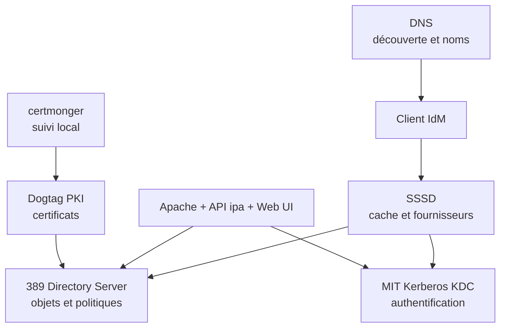
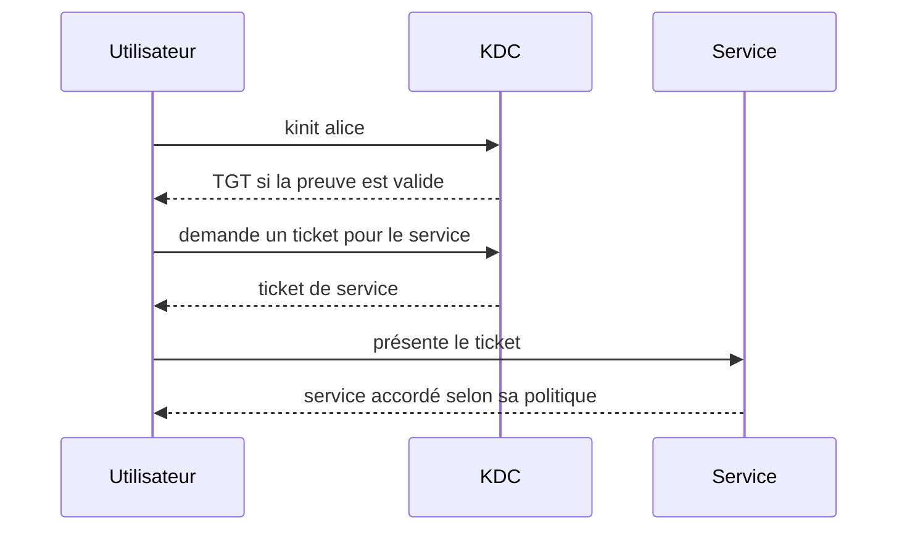
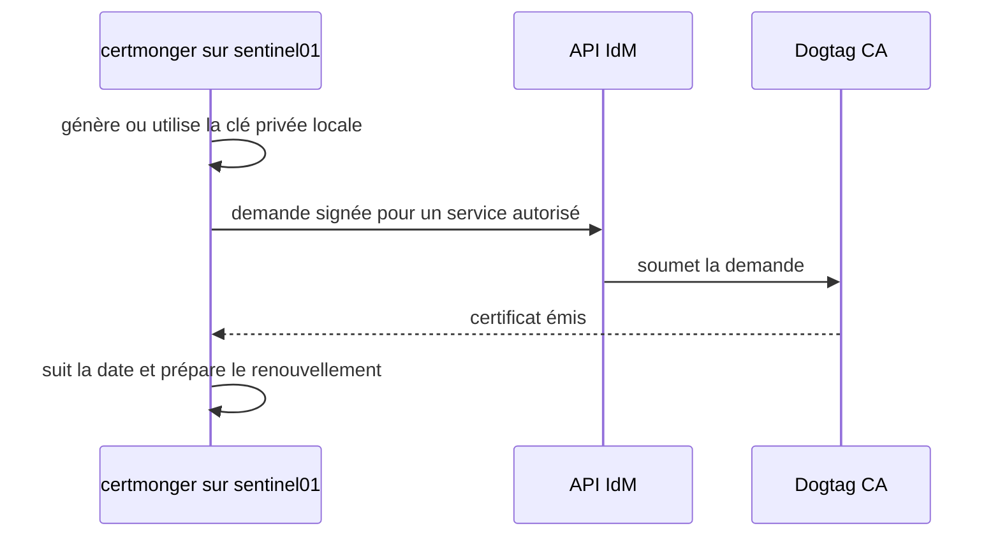
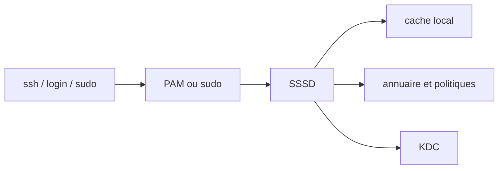

# Chapitre 8.2 — Comprendre l'architecture interne de FreeIPA

> **Campagne 8 — FreeIPA**
>
> *« Diagnostiquer FreeIPA commence par nommer le composant qui devait répondre. »*

## Vous êtes ici

```text
Partie II — Industrialiser la sécurité

Campagne 8 — FreeIPA

      8.1 Présentation de FreeIPA
    ► 8.2 Architecture interne
      8.3 Installation du serveur
      8.4 Gestion des utilisateurs
      8.5 Groupes et rôles
      8.6 Politiques sudo
      8.7 Hôtes et règles HBAC
      8.8 Certificats
      8.9 Intégration de Sentinel
      8.10 Mission d'administration
```

## Objectifs pédagogiques

À la fin de ce chapitre, vous serez capable de :

- associer chaque fonction FreeIPA à son composant ;
- expliquer le parcours d'une authentification Kerberos ;
- distinguer annuaire LDAP, KDC, PKI, DNS et cache client ;
- choisir les premiers outils de diagnostic ;
- identifier les dépendances critiques du domaine.

## Pourquoi ce chapitre existe

La commande `ipa user-show` peut échouer alors que Kerberos fonctionne ; une connexion SSH peut échouer alors que l'utilisateur existe dans LDAP. FreeIPA est une intégration de services spécialisés, pas un démon unique.

Comprendre leurs frontières permet de chercher un problème au bon endroit au lieu de redémarrer tous les composants.

## Vue d'ensemble



L'installation coordonne ces briques et leur configuration. Elle ne les rend pas interchangeables.

## 389 Directory Server et LDAP

**389 Directory Server** stocke les entrées du domaine : utilisateurs, groupes, hôtes, services, règles HBAC, règles `sudo`, permissions et métadonnées.

LDAP est le protocole utilisé pour consulter et modifier cet annuaire. Une entrée possède un nom distinctif, des classes d'objet et des attributs. L'API FreeIPA protège l'administrateur d'une grande partie de cette complexité.

```bash
ipa user-show admin --all
ipa group-find
```

Dire « LDAP authentifie l'utilisateur » est imprécis dans l'architecture habituelle d'IdM : Kerberos fournit l'authentification du domaine. LDAP peut vérifier un secret par une opération *bind*, mais ce n'est pas le parcours privilégié d'un client FreeIPA intégré.

### Pourquoi ne pas modifier directement LDAP ?

Une modification brute peut contourner validations, attributs calculés, contrôles d'accès et logique d'API. Utilisez d'abord `ipa`, l'interface Web ou les modules Ansible FreeIPA. Les outils LDAP servent surtout à comprendre et diagnostiquer.

## Kerberos : prouver une identité sans transmettre le mot de passe à chaque service

Le **KDC** (*Key Distribution Center*) comprend conceptuellement :

- l'AS (*Authentication Service*), qui délivre le ticket initial ;
- le TGS (*Ticket Granting Service*), qui délivre les tickets de service.



Le mot de passe ne circule pas vers chaque application. Le client conserve des tickets temporaires dans un cache :

```bash
kinit admin
klist
kdestroy
```

Un ticket prouve une authentification, pas un droit administratif universel. L'API et les politiques continuent de contrôler les opérations.

### Principaux, SPN et `keytab`

Un principal nomme une identité Kerberos :

```text
alice@SENTINEL.EXAMPLE.TEST
host/sentinel01.sentinel.example.test@SENTINEL.EXAMPLE.TEST
HTTP/sentinel01.sentinel.example.test@SENTINEL.EXAMPLE.TEST
```

Un service non interactif conserve ses clés dans un **keytab** protégé. Ce fichier est un secret réutilisable par la machine ; le qualifier de « simple configuration » conduit à des permissions dangereuses.

## DNS : nommer et découvrir

IdM publie des enregistrements SRV afin que les clients trouvent LDAP et Kerberos. Les FQDN servent aussi dans les principaux et certificats.

```bash
dig +short ipa01.sentinel.example.test
dig +short -t SRV _ldap._tcp.sentinel.example.test
dig +short -t SRV _kerberos._udp.sentinel.example.test
```

Une entrée `/etc/hosts` peut résoudre un nom, mais ne remplace pas les enregistrements de découverte ni une architecture DNS cohérente. La résolution directe et inverse doit être décidée avant l'installation.

## Le temps : dépendance de sécurité

Kerberos rejette les échanges lorsque l'écart d'horloge dépasse la tolérance prévue. Cette contrainte limite la réutilisation de messages capturés.

```bash
timedatectl
chronyc tracking
chronyc sources -v
```

Forcer l'heure manuellement masque le problème. Les serveurs et clients doivent partager une source de temps fiable et supervisée.

## Dogtag PKI et `certmonger`

Avec une CA intégrée, **Dogtag PKI** émet et révoque les certificats du domaine. Il ne doit pas être confondu avec Kerberos : tous deux gèrent des identités cryptographiques, mais leurs protocoles, usages et durées de vie diffèrent.

`certmonger` s'exécute sur la machine qui utilise un certificat. Il génère ou protège la demande locale, dialogue avec la CA, suit l'expiration et renouvelle selon sa configuration.



La clé privée n'est pas envoyée à la CA.

## Apache, API et interface Web

Les commandes `ipa` et l'interface Web utilisent l'API du serveur, exposée par Apache. Elles orchestrent annuaire, Kerberos et PKI en appliquant les autorisations FreeIPA.

```bash
ipa ping
ipa env
ipa user-show admin
```

Une page Web accessible prouve que le frontal répond, pas que l'annuaire, le KDC et la CA sont tous sains.

## SSSD : l'intégration côté client

**SSSD** (*System Security Services Daemon*) relie les interfaces Linux aux fournisseurs d'identité :

| Consommateur | Rôle de SSSD |
|---|---|
| NSS / `getent` / `id` | rechercher utilisateurs et groupes |
| PAM / SSH | participer à l'authentification et à l'accès |
| `sudo` | récupérer les règles centralisées |
| HBAC | évaluer utilisateur, hôte et service |
| cache | supporter certaines opérations hors ligne |



Commandes de première intention :

```bash
systemctl status sssd --no-pager
sssctl domain-list
sssctl domain-status sentinel.example.test
sssctl user-checks alice
getent passwd alice
id alice
```

`sss_cache -E` invalide des caches et peut augmenter la charge ; ce n'est pas une correction à exécuter systématiquement.

## Dépendances et modes de panne

| Symptôme | Premières vérifications |
|---|---|
| serveur introuvable | DNS, SRV, pare-feu |
| `kinit` échoue | heure, KDC, principal, secret |
| `ipa` échoue avec un ticket valide | API Apache, LDAP, autorisation |
| `id alice` échoue sur un client | SSSD, DNS, annuaire, cache |
| `sudo -l` incomplet | règle, groupe d'hôtes, fournisseur `sudo`, cache |
| certificat non renouvelé | `getcert list`, CA, principal, permissions, hooks |

L'outil `ipactl status` donne une vue des services IdM sur un serveur. `systemctl` et les journaux de chaque composant donnent ensuite le détail.

## Culture technique — standards et intégration

FreeIPA combine des standards, mais son intérêt vient précisément de l'intégration : schémas, API, politiques, clés, découverte et outils d'exploitation sont conçus ensemble. Réassembler manuellement « un LDAP + un Kerberos + une CA » demande de recréer ce contrat.

## Mise en pratique — suivre deux parcours

Sans modifier la plateforme, complétez ces deux chaînes avec le composant et la preuve attendue :

1. `kinit admin` → KDC → `klist` ;
2. `getent passwd alice` → NSS → SSSD → annuaire/cache.

Sur un environnement IdM existant :

```bash
dig +short -t SRV _kerberos._udp.sentinel.example.test
chronyc tracking
kinit admin
klist
ipa ping
ipa user-show admin
```

Conservez l'heure, la commande, le résultat et le composant validé. Un résultat réussi ne valide que le maillon réellement exercé.

## Impact sur Sentinel

Sentinel interagira indirectement avec plusieurs composants : Dogtag émettra ses certificats, `certmonger` les renouvellera, SSSD fournira les identités humaines au système et l'application autorisera les SAN DNS des clients mTLS. Le code ne doit pas interroger directement toutes les bases FreeIPA.

## Synthèse

- 389 Directory Server stocke les objets ; LDAP permet de les consulter ;
- Kerberos authentifie avec des tickets et des principaux ;
- DNS découvre les services et stabilise leurs noms ;
- Dogtag émet les certificats, tandis que `certmonger` les suit sur le client ;
- SSSD relie le domaine à NSS, PAM, HBAC et `sudo` ;
- l'API FreeIPA coordonne ces services sans les confondre ;
- un diagnostic efficace part du maillon correspondant au symptôme.

## Infographie de révision

```text
DNS ─ découvre ─┐
LDAP ─ stocke ──┼─ FreeIPA ─ API/Web
KDC ─ authentifie┤
Dogtag ─ certifie┘
                  │
               SSSD côté client
          NSS · PAM · sudo · HBAC · cache
```

## Pour aller plus loin

Le chapitre suivant transforme cette architecture en laboratoire installé, avec des contrôles avant et après chaque étape.

[Continuer vers le chapitre 8.3 — Installer le serveur FreeIPA](8.3-installation-freeipa.md)

Références : [Planning Identity Management](https://docs.redhat.com/en/documentation/red_hat_enterprise_linux/9/html/planning_identity_management/) et [Installing Identity Management](https://docs.redhat.com/en/documentation/red_hat_enterprise_linux/9/html/installing_identity_management/).
