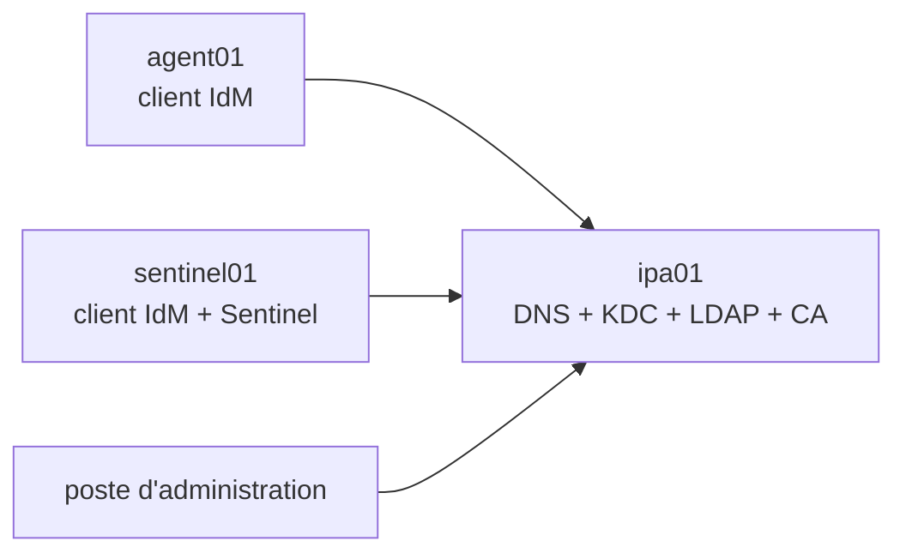
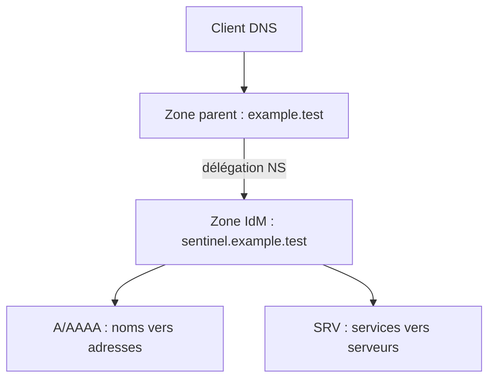
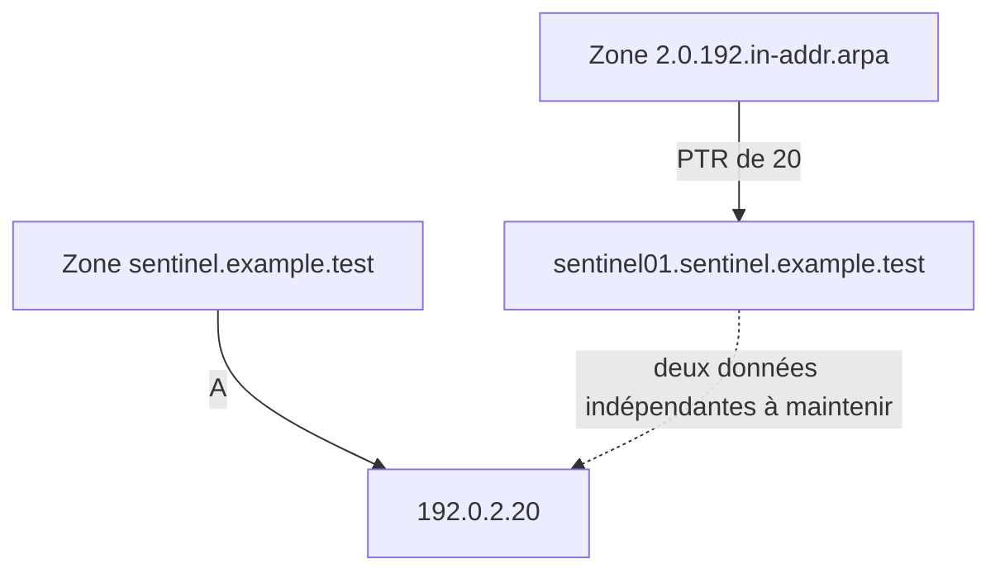
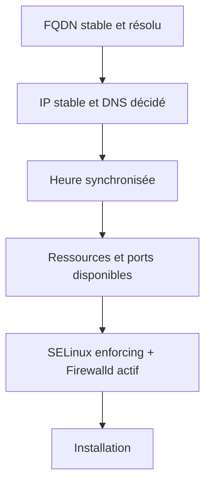
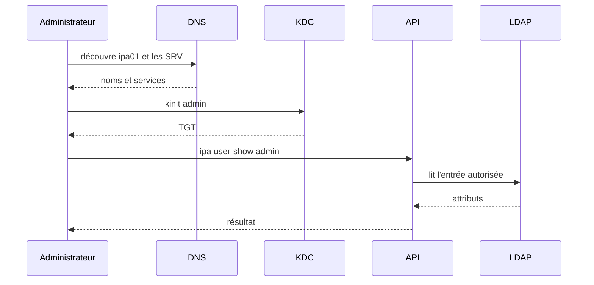

# Chapitre 8.3 — Installer un serveur FreeIPA de laboratoire

> **Campagne 8 — FreeIPA**
>
> *« Le succès de l'installation dépend surtout des décisions prises avant de lancer l'installateur. »*

## Vous êtes ici

```text
Partie II — Industrialiser la sécurité

Campagne 8 — FreeIPA

      8.1 Présentation de FreeIPA
      8.2 Architecture interne
    ► 8.3 Installation du serveur
      8.4 Gestion des utilisateurs
      8.5 Groupes et rôles
      8.6 Politiques sudo
      8.7 Hôtes et règles HBAC
      8.8 Certificats
      8.9 Intégration de Sentinel
      8.10 Mission d'administration
```

## Objectifs pédagogiques

À la fin de ce chapitre, vous serez capable de :

- préparer nom, DNS, adresse, temps et ressources d'un serveur IdM ;
- distinguer domaine, zone directe, zone inverse et délégation ;
- créer et vérifier les principaux types d'enregistrements DNS d'un domaine IdM ;
- expliquer le reverse DNS et maintenir la cohérence A/AAAA/PTR ;
- installer FreeIPA avec DNS et autorité de certification intégrés ;
- vérifier séparément services, Kerberos, DNS, API et certificats ;
- retrouver les journaux d'installation et d'exécution ;
- distinguer une installation de laboratoire d'une architecture de production.

## Pourquoi ce chapitre existe

FreeIPA lie durablement le FQDN, le domaine DNS, le royaume Kerberos, les certificats et les objets de l'annuaire. Corriger après coup un nom improvisé est beaucoup plus difficile que préparer correctement la machine.

Le laboratoire construit un premier serveur autonome. Il sert à apprendre ; il ne constitue pas une topologie hautement disponible.

## Architecture du laboratoire

| Rôle | FQDN | Adresse documentaire |
|---|---|---|
| serveur FreeIPA + DNS + CA | `ipa01.sentinel.example.test` | `192.0.2.10` |
| serveur Sentinel, futur client | `sentinel01.sentinel.example.test` | `192.0.2.20` |
| agent mTLS, futur client | `agent01.sentinel.example.test` | `192.0.2.30` |

Les adresses `192.0.2.0/24` et le suffixe `.test` sont réservés à la documentation. Remplacez-les dans le réseau isolé du laboratoire.



Prévoyez des instantanés avant l'installation, mais ne les confondez pas avec une sauvegarde cohérente d'un domaine en production.

## Les décisions irréversibles ou coûteuses

### FQDN

Le nom doit être stable, en minuscules et résolu vers l'adresse de la machine :

```bash
sudo hostnamectl set-hostname ipa01.sentinel.example.test
hostname --fqdn
getent ahosts ipa01.sentinel.example.test
```

Évitez `localhost`, un nom court, une adresse dynamique ou un alias qui ne correspond pas à l'identité principale.

### Domaine et royaume

```text
Domaine DNS : sentinel.example.test
Royaume     : SENTINEL.EXAMPLE.TEST
```

Le royaume proposé à partir du domaine convient au laboratoire. En production, le choix doit tenir compte du DNS existant, des relations de confiance et de la pérennité organisationnelle.

### DNS intégré ou externe

Le laboratoire utilise le DNS intégré pour observer la découverte de services. Une entreprise peut déléguer le sous-domaine à FreeIPA ou maintenir les enregistrements dans un DNS externe.

Dans les deux cas, les clients doivent retrouver les enregistrements A/AAAA et SRV. Une ligne `/etc/hosts` seule ne suffit pas à représenter cette architecture.

## Comprendre les zones avant de créer des enregistrements

Un **domaine DNS** est un espace de noms. Une **zone DNS** est la portion de cet espace dont un ensemble de serveurs détient les données faisant autorité. Les deux coïncident souvent dans un petit laboratoire, mais ce ne sont pas des synonymes.

Dans notre cas :

```text
domaine IdM et zone directe : sentinel.example.test.
réseau IPv4                 : 192.0.2.0/24
zone inverse correspondante : 2.0.192.in-addr.arpa.
```

Le point final indique un nom DNS absolu. Les outils l'acceptent parfois sans ce point, mais l'écrire dans les valeurs cibles, par exemple un PTR, évite qu'un suffixe de zone soit ajouté par erreur.

### Autorité, SOA, NS et délégation

Une zone primaire contient notamment :

- un enregistrement **SOA** (*Start of Authority*), qui décrit l'autorité et les paramètres de la zone ;
- un ou plusieurs enregistrements **NS**, qui nomment ses serveurs faisant autorité ;
- les enregistrements de ressources portant les données utiles.

Si le DNS parent `example.test` existe ailleurs, il doit **déléguer** `sentinel.example.test` vers les serveurs DNS IdM avec des enregistrements NS. Lorsque le nom du serveur délégué appartient lui-même à la sous-zone, le parent peut aussi devoir publier son adresse comme *glue record*. Sans cette délégation, le serveur IdM connaît sa zone, mais les clients utilisant le DNS parent ne savent pas nécessairement comment l'atteindre.



IdM crée SOA et NS lors de la création de sa zone. Dans une architecture avec DNS externe, la délégation dans le parent reste une action d'exploitation à préparer avec l'équipe qui contrôle ce parent.

### Zone primaire, zone inverse et zone de renvoi

Ces trois objets répondent à des besoins différents :

| Objet | Contenu ou fonction | Exemple |
|---|---|---|
| zone primaire directe | données faisant autorité pour des noms | `sentinel.example.test.` |
| zone primaire inverse | données faisant autorité pour des adresses renversées | `2.0.192.in-addr.arpa.` |
| zone de renvoi | transmet certaines requêtes à un autre résolveur | domaine géré par une autre équipe |

Une zone de renvoi n'est pas un raccourci universel pour éviter une délégation. La délégation DNS standard reste préférable lorsque vous contrôlez le parent et la sous-zone.

Inventoriez l'existant avant toute création :

```bash
kinit admin
ipa dnszone-find
ipa dnszone-show sentinel.example.test.
ipa dnsrecord-find sentinel.example.test.
```

Ne recréez pas une zone déjà installée et ne prenez pas autorité sur un réseau inverse que votre équipe ne contrôle pas.

## Les principaux enregistrements DNS

Un **enregistrement de ressource** (*resource record*) associe un nom, un type, une valeur et une durée de cache, le **TTL**. Le type précise le sens de la valeur.

| Type | Rôle | Exemple dans le laboratoire |
|---|---|---|
| `A` | nom vers adresse IPv4 | `sentinel01` → `192.0.2.20` |
| `AAAA` | nom vers adresse IPv6 | `sentinel01` → `2001:db8::20` |
| `PTR` | adresse renversée vers nom | `20` → `sentinel01.sentinel.example.test.` |
| `SRV` | service et protocole vers cible et port | `_ldap._tcp` → `ipa01...:389` |
| `CNAME` | alias vers un nom canonique | `status` → `sentinel01...` |
| `TXT` | texte associé au nom | preuve ou politique définie par un protocole |
| `MX` | serveurs de messagerie d'un domaine | hors du besoin Sentinel actuel |
| `NS` | serveurs faisant autorité pour une zone | `ipa01.sentinel.example.test.` |
| `SOA` | origine et paramètres de la zone | généré et géré avec la zone |

`A` et `AAAA` ne signifient pas « ce serveur est digne de confiance » : ils fournissent une adresse. `PTR` ne prouve pas davantage l'identité de la machine. DNSSEC peut protéger l'authenticité des données DNS dans une architecture prévue pour cela, tandis que Kerberos et TLS authentifient leurs propres identités ; ces mécanismes ne doivent pas être confondus.

### A et AAAA : résolution directe

Pour ajouter l'adresse documentaire de Sentinel dans la zone intégrée :

```bash
ipa dnsrecord-add sentinel.example.test. sentinel01 \
  --a-rec=192.0.2.20

ipa dnsrecord-show sentinel.example.test. sentinel01 --all
dig +noall +answer sentinel01.sentinel.example.test. A
```

Si IPv6 est réellement configuré de bout en bout, ajoutez un `AAAA` cohérent. N'inventez pas un `AAAA` uniquement pour remplir la zone : un client pourrait préférer IPv6 et joindre une adresse qui ne fonctionne pas.

### SRV : découvrir un service, pas seulement une machine

Un enregistrement SRV contient quatre valeurs :

```text
priorité poids port cible
```

Exemple conceptuel :

```text
_ldap._tcp.sentinel.example.test. 3600 IN SRV 0 100 389 ipa01.sentinel.example.test.
```

- la priorité la plus basse est essayée en premier ;
- le poids répartit les choix entre cibles de même priorité ;
- le port indique où joindre le service ;
- la cible est un nom DNS disposant de ses propres A ou AAAA.

L'installation IdM publie et maintient ses enregistrements SRV. Commencez donc par les observer au lieu de les recréer manuellement :

```bash
dig +noall +answer SRV _ldap._tcp.sentinel.example.test.
dig +noall +answer SRV _kerberos._udp.sentinel.example.test.
dig +noall +answer SRV _kerberos._tcp.sentinel.example.test.
```

Le SRV permet au client de demander « où se trouve Kerberos pour ce domaine ? ». Une entrée A répond seulement « quelle est l'adresse de ce nom ? ». C'est pourquoi `/etc/hosts` ne remplace pas la découverte IdM.

### CNAME : utile, mais pas neutre pour les identités

Un CNAME fournit un alias. Il peut être pratique pour présenter `status.sentinel.example.test` tandis que le nom canonique de l'hôte reste `sentinel01...`. Cependant, Kerberos et TLS comparent des noms précis : le service peut avoir besoin d'un principal et d'un SAN correspondant au nom réellement utilisé par les clients.

Avant d'ajouter un alias, répondez donc à trois questions :

1. quel nom les clients saisiront-ils ?
2. quel principal de service demanderont-ils ?
3. quel nom figure dans le SAN du certificat ?

L'alias DNS ne crée automatiquement ni le principal Kerberos ni le SAN X.509.

## Reverse DNS : retrouver un nom depuis une adresse

La résolution directe parcourt `nom → adresse`. Le **reverse DNS** parcourt `adresse → nom` avec un enregistrement PTR stocké dans un espace de noms spécial.

Pour IPv4, les octets du préfixe sont renversés sous `in-addr.arpa`. Ainsi, l'adresse `192.0.2.20` du réseau `/24` se décompose en :

```text
zone inverse : 2.0.192.in-addr.arpa.
nom relatif  : 20
valeur PTR   : sentinel01.sentinel.example.test.
```

Pour IPv6, chaque chiffre hexadécimal est renversé sous `ip6.arpa`. Le principe est identique mais le nom devient beaucoup plus long ; les outils de gestion évitent de le composer à la main.



Le PTR n'est pas calculé à la volée à partir du A. Ce sont deux enregistrements indépendants, souvent placés dans deux zones administrées par des équipes différentes. Il est donc possible que le direct fonctionne et que l'inverse soit absent ou obsolète.

### Créer la zone et le PTR dans le laboratoire

Vérifiez d'abord que l'installateur n'a pas déjà créé la zone inverse :

```bash
ipa dnszone-find
ipa dnszone-show 2.0.192.in-addr.arpa.
```

La deuxième commande échoue si la zone est absente. Créez-la uniquement si le réseau du laboratoire relève bien de votre autorité :

```bash
ipa dnszone-add 2.0.192.in-addr.arpa.
ipa dnsrecord-add 2.0.192.in-addr.arpa. 20 \
  --ptr-rec=sentinel01.sentinel.example.test.
```

Vérifiez ensuite les deux sens depuis un client utilisant réellement le DNS IdM :

```bash
dig +noall +answer sentinel01.sentinel.example.test. A
dig +noall +answer -x 192.0.2.20
getent hosts sentinel01.sentinel.example.test
```

Le résultat cohérent attendu est :

```text
sentinel01.sentinel.example.test. → 192.0.2.20
192.0.2.20 → sentinel01.sentinel.example.test.
```

Cette cohérence directe/inverse facilite les journaux, certains contrôles de services et le diagnostic. Elle n'est toutefois pas une preuve cryptographique : toute personne qui contrôle la zone inverse peut publier un PTR. Pour authentifier Sentinel, utilisez le principal Kerberos ou le certificat TLS attendu.

### Quand plusieurs noms ou adresses existent

Une machine peut avoir plusieurs adresses et plusieurs noms. Ne cherchez pas mécaniquement une relation bijective parfaite. Définissez plutôt :

- un FQDN canonique stable pour l'identité de l'hôte ;
- les A/AAAA correspondant aux interfaces réellement joignables ;
- un PTR pertinent pour chaque adresse administrée ;
- les alias nécessaires aux usages applicatifs ;
- les principaux et SAN correspondant aux noms employés par les clients.

Kerberos peut canonicaliser un nom selon la bibliothèque et l'application. Une incohérence entre alias, nom canonique et reverse DNS peut donc faire demander un ticket pour un autre principal que celui présent dans le `keytab`. N'utilisez pas cette possibilité pour attribuer toute panne Kerberos au PTR : observez d'abord avec `kvno`, `klist`, les journaux du service et `klist -k`.

⚠️ **Piège classique** — ajouter le bon A dans la zone directe puis considérer `dig -x` vide comme un détail. Soit la zone inverse fait partie du plan et le PTR doit être géré, soit elle appartient à un tiers et cette dépendance doit être documentée. Le silence ne constitue pas une décision d'architecture.

## Préparer le système

### Ressources et réseau

Allouez une VM persistante avec plusieurs Gio de mémoire, suffisamment d'espace disque et une adresse stable. Les besoins exacts dépendent du nombre d'entrées, des services activés et de la topologie ; consultez la documentation de la version déployée.

Repérez le profil NetworkManager puis définissez l'adresse et le DNS adaptés à votre laboratoire :

```bash
nmcli connection show
ip -brief address
ip route
```

Exemple à adapter au nom réel de la connexion :

```bash
sudo nmcli connection modify 'System eth0' \
  ipv4.method manual \
  ipv4.addresses 192.0.2.10/24 \
  ipv4.gateway 192.0.2.1 \
  ipv4.dns '127.0.0.1' \
  ipv4.dns-search 'sentinel.example.test'
sudo nmcli connection up 'System eth0'
```

Configurer `127.0.0.1` comme DNS n'est pertinent qu'une fois le DNS local disponible. Avant l'installation, assurez la résolution du FQDN par le DNS amont ou une entrée temporaire cohérente ; supprimez les contournements devenus inutiles après installation.

### Heure

```bash
sudo systemctl enable --now chronyd
timedatectl
chronyc tracking
chronyc sources -v
```

La présence de `chronyd` ne prouve pas la synchronisation : contrôlez la source et l'écart.

### Mise à jour, SELinux et pare-feu

```bash
sudo dnf update -y
sestatus
sudo firewall-cmd --state
sudo firewall-cmd --get-active-zones
```

Conservez SELinux en mode `Enforcing`. Une installation qui exige sa désactivation révèle un problème de préparation ou une procédure obsolète.

### Contrôles préalables

```bash
hostname --fqdn
getent hosts ipa01.sentinel.example.test
ip -brief address
chronyc tracking
df -h / /var
free -h
sestatus
sudo ss -lntup
```

Vérifiez qu'aucun service existant n'occupe les ports nécessaires, notamment DNS si vous activez le serveur intégré.



## Installer les paquets

Sur RHEL 9 et distributions compatibles, les paquets IdM ne nécessitent plus l'activation d'un module DNF :

```bash
sudo dnf install -y ipa-server ipa-server-dns
rpm -q ipa-server ipa-server-dns
command -v ipa-server-install
```

Le nom commercial IdM et les commandes `ipa-*` désignent la même famille de logiciels FreeIPA.

## Lancer l'installation interactive

L'interactivité évite d'inscrire les mots de passe dans l'historique du shell :

```bash
sudo ipa-server-install --setup-dns
```

Réponses attendues pour le laboratoire :

```text
Server host name : ipa01.sentinel.example.test
DNS domain name  : sentinel.example.test
Kerberos realm   : SENTINEL.EXAMPLE.TEST
Configure DNS    : yes
Forwarders       : ceux du laboratoire, ou aucun réseau externe
Reverse zone     : selon le plan d'adressage contrôlé
```

L'installateur demande deux secrets distincts :

- le mot de passe du **Directory Manager**, compte de récupération de l'annuaire ;
- le mot de passe de l'administrateur `admin` du domaine.

Stockez-les dans le gestionnaire de secrets du laboratoire. Ne les mettez ni dans Git, ni dans un script, ni dans la documentation de preuve.

Une installation non interactive est utile pour l'automatisation, mais passez alors les secrets par un mécanisme protégé. La campagne 9 utilisera les rôles `ansible-freeipa` plutôt qu'une longue commande enregistrée dans l'historique.

Le journal principal est :

```bash
sudo less /var/log/ipaserver-install.log
```

## Ouvrir les services nécessaires

Identifiez la zone portée par l'interface, puis ajoutez les services à cette zone :

```bash
sudo firewall-cmd --get-active-zones
sudo firewall-cmd --permanent --add-service=freeipa-4
sudo firewall-cmd --permanent --add-service=dns
sudo firewall-cmd --reload
sudo firewall-cmd --list-services
```

`freeipa-4` regroupe les ports du serveur IdM courants. Vérifiez sa définition sur la distribution :

```bash
sudo firewall-cmd --info-service=freeipa-4
```

Dans un environnement filtré par sources, limitez l'accès aux réseaux clients prévus au lieu d'ouvrir le service sur une zone trop large.

## Vérifier les services

### Vue FreeIPA

```bash
sudo ipactl status
```

`ipactl` orchestre les composants IdM. Utilisez ensuite `systemctl` et les journaux du composant en faute, plutôt qu'un redémarrage global automatique.

### DNS

```bash
dig +noall +answer SOA sentinel.example.test.
dig +noall +answer NS sentinel.example.test.
dig +noall +answer A ipa01.sentinel.example.test.
dig +noall +answer -x 192.0.2.10
dig +noall +answer SRV _ldap._tcp.sentinel.example.test.
dig +noall +answer SRV _kerberos._udp.sentinel.example.test.
```

SOA et NS valident l'autorité de la zone, A la résolution directe, PTR la résolution inverse et SRV la découverte de service. La zone inverse peut être absente si vous avez explicitement choisi de ne pas la gérer. Documentez alors qui la contrôle et les conséquences ; ne présentez pas une réponse vide comme une réussite.

### Mise en pratique DNS — publier `sentinel01`

Sur le domaine de laboratoire installé, réalisez le parcours suivant :

1. inventoriez les zones avec `ipa dnszone-find` ;
2. identifiez SOA et NS de `sentinel.example.test` avec `dig` ;
3. observez les SRV LDAP et Kerberos créés par IdM ;
4. créez ou vérifiez le A de `sentinel01` ;
5. créez ou vérifiez sa zone inverse et son PTR ;
6. testez direct et inverse depuis `ipa01`, puis depuis une VM cliente ;
7. expliquez pourquoi chaque résultat valide une propriété différente.

Commandes de preuve :

```bash
dig +noall +answer SOA sentinel.example.test.
dig +noall +answer NS sentinel.example.test.
dig +noall +answer SRV _ldap._tcp.sentinel.example.test.
dig +noall +answer SRV _kerberos._udp.sentinel.example.test.
dig +noall +answer A sentinel01.sentinel.example.test.
dig +noall +answer -x 192.0.2.20
```

Pour l'incident pédagogique, utilisez une VM témoin ou un enregistrement temporaire dédié : laissez le direct valide mais omettez volontairement le PTR. Constatez précisément ce qui continue de fonctionner et ce qui devient incohérent, puis ajoutez le PTR et répétez les mêmes commandes. Ne cassez pas les enregistrements du serveur IdM dont dépend tout le laboratoire.

### Kerberos

```bash
kinit admin
klist
```

Contrôlez le principal, le royaume, les dates et le cache. À la fin de la session administrative :

```bash
kdestroy
klist
```

La dernière commande doit indiquer qu'aucun cache de tickets n'est disponible.

### API et annuaire

Après un nouveau `kinit admin` :

```bash
ipa ping
ipa env | head
ipa user-show admin
ipa config-show
```

### HTTPS et certificat

```bash
curl --fail --cacert /etc/ipa/ca.crt \
  https://ipa01.sentinel.example.test/ipa/ui/
openssl x509 -in /var/lib/ipa/certs/httpd.crt \
  -noout -subject -issuer -dates -ext subjectAltName
```

Le chemin exact du certificat système peut varier selon la version. Utilisez `getcert list` et la documentation de l'installation pour identifier le fichier réellement suivi.

### Ports et journaux

```bash
sudo ss -lntup
sudo journalctl --since '-15 minutes' -p warning
sudo tail -n 100 /var/log/ipaserver-install.log
```

Quelques emplacements utiles :

| Composant | Source de diagnostic |
|---|---|
| installation | `/var/log/ipaserver-install.log` |
| Apache/API | journal de `httpd` et journaux IPA |
| 389 DS | journaux de l'instance Directory Server |
| Kerberos | journaux KDC |
| Dogtag | journaux PKI |
| DNS | journal de `named` |

Les noms exacts des unités et répertoires dépendent de l'instance et de la version ; partez de `ipactl status` et `systemctl status`.

## Une validation de bout en bout



Conservez les sorties de chacune de ces étapes. Une interface Web visible ne remplace pas ce test.

## Ce que le laboratoire ne fournit pas

Un seul serveur reste un point unique de panne. Une architecture de production doit notamment prévoir :

- plusieurs réplicas dans des zones de défaillance pertinentes ;
- plusieurs serveurs DNS et un nombre raisonné de réplicas CA ;
- sauvegardes IdM cohérentes et restaurations testées ;
- supervision de réplication, tickets, certificats, temps et capacité ;
- procédures pour la perte d'un serveur ou d'un secret d'administration ;
- intégration éventuelle avec Active Directory.

Plus de réplicas n'est pas toujours mieux : la réplication et les services CA ont un coût. Le dimensionnement suit la topologie, pas un nombre arbitraire.

## Désinstaller dans un laboratoire

Avant de détruire la VM, la commande prévue est :

```bash
sudo ipa-server-install --uninstall
```

Cette action est destructive pour le serveur IdM. Ne l'exécutez jamais sur le seul serveur contenant un domaine utile. Dans le laboratoire, préférez revenir à un instantané identifié si vous devez recommencer la campagne.

## Mise en pratique — dossier de preuve

Créez un dossier hors du dépôt de code et conservez :

1. le plan de nommage et d'adressage ;
2. les contrôles préalables ;
3. le résumé de l'installateur sans secrets ;
4. l'état `ipactl` ;
5. l'inventaire des zones et les réponses DNS SOA/NS/A/PTR/SRV ;
6. un TGT valide puis détruit ;
7. une requête `ipa user-show` réussie ;
8. le certificat HTTPS lu avec OpenSSL ;
9. les règles Firewalld réellement chargées ;
10. les limites connues de la topologie à un serveur.

## Impact sur Sentinel

Sentinel n'est pas encore modifié. Le serveur `ipa01` devient la racine de confiance du laboratoire qui enrôlera `sentinel01`, créera ses groupes et délivrera ses certificats. Cette dépendance doit être opérationnelle avant de toucher à l'application.

## Synthèse

- le FQDN, le domaine, le royaume, le DNS et l'heure précèdent l'installation ;
- une zone est un périmètre d'autorité ; SOA et NS l'identifient, une délégation la relie à son parent ;
- A/AAAA résolvent un nom, PTR réalise l'inverse et SRV permet la découverte de services ;
- résolution directe et inverse sont deux données indépendantes dont la cohérence doit être conçue et vérifiée ;
- le laboratoire active DNS et CA intégrés pour rendre les dépendances observables ;
- les secrets administratifs ne doivent pas figurer dans les commandes versionnées ;
- `ipactl`, DNS, Kerberos, l'API et les certificats se valident séparément ;
- SELinux reste en application et Firewalld n'ouvre que les services prévus ;
- un serveur unique permet d'apprendre, mais ne fournit pas la haute disponibilité.

## Infographie de révision

```text
PLANIFIER
  FQDN · domaine · royaume · DNS · IP · heure
        ↓
INSTALLER
  ipa-server + DNS + CA
        ↓
VALIDER
  ipactl · SRV · kinit · ipa ping · certificat
        ↓
PROTÉGER
  secrets · pare-feu · sauvegarde · réplication future
```

## Pour aller plus loin

Le domaine est disponible. Le chapitre suivant crée et fait vivre sa première identité humaine sans confondre mot de passe, ticket et état du compte.

[Continuer vers le chapitre 8.4 — Gérer les utilisateurs](8.4-gestion-utilisateurs.md)

Références : [Installing Identity Management](https://docs.redhat.com/en/documentation/red_hat_enterprise_linux/9/html/installing_identity_management/), [Planning Identity Management](https://docs.redhat.com/en/documentation/red_hat_enterprise_linux/9/html/planning_identity_management/), [Managing DNS zones in IdM](https://docs.redhat.com/en/documentation/red_hat_enterprise_linux/9/html/working_with_dns_in_identity_management/managing-dns-zones-in-idm_working-with-dns-in-identity-management) et [Managing DNS records in IdM](https://docs.redhat.com/en/documentation/red_hat_enterprise_linux/9/html/working_with_dns_in_identity_management/managing-dns-records-in-idm_working-with-dns-in-identity-management).
