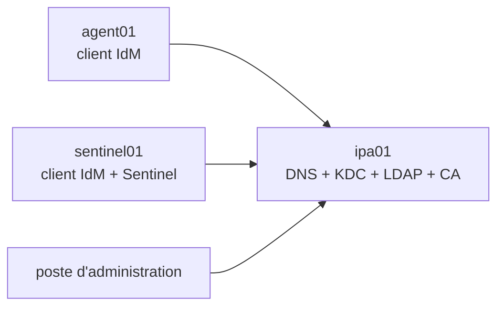
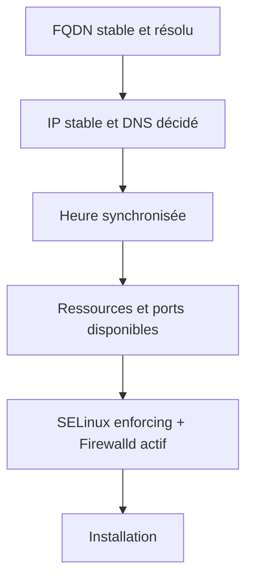
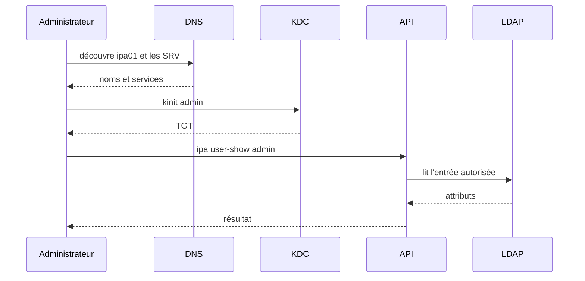

# Chapitre 8.3 — Installer un serveur FreeIPA de laboratoire

> **Campagne 8 — FreeIPA**
>
> *« Le succès de l'installation dépend surtout des décisions prises avant de lancer l'installateur. »*

## Vous êtes ici

```text
Partie II — Industrialiser la sécurité

Campagne 8 — FreeIPA

      8.1 Présentation de FreeIPA
      8.2 Architecture interne
    ► 8.3 Installation du serveur
      8.4 Gestion des utilisateurs
      8.5 Groupes et rôles
      8.6 Politiques sudo
      8.7 Hôtes et règles HBAC
      8.8 Certificats
      8.9 Intégration de Sentinel
      8.10 Mission d'administration
```

## Objectifs pédagogiques

À la fin de ce chapitre, vous serez capable de :

- préparer nom, DNS, adresse, temps et ressources d'un serveur IdM ;
- installer FreeIPA avec DNS et autorité de certification intégrés ;
- vérifier séparément services, Kerberos, DNS, API et certificats ;
- retrouver les journaux d'installation et d'exécution ;
- distinguer une installation de laboratoire d'une architecture de production.

## Pourquoi ce chapitre existe

FreeIPA lie durablement le FQDN, le domaine DNS, le royaume Kerberos, les certificats et les objets de l'annuaire. Corriger après coup un nom improvisé est beaucoup plus difficile que préparer correctement la machine.

Le laboratoire construit un premier serveur autonome. Il sert à apprendre ; il ne constitue pas une topologie hautement disponible.

## Architecture du laboratoire

| Rôle | FQDN | Adresse documentaire |
|---|---|---|
| serveur FreeIPA + DNS + CA | `ipa01.sentinel.example.test` | `192.0.2.10` |
| serveur Sentinel, futur client | `sentinel01.sentinel.example.test` | `192.0.2.20` |
| agent mTLS, futur client | `agent01.sentinel.example.test` | `192.0.2.30` |

Les adresses `192.0.2.0/24` et le suffixe `.test` sont réservés à la documentation. Remplacez-les dans le réseau isolé du laboratoire.



Prévoyez des instantanés avant l'installation, mais ne les confondez pas avec une sauvegarde cohérente d'un domaine en production.

## Les décisions irréversibles ou coûteuses

### FQDN

Le nom doit être stable, en minuscules et résolu vers l'adresse de la machine :

```bash
sudo hostnamectl set-hostname ipa01.sentinel.example.test
hostname --fqdn
getent ahosts ipa01.sentinel.example.test
```

Évitez `localhost`, un nom court, une adresse dynamique ou un alias qui ne correspond pas à l'identité principale.

### Domaine et royaume

```text
Domaine DNS : sentinel.example.test
Royaume     : SENTINEL.EXAMPLE.TEST
```

Le royaume proposé à partir du domaine convient au laboratoire. En production, le choix doit tenir compte du DNS existant, des relations de confiance et de la pérennité organisationnelle.

### DNS intégré ou externe

Le laboratoire utilise le DNS intégré pour observer la découverte de services. Une entreprise peut déléguer le sous-domaine à FreeIPA ou maintenir les enregistrements dans un DNS externe.

Dans les deux cas, les clients doivent retrouver les enregistrements A/AAAA et SRV. Une ligne `/etc/hosts` seule ne suffit pas à représenter cette architecture.

## Préparer le système

### Ressources et réseau

Allouez une VM persistante avec plusieurs Gio de mémoire, suffisamment d'espace disque et une adresse stable. Les besoins exacts dépendent du nombre d'entrées, des services activés et de la topologie ; consultez la documentation de la version déployée.

Repérez le profil NetworkManager puis définissez l'adresse et le DNS adaptés à votre laboratoire :

```bash
nmcli connection show
ip -brief address
ip route
```

Exemple à adapter au nom réel de la connexion :

```bash
sudo nmcli connection modify 'System eth0' \
  ipv4.method manual \
  ipv4.addresses 192.0.2.10/24 \
  ipv4.gateway 192.0.2.1 \
  ipv4.dns '127.0.0.1' \
  ipv4.dns-search 'sentinel.example.test'
sudo nmcli connection up 'System eth0'
```

Configurer `127.0.0.1` comme DNS n'est pertinent qu'une fois le DNS local disponible. Avant l'installation, assurez la résolution du FQDN par le DNS amont ou une entrée temporaire cohérente ; supprimez les contournements devenus inutiles après installation.

### Heure

```bash
sudo systemctl enable --now chronyd
timedatectl
chronyc tracking
chronyc sources -v
```

La présence de `chronyd` ne prouve pas la synchronisation : contrôlez la source et l'écart.

### Mise à jour, SELinux et pare-feu

```bash
sudo dnf update -y
sestatus
sudo firewall-cmd --state
sudo firewall-cmd --get-active-zones
```

Conservez SELinux en mode `Enforcing`. Une installation qui exige sa désactivation révèle un problème de préparation ou une procédure obsolète.

### Contrôles préalables

```bash
hostname --fqdn
getent hosts ipa01.sentinel.example.test
ip -brief address
chronyc tracking
df -h / /var
free -h
sestatus
sudo ss -lntup
```

Vérifiez qu'aucun service existant n'occupe les ports nécessaires, notamment DNS si vous activez le serveur intégré.



## Installer les paquets

Sur RHEL 9 et distributions compatibles, les paquets IdM ne nécessitent plus l'activation d'un module DNF :

```bash
sudo dnf install -y ipa-server ipa-server-dns
rpm -q ipa-server ipa-server-dns
command -v ipa-server-install
```

Le nom commercial IdM et les commandes `ipa-*` désignent la même famille de logiciels FreeIPA.

## Lancer l'installation interactive

L'interactivité évite d'inscrire les mots de passe dans l'historique du shell :

```bash
sudo ipa-server-install --setup-dns
```

Réponses attendues pour le laboratoire :

```text
Server host name : ipa01.sentinel.example.test
DNS domain name  : sentinel.example.test
Kerberos realm   : SENTINEL.EXAMPLE.TEST
Configure DNS    : yes
Forwarders       : ceux du laboratoire, ou aucun réseau externe
Reverse zone     : selon le plan d'adressage contrôlé
```

L'installateur demande deux secrets distincts :

- le mot de passe du **Directory Manager**, compte de récupération de l'annuaire ;
- le mot de passe de l'administrateur `admin` du domaine.

Stockez-les dans le gestionnaire de secrets du laboratoire. Ne les mettez ni dans Git, ni dans un script, ni dans la documentation de preuve.

Une installation non interactive est utile pour l'automatisation, mais passez alors les secrets par un mécanisme protégé. La campagne 9 utilisera les rôles `ansible-freeipa` plutôt qu'une longue commande enregistrée dans l'historique.

Le journal principal est :

```bash
sudo less /var/log/ipaserver-install.log
```

## Ouvrir les services nécessaires

Identifiez la zone portée par l'interface, puis ajoutez les services à cette zone :

```bash
sudo firewall-cmd --get-active-zones
sudo firewall-cmd --permanent --add-service=freeipa-4
sudo firewall-cmd --permanent --add-service=dns
sudo firewall-cmd --reload
sudo firewall-cmd --list-services
```

`freeipa-4` regroupe les ports du serveur IdM courants. Vérifiez sa définition sur la distribution :

```bash
sudo firewall-cmd --info-service=freeipa-4
```

Dans un environnement filtré par sources, limitez l'accès aux réseaux clients prévus au lieu d'ouvrir le service sur une zone trop large.

## Vérifier les services

### Vue FreeIPA

```bash
sudo ipactl status
```

`ipactl` orchestre les composants IdM. Utilisez ensuite `systemctl` et les journaux du composant en faute, plutôt qu'un redémarrage global automatique.

### DNS

```bash
dig +short ipa01.sentinel.example.test
dig +short -x 192.0.2.10
dig +short -t SRV _ldap._tcp.sentinel.example.test
dig +short -t SRV _kerberos._udp.sentinel.example.test
```

La zone inverse peut être absente si vous avez explicitement choisi de ne pas la gérer. Documentez ce choix ; ne présentez pas une réponse vide comme une réussite.

### Kerberos

```bash
kinit admin
klist
```

Contrôlez le principal, le royaume, les dates et le cache. À la fin de la session administrative :

```bash
kdestroy
klist
```

La dernière commande doit indiquer qu'aucun cache de tickets n'est disponible.

### API et annuaire

Après un nouveau `kinit admin` :

```bash
ipa ping
ipa env | head
ipa user-show admin
ipa config-show
```

### HTTPS et certificat

```bash
curl --fail --cacert /etc/ipa/ca.crt \
  https://ipa01.sentinel.example.test/ipa/ui/
openssl x509 -in /var/lib/ipa/certs/httpd.crt \
  -noout -subject -issuer -dates -ext subjectAltName
```

Le chemin exact du certificat système peut varier selon la version. Utilisez `getcert list` et la documentation de l'installation pour identifier le fichier réellement suivi.

### Ports et journaux

```bash
sudo ss -lntup
sudo journalctl --since '-15 minutes' -p warning
sudo tail -n 100 /var/log/ipaserver-install.log
```

Quelques emplacements utiles :

| Composant | Source de diagnostic |
|---|---|
| installation | `/var/log/ipaserver-install.log` |
| Apache/API | journal de `httpd` et journaux IPA |
| 389 DS | journaux de l'instance Directory Server |
| Kerberos | journaux KDC |
| Dogtag | journaux PKI |
| DNS | journal de `named` |

Les noms exacts des unités et répertoires dépendent de l'instance et de la version ; partez de `ipactl status` et `systemctl status`.

## Une validation de bout en bout



Conservez les sorties de chacune de ces étapes. Une interface Web visible ne remplace pas ce test.

## Ce que le laboratoire ne fournit pas

Un seul serveur reste un point unique de panne. Une architecture de production doit notamment prévoir :

- plusieurs réplicas dans des zones de défaillance pertinentes ;
- plusieurs serveurs DNS et un nombre raisonné de réplicas CA ;
- sauvegardes IdM cohérentes et restaurations testées ;
- supervision de réplication, tickets, certificats, temps et capacité ;
- procédures pour la perte d'un serveur ou d'un secret d'administration ;
- intégration éventuelle avec Active Directory.

Plus de réplicas n'est pas toujours mieux : la réplication et les services CA ont un coût. Le dimensionnement suit la topologie, pas un nombre arbitraire.

## Désinstaller dans un laboratoire

Avant de détruire la VM, la commande prévue est :

```bash
sudo ipa-server-install --uninstall
```

Cette action est destructive pour le serveur IdM. Ne l'exécutez jamais sur le seul serveur contenant un domaine utile. Dans le laboratoire, préférez revenir à un instantané identifié si vous devez recommencer la campagne.

## Mise en pratique — dossier de preuve

Créez un dossier hors du dépôt de code et conservez :

1. le plan de nommage et d'adressage ;
2. les contrôles préalables ;
3. le résumé de l'installateur sans secrets ;
4. l'état `ipactl` ;
5. les réponses DNS A/PTR/SRV ;
6. un TGT valide puis détruit ;
7. une requête `ipa user-show` réussie ;
8. le certificat HTTPS lu avec OpenSSL ;
9. les règles Firewalld réellement chargées ;
10. les limites connues de la topologie à un serveur.

## Impact sur Sentinel

Sentinel n'est pas encore modifié. Le serveur `ipa01` devient la racine de confiance du laboratoire qui enrôlera `sentinel01`, créera ses groupes et délivrera ses certificats. Cette dépendance doit être opérationnelle avant de toucher à l'application.

## Synthèse

- le FQDN, le domaine, le royaume, le DNS et l'heure précèdent l'installation ;
- le laboratoire active DNS et CA intégrés pour rendre les dépendances observables ;
- les secrets administratifs ne doivent pas figurer dans les commandes versionnées ;
- `ipactl`, DNS, Kerberos, l'API et les certificats se valident séparément ;
- SELinux reste en application et Firewalld n'ouvre que les services prévus ;
- un serveur unique permet d'apprendre, mais ne fournit pas la haute disponibilité.

## Infographie de révision

```text
PLANIFIER
  FQDN · domaine · royaume · DNS · IP · heure
        ↓
INSTALLER
  ipa-server + DNS + CA
        ↓
VALIDER
  ipactl · SRV · kinit · ipa ping · certificat
        ↓
PROTÉGER
  secrets · pare-feu · sauvegarde · réplication future
```

## Pour aller plus loin

Le domaine est disponible. Le chapitre suivant crée et fait vivre sa première identité humaine sans confondre mot de passe, ticket et état du compte.

[Continuer vers le chapitre 8.4 — Gérer les utilisateurs](8.4-gestion-utilisateurs.md)

Références : [Installing Identity Management](https://docs.redhat.com/en/documentation/red_hat_enterprise_linux/9/html/installing_identity_management/) et [Planning Identity Management](https://docs.redhat.com/en/documentation/red_hat_enterprise_linux/9/html/planning_identity_management/).
