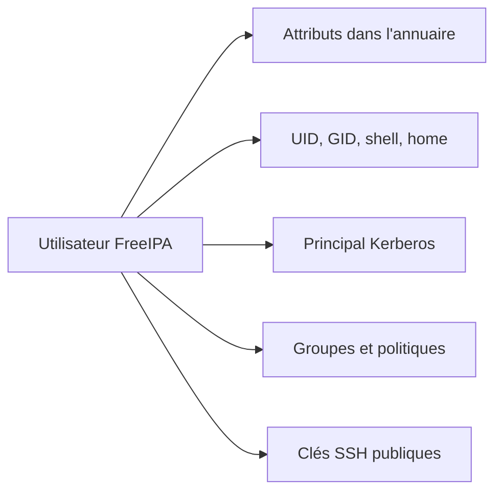
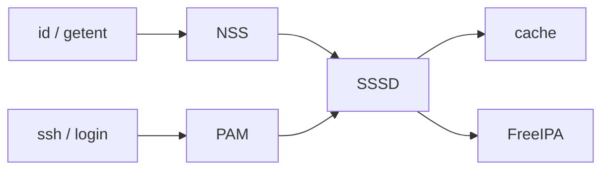
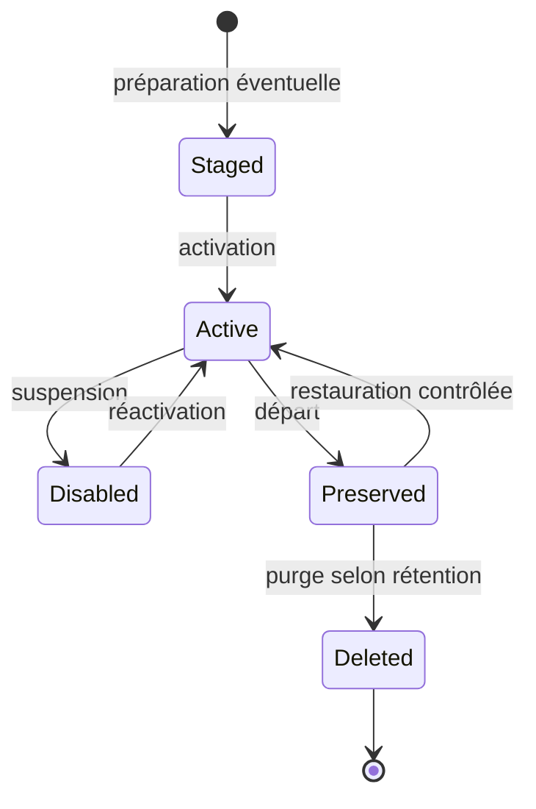

# Chapitre 8.4 — Gérer le cycle de vie des utilisateurs FreeIPA

> **Campagne 8 — FreeIPA**
>
> *« Créer un compte est une minute d'administration ; maîtriser tout son cycle de vie est une politique. »*

## Vous êtes ici

```text
Partie II — Industrialiser la sécurité

Campagne 8 — FreeIPA

      8.1 Présentation de FreeIPA
      8.2 Architecture interne
      8.3 Installation du serveur
    ► 8.4 Gestion des utilisateurs
      8.5 Groupes et rôles
      8.6 Politiques sudo
      8.7 Hôtes et règles HBAC
      8.8 Certificats
      8.9 Intégration de Sentinel
      8.10 Mission d'administration
```

## Objectifs pédagogiques

À la fin de ce chapitre, vous serez capable de :

- créer une identité avec des attributs cohérents ;
- distinguer compte, principal Kerberos, mot de passe et UID ;
- tester résolution NSS et première authentification ;
- désactiver, préserver, réactiver ou supprimer un utilisateur ;
- gérer prudemment mot de passe et clé SSH.

## Pourquoi ce chapitre existe

Une identité centrale n'est utile que si son arrivée, ses changements de fonction et son départ sont maîtrisés. La commande de création est simple ; les conséquences d'un UID mal choisi, d'un compte jamais désactivé ou d'une clé oubliée le sont moins.

## Ce que représente un utilisateur

Une entrée utilisateur FreeIPA réunit plusieurs dimensions :

| Dimension | Exemples |
|---|---|
| identité humaine | prénom, nom, adresse électronique |
| identité POSIX | nom de connexion, UID, GID, shell, répertoire |
| identité Kerberos | principal et clés dérivées du secret |
| appartenance | groupes directs et indirects |
| accès | clés SSH, état, dates d'expiration |



Le mot de passe n'est pas stocké comme un texte lisible. Le KDC conserve les informations cryptographiques nécessaires à l'authentification. L'UID reste important pour les systèmes de fichiers : changer une identité numérique après création peut laisser des fichiers orphelins.

## Préparer une convention

Avant la première création, décidez :

- format du login et traitement des homonymes ;
- plage d'UID/GID gérée par le domaine ;
- shell autorisé et chemin des répertoires personnels ;
- attributs obligatoires et source RH ;
- règles d'expiration, de désactivation et de conservation ;
- propriétaire du processus d'approbation.

Un login court comme `alice` convient au laboratoire. En production, la convention doit rester stable même après un changement de nom.

## Créer et examiner une identité

Obtenez un ticket administratif, puis vérifiez l'absence de conflit :

```bash
kinit admin
ipa user-find alice
getent passwd alice
```

Créez l'utilisateur sans inscrire de mot de passe dans la commande :

```bash
ipa user-add alice \
  --first='Alice' \
  --last='Martin' \
  --email='alice@sentinel.example.test' \
  --shell='/bin/bash'
```

Puis observez les valeurs réellement attribuées :

```bash
ipa user-show alice --all
ipa user-show alice --raw
```

`--all` montre les attributs utiles supplémentaires ; `--raw` expose davantage les noms LDAP. Ce dernier sert au diagnostic, pas à l'apprentissage par cœur.

### Groupe privé et GID

Par défaut, une identité POSIX peut recevoir un groupe privé du même nom. Cette pratique simplifie la propriété des fichiers. Elle n'élimine pas les groupes fonctionnels comme `sentinel-operators`.

```bash
ipa group-show alice
```

## Initialiser le secret sans le divulguer

```bash
ipa passwd alice
```

Saisissez un mot de passe temporaire de laboratoire à l'invite. Le premier `kinit` force généralement l'utilisateur à le remplacer :

```bash
kdestroy
kinit alice
klist
```

Le changement obligatoire prouve que l'administrateur ne connaît pas durablement le secret final. Un mot de passe temporaire ne doit pas être transmis dans un canal public ni réutilisé pour plusieurs personnes.

### Mot de passe expiré et compte expiré

Ces états sont différents :

- l'expiration du mot de passe demande son renouvellement ;
- l'expiration ou la désactivation du compte interdit l'usage de l'identité ;
- l'expiration d'un ticket déjà émis suit les durées Kerberos, pas celle de la session shell.

Une procédure de départ doit donc couvrir comptes, sessions, tickets, clés SSH, certificats et droits applicatifs.

## Vérifier les interfaces Linux

Sur un client enrôlé :

```bash
getent passwd alice
id alice
sssctl user-checks alice
```

La résolution NSS ne prouve pas que la connexion SSH est autorisée : PAM, HBAC, le shell, le répertoire personnel et `sshd` interviennent ensuite.



## Répertoire personnel

FreeIPA stocke le chemin attendu, mais l'annuaire ne crée pas le répertoire sur chaque client. `oddjob-mkhomedir`, `pam_mkhomedir`, un montage réseau ou l'automatisation peuvent s'en charger.

```bash
getent passwd alice
authselect current
```

Choisissez une stratégie cohérente. Un répertoire local créé au premier login ne suit pas automatiquement l'utilisateur sur une autre machine.

## Modifier sans casser l'identité

Les attributs descriptifs évoluent facilement :

```bash
ipa user-mod alice \
  --title='Opératrice Sentinel' \
  --phone='+33 1 00 00 00 00'
ipa user-show alice
```

Soyez beaucoup plus prudent avec login, UID, GID, répertoire et principal : ces valeurs peuvent être référencées par des fichiers, ACL, tickets, applications ou journaux.

## Ajouter une clé SSH publique

FreeIPA peut distribuer la clé publique d'un utilisateur aux clients intégrés. La clé privée ne doit jamais être envoyée à l'annuaire.

```bash
ipa user-mod alice --sshpubkey="$(< ~/.ssh/id_ed25519.pub)"
ipa user-show alice --all | grep -i 'SSH public key'
```

Avant la commande, vérifiez que le fichier contient uniquement la clé publique prévue. Une clé SSH n'est pas un substitut au cycle de vie du compte : désactivation, rotation et révocation restent nécessaires.

## Désactiver, préserver ou supprimer

### Désactivation temporaire

```bash
ipa user-disable alice
ipa user-show alice
```

Testez ensuite un nouveau `kinit alice`, qui doit échouer. Un ticket ou une session déjà ouverts peuvent survivre jusqu'à leur fin ; la réponse à incident doit les traiter séparément.

Pour réactiver :

```bash
ipa user-enable alice
```

### Suppression préservée

Pour un départ, IdM peut préserver l'entrée afin de conserver certains attributs et permettre une restauration contrôlée :

```bash
ipa user-del alice --preserve
ipa user-find --preserved=true
```

La restauration se fait avec la commande prévue par la version, généralement :

```bash
ipa user-undel alice
```

Validez cette procédure dans le laboratoire avant de l'inscrire dans une politique. Une suppression définitive ne supprime pas les fichiers dont l'ancien UID est propriétaire.

### États du cycle de vie



Les *stage users* permettent de préparer des entrées avant activation dans des workflows avancés. Ils sont utiles à connaître, mais le laboratoire peut rester sur création directe puis conservation.

## Regards sécurité

- **Architecte** : relie le cycle de vie à la source RH, aux validations et aux délais de révocation.
- **Attaquant** : recherche comptes inactifs, clés jamais retirées et sessions encore ouvertes.
- **Culture** : l'identité numérique survit souvent plus longtemps que la relation contractuelle ; la rétention répond à l'audit, pas à la nostalgie.
- **Piège** : supprimer immédiatement un utilisateur peut rendre ses fichiers identifiables uniquement par un UID numérique.

## Mise en pratique — arrivée, contrôle et départ

1. créez `alice` et examinez tous ses attributs ;
2. définissez un secret temporaire sans le placer dans l'historique ;
3. réalisez le premier `kinit` et changez le secret ;
4. vérifiez `getent`, `id` et `sssctl user-checks` sur un client ;
5. ajoutez une clé publique éphémère ;
6. désactivez le compte et prouvez le refus d'un nouveau ticket ;
7. réactivez-le pour la suite de la campagne ;
8. documentez la différence entre désactivation, préservation et purge.

## Impact sur Sentinel

`alice` représente une personne, pas le processus Sentinel. Elle sera ajoutée à un groupe fonctionnel puis recevra des droits administratifs ciblés. Le service continuera de tourner sous le compte système local `sentinel`.

## Synthèse

- un utilisateur FreeIPA combine attributs LDAP, identité POSIX et principal Kerberos ;
- l'UID/GID a des conséquences durables sur les fichiers ;
- le secret temporaire doit être changé par l'utilisateur ;
- NSS résout une identité, tandis que PAM et HBAC contrôlent l'accès ;
- FreeIPA ne crée pas seul tous les répertoires personnels ;
- désactiver, préserver et supprimer répondent à des objectifs différents ;
- une clé SSH publique centralisée reste soumise au cycle de vie du compte.

## Infographie de révision

```text
PRÉPARER → CRÉER → SECRET TEMPORAIRE → PREMIER KINIT
   ↓          ↓             ↓                 ↓
convention  UID/GID     jamais en Git     secret personnel

ACTIF ⇄ DÉSACTIVÉ → PRÉSERVÉ → PURGÉ
       chaque transition exige une preuve et une politique
```

## Pour aller plus loin

Le chapitre suivant attribue les responsabilités à des groupes et réserve les rôles FreeIPA à l'administration du domaine.

[Continuer vers le chapitre 8.5 — Organiser groupes et rôles](8.5-groupes-roles.md)

Référence : [RHEL 9 — Managing IdM users, groups, hosts, and access control rules](https://docs.redhat.com/en/documentation/red_hat_enterprise_linux/9/html/managing_idm_users_groups_hosts_and_access_control_rules/).
