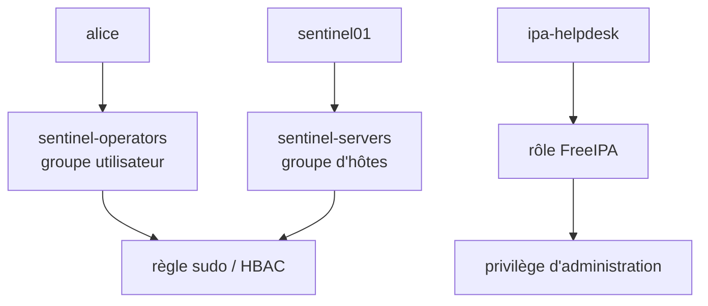
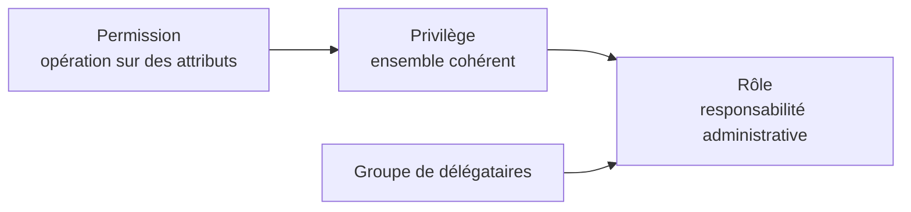

# Chapitre 8.5 — Organiser les groupes et les rôles FreeIPA

> **Campagne 8 — FreeIPA**
>
> *« On attribue une responsabilité à une fonction ; les personnes entrent et sortent de cette fonction. »*

## Vous êtes ici

```text
Partie II — Industrialiser la sécurité

Campagne 8 — FreeIPA

      8.1 Présentation de FreeIPA
      8.2 Architecture interne
      8.3 Installation du serveur
      8.4 Gestion des utilisateurs
    ► 8.5 Groupes et rôles
      8.6 Politiques sudo
      8.7 Hôtes et règles HBAC
      8.8 Certificats
      8.9 Intégration de Sentinel
      8.10 Mission d'administration
```

## Objectifs pédagogiques

À la fin de ce chapitre, vous serez capable de :

- distinguer groupes d'utilisateurs, groupes d'hôtes et rôles administratifs ;
- choisir entre groupe POSIX et non-POSIX ;
- gérer appartenances directes, indirectes et cache client ;
- expliquer la chaîne permission → privilège → rôle ;
- concevoir les groupes fonctionnels de Sentinel.

## Pourquoi ce chapitre existe

Attribuer un droit directement à chaque personne multiplie les exceptions. Un modèle par groupes relie la fonction à la politique, puis gère uniquement l'appartenance des personnes.

FreeIPA emploie toutefois plusieurs objets nommés « groupe » ou « rôle ». Les confondre produit soit des droits inefficaces, soit une délégation beaucoup trop large.

## Trois périmètres distincts

| Objet | Membres | Usage principal |
|---|---|---|
| groupe d'utilisateurs | personnes ou autres groupes | identité POSIX, `sudo`, HBAC, application |
| groupe d'hôtes | machines ou groupes d'hôtes | périmètre des politiques |
| rôle FreeIPA | utilisateurs/groupes + privilèges | administrer des objets dans FreeIPA |



Le groupe `sentinel-operators` ne permet pas, par lui-même, de modifier l'annuaire. Le rôle FreeIPA ne représente pas automatiquement un rôle métier dans Sentinel.

## Groupes POSIX, non-POSIX et externes

### POSIX

Un groupe POSIX possède un GID et apparaît sur les clients Linux :

```bash
ipa group-add sentinel-operators \
  --desc='Opérateurs autorisés à exploiter Sentinel'
ipa group-show sentinel-operators
```

Utilisez-le lorsque les systèmes doivent résoudre le groupe avec `getent` ou `id`.

### Non-POSIX

Un groupe non-POSIX organise des objets dans FreeIPA sans identité de groupe Unix :

```bash
ipa group-add ipa-helpdesk \
  --nonposix \
  --desc='Délégation limitée dans FreeIPA'
```

Il convient aux délégations administratives qui n'ont pas besoin d'un GID sur les hôtes.

### Externe

Les groupes externes servent notamment à référencer des identités provenant d'un domaine en relation de confiance. Ils ne sont pas nécessaires au laboratoire autonome, mais deviennent importants dans une intégration Active Directory.

## Construire les groupes Sentinel

Le laboratoire utilise :

| Groupe | Responsabilité future |
|---|---|
| `sentinel-admins` | administration complète, très limitée |
| `sentinel-operators` | état, diagnostic et opérations prévues |
| `sentinel-auditors` | consultation des preuves sans modification |

```bash
ipa group-add sentinel-admins --desc='Administrateurs Sentinel'
ipa group-add sentinel-operators --desc='Opérateurs Sentinel'
ipa group-add sentinel-auditors --desc='Auditeurs Sentinel'
```

Ajoutez les membres par fonction :

```bash
ipa group-add-member sentinel-operators --users=alice
ipa group-show sentinel-operators --all
```

Pour retirer :

```bash
ipa group-remove-member sentinel-operators --users=alice
```

Supprimer un groupe utilisé par plusieurs politiques casse leur intention. Recherchez ses références et désactivez les politiques concernées avant la suppression.

## Appartenances directes et indirectes

Un groupe peut contenir un autre groupe. Cette imbrication simplifie certains modèles organisationnels, mais rend le résultat moins visible.


Le droit d'Alice devient indirect. Vérifiez les deux perspectives :

```bash
ipa user-show alice --all
ipa group-show sentinel-operators --all
```

Évitez les imbrications profondes et documentez le propriétaire de chaque groupe. Un nom clair vaut mieux qu'une chaîne de cinq appartenances.

## Observation sur le client et cache SSSD

```bash
getent group sentinel-operators
id alice
sssctl user-show alice
```

Une session déjà ouverte conserve sa liste de groupes au moment de la connexion. Après une modification centrale, il peut être nécessaire de fermer la session et de laisser SSSD rafraîchir son cache.

```bash
sudo sss_cache -u alice
```

N'invalidez pas tout le cache à chaque test. Commencez par vérifier l'objet côté serveur, l'état du domaine SSSD et la durée de cache.

## Les groupes d'hôtes

Créez le périmètre des serveurs applicatifs :

```bash
ipa hostgroup-add sentinel-servers \
  --desc='Hôtes exécutant le service Sentinel'
ipa hostgroup-add-member sentinel-servers \
  --hosts=sentinel01.sentinel.example.test
ipa hostgroup-show sentinel-servers --all
```

Un groupe d'hôtes peut représenter une fonction (`sentinel-servers`) ou un environnement (`production`). Croiser plusieurs groupes dans une règle rend souvent l'intention plus claire que des noms d'hôtes individuels.

## Permission, privilège et rôle administratif

La délégation FreeIPA suit trois niveaux :



- une **permission** décrit une opération précise sur des entrées ou attributs ;
- un **privilège** rassemble des permissions pour une fonction ;
- un **rôle** rassemble des privilèges et reçoit des membres.

Examinez les objets existants avant d'en créer :

```bash
ipa permission-find --sizelimit=20
ipa privilege-find
ipa role-find
ipa role-show 'User Administrator' --all
```

Les rôles intégrés peuvent être plus larges que le besoin. « Helpdesk Sentinel » ne devrait pas pouvoir créer des administrateurs de domaine ou modifier la CA.

## Créer une délégation de laboratoire

Créez d'abord le rôle sans privilège :

```bash
ipa role-add 'Sentinel Identity Helpdesk' \
  --desc='Délégation d'identité à définir et relire'
ipa role-add-member 'Sentinel Identity Helpdesk' \
  --groups=ipa-helpdesk
```

N'attachez pas immédiatement un privilège intégré au hasard. Pour le laboratoire :

1. identifiez les opérations exactes, par exemple réinitialiser un mot de passe ou modifier une clé publique ;
2. examinez les permissions et privilèges existants ;
3. créez si nécessaire une permission limitée aux attributs et entrées prévus ;
4. testez avec un membre du helpdesk et un non-membre ;
5. vérifiez qu'une opération administrative sensible reste interdite.

La syntaxe des permissions évolue entre versions. Utilisez :

```bash
ipa help permission-add
ipa help privilege-add-permission
ipa help role-add-privilege
```

Cette pause volontaire enseigne une règle importante : une délégation ne doit pas être inventée à partir d'un nom séduisant.

## Conception et séparation des responsabilités

| Fonction | Groupe métier | Délégation FreeIPA | Accès système |
|---|---|---|---|
| opérateur Sentinel | `sentinel-operators` | aucune | règle `sudo` ciblée |
| auditeur | `sentinel-auditors` | aucune | lecture des preuves |
| helpdesk identités | `ipa-helpdesk` | rôle limité | aucun accès Sentinel implicite |
| administrateur IdM | groupe dédié | rôles IdM nécessaires | accès aux serveurs IdM contrôlé |

Une même personne peut cumuler temporairement des fonctions, mais le modèle doit rendre ce cumul visible et révisable.

## Regards sécurité

- **Architecte** : privilégie des groupes stables, un propriétaire et une revue périodique.
- **Attaquant** : cherche les groupes imbriqués oubliés et les rôles intégrés trop larges.
- **Culture** : le RBAC exprime une responsabilité ; l'ABAC ajoute des attributs et conditions. FreeIPA combine plusieurs approches selon l'objet.
- **Piège** : utiliser `sentinel-admins` à la fois comme rôle métier, groupe Unix et délégation de l'annuaire crée des dépendances invisibles.

## Mise en pratique — produire une matrice de responsabilités

1. créez les trois groupes utilisateurs Sentinel ;
2. ajoutez `alice` à `sentinel-operators` ;
3. créez `sentinel-servers` et ajoutez l'hôte si celui-ci existe déjà ;
4. observez l'appartenance côté serveur puis côté client ;
5. créez le rôle vide `Sentinel Identity Helpdesk` ;
6. documentez les opérations que ce rôle devrait et ne devrait jamais posséder ;
7. obtenez une validation avant d'attacher un privilège.

Livrable : une matrice `fonction → groupe → politique → propriétaire → fréquence de revue`.

## Impact sur Sentinel

Ces groupes serviront à trois couches différentes : `sudo` et HBAC sur les hôtes, administration du service, et autorisation applicative future. Sentinel `0.6.0` n'importe pas les groupes dans une base locale : FreeIPA reste la source et l'application ne conserve que sa politique propre.

## Synthèse

- les groupes utilisateurs portent les fonctions humaines ;
- les groupes POSIX sont visibles sur Linux, contrairement aux groupes non-POSIX ;
- les groupes d'hôtes définissent le périmètre des politiques ;
- les appartenances indirectes et caches doivent être observés ;
- permission, privilège et rôle administrent FreeIPA lui-même ;
- un rôle métier Sentinel n'est pas un rôle administratif FreeIPA ;
- toute délégation exige un cas positif et un refus attendu.

## Infographie de révision

```text
PERSONNES → GROUPES UTILISATEURS ─┐
                                  ├→ sudo / HBAC / application
MACHINES  → GROUPES D'HÔTES ──────┘

DÉLÉGATION FREEIPA : PERMISSION → PRIVILÈGE → RÔLE → MEMBRES
```

## Pour aller plus loin

Le chapitre suivant utilise les groupes d'utilisateurs et d'hôtes pour construire une autorisation `sudo` minimale et vérifiable.

[Continuer vers le chapitre 8.6 — Centraliser les politiques sudo](8.6-politiques-sudo.md)

Référence : [RHEL 9 — Managing IdM users, groups, hosts, and access control rules](https://docs.redhat.com/en/documentation/red_hat_enterprise_linux/9/html/managing_idm_users_groups_hosts_and_access_control_rules/).
