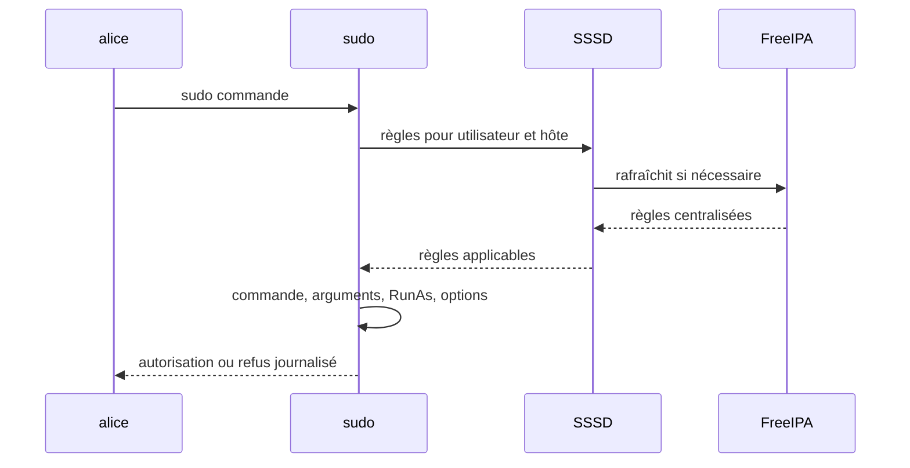
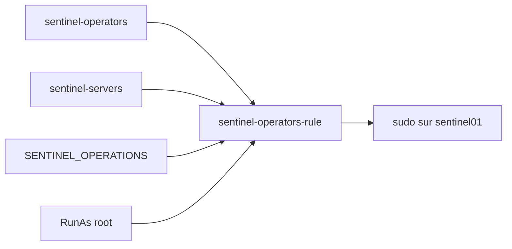
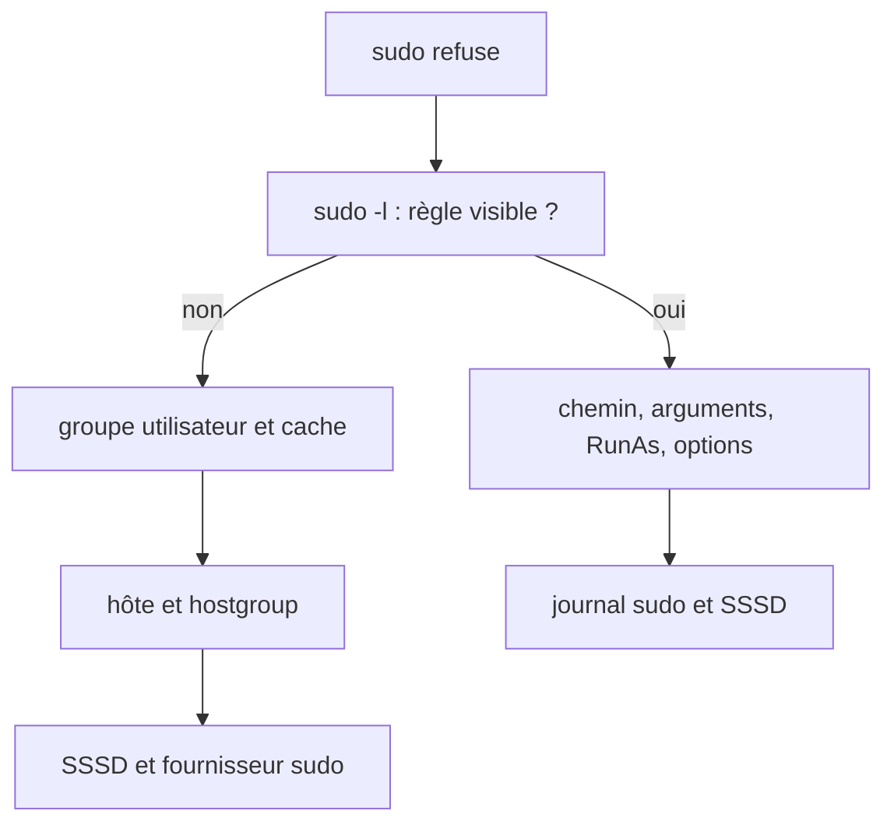

# Chapitre 8.6 — Centraliser les politiques sudo avec FreeIPA

> **Campagne 8 — FreeIPA**
>
> *« Une délégation sûre nomme qui, où, en tant que qui et pour quelle commande. »*

## Vous êtes ici

```text
Partie II — Industrialiser la sécurité

Campagne 8 — FreeIPA

      8.1 Présentation de FreeIPA
      8.2 Architecture interne
      8.3 Installation du serveur
      8.4 Gestion des utilisateurs
      8.5 Groupes et rôles
    ► 8.6 Politiques sudo
      8.7 Hôtes et règles HBAC
      8.8 Certificats
      8.9 Intégration de Sentinel
      8.10 Mission d'administration
```

## Objectifs pédagogiques

À la fin de ce chapitre, vous serez capable de :

- décomposer une règle `sudo` centralisée ;
- créer commandes, groupe de commandes et règle FreeIPA ;
- limiter la règle à un groupe d'utilisateurs et d'hôtes ;
- vérifier le résultat avec SSSD et `sudo -l` ;
- prouver que des commandes voisines restent interdites.

## Pourquoi ce chapitre existe

Le fichier `/etc/sudoers` d'un serveur peut être bien écrit et néanmoins devenir une exception oubliée. FreeIPA centralise l'intention, tandis que chaque client continue d'utiliser `sudo` et SSSD pour l'évaluer.

La centralisation ne rend pas une règle sûre par magie. Une règle `ALL` centralisée reste une règle `ALL`.

## Le chemin d'une décision sudo



Le ticket `kinit admin` sert à modifier FreeIPA avec la CLI. L'utilisateur qui exécute `sudo` s'authentifie selon la politique PAM/`sudo` du client, généralement avec son propre secret, sauf mécanisme GSSAPI explicitement configuré.

## Anatomie d'une règle

| Dimension | Objet FreeIPA | Exemple Sentinel |
|---|---|---|
| qui ? | utilisateur ou groupe | `sentinel-operators` |
| où ? | hôte ou groupe d'hôtes | `sentinel-servers` |
| quoi ? | commande ou groupe de commandes | opérations Sentinel |
| en tant que qui ? | RunAs | `root` |
| avec quelles options ? | options `sudo` | authentification requise |



Une règle ne s'applique que si toutes les dimensions correspondent.

## Concevoir les commandes avant la règle

Pour le laboratoire, les opérateurs peuvent :

```text
/usr/bin/systemctl status sentinel.service
/usr/bin/systemctl is-active sentinel.service
/usr/bin/systemctl restart sentinel.service
```

Ils ne peuvent pas :

```text
/usr/bin/systemctl restart sshd.service
/bin/bash
/usr/bin/systemctl edit sentinel.service
```

Le chemin absolu évite que la recherche `PATH` sélectionne un autre exécutable. Vérifiez-le sur le client :

```bash
command -v systemctl
readlink -f "$(command -v systemctl)"
```

### Arguments et contournements

Les arguments font partie de l'expression d'une commande `sudo`, mais les jokers et les outils polyvalents peuvent ouvrir des possibilités inattendues. `systemctl` sait agir sur de nombreuses unités et possède plusieurs sous-commandes.

Pour une opération complexe, préférez un wrapper minimal, possédé par `root`, non modifiable par le groupe autorisé et sans argument libre :

```bash
sudo install -o root -g root -m 0755 \
  /dev/null /usr/local/sbin/restart-sentinel
sudoedit /usr/local/sbin/restart-sentinel
```

Contenu attendu :

```sh
#!/bin/sh
exec /usr/bin/systemctl restart sentinel.service
```

Après l'édition :

```bash
sudo chown root:root /usr/local/sbin/restart-sentinel
sudo chmod 0755 /usr/local/sbin/restart-sentinel
sudo sha256sum /usr/local/sbin/restart-sentinel
```

Le laboratoire ci-dessous utilise les commandes explicites pour rendre les objets FreeIPA visibles. La mission finale pourra retenir le wrapper après revue.

## Créer les objets sudo

### 1. Enregistrer les commandes

```bash
kinit admin
ipa sudocmd-add '/usr/bin/systemctl status sentinel.service' \
  --desc='Afficher l état du service Sentinel'
ipa sudocmd-add '/usr/bin/systemctl is-active sentinel.service' \
  --desc='Tester l activité du service Sentinel'
ipa sudocmd-add '/usr/bin/systemctl restart sentinel.service' \
  --desc='Redémarrer le service Sentinel'
```

Les chaînes sont citées pour que le shell ne les découpe pas avant la commande `ipa`.

### 2. Regrouper les commandes

```bash
ipa sudocmdgroup-add SENTINEL_OPERATIONS \
  --desc='Opérations déléguées sur Sentinel'
ipa sudocmdgroup-add-member SENTINEL_OPERATIONS \
  --sudocmds='/usr/bin/systemctl status sentinel.service' \
  --sudocmds='/usr/bin/systemctl is-active sentinel.service' \
  --sudocmds='/usr/bin/systemctl restart sentinel.service'
ipa sudocmdgroup-show SENTINEL_OPERATIONS --all
```

Le groupe de commandes facilite la réutilisation et la revue. Il ne donne encore aucun droit.

### 3. Créer la règle

```bash
ipa sudorule-add sentinel-operators-rule \
  --desc='Exploitation limitée de Sentinel sur ses serveurs'
```

### 4. Ajouter les utilisateurs et hôtes

```bash
ipa sudorule-add-user sentinel-operators-rule \
  --groups=sentinel-operators
ipa sudorule-add-host sentinel-operators-rule \
  --hostgroups=sentinel-servers
```

Évitez `--hostcat=all` et `--usercat=all` dans une règle applicative : ils élargiraient le périmètre au-delà des groupes conçus.

### 5. Ajouter les commandes et RunAs

```bash
ipa sudorule-add-allow-command sentinel-operators-rule \
  --sudocmdgroups=SENTINEL_OPERATIONS
ipa sudorule-add-runasuser sentinel-operators-rule --users=root
ipa sudorule-show sentinel-operators-rule --all
```

Si la syntaxe RunAs diffère sur votre version, consultez `ipa help sudorule-add-runasuser` plutôt que de remplacer la cible par `ALL`.

## Authentification et NOPASSWD

Une option telle que `!authenticate` supprime la demande d'authentification pour les commandes concernées. Elle peut être nécessaire à un automate, mais augmente le risque d'une session déjà compromise.

Pour les opérateurs humains du laboratoire, conservez l'authentification. Si un service non interactif doit exécuter une action, créez une identité et une règle spécifiques, puis protégez son mécanisme d'authentification.

## Vérifier côté serveur

```bash
ipa group-show sentinel-operators
ipa hostgroup-show sentinel-servers
ipa sudocmdgroup-show SENTINEL_OPERATIONS
ipa sudorule-show sentinel-operators-rule --all
```

Cette vue valide la configuration centrale, pas encore sa consommation sur `sentinel01`.

## Vérifier côté client

Sur `sentinel01` :

```bash
systemctl status sssd --no-pager
sssctl domain-status sentinel.example.test
id alice
sudo -iu alice
```

Dans la session d'Alice :

```bash
sudo -l
sudo /usr/bin/systemctl status sentinel.service
sudo /usr/bin/systemctl is-active sentinel.service
sudo /usr/bin/systemctl restart sentinel.service
```

Puis prouvez les refus :

```bash
sudo /usr/bin/systemctl restart sshd.service
sudo /bin/bash
```

Les deux dernières commandes doivent être absentes de `sudo -l` et refusées. N'exécutez ces tests que sur une VM où l'échec n'interrompt pas votre accès d'administration.

## Cache et propagation

Une règle peut ne pas apparaître immédiatement à cause du cache SSSD. Avant de le vider :

1. vérifiez groupe, hôte et règle côté FreeIPA ;
2. vérifiez que le client appartient au bon domaine ;
3. fermez l'ancienne session utilisateur ;
4. attendez le rafraîchissement normal ;
5. invalidez enfin l'entrée ciblée si nécessaire.

```bash
sudo sss_cache -u alice
```

Redémarrer SSSD ou vider tout le cache peut masquer la cause et perturber les connexions hors ligne.

## Diagnostiquer un refus



Commandes utiles :

```bash
sudo journalctl _COMM=sudo --since '-10 minutes'
sudo journalctl -u sssd --since '-10 minutes'
sudo sssctl user-checks alice
```

Augmentez temporairement le niveau de journalisation SSSD seulement avec une procédure de retour arrière : les journaux peuvent devenir volumineux et contenir des informations sensibles.

## Journalisation : ce qu'elle prouve

Le journal `sudo` peut établir l'identité, la commande, la cible et le résultat. Il ne fournit pas automatiquement un enregistrement complet et fiable de tout ce qu'un shell privilégié exécute ensuite.

C'est une raison supplémentaire de refuser `/bin/bash`, les éditeurs capables de lancer un shell et les commandes trop génériques. Pour les exigences fortes, étudiez l'I/O logging de `sudo`, une collecte centralisée et des contrôles complémentaires.

## Regards sécurité

- **Architecte** : construit la règle depuis une matrice et versionne son intention.
- **Attaquant** : cherche les binaires permettant d'éditer, de charger un plugin, de changer d'unité ou d'ouvrir un shell.
- **Culture** : `sudo` délègue une exécution ; ce n'est ni une sandbox ni un contrôle d'accès applicatif.
- **Piège** : accorder `systemctl * sentinel*` avec des jokers mal compris peut autoriser plus d'unités ou d'arguments que prévu.

## Mise en pratique — revue croisée

Produisez un tableau de preuve :

| Test | Alice opératrice | utilisateur témoin | Résultat attendu |
|---|---|---|---|
| `sudo -l` | règle visible | règle absente | séparation des groupes |
| état Sentinel | autorisé | refusé | lecture déléguée |
| redémarrage Sentinel | autorisé | refusé | opération déléguée |
| redémarrage SSH | refusé | refusé | périmètre de service |
| shell root | refusé | refusé | absence d'échappement évident |

Conservez les sorties côté FreeIPA, côté client et les journaux du refus.

## Impact sur Sentinel

La règle permet d'exploiter l'unité sans partager le compte `root` ni rendre le compte système `sentinel` interactif. Elle ne donne aucun droit dans l'API Sentinel : l'administration Linux et l'autorisation applicative restent séparées.

## Synthèse

- une règle `sudo` relie utilisateurs, hôtes, commandes, RunAs et options ;
- les groupes rendent l'intention stable malgré les mouvements de personnes et machines ;
- chemin absolu et arguments précis réduisent les ambiguïtés ;
- un wrapper root non modifiable est préférable pour une opération complexe ;
- `NOPASSWD` doit répondre à un besoin explicite, pas au confort ;
- `sudo -l`, un cas passant et plusieurs refus prouvent la règle sur le client ;
- `sudo` ne remplace ni HBAC ni les rôles de Sentinel.

## Infographie de révision

```text
QUI + OÙ + COMMANDE + RUNAS + OPTIONS = RÈGLE SUDO APPLICABLE

FreeIPA stocke → SSSD distribue → sudo décide → journaux prouvent

TESTS : Sentinel autorisé · SSH refusé · shell root refusé
```

## Pour aller plus loin

Le chapitre suivant enrôle les hôtes, protège leur `keytab` et utilise HBAC pour décider qui peut ouvrir quel service sur quelle machine.

[Continuer vers le chapitre 8.7 — Gérer les hôtes et les règles HBAC](8.7-gestion-hotes.md)

Référence : [RHEL 9 — Granting sudo access to an IdM user on an IdM client](https://docs.redhat.com/en/documentation/red_hat_enterprise_linux/9/html/managing_idm_users_groups_hosts_and_access_control_rules/granting-sudo-access-to-an-idm-user-on-an-idm-client_managing-users-groups-hosts).
