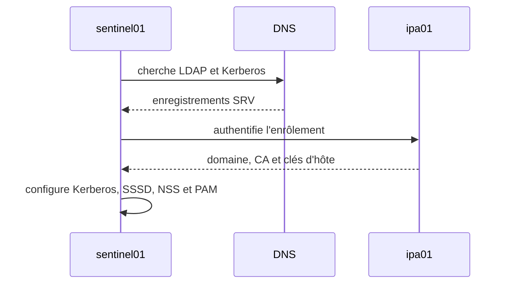
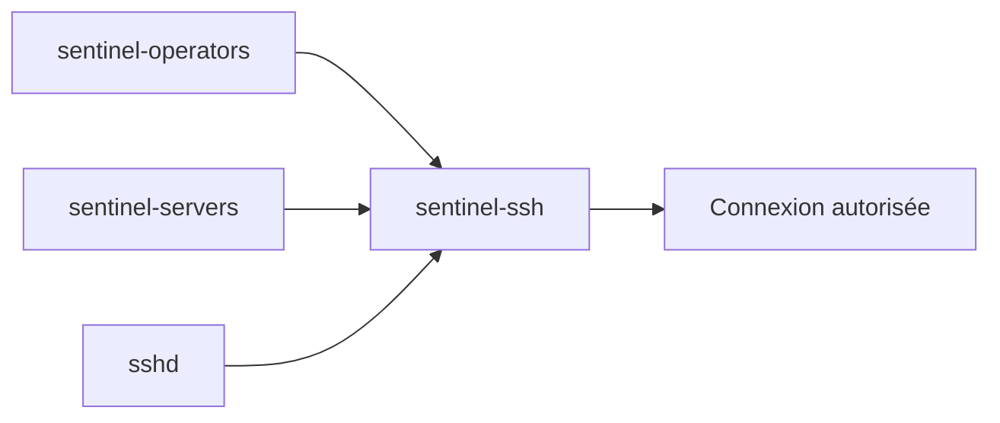
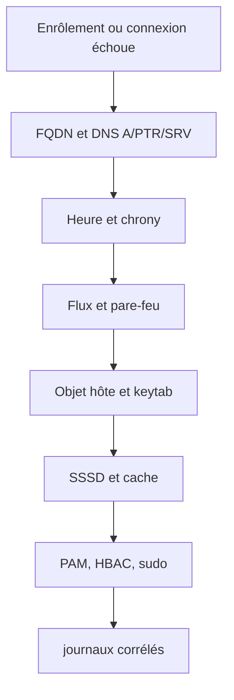

# Chapitre 8.7 — Enrôler les hôtes et contrôler les accès avec HBAC

> **Campagne 8 — FreeIPA**
>
> *« Une machine rejoint le domaine avec une identité propre ; elle ne devient pas seulement un consommateur de comptes. »*

## Vous êtes ici

```text
Partie II — Industrialiser la sécurité

Campagne 8 — FreeIPA

      8.1 Présentation de FreeIPA
      8.2 Architecture interne
      8.3 Installation du serveur
      8.4 Gestion des utilisateurs
      8.5 Groupes et rôles
      8.6 Politiques sudo
    ► 8.7 Hôtes et règles HBAC
      8.8 Certificats
      8.9 Intégration de Sentinel
      8.10 Mission d'administration
```

## Objectifs pédagogiques

À la fin de ce chapitre, vous serez capable de :

- préparer et enrôler un client AlmaLinux ;
- expliquer l'objet hôte, son principal et son `keytab` ;
- vérifier SSSD, NSS, PAM, Kerberos et `sudo` côté client ;
- construire et tester une règle HBAC ;
- diagnostiquer un échec d'enrôlement ou d'accès.

## Pourquoi ce chapitre existe

Les utilisateurs et politiques centrales ne produisent aucun effet tant que les machines ne savent pas découvrir le domaine, lui faire confiance et présenter leur propre identité.

L'enrôlement installe ce contrat. HBAC ajoute ensuite une question distincte de `sudo` : **qui peut accéder à quel service sur quel hôte ?**

## Préparer le client

Le futur client est :

```text
sentinel01.sentinel.example.test — 192.0.2.20
```

### Nom et DNS

```bash
sudo hostnamectl set-hostname sentinel01.sentinel.example.test
hostname --fqdn
getent hosts ipa01.sentinel.example.test
getent hosts sentinel01.sentinel.example.test
dig +short -t SRV _ldap._tcp.sentinel.example.test
dig +short -t SRV _kerberos._udp.sentinel.example.test
```

Le client doit utiliser le DNS qui publie le domaine. Un FQDN présent uniquement dans `/etc/hosts` ne fournit pas les enregistrements SRV.

### Heure et réseau

```bash
sudo systemctl enable --now chronyd
chronyc tracking
chronyc sources -v
sudo firewall-cmd --state
```

Le client doit joindre les services IdM. Les flux exacts dépendent de la topologie ; validez DNS, Kerberos, LDAP/LDAPS et HTTPS selon la documentation, sans désactiver le pare-feu.

### Conflits locaux

```bash
getent passwd alice
getent group sentinel-operators
```

Avant enrôlement, ces identités ne devraient pas être définies localement avec des UID/GID contradictoires. Le compte système local `sentinel`, lui, est attendu.

## Précréer l'objet hôte

Sur une machine disposant d'un ticket administratif :

```bash
kinit admin
ipa host-find sentinel01.sentinel.example.test
ipa host-add sentinel01.sentinel.example.test --ip-address=192.0.2.20
ipa host-show sentinel01.sentinel.example.test --all
```

Si le DNS intégré gère la zone, l'option d'adresse peut créer ou associer l'enregistrement nécessaire. Contrôlez le résultat ; ne supposez pas que DNS direct et inverse sont automatiquement corrects dans toutes les topologies.

L'objet hôte permet ensuite de recevoir un principal, des clés, des certificats et des appartenances à des groupes d'hôtes.

## Installer et enrôler le client

Sur `sentinel01` :

```bash
sudo dnf install -y ipa-client oddjob-mkhomedir
sudo ipa-client-install --mkhomedir
```

L'installateur doit découvrir `sentinel.example.test` et `ipa01`. Lisez le résumé avant de confirmer. Utilisez une identité autorisée à enrôler l'hôte et ne placez pas son secret sur la ligne de commande.

Une installation non interactive sera automatisée en campagne 9. Pour l'apprentissage, le mode interactif rend les décisions visibles.



Le journal d'installation est généralement `/var/log/ipaclient-install.log`.

## Ce que l'enrôlement configure

Selon les options et la version :

- `/etc/krb5.conf` et la découverte Kerberos ;
- `/etc/ipa/default.conf` et le certificat de la CA ;
- `/etc/krb5.keytab` avec l'identité de l'hôte ;
- SSSD et son domaine ;
- NSS et PAM via `authselect` ;
- éventuellement la création des répertoires personnels ;
- la mise à jour DNS dynamique si elle est activée.

Relisez l'état réel au lieu de modifier immédiatement les fichiers générés.

## Le `keytab` de l'hôte

```bash
sudo klist -k -e /etc/krb5.keytab
sudo stat -c '%a %U:%G %n' /etc/krb5.keytab
```

Vous devez retrouver un principal comme :

```text
host/sentinel01.sentinel.example.test@SENTINEL.EXAMPLE.TEST
```

Test contrôlé :

```bash
sudo kinit -k \
  -t /etc/krb5.keytab \
  host/sentinel01.sentinel.example.test
sudo klist
sudo kdestroy
```

Le `keytab` contient des clés de long terme. Une copie volée peut permettre d'usurper l'identité de la machine jusqu'à rotation ou désactivation. Il doit rester lisible uniquement par les processus prévus, sauvegardé et transmis selon une procédure adaptée.

## Vérifier l'intégration client

### SSSD

```bash
systemctl status sssd --no-pager
sudo stat -c '%a %U:%G %n' /etc/sssd/sssd.conf
sssctl domain-list
sssctl domain-status sentinel.example.test
```

`sssd.conf` peut contenir des paramètres sensibles et doit conserver des permissions restrictives.

### NSS et groupes

```bash
getent passwd alice
getent group sentinel-operators
id alice
```

### Kerberos utilisateur

```bash
kinit alice
klist
kdestroy
```

### PAM et répertoire personnel

Depuis une console de laboratoire ou une session distincte :

```bash
ssh alice@sentinel01.sentinel.example.test
pwd
id
```

Ne fermez pas votre seul accès administratif avant d'avoir prouvé un chemin de secours.

### Politiques sudo

```bash
sudo -iu alice
sudo -l
```

La règle du chapitre 8.6 doit apparaître si l'hôte appartient à `sentinel-servers` et si les caches sont à jour.

## Classer l'hôte

Sur le serveur :

```bash
kinit admin
ipa hostgroup-add-member sentinel-servers \
  --hosts=sentinel01.sentinel.example.test
ipa hostgroup-show sentinel-servers --all
```

Cette appartenance devient un périmètre commun pour `sudo`, HBAC et les futurs déploiements.

## HBAC : contrôler l'entrée, pas l'élévation

Une règle **Host-Based Access Control** associe :

- un utilisateur ou groupe ;
- un hôte ou groupe d'hôtes ;
- un service PAM ou groupe de services.



HBAC peut autoriser une connexion SSH sans donner `sudo`. Inversement, une règle `sudo` n'a pas vocation à autoriser la connexion initiale.

## Créer et tester une règle HBAC

```bash
ipa hbacrule-add sentinel-ssh \
  --desc='SSH des opérateurs vers les serveurs Sentinel'
ipa hbacrule-add-user sentinel-ssh --groups=sentinel-operators
ipa hbacrule-add-host sentinel-ssh --hostgroups=sentinel-servers
ipa hbacrule-add-service sentinel-ssh --hbacsvcs=sshd
ipa hbacrule-show sentinel-ssh --all
```

Testez la règle explicitement :

```bash
ipa hbactest \
  --user=alice \
  --host=sentinel01.sentinel.example.test \
  --service=sshd \
  --rules=sentinel-ssh
```

Test négatif :

```bash
ipa hbactest \
  --user=alice \
  --host=sentinel01.sentinel.example.test \
  --service=login \
  --rules=sentinel-ssh
```

Le premier doit être autorisé par la règle, le second refusé pour ce périmètre.

## Le cas critique de `allow_all`

IdM fournit souvent une règle HBAC `allow_all` active au départ. Tant qu'elle reste active, votre règle restrictive n'est pas la seule voie d'accès.

Ne la désactivez qu'après avoir :

1. recensé tous les usages PAM nécessaires ;
2. créé une règle séparée pour l'administration de secours ;
3. testé chaque règle avec `ipa hbactest` ;
4. conservé une console indépendante ;
5. planifié un retour arrière.

```bash
ipa hbacrule-show allow_all
```

Dans une VM jetable et avec le chemin de secours validé :

```bash
ipa hbacrule-disable allow_all
```

Prouvez immédiatement la connexion autorisée et un refus. Si le test est incomplet, réactivez-la depuis la console :

```bash
ipa hbacrule-enable allow_all
```

## Cache hors ligne et révocation

SSSD peut autoriser une connexion hors ligne à une identité déjà mise en cache selon sa configuration. Cette disponibilité a un coût : une révocation centrale ne peut pas être consultée pendant la coupure.

Testez le comportement dans une VM :

1. réalisez une connexion en ligne réussie ;
2. coupez uniquement l'accès au domaine, sans perdre la console ;
3. observez une nouvelle connexion ;
4. rétablissez le réseau ;
5. documentez durée de cache et politique attendue.

Ne concluez pas « FreeIPA fonctionne hors ligne » : le cache répond temporairement pour certains scénarios.

## Diagnostic structuré



```bash
hostname --fqdn
dig +short -t SRV _kerberos._udp.sentinel.example.test
chronyc tracking
sudo klist -k /etc/krb5.keytab
sssctl domain-status sentinel.example.test
sssctl user-checks alice
sudo journalctl -u sssd --since '-10 minutes'
sudo tail -n 100 /var/log/ipaclient-install.log
```

## Désenrôler proprement un laboratoire

Sur le client :

```bash
sudo ipa-client-install --uninstall
```

Puis, depuis une session administrative FreeIPA, supprimez ou désactivez l'objet hôte selon la politique :

```bash
ipa host-show sentinel01.sentinel.example.test
```

Ne supprimez pas l'objet avant d'avoir inventorié services, certificats, DNS et politiques qui le référencent. Une réinstallation avec un ancien `keytab` copié n'est pas un réenrôlement sûr.

## Regards sécurité

- **Architecte** : distingue résilience hors ligne et délai de révocation.
- **Attaquant** : cible `/etc/krb5.keytab` parce qu'il porte l'identité durable de la machine.
- **Culture** : un principal `host/...` est une identité de service, pas le compte `root` de la machine.
- **Piège** : désactiver `allow_all` avant de couvrir `sshd`, `login`, `sudo` ou un chemin de secours peut verrouiller le parc.

## Mise en pratique — dossier d'acceptation du client

Le livrable doit contenir :

- FQDN, A/PTR et SRV validés ;
- heure synchronisée ;
- objet hôte et groupe `sentinel-servers` ;
- principal d'hôte visible dans le `keytab` sans en exposer les clés ;
- domaine SSSD en ligne ;
- résolution d'Alice et de ses groupes ;
- `kinit` réussi ;
- règle `sudo` visible ;
- `hbactest` positif pour `sshd` et négatif pour un autre service ;
- procédure de console et de retour arrière.

## Impact sur Sentinel

`sentinel01` possède désormais une identité de domaine et peut demander un certificat de service. Les utilisateurs et politiques sont résolus par SSSD, mais le processus Sentinel reste sous son compte système local et ne lit jamais le `keytab` d'hôte sans besoin explicite.

## Synthèse

- l'enrôlement dépend du FQDN, du DNS, de l'heure et des flux ;
- le `keytab` est un secret de machine à protéger et renouveler ;
- SSSD relie FreeIPA à NSS, PAM, HBAC et `sudo` ;
- un groupe d'hôtes stabilise le périmètre des politiques ;
- HBAC contrôle l'accès à un service sur un hôte, pas les droits une fois connecté ;
- `allow_all` ne se désactive qu'après tests et voie de secours ;
- le cache hors ligne améliore la disponibilité mais retarde certaines décisions centrales.

## Infographie de révision

```text
DNS + HEURE + RÉSEAU
          ↓
ipa-client-install
          ↓
HOST PRINCIPAL + KEYTAB + SSSD + PAM/NSS
          ↓
HBAC : UTILISATEUR × HÔTE × SERVICE
          ↓
sudo décide ensuite des commandes privilégiées
```

## Pour aller plus loin

Le client peut maintenant demander à la CA un certificat lié à son service, suivi et renouvelé localement par `certmonger`.

[Continuer vers le chapitre 8.8 — Gérer les certificats](8.8-certificats.md)

Références : [Installing Identity Management](https://docs.redhat.com/en/documentation/red_hat_enterprise_linux/9/html/installing_identity_management/) et [Configuring host-based access control rules](https://docs.redhat.com/en/documentation/red_hat_enterprise_linux/9/html/managing_idm_users_groups_hosts_and_access_control_rules/configuring-host-based-access-control-rules_managing-users-groups-hosts).
