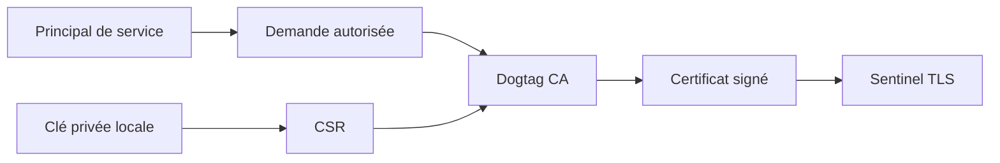
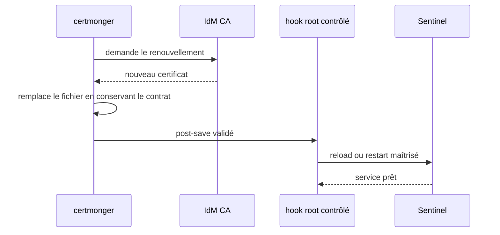
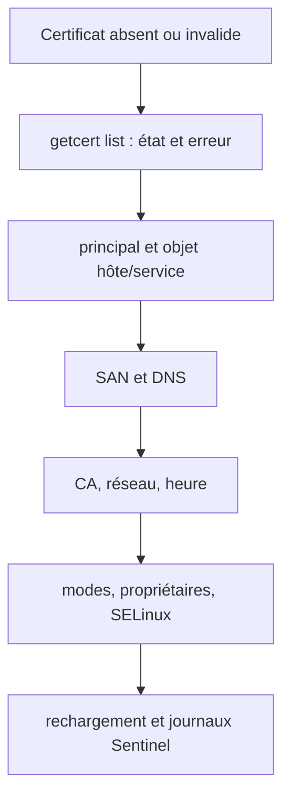

# Chapitre 8.8 — Gérer les certificats de service avec FreeIPA

> **Campagne 8 — FreeIPA**
>
> *« Émettre un certificat est un événement ; maintenir sa confiance est un cycle de vie. »*

## Vous êtes ici

```text
Partie II — Industrialiser la sécurité

Campagne 8 — FreeIPA

      8.1 Présentation de FreeIPA
      8.2 Architecture interne
      8.3 Installation du serveur
      8.4 Gestion des utilisateurs
      8.5 Groupes et rôles
      8.6 Politiques sudo
      8.7 Hôtes et règles HBAC
    ► 8.8 Certificats
      8.9 Intégration de Sentinel
      8.10 Mission d'administration
```

## Objectifs pédagogiques

À la fin de ce chapitre, vous serez capable de :

- relier principal de service, SAN DNS, clé privée et certificat ;
- demander un certificat à la CA IdM avec `certmonger` ;
- vérifier chaîne, identité, usages et dates avec OpenSSL ;
- préparer un renouvellement qui recharge le service ;
- distinguer renouvellement, révocation et retrait du suivi.

## Pourquoi ce chapitre existe

La campagne 7 a construit une PKI manuelle pour comprendre TLS. FreeIPA fournit maintenant une autorité intégrée et une identité de domaine ; `certmonger` peut demander puis suivre les certificats sur l'hôte qui les utilise.

Le danger serait de remplacer une copie manuelle par une demande automatique sans vérifier le nom, les usages, les permissions ou le comportement au renouvellement.

## Les quatre objets à ne pas confondre

| Objet | Rôle | Sensibilité |
|---|---|---|
| principal `HTTP/sentinel01...` | identité du service dans IdM/Kerberos | contrôlé par le domaine |
| clé privée | prouve la possession de l'identité TLS | secret local critique |
| certificat | lie clé publique, identité et usages | public, mais doit être valide |
| certificat de CA | ancre ou intermédiaire de confiance | distribué et protégé contre la substitution |



Le certificat ne contient pas la clé privée. Copier le certificat n'usurpe pas le service ; copier la clé privée peut le permettre.

## Identité X.509 : le SAN avant le CN

Les clients TLS modernes vérifient les entrées **Subject Alternative Name**. Pour le serveur :

```text
DNS:sentinel01.sentinel.example.test
```

Chaque nom réellement utilisé par un client doit être prévu. Ajouter des alias « au cas où » augmente la portée d'une clé compromise. Le CN historique ne remplace pas un SAN correct.

### Usages de clé

Les extensions **Key Usage** et **Extended Key Usage** limitent les usages prévus :

- certificat serveur : `serverAuth` ;
- certificat client mTLS : `clientAuth` ;
- une CA possède des capacités de signature spécifiques.

Réutiliser le certificat serveur comme client du healthcheck brouille les rôles et peut échouer lorsque les usages sont correctement restreints.

## Préparer principal, chemins et permissions

Depuis une session administrative :

```bash
kinit admin
ipa service-add \
  HTTP/sentinel01.sentinel.example.test
ipa service-show \
  HTTP/sentinel01.sentinel.example.test --all
```

Sur `sentinel01`, préparez un répertoire hors du dépôt Git :

```bash
sudo install -d -o root -g sentinel -m 0750 /etc/sentinel/tls
sudo restorecon -Rv /etc/sentinel/tls
```

La politique SELinux introduite en campagne 6 et étendue en campagne 7 doit autoriser seulement la lecture des matériaux prévus. Vérifiez les types avec `ls -lZ` et recherchez les AVC au lieu de désactiver SELinux.

## Demander le certificat serveur

`ipa-getcert` est l'interface de `certmonger` spécialisée pour la CA IdM :

```bash
sudo systemctl enable --now certmonger
sudo ipa-getcert request \
  -I sentinel-server \
  -K HTTP/sentinel01.sentinel.example.test \
  -D sentinel01.sentinel.example.test \
  -k /etc/sentinel/tls/server.key \
  -f /etc/sentinel/tls/server.crt
```

La requête est liée au principal et au nom DNS. Selon la politique et les droits du domaine, une approbation peut être nécessaire.

Suivez l'état :

```bash
sudo getcert list -i sentinel-server
```

L'état attendu est `MONITORING`. Un état d'erreur doit être expliqué : principal absent, nom non autorisé, CA indisponible, permissions ou authentification de l'hôte.

## Protéger la clé et permettre le renouvellement

Après émission :

```bash
sudo chown root:sentinel /etc/sentinel/tls/server.key
sudo chmod 0640 /etc/sentinel/tls/server.key
sudo chown root:sentinel /etc/sentinel/tls/server.crt
sudo chmod 0644 /etc/sentinel/tls/server.crt
sudo restorecon -v /etc/sentinel/tls/server.key /etc/sentinel/tls/server.crt
sudo -u sentinel test -r /etc/sentinel/tls/server.key
```

Vérifiez que les propriétaires et modes persistent après un renouvellement ou configurez-les explicitement dans la demande selon les options disponibles sur votre version de `getcert`. Le processus doit lire la clé sans pouvoir la remplacer.

La clé ne doit apparaître ni dans Git, ni dans une archive de preuve, ni dans un copier-coller de terminal.

## Vérifier le certificat obtenu

```bash
openssl x509 -in /etc/sentinel/tls/server.crt \
  -noout -subject -issuer -serial -dates
openssl x509 -in /etc/sentinel/tls/server.crt \
  -noout -ext subjectAltName,keyUsage,extendedKeyUsage
openssl verify \
  -CAfile /etc/ipa/ca.crt \
  /etc/sentinel/tls/server.crt
```

La checklist minimale :

| Contrôle | Résultat attendu |
|---|---|
| chaîne | vérifiée par la CA IdM attendue |
| SAN | contient le FQDN réellement utilisé |
| usages | compatibles avec serveur TLS |
| validité | actif maintenant, marge de renouvellement suffisante |
| clé privée | lisible par Sentinel, non modifiable par lui |
| suivi | demande `MONITORING` dans `certmonger` |

Pour confirmer que la clé correspond au certificat, comparez leurs clés publiques sans afficher la clé privée :

```bash
openssl x509 -in /etc/sentinel/tls/server.crt -pubkey -noout \
  | openssl pkey -pubin -outform DER \
  | sha256sum
sudo openssl pkey -in /etc/sentinel/tls/server.key -pubout -outform DER \
  | sha256sum
```

Les condensats doivent être identiques.

## Certificats clients mTLS

Un client Sentinel reçoit sa propre identité et une clé distincte. Sur `agent01`, le principe est identique avec un principal de service dédié et un SAN :

```text
sentinel-agent/agent01.sentinel.example.test@SENTINEL.EXAMPLE.TEST
DNS:agent01.sentinel.example.test
Extended Key Usage: clientAuth
```

Le nom exact du type de principal relève de votre convention. En revanche, ne partagez pas une seule clé entre tous les agents : vous perdriez l'attribution et la révocation individuelle.

Le certificat du healthcheck local utilise encore une identité cliente dédiée. Sentinel `0.6.0` devra autoriser cette identité avec les agents légitimes.

## Renouvellement et rechargement du service

`certmonger` surveille l'expiration et soumet une demande de renouvellement avant l'échéance. Le fichier renouvelé n'est utile que si le processus relit le certificat et la clé.



Un hook post-enregistrement s'exécute avec des privilèges élevés. Il doit être root, non modifiable par `sentinel`, minimal et testé. Si Sentinel ne sait pas recharger TLS à chaud, utilisez un redémarrage contrôlé par systemd et vérifiez `/ready` ensuite.

Consultez les options disponibles avant de l'associer :

```bash
ipa-getcert request --help
getcert list -i sentinel-server
```

Pour tester le cycle sans attendre l'expiration, utilisez une VM et la commande de renouvellement documentée par la version, puis vérifiez numéro de série, dates, permissions, contexte SELinux et disponibilité du service. `getcert resubmit` déclenche une nouvelle soumission ; ce n'est pas une simulation parfaite de l'échéance automatique.

## Renouveler, révoquer ou arrêter le suivi

| Action | Quand ? | Conséquence |
|---|---|---|
| renouveler | certificat approche de l'expiration, clé encore digne de confiance | nouvelle période de validité |
| révoquer | clé compromise, service retiré ou certificat émis à tort | certificat déclaré non fiable |
| arrêter le suivi | certificat géré autrement ou service supprimé | plus de renouvellement local |

```bash
sudo getcert stop-tracking -i sentinel-server
```

Cette commande n'efface pas nécessairement les fichiers et ne révoque pas automatiquement le certificat. De même, supprimer un fichier n'informe pas la CA.

## Révocation, CRL et OCSP

La CA publie des informations de révocation, par liste CRL ou service OCSP selon l'architecture. Un client qui ne les consulte pas peut continuer à accepter un certificat révoqué jusqu'à expiration.

Le laboratoire doit documenter :

- qui a le droit de révoquer ;
- comment retrouver le numéro de série ;
- comment publier et distribuer l'état de révocation ;
- comment Sentinel ou son frontal vérifie cet état ;
- comment remplacer rapidement l'identité compromise.

Ne révoquez pas le certificat principal avant d'avoir une identité de remplacement et un accès de secours.

## Diagnostic



```bash
sudo getcert list -i sentinel-server
ipa service-show HTTP/sentinel01.sentinel.example.test --all
timedatectl
ls -lZ /etc/sentinel/tls
sudo ausearch -m AVC -ts recent -c sentinel -i
journalctl -u sentinel --since '-10 minutes'
```

## Regards sécurité

- **Architecte** : supervise l'expiration et le dernier renouvellement réussi, pas seulement le fichier présent.
- **Attaquant** : préfère voler une clé encore valide plutôt que casser TLS.
- **Culture** : Kerberos et X.509 sont deux systèmes de tickets d'identité très différents ; un principal peut toutefois autoriser l'émission d'un certificat de service.
- **Piège** : rendre une clé `0644` pour résoudre un refus remplace un problème d'exploitation par une fuite potentielle.

## Mise en pratique — dossier de certificat Sentinel

1. créez le principal `HTTP/sentinel01...` ;
2. préparez `/etc/sentinel/tls` avec propriétaires, modes et contexte SELinux ;
3. demandez le certificat avec un identifiant de suivi ;
4. attendez `MONITORING` ;
5. vérifiez chaîne, SAN, usages, dates et correspondance de clé ;
6. prouvez que `sentinel` lit la clé sans pouvoir la modifier ;
7. documentez le hook de rechargement, sans l'activer avant revue ;
8. écrivez la procédure de renouvellement, révocation, arrêt du suivi et retour arrière.

## Impact sur Sentinel

FreeIPA remplace la CA manuelle du laboratoire, pas le contrôle TLS de Sentinel. `certmonger` maintient les fichiers ; Sentinel les lit au démarrage, vérifie les clients et garde l'autorisation des SAN DNS dans sa configuration.

## Synthèse

- le principal autorise une identité de service, le SAN nomme l'identité TLS ;
- la clé privée reste sur l'hôte et reçoit les permissions les plus restrictives ;
- `certmonger` demande, suit et renouvelle les certificats de service ;
- chaîne, SAN, usages, dates et correspondance de clé se vérifient séparément ;
- un renouvellement doit déclencher une relecture sûre par le service ;
- renouvellement, révocation et arrêt du suivi sont trois actions distinctes ;
- la révocation n'est utile que si les clients consultent l'information.

## Infographie de révision

```text
PRINCIPAL + CLÉ LOCALE → CSR → DOGTAG → CERTIFICAT
                                      ↓
                             certmonger surveille
                                      ↓
                          renouvelle → recharge Sentinel

VÉRIFIER : CHAÎNE · SAN · USAGES · DATES · MODES · SELINUX
```

## Pour aller plus loin

Le chapitre suivant branche ces identités sur Sentinel `0.6.0` et prouve la différence entre client anonyme, certificat fiable non autorisé et identité autorisée.

[Continuer vers le chapitre 8.9 — Intégrer Sentinel à FreeIPA](8.9-integration-sentinel.md)

Référence : [RHEL 9 — Managing certificates in IdM](https://docs.redhat.com/en/documentation/red_hat_enterprise_linux/9/html/managing_certificates_in_idm/).
