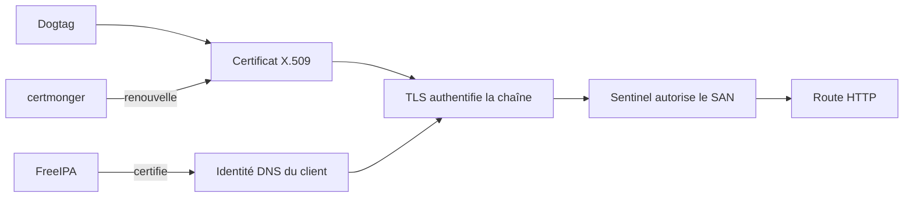
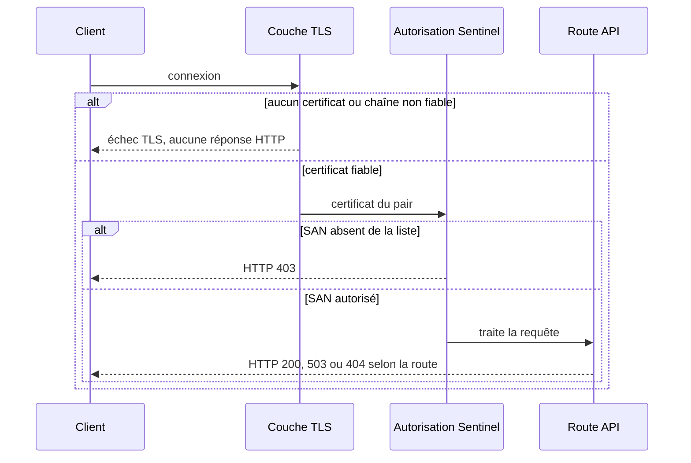

# Chapitre 8.9 — Intégrer Sentinel à FreeIPA

> **Campagne 8 — FreeIPA**
>
> *« TLS établit qui présente une identité fiable ; Sentinel décide encore si cette identité entre. »*

## Vous êtes ici

```text
Partie II — Industrialiser la sécurité

Campagne 8 — FreeIPA

      8.1 Présentation de FreeIPA
      8.2 Architecture interne
      8.3 Installation du serveur
      8.4 Gestion des utilisateurs
      8.5 Groupes et rôles
      8.6 Politiques sudo
      8.7 Hôtes et règles HBAC
      8.8 Certificats
    ► 8.9 Intégration de Sentinel
      8.10 Mission d'administration
```

## Objectifs pédagogiques

À la fin de ce chapitre, vous serez capable de :

- répartir les responsabilités entre FreeIPA, le système et Sentinel ;
- configurer Sentinel avec des certificats suivis par `certmonger` ;
- expliquer l'autorisation des SAN DNS de la version `0.6.0` ;
- tester client anonyme, certificat fiable refusé et identité autorisée ;
- identifier les limites volontaires du jalon.

## Pourquoi ce chapitre existe

Sentinel `0.5.0` exige déjà un certificat client signé par une CA approuvée. Si la CA signe les certificats de plusieurs services, cette vérification signifie seulement « identité issue de la confiance attendue », pas « agent autorisé à appeler Sentinel ».

La version `0.6.0` ajoute une seconde décision : extraire les SAN DNS du certificat validé puis les comparer à une liste fermée.

## Répartir les responsabilités

| Fonction | Responsable |
|---|---|
| utilisateurs et groupes humains | FreeIPA |
| authentification système | Kerberos, PAM et SSSD |
| accès SSH aux hôtes | HBAC via SSSD |
| commandes d'exploitation | `sudo` et règles FreeIPA |
| émission et révocation des certificats | Dogtag CA |
| suivi et renouvellement local | `certmonger` |
| validation de la chaîne mTLS | bibliothèque TLS de Sentinel |
| autorisation des SAN DNS | configuration et code Sentinel |
| données métier et routes | Sentinel |



FreeIPA ne devient pas la base de données métier de Sentinel. Sentinel ne stocke ni mot de passe humain, ni copie des groupes, ni clé privée dans son dépôt.

## Trois résultats de sécurité différents



Ce modèle rend le diagnostic précis : une erreur TLS, un `403` et un `503 /ready` n'ont pas la même cause.

## Les fichiers du checkpoint `0.6.0`

Le checkpoint se trouve dans :

```text
sentinel/labs/sentinel-app/checkpoints/0.6.0/
├── config/sentinel.conf
├── src/
│   ├── configuration.py
│   ├── identity.py
│   ├── tls_support.py
│   ├── web.py
│   └── ...
└── tests/test_sentinel.py
```

`tls_support.py` authentifie cryptographiquement le pair. Le nouveau `identity.py` ne conserve que les SAN DNS :

```python
def certificate_dns_names(certificate: dict[str, Any]) -> set[str]:
    return {
        str(value).lower()
        for name_type, value in certificate.get("subjectAltName", ())
        if name_type == "DNS"
    }


def is_authorized_certificate(
    certificate: dict[str, Any],
    allowed_dns_names: tuple[str, ...],
) -> bool:
    return bool(certificate_dns_names(certificate).intersection(allowed_dns_names))
```

Le CN historique et les SAN de type adresse IP sont ignorés. Les noms sont comparés en minuscules et une intersection suffit lorsqu'un certificat possède plusieurs SAN DNS.

Dans `web.py`, le contrôle intervient avant le routage :

```python
if settings.tls_enabled and settings.tls_require_client_certificate:
    certificate = self.connection.getpeercert()
    if not is_authorized_certificate(certificate, settings.allowed_dns_names):
        self.send_json(
            HTTPStatus.FORBIDDEN,
            {"status": "error", "detail": "identité cliente non autorisée"},
        )
        return
```

Le certificat a déjà franchi la validation mTLS lorsqu'il atteint cette partie du code.

## Préparer les identités du laboratoire

Le serveur utilise :

```text
HTTP/sentinel01.sentinel.example.test
SAN DNS : sentinel01.sentinel.example.test
```

Le healthcheck local et l'agent distant utilisent deux certificats clients distincts :

```text
healthcheck.sentinel.example.test
agent01.sentinel.example.test
```

Créez aussi un certificat de confiance mais non autorisé pour le test négatif :

```text
agent02.sentinel.example.test
```

Chaque clé privée reste sur la machine qui présente l'identité. Copier toutes les clés sur `sentinel01` rendrait le test artificiel et détruirait la séparation des responsabilités.

## Installer les matériaux sans les versionner

Sur `sentinel01` :

```bash
sudo install -d -o root -g sentinel -m 0750 /etc/sentinel/tls
sudo ls -lZ /etc/sentinel/tls
sudo getcert list
```

Les chemins de référence :

```text
/etc/sentinel/tls/server.crt
/etc/sentinel/tls/server.key
/etc/ipa/ca.crt
/etc/sentinel/tls/healthcheck.crt
/etc/sentinel/tls/healthcheck.key
```

La CA cliente peut être une ancre ou un bundle contrôlé. N'utilisez pas le magasin générique du système pour faire confiance à toutes les autorités lorsque Sentinel doit n'accepter que la CA IdM prévue.

## Configurer Sentinel

Dans `/etc/sentinel/sentinel.conf` :

```ini
[server]
listen_address = 0.0.0.0
listen_port = 8443

[storage]
state_directory = /var/lib/sentinel

[logging]
level = INFO

[tls]
enabled = true
certificate = /etc/sentinel/tls/server.crt
private_key = /etc/sentinel/tls/server.key
client_ca = /etc/ipa/ca.crt
require_client_certificate = true

[healthcheck]
server_name = sentinel01.sentinel.example.test
certificate = /etc/sentinel/tls/healthcheck.crt
private_key = /etc/sentinel/tls/healthcheck.key

[identity]
allowed_dns_names = healthcheck.sentinel.example.test, agent01.sentinel.example.test
```

`server_name` permet au healthcheck local de joindre une adresse locale tout en vérifiant le nom du certificat serveur.

Si le mTLS est actif et que `allowed_dns_names` est vide, le chargement de configuration échoue. Cette fermeture évite de démarrer un serveur qui authentifie des clients sans politique d'autorisation.

## Vérifier avant le redémarrage

```bash
sudo -u sentinel test -r /etc/sentinel/tls/server.crt
sudo -u sentinel test -r /etc/sentinel/tls/server.key
sudo -u sentinel test -r /etc/ipa/ca.crt
sudo -u sentinel /opt/sentinel/bin/sentinel \
  --config /etc/sentinel/sentinel.conf --check-config
sudo restorecon -Rv /etc/sentinel /var/lib/sentinel
sudo ausearch -m AVC -ts recent -c sentinel -i
```

Si le compte `sentinel` ne doit pas lire directement `/etc/ipa/ca.crt`, installez une copie publique contrôlée sous `/etc/sentinel/tls/` et faites-la gérer par l'automatisation. N'élargissez pas les droits de tout `/etc/ipa`.

Puis :

```bash
sudo systemctl restart sentinel.service
systemctl status sentinel.service --no-pager
journalctl -u sentinel.service --since '-5 minutes'
```

## Tester les trois scénarios

Les commandes suivantes sont exécutées depuis les clients possédant les clés correspondantes.

### 1. Aucun certificat client

```bash
curl --verbose \
  --cacert /etc/ipa/ca.crt \
  https://sentinel01.sentinel.example.test:8443/health
```

La négociation TLS doit échouer avant toute réponse HTTP.

### 2. Certificat IdM valide mais SAN non autorisé

Depuis `agent02` :

```bash
curl --verbose \
  --cacert /etc/ipa/ca.crt \
  --cert /etc/sentinel-agent/client.crt \
  --key /etc/sentinel-agent/client.key \
  https://sentinel01.sentinel.example.test:8443/health
```

Résultat attendu : HTTP `403` et message d'identité non autorisée.

### 3. Certificat et SAN autorisés

Depuis `agent01` :

```bash
curl --fail --show-error \
  --cacert /etc/ipa/ca.crt \
  --cert /etc/sentinel-agent/client.crt \
  --key /etc/sentinel-agent/client.key \
  https://sentinel01.sentinel.example.test:8443/health
```

Résultat attendu : HTTP `200` et version `0.6.0`.

Testez également `/ready` et `/api/v1/status`. Un `503` de disponibilité ne doit pas être interprété comme un échec d'identité.

## Observer les preuves

```bash
getcert list
openssl s_client \
  -connect sentinel01.sentinel.example.test:8443 \
  -servername sentinel01.sentinel.example.test \
  -CAfile /etc/ipa/ca.crt </dev/null
journalctl -u sentinel.service --since '-10 minutes'
sudo ausearch -m AVC -ts recent -c sentinel -i
```

Les journaux doivent distinguer refus d'identité et erreur applicative sans divulguer de clé, de ticket ou de certificat complet inutile.

## Tests automatisés

Depuis la racine du dépôt :

```bash
python3 -m unittest discover \
  -s sentinel/labs/sentinel-app/checkpoints/0.6.0/tests -v
```

Le test d'intégration crée une CA et trois certificats éphémères :

- client autorisé → `200` ;
- client signé mais non autorisé → `403` ;
- client anonyme → échec TLS.

Il vérifie également les fonctions cumulées : santé, disponibilité, healthcheck, notification systemd et validation de configuration.

## Migration depuis `0.5.0`

Les routes et fichiers d'état restent compatibles. Les nouvelles options sont :

```text
[identity] allowed_dns_names
[healthcheck] server_name
```

Lorsque le mTLS est requis, l'absence de liste autorisée devient une erreur de configuration. Préparez les certificats et le nouveau fichier, lancez `--check-config`, puis remplacez le code et redémarrez le service.

Retour arrière : restaurez ensemble le code `0.5.0` et sa configuration. Ne laissez pas une configuration `0.6.0` interprétée partiellement par une ancienne version.

## Limites volontaires du jalon

Sentinel `0.6.0` n'interroge pas les groupes FreeIPA lors de chaque requête. Les groupes servent à l'administration des hôtes via SSSD, `sudo` et HBAC. L'API utilise une liste locale de SAN DNS émis par la CA IdM.

Cette décision garde le code lisible et disponible si l'annuaire est momentanément indisponible, mais impose :

- une mise à jour de configuration pour ajouter ou retirer un agent ;
- un redémarrage ou rechargement contrôlé ;
- une procédure de révocation des certificats ;
- une supervision de la cohérence entre objets IdM et liste locale.

La bibliothèque TLS ne vérifie pas automatiquement toutes les politiques de révocation possibles. La CRL, OCSP ou un frontal capable de les appliquer constituent une évolution d'architecture à concevoir explicitement.

## Jalon Sentinel

### État de départ

Sentinel `0.5.0` fournit TLS, mTLS, routes de santé, état local, systemd, journaux et confinement SELinux.

### Besoin

Un certificat signé par la CA du domaine doit prouver l'identité du client sans accorder l'API à tous les certificats de cette CA.

### Modification

Le checkpoint `0.6.0` ajoute :

- `identity.py` pour extraire et autoriser les SAN DNS ;
- `allowed_dns_names` dans la configuration ;
- `healthcheck_server_name` pour vérifier le serveur local ;
- un refus HTTP `403` après mTLS ;
- des tests unitaires et mTLS couvrant les trois résultats.

### Migration

Les routes et données restent compatibles. La configuration mTLS doit recevoir une liste non vide avant le redémarrage. Les certificats sont fournis hors Git par FreeIPA et suivis par `certmonger`.

### Preuves

- sept tests cumulatifs réussis ;
- configuration validée sous l'identité `sentinel` ;
- certificat serveur et certificats clients suivis ;
- client autorisé en `200`, client fiable non autorisé en `403`, anonyme refusé par TLS ;
- `/ready` et healthcheck fonctionnels ;
- aucun AVC inattendu.

### Échecs attendus

- démarrage refusé si la liste d'identités est vide en mTLS ;
- négociation refusée sans certificat client ;
- HTTP `403` pour `agent02` pourtant signé par la CA ;
- healthcheck refusé si son propre SAN est retiré de la liste.

### Livrable

Le checkpoint Sentinel `0.6.0`, sa configuration, les certificats gérés hors dépôt et les preuves d'acceptation deviennent l'entrée de la mission 8.10 puis de l'automatisation Ansible.

## Synthèse

- FreeIPA émet et maintient l'identité ; Sentinel conserve sa décision métier ;
- l'authentification mTLS précède l'autorisation du SAN DNS ;
- absence de certificat, SAN refusé et service indisponible produisent des résultats distincts ;
- le CN et les SAN IP ne sont pas utilisés par l'autorisation `0.6.0` ;
- les clés restent sur leurs hôtes et hors de Git ;
- la liste locale est un compromis explicite, pas une synchronisation dynamique des groupes ;
- la migration échoue de manière fermée si la politique d'identité manque.

## Infographie de révision

```text
CERTIFICAT ABSENT       → refus TLS
CERTIFICAT VALIDE       → identité authentifiée
SAN HORS LISTE          → HTTP 403
SAN DANS LISTE          → route Sentinel
ROUTE NON DISPONIBLE    → HTTP 503

FreeIPA certifie · certmonger renouvelle · Sentinel autorise
```

## Pour aller plus loin

La mission finale exige maintenant de reconstruire l'intégration entière à partir de critères et de preuves, sans recopier mécaniquement les chapitres.

[Continuer vers le chapitre 8.10 — Mission : administrer avec FreeIPA](8.10-mission-administration-freeipa.md)

Références : [Managing certificates in IdM](https://docs.redhat.com/en/documentation/red_hat_enterprise_linux/9/html/managing_certificates_in_idm/) et [Managing IdM users, groups, hosts, and access control rules](https://docs.redhat.com/en/documentation/red_hat_enterprise_linux/9/html/managing_idm_users_groups_hosts_and_access_control_rules/).
