# Chapitre 8.9 — Intégration de Sentinel

> **Campagne 8 — FreeIPA**

> *« Une application devient un service d'entreprise lorsqu'elle cesse de gérer seule la sécurité et s'intègre à celle du système d'information. »*

---

## Vous êtes ici

```text
PARTIE II — Industrialiser la sécurité

Campagne 8  [█████████░]

      8.1 Présentation de FreeIPA ✔
      8.2 Architecture interne ✔
      8.3 Installation ✔
      8.4 Gestion des utilisateurs ✔
      8.5 Groupes et rôles ✔
      8.6 Politiques sudo ✔
      8.7 Gestion des hôtes ✔
      8.8 Certificats ✔
   ►  8.9 Intégration de Sentinel
      8.10 Mission : administrer une infrastructure avec FreeIPA
```

---

## Objectifs pédagogiques

À la fin de ce chapitre, vous serez capable de :

- identifier les composants de Sentinel pouvant s'appuyer sur FreeIPA ;
- remplacer des mécanismes locaux par des services centralisés ;
- concevoir une architecture de sécurité cohérente ;
- préparer Sentinel à une industrialisation à grande échelle.

---

## Pourquoi ce chapitre existe

Depuis le début de cette formation, Sentinel évolue progressivement.

Au départ, il ne s'agissait que d'une application Python.

Elle possédait :

- ses propres fichiers ;
- son propre utilisateur système ;
- sa propre configuration.

Au fil des campagnes, nous lui avons ajouté :

- un service `systemd` ;
- un pare-feu ;
- une politique `sudo` ;
- une identité de machine ;
- une PKI.

Une question se pose maintenant.

Sentinel doit-il continuer à gérer lui-même toutes les informations de sécurité ?

La réponse est généralement non.

Une application ne devrait pas réimplémenter ce que l'infrastructure fournit déjà.

---

## Avant FreeIPA

Imaginons une version très simple de Sentinel.

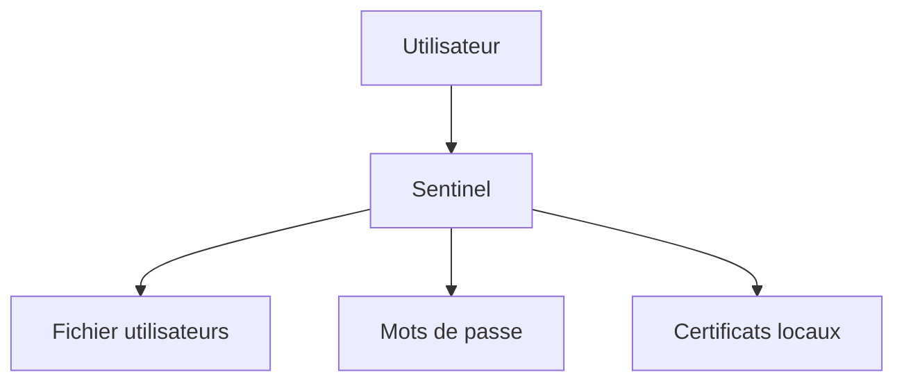

L'application gère tout elle-même.

Cette architecture fonctionne.

Mais elle présente plusieurs limites.

Chaque application possède :

- ses comptes ;
- ses mots de passe ;
- ses groupes ;
- ses certificats.

L'administration devient rapidement complexe.

---

## Après intégration à FreeIPA

L'objectif est de déléguer autant que possible les mécanismes de sécurité.

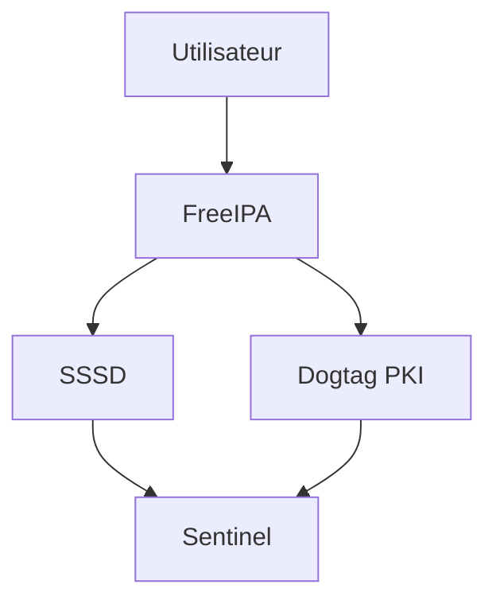

Sentinel ne demande plus :

> « Quel est le mot de passe de cet utilisateur ? »

Il demande plutôt :

> « Le système connaît-il cet utilisateur ? »

Cette différence est essentielle.

L'application cesse d'être responsable de l'identité.

Elle fait confiance au système.

---

## Ce que Sentinel ne devrait plus gérer

Une application moderne devrait éviter de stocker :

- les mots de passe des utilisateurs de l'entreprise ;
- les groupes d'administration ;
- les certificats racines ;
- les autorisations système.

Ces informations existent déjà ailleurs.

Par exemple :

| Besoin | Responsable |
|--------|-------------|
| Utilisateurs | FreeIPA |
| Groupes | FreeIPA |
| Authentification système | PAM / SSSD |
| Certificats | Dogtag |
| Politiques `sudo` | FreeIPA |
| Comptes système | AlmaLinux |

L'application peut alors se concentrer sur son véritable métier.

Dans le cas de Sentinel :

- superviser ;
- collecter ;
- analyser ;
- alerter.

Et non administrer des identités.

---

## Les identités vues par Sentinel

À terme, Sentinel rencontrera plusieurs types d'identités.

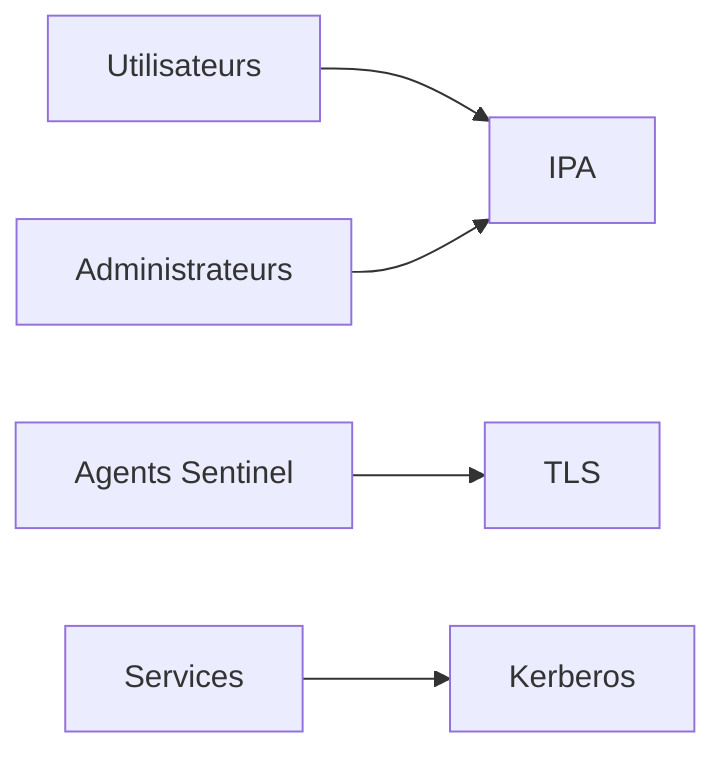

Toutes n'utilisent pas les mêmes mécanismes.

Certaines utiliseront :

- PAM ;
- Kerberos ;
- TLS ;
- des certificats de service.

Comprendre cette diversité permettra de concevoir une application capable de s'intégrer naturellement dans un environnement d'entreprise.

## Les utilisateurs de Sentinel

Une erreur fréquente consiste à créer une table spécifique dans l'application.

Par exemple :

```text
users

id
login
password_hash
role
```

Cette approche est acceptable pour une application Internet autonome.

Elle l'est beaucoup moins dans une infrastructure d'entreprise déjà équipée d'un annuaire.

Dans notre laboratoire, les utilisateurs existent déjà.

Ils sont connus de FreeIPA.

```text
alice

bob

claire
```

Sentinel ne devrait donc pas demander :

> « Qui est Alice ? »

Il devrait demander au système.

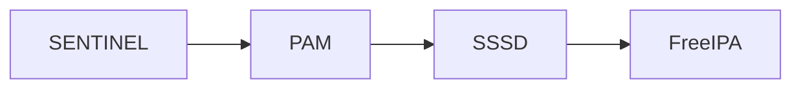

L'application délègue entièrement l'authentification.

---

## Authentification et autorisation

Ces deux notions sont souvent confondues.

Pourtant, elles répondent à deux questions différentes.

```text
Authentification

↓

Qui êtes-vous ?
```

```text
Autorisation

↓

Que pouvez-vous faire ?
```

FreeIPA peut participer aux deux.

Par exemple :

- PAM authentifie Alice ;
- SSSD récupère ses groupes ;
- Sentinel décide quelles fonctionnalités sont accessibles.

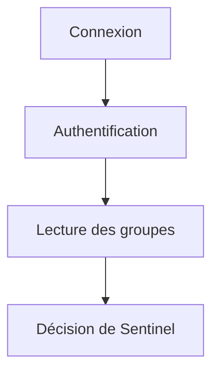

L'application ne vérifie plus le mot de passe.

Elle exploite le résultat fourni par le système.

---

## Exploiter les groupes FreeIPA

Nous avons déjà créé plusieurs groupes.

Par exemple :

```text
sentinel-operators
```

ou encore :

```text
sentinel-admins
```

Sentinel peut directement les utiliser.

Une logique simple pourrait être :

| Groupe FreeIPA | Rôle dans Sentinel |
|----------------|--------------------|
| `sentinel-operators` | Exploitation quotidienne |
| `sentinel-admins` | Administration complète |
| `sentinel-auditors` | Consultation des rapports |

L'application ne stocke donc plus les rôles.

Elle les déduit des groupes du domaine.

---

## Exemple de fonctionnement

Lorsqu'Alice ouvre l'interface Web.

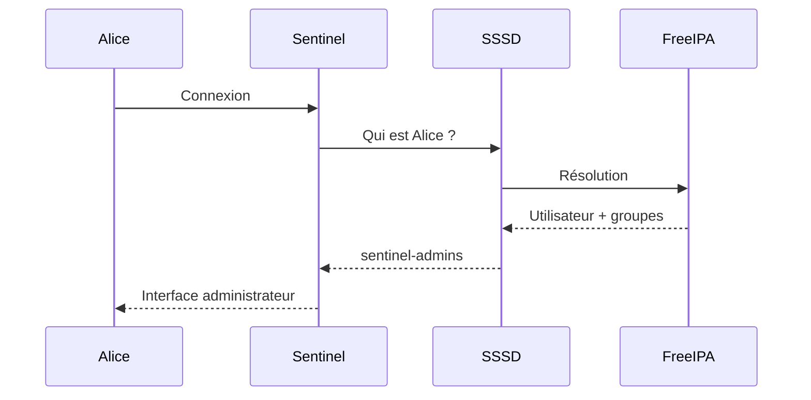

Aucune information d'identité n'est enregistrée dans Sentinel.

L'application consomme simplement les informations fournies par le système.

---

## Les avantages

Cette approche apporte plusieurs bénéfices.

Si Alice quitte l'entreprise.

Il suffit de :

```text
Supprimer Alice

ou

La retirer de sentinel-admins
```

Aucune modification n'est nécessaire dans Sentinel.

Toutes les applications intégrées à FreeIPA observent immédiatement ce changement.

L'administration est centralisée.

Les risques d'incohérence diminuent fortement.

---

## Les rôles propres à l'application

Attention cependant.

Toutes les autorisations ne doivent pas forcément provenir de FreeIPA.

Certaines sont purement fonctionnelles.

Par exemple :

- tableau de bord favori ;
- préférences utilisateur ;
- disposition de l'interface ;
- seuils d'alerte personnels ;
- widgets affichés.

Ces informations relèvent de Sentinel.

On peut donc résumer ainsi.

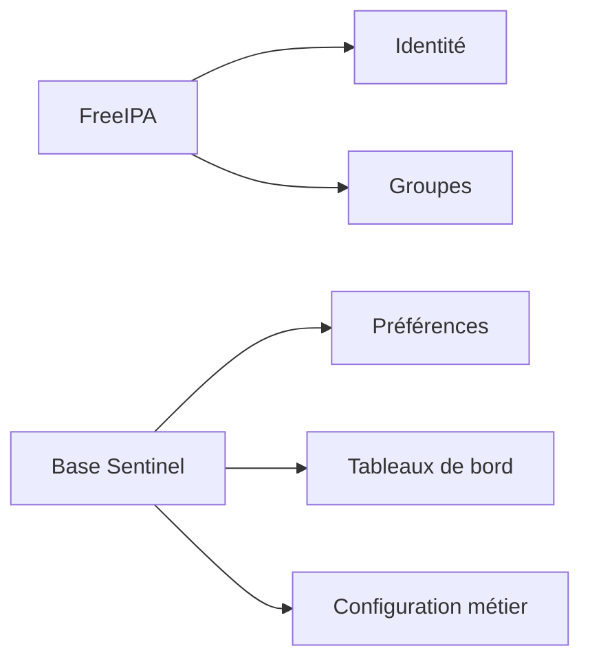

Une bonne intégration consiste à laisser chaque composant gérer ce qu'il connaît le mieux.

FreeIPA gère les identités.

Sentinel gère les données métier de Sentinel.

## Les certificats dans Sentinel

Nous avons vu au chapitre précédent comment obtenir un certificat.

Voyons maintenant comment Sentinel doit l'utiliser.

L'application n'a pas vocation à créer elle-même ses certificats.

Elle doit simplement charger ceux qui ont été fournis par la PKI.

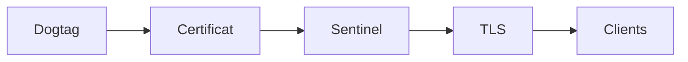

Le certificat devient une ressource de configuration, au même titre que :

- un fichier YAML ;
- un port TCP ;
- un répertoire de données.

---

## Où stocker les chemins ?

Une erreur fréquente consiste à coder les chemins directement dans l'application.

Par exemple :

```python
CERT = "/etc/pki/tls/certs/sentinel.crt"
KEY  = "/etc/pki/tls/private/sentinel.key"
```

Cette solution fonctionne.

Mais elle manque de souplesse.

Il est préférable de rendre ces chemins configurables.

Par exemple :

```yaml
tls:

  enabled: true

  certificate: /etc/pki/tls/certs/sentinel.crt

  private_key: /etc/pki/tls/private/sentinel.key

  ca_certificate: /etc/ipa/ca.crt
```

L'application peut ainsi être adaptée à différents environnements sans être recompilée.

---

## Le démarrage de Sentinel

Lors du lancement du service, Sentinel peut suivre une séquence similaire à celle-ci.

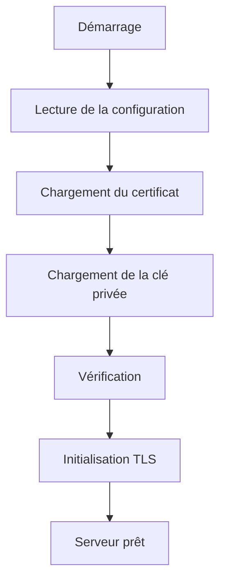

Si une étape échoue, le service doit refuser de démarrer.

Un serveur HTTPS sans certificat valide ne doit jamais continuer son exécution en mode dégradé sans que cela soit un choix explicite de l'administrateur.

---

## Vérifier les certificats au démarrage

Avant d'ouvrir le port HTTPS, plusieurs contrôles sont recommandés.

Par exemple :

- le fichier existe ;
- la clé privée existe ;
- les permissions sont correctes ;
- le certificat n'est pas expiré ;
- la clé privée correspond au certificat.

Ces vérifications permettent de détecter très tôt une erreur de déploiement.

Elles évitent qu'un incident ne soit découvert uniquement lorsqu'un client tente de se connecter.

---

## Exemple d'architecture

Au final, la partie TLS de Sentinel peut être représentée ainsi.

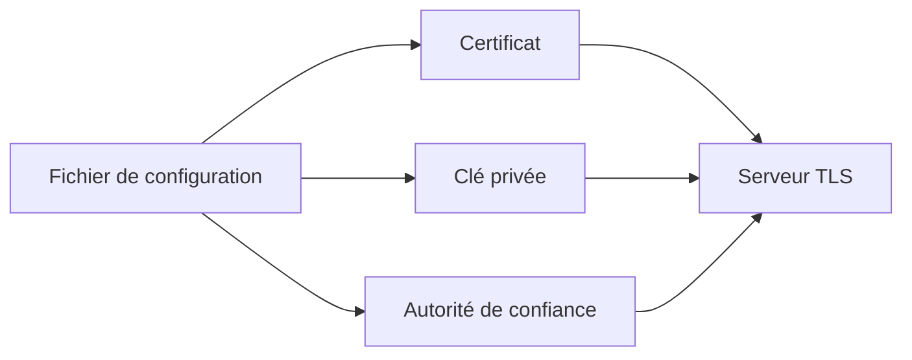

L'application ne connaît pas Dogtag.

Elle ne connaît pas non plus `certmonger`.

Elle exploite simplement les fichiers mis à sa disposition par le système.

Cette séparation des responsabilités facilite énormément la maintenance et les futures évolutions de Sentinel.

## Les groupes système et le service Sentinel

L'intégration à FreeIPA ne signifie pas que tous les comptes doivent devenir des comptes du domaine.

Sentinel reste un service Linux.

À ce titre, il continue d'utiliser un compte système dédié.

Par exemple :

```text
sentinel
```

créé localement lors de l'installation du paquet RPM.

Ce compte possède une responsabilité bien précise.

Il exécute le service.

Il ne représente pas un utilisateur humain.

---

## Deux catégories d'identités

Il est important de distinguer les identités humaines des identités techniques.

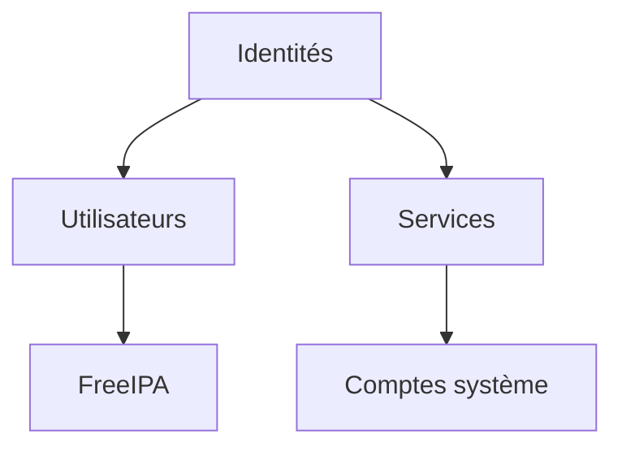

Les utilisateurs :

- Alice ;
- Bob ;
- Claire.

proviennent de FreeIPA.

En revanche :

```text
sentinel
```

reste un compte local.

Cette séparation est très courante dans les infrastructures Linux.

---

## Pourquoi conserver un compte système ?

Imaginons que Sentinel s'exécute directement sous le compte :

```text
root
```

En cas de compromission de l'application, l'attaquant obtiendrait immédiatement tous les privilèges du système.

À l'inverse, si Sentinel fonctionne avec un compte dédié :

```text
sentinel
```

les dégâts sont considérablement limités.

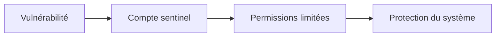

Cette approche complète parfaitement le principe du moindre privilège étudié précédemment.

---

## Les groupes FreeIPA dans l'application

Même si le processus Sentinel s'exécute sous un compte système local, il peut exploiter les groupes FreeIPA lors des connexions des utilisateurs.

Prenons un exemple.

Bob appartient au groupe :

```text
sentinel-operators
```

Lorsqu'il ouvre l'interface Web :

1. son identité est validée ;
2. ses groupes sont récupérés ;
3. Sentinel adapte les fonctionnalités proposées.

Par exemple :

| Groupe FreeIPA | Fonctionnalités |
|---------------|-----------------|
| `sentinel-viewers` | Consultation des tableaux de bord |
| `sentinel-operators` | Gestion des alertes |
| `sentinel-admins` | Administration complète |

L'application ne contient aucune liste d'utilisateurs.

Elle exploite uniquement les groupes fournis par l'infrastructure.

---

## Préparer les futures intégrations

Cette architecture présente un autre avantage.

Si, demain, l'entreprise décide :

- d'ajouter un nouvel administrateur ;
- de retirer un opérateur ;
- de créer une équipe d'auditeurs ;

il suffira de modifier les groupes dans FreeIPA.

Sentinel n'aura pas besoin d'être redéployé.

L'application évolue alors au rythme de l'organisation de l'entreprise, sans modification de son code.

C'est précisément l'un des objectifs recherchés lors de l'industrialisation d'un service.

## 💎 Le point d'expertise

Une erreur d'architecture très répandue consiste à utiliser FreeIPA comme une simple base d'utilisateurs.

Par exemple, lors de chaque connexion, l'application effectue une requête LDAP pour vérifier que l'utilisateur existe, puis elle gère tout le reste elle-même.

Cette approche ne tire parti que d'une faible partie des capacités de FreeIPA.

Une intégration réussie va beaucoup plus loin.

Elle exploite :

- les utilisateurs ;
- les groupes ;
- Kerberos ;
- les certificats ;
- les règles `sudo` ;
- les politiques HBAC.

L'application cesse progressivement de réimplémenter des fonctionnalités déjà disponibles dans le système d'information.

---

## 🧠 Comment pense un architecte ?

Un architecte considère FreeIPA comme un fournisseur de services.

Chaque fois qu'une nouvelle fonctionnalité de Sentinel apparaît, il se pose une question.

> Cette fonctionnalité existe-t-elle déjà dans l'infrastructure ?

Si la réponse est oui, il évite de la redévelopper.

Par exemple :

| Besoin | Solution |
|--------|----------|
| Authentifier un utilisateur | PAM / Kerberos |
| Connaître ses groupes | SSSD |
| Délivrer un certificat | Dogtag |
| Renouveler un certificat | certmonger |
| Autoriser une commande système | sudo + FreeIPA |

L'application se concentre alors uniquement sur sa valeur métier.

---

## ⚔️ Comment pense un attaquant ?

Un attaquant cherche souvent les différences entre les politiques de sécurité.

Par exemple :

```text
FreeIPA

↓

Bob est désactivé
```

Mais dans Sentinel :

```text
Compte Bob toujours actif
```

L'attaquant dispose alors d'une porte d'entrée.

Plus une application conserve ses propres utilisateurs, plus le risque d'incohérence augmente.

À l'inverse, lorsqu'elle délègue complètement l'identité à FreeIPA, cette classe d'erreurs disparaît presque entièrement.

---

## 📚 Culture technique

De nombreuses grandes applications fonctionnent déjà selon ce principe.

Par exemple :

- GitLab ;
- Grafana ;
- Jenkins ;
- Nexus Repository ;
- Keycloak (dans certains scénarios).

Ces applications ne cherchent pas à remplacer l'annuaire de l'entreprise.

Elles s'y intègrent.

Leur base de données conserve principalement :

- les préférences utilisateur ;
- les projets ;
- les tableaux de bord ;
- les données métier.

L'identité reste, elle, centralisée.

Cette séparation est aujourd'hui considérée comme une bonne pratique d'architecture.

---

## ⚠️ Piège classique

Une erreur fréquente consiste à copier les groupes FreeIPA dans une base de données locale afin de « gagner en performances ».

Très rapidement, les deux sources divergent.

Exemple.

```text
09:00

Bob appartient à sentinel-admins.
```

À 09:15.

```text
Bob est retiré du groupe.
```

Mais Sentinel utilise encore sa copie locale.

Bob conserve alors des privilèges qu'il ne devrait plus avoir.

La bonne approche consiste à :

- utiliser directement les groupes fournis par SSSD ou le mécanisme d'authentification choisi ;
- ou mettre en place un cache maîtrisé avec une stratégie d'expiration clairement définie.

La cohérence des autorisations est souvent plus importante que quelques millisecondes gagnées lors d'une authentification.

## Laboratoire AlmaLinux

### Objectif

Préparer Sentinel à fonctionner comme une application entièrement intégrée à FreeIPA.

À la fin du laboratoire, Sentinel devra :

- utiliser un certificat délivré par la PKI ;
- fonctionner sous un compte système dédié ;
- exploiter les groupes FreeIPA ;
- ne conserver localement que ses données métier.

---

### Étape 1 — Vérifier le compte système

Le service Sentinel ne doit pas fonctionner sous `root`.

Vérifiez son utilisateur.

```bash
grep '^User=' \
    /etc/systemd/system/sentinel.service
```

Le résultat attendu est par exemple :

```text
User=sentinel
```

Contrôlez ensuite le compte.

```bash
id sentinel
```

Il doit s'agir d'un compte système local.

---

### Étape 2 — Vérifier les certificats

Contrôlez la présence des fichiers.

```bash
ls -l /etc/pki/tls/certs/sentinel.crt
```

Puis :

```bash
ls -l /etc/pki/tls/private/sentinel.key
```

Vérifiez également que le certificat est toujours suivi.

```bash
getcert list
```

Le statut doit être :

```text
MONITORING
```

---

### Étape 3 — Vérifier les groupes FreeIPA

Depuis le serveur Sentinel.

```bash
id bob
```

Puis :

```bash
id alice
```

Les groupes FreeIPA doivent apparaître.

Par exemple :

```text
sentinel-operators
```

ou :

```text
sentinel-admins
```

Ces groupes seront utilisés par l'application pour déterminer les autorisations.

---

### Étape 4 — Vérifier les politiques sudo

Connectez-vous avec Bob.

```bash
sudo -l
```

Les commandes prévues au chapitre précédent doivent être présentes.

Cette vérification confirme que :

- SSSD fonctionne ;
- les groupes sont correctement résolus ;
- les politiques FreeIPA sont appliquées.

---

## Jalon Sentinel — version 0.6.0

### Partir du mTLS, sans stocker les identités

Sentinel 0.5.0, jalon prévu par la campagne TLS, sait déjà exiger un certificat client signé par une autorité approuvée. Cette authentification cryptographique ne répond cependant pas encore à la question : **ce client de confiance est-il autorisé à utiliser Sentinel ?**

La version 0.6.0 ajoute une liste fermée d'identités DNS attendues dans le `subjectAltName` des certificats :

```ini
[identity]
allowed_dns_names = healthcheck.sentinel.example.test, agent01.example.test
```

Les noms sont des données de configuration, pas des comptes copiés dans une base Sentinel. FreeIPA reste la source des certificats et de leur cycle de vie. Sentinel prend seulement la décision liée à sa fonction.

Le contrôle applicatif extrait exclusivement les entrées SAN de type DNS :

```python
def certificate_dns_names(certificate):
    return {
        str(value).lower()
        for name_type, value in certificate.get("subjectAltName", ())
        if name_type == "DNS"
    }

def is_authorized_certificate(certificate, allowed_dns_names):
    return bool(certificate_dns_names(certificate).intersection(allowed_dns_names))
```

La validation de chaîne TLS a lieu avant ce contrôle. Un certificat autosigné ou émis par une autre autorité échoue pendant la négociation ; un certificat signé par l'autorité mais absent de la liste reçoit HTTP `403`. Ces deux refus prouvent des couches différentes.

### Déployer les certificats hors du dépôt Git

Les chemins attendus sont référencés dans la configuration :

```ini
[tls]
enabled = true
certificate = /etc/sentinel/tls/server.crt
private_key = /etc/sentinel/tls/server.key
client_ca = /etc/sentinel/tls/clients-ca.crt
require_client_certificate = true

[healthcheck]
server_name = sentinel.sentinel.lab
certificate = /etc/sentinel/tls/healthcheck.crt
private_key = /etc/sentinel/tls/healthcheck.key
```

`server_name` est le nom présent dans le SAN du certificat serveur. Il permet au healthcheck local de vérifier l'identité TLS même lorsque le processus écoute sur une adresse IP. Ce nom doit être résolu vers l'hôte Sentinel par le DNS du laboratoire.

La clé privée n'entre jamais dans le dépôt Sentinel. Le compte de service peut la lire sans pouvoir la modifier. Le certificat du healthcheck possède une identité dédiée et doit lui aussi être autorisé ; réutiliser le certificat serveur comme identité cliente brouillerait les usages et peut être refusé par ses extensions X.509.

### Prouver l'intégration

Après émission et suivi par `certmonger`, contrôlez le serveur puis lancez la requête depuis l'hôte `agent01` autorisé :

```bash
getcert list
sudo systemctl restart sentinel.service

curl --fail \
  --cacert /etc/pki/ca-trust/source/anchors/ipa-ca.crt \
  --cert /etc/pki/tls/certs/agent01.crt \
  --key /etc/pki/tls/private/agent01.key \
  https://sentinel.example.test:8443/api/v1/status
```

Puis distinguez :

1. certificat autorisé : HTTP 200 ;
2. certificat FreeIPA valide mais identité non autorisée : HTTP 403 ;
3. certificat émis par une autorité inconnue : échec TLS ;
4. absence de certificat client : échec TLS ;
5. renouvellement du certificat serveur : nouveau numéro de série présenté après l'action de rechargement ou redémarrage documentée.

Le checkpoint 0.6.0 et ses tests se trouvent sous `sentinel/labs/sentinel-app/checkpoints/0.6.0/`. Le checkpoint 0.5.0 documente séparément l'étape TLS afin que l'intégration FreeIPA n'en masque pas les concepts.

---

## Mission d'ingénieur

Vous devez préparer une architecture cible pour Sentinel.

Complétez le tableau suivant.

| Élément | Géré par |
|----------|----------|
| Comptes utilisateurs | |
| Groupes | |
| Authentification | |
| Certificats TLS | |
| Renouvellement des certificats | |
| Politiques `sudo` | |
| Préférences utilisateur | |
| Configuration métier Sentinel | |
| Journaux métier | |

L'objectif est que chaque information soit administrée par le composant le plus adapté.

Ajoutez au dossier le commit Sentinel 0.6.0, la configuration sans clé privée et les cinq preuves mTLS. Une simple sortie `getcert MONITORING` ne démontre ni l'autorisation applicative ni la prise en compte effective d'un certificat renouvelé.

---

## Impact sur Sentinel

Sentinel est désormais prêt à fonctionner comme un véritable service Linux intégré au système d'information.

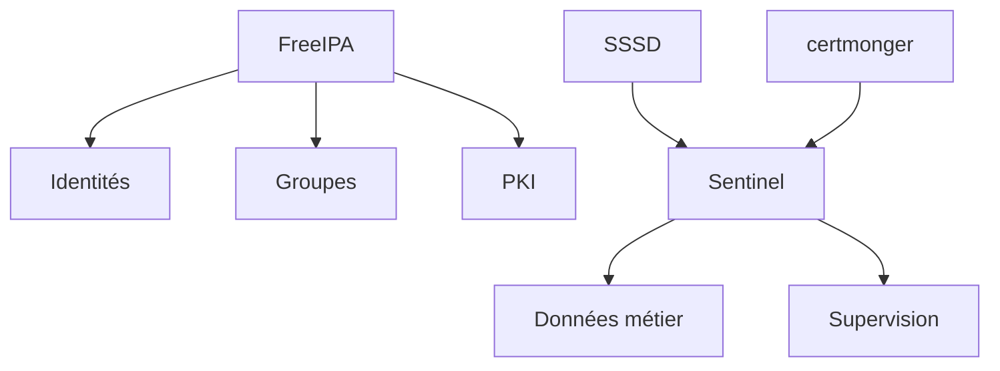

À ce stade de la formation, l'application ne repose plus sur des mécanismes artisanaux.

Elle s'appuie sur :

- l'annuaire de l'entreprise ;
- l'autorité de certification ;
- les politiques centralisées ;
- les services natifs d'AlmaLinux.

Cette approche est celle retenue dans la majorité des infrastructures Linux d'entreprise.

---

## Synthèse

- Une application d'entreprise ne doit pas gérer elle-même les identités si une infrastructure dédiée existe.
- FreeIPA fournit les utilisateurs, les groupes et les politiques de sécurité.
- Sentinel conserve uniquement les données propres à son métier.
- Le service continue de fonctionner avec un compte système local dédié.
- Les certificats sont délivrés et renouvelés automatiquement par l'infrastructure.
- Cette séparation des responsabilités améliore la sécurité, la maintenabilité et l'évolutivité de l'application.

---

## Infographie de révision

```text
                 INTÉGRATION DE SENTINEL À FREEIPA

                  +---------------------------+
                  |        FreeIPA            |
                  +---------------------------+
                     |      |        |
                     |      |        |
             Utilisateurs  Groupes  PKI
                     |      |        |
                     +------+--------+
                            |
                           SSSD
                            |
                            v
                    +----------------+
                    |    Sentinel    |
                    +----------------+
                     |              |
                     |              |
              Données métier   Préférences
                     |
                     v
              Supervision & Audit

──────────────────────────────────────────────────────────────

   FreeIPA fournit l'identité.

   AlmaLinux applique les politiques.

   Sentinel se concentre sur son métier.
```

## Pour aller plus loin

Nous avons maintenant étudié tous les composants majeurs de FreeIPA :

- l'architecture interne ;
- les utilisateurs ;
- les groupes ;
- les politiques `sudo` ;
- les hôtes ;
- les certificats ;
- l'intégration de Sentinel.

Il est temps de réunir l'ensemble de ces connaissances dans une mission complète.

Le prochain chapitre vous placera dans le rôle d'un ingénieur système chargé de déployer, sécuriser et administrer une infrastructure FreeIPA autour de Sentinel, en appliquant l'ensemble des concepts étudiés depuis le début de cette campagne.

---

← [8.8 — Certificats](8.8-certificats.md) · [8.10 — Mission : administrer avec FreeIPA](8.10-mission-administration-freeipa.md) →
