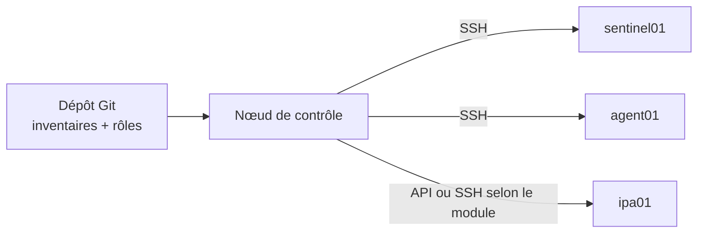
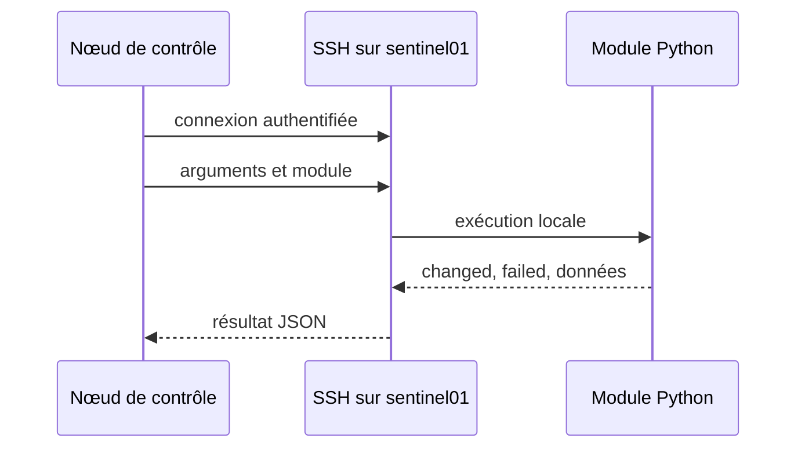

# Chapitre 9.1 — Comprendre l'architecture Ansible

> **Campagne 9 — Déploiement avec Ansible**
>
> *« Automatiser ne consiste pas à exécuter plus vite une procédure floue, mais à rendre l'état attendu explicite et vérifiable. »*

## Vous êtes ici

```text
Partie II — Industrialiser la sécurité

Campagne 9 — Déploiement avec Ansible

    ► 9.1 Architecture Ansible
      9.2 Composants et idempotence
      9.3 Inventaires
      9.4 Premiers playbooks
      9.5 Variables et templates
      9.6 Rôles Ansible
      9.7 Déploiement de Sentinel
      9.8 Intégration à FreeIPA
      9.9 Industrialisation du projet
      9.10 Mission de déploiement
```

## Objectifs pédagogiques

À la fin de ce chapitre, vous serez capable de :

- nommer les composants d'une architecture Ansible ;
- décrire le trajet d'une tâche du nœud de contrôle vers un hôte ;
- expliquer ce que signifie réellement « sans agent » ;
- préparer les comptes, SSH et Python nécessaires ;
- identifier les actifs sensibles du nœud de contrôle.

## Pourquoi ce chapitre existe

Les huit premières campagnes ont construit manuellement un serveur Sentinel durci. Cette méthode est indispensable pour comprendre chaque protection, mais elle ne garantit pas que `sentinel02` recevra exactement les mêmes permissions, règles, certificats et contrôles.

La campagne 9 ne change pas le code Python de Sentinel `0.6.0`. Elle transforme son installation en infrastructure versionnée, rejouable et vérifiable sur plusieurs hôtes.

## Du geste administrateur à l'état déclaré

Un script impératif décrit une suite d'actions : « crée ce répertoire, copie ce fichier, redémarre ce service ». Un projet Ansible cherche plutôt à exprimer un état : « ce paquet est présent, ce fichier possède ce contenu, ce service est actif ».

Cette nuance devient visible au deuxième passage. Une bonne automatisation constate que l'état est déjà correct et ne provoque aucun changement inutile.



## Les composants de l'architecture

### Le nœud de contrôle

Le **control node** exécute `ansible`, `ansible-playbook` et les plugins. Il contient ou reçoit :

- le projet versionné ;
- les inventaires ;
- les collections et rôles ;
- une configuration Ansible ;
- les identités SSH nécessaires ;
- un moyen contrôlé d'accéder aux secrets.

Il ne s'agit pas d'un simple poste de travail interchangeable. Une compromission peut donner accès à tous les hôtes administrés et aux secrets chargés pendant l'exécution. En entreprise, ce rôle est souvent confié à un bastion d'automatisation ou à un *execution environment* isolé.

### Les nœuds administrés

Les **managed nodes** sont les machines ciblées. Dans le laboratoire :

| Hôte | Rôle |
|---|---|
| `ipa01.sentinel.example.test` | domaine FreeIPA existant |
| `sentinel01.sentinel.example.test` | service Sentinel `0.6.0` |
| `agent01.sentinel.example.test` | client mTLS autorisé |

Pour les modules Linux usuels, l'hôte doit être joignable, offrir un compte distant et disposer d'un interpréteur Python compatible. Quelques modules particuliers, comme `raw`, peuvent intervenir avant Python, mais ils ne constituent pas le mode normal du projet.

### Inventaire, playbook, rôle et collection

| Objet | Responsabilité |
|---|---|
| inventaire | décrire les hôtes, groupes et variables de connexion |
| playbook | sélectionner des hôtes et orchestrer des tâches ou rôles |
| module | réaliser une opération précise sur un objet |
| rôle | regrouper une responsabilité réutilisable |
| collection | distribuer modules, rôles et plugins sous un espace de noms |
| plugin | étendre le comportement du moteur : connexion, inventaire, filtre, callback, etc. |

Un fichier YAML n'est donc pas « Ansible tout entier ». Le moteur charge un inventaire, résout les variables, sélectionne les plugins, puis appelle les modules décrits par le playbook.

## Ce que « sans agent » signifie

Ansible n'installe pas un démon Ansible permanent sur chaque serveur Linux. Pour une tâche classique :

1. le nœud de contrôle prépare les arguments du module ;
2. il ouvre une connexion SSH ;
3. il transfère ou exécute le code nécessaire dans un espace temporaire ;
4. le module inspecte ou modifie l'hôte ;
5. il renvoie un résultat structuré ;
6. les fichiers temporaires sont retirés.



« Sans agent » ne signifie donc ni sans dépendance, ni sans privilège, ni sans trace. SSH, Python, le compte distant, `sudo`, les répertoires temporaires et les journaux restent dans le modèle de sécurité.

## SSH et élévation de privilèges

Le nœud de contrôle se connecte avec un compte nominatif ou technique dédié. Il n'est pas nécessaire d'autoriser une connexion directe de `root`.

Le parcours recommandé est :

```text
clé SSH → compte ansible → sudo limité → module privilégié
```

Ansible appelle cette élévation `become`. Elle ne remplace pas la politique `sudo` : elle l'utilise. Les règles construites dans les campagnes précédentes restent donc actives.

Conservez également la vérification des clés d'hôtes SSH. Désactiver globalement `host_key_checking` facilite le premier test, mais retire la preuve que le nœud de contrôle contacte la machine attendue. Préparez plutôt `known_hosts` par un mécanisme approuvé.

⚔️ **Regard attaquant** — la clé privée du compte d'automatisation, le fichier de coffre déchiffré et le cache du processus sont des cibles à forte valeur. Limiter les droits de la clé sur chaque hôte réduit l'effet d'une compromission du contrôleur.

## Préparer le nœud de contrôle

Sur une machine AlmaLinux dédiée, installez une version maîtrisée d'Ansible. Selon les dépôts autorisés dans votre environnement, utilisez le paquet `ansible-core` ou un environnement Python isolé. Ne mélangez pas silencieusement plusieurs installations.

```bash
sudo dnf install -y ansible-core git-core
ansible --version
ansible-config dump --only-changed
python3 --version
```

La sortie `ansible --version` indique notamment le chemin de `ansible.cfg`, la version de Python et les emplacements de collections. Conservez-la dans le dossier de preuve : une automatisation reproductible dépend aussi de son moteur.

Préparez ensuite le dépôt de laboratoire :

```bash
cd sentinel/labs/ansible
ansible-galaxy collection install -r requirements.yml
ansible-inventory --graph
```

Le fichier `requirements.yml` épingle les collections externes. Sans ce manifeste, deux contrôleurs peuvent interpréter le même dépôt avec des versions différentes.

## Laboratoire — qualifier le chemin de connexion

Avant tout playbook privilégié, validez séparément :

```bash
ssh ansible@sentinel01.sentinel.example.test id
ssh ansible@sentinel01.sentinel.example.test sudo -n true
ssh-keygen -F sentinel01.sentinel.example.test
```

Puis, lorsque l'inventaire du chapitre 9.3 est disponible :

```bash
ansible sentinel_servers -m ansible.builtin.ping
ansible sentinel_servers -a 'id'
```

Le module `ping` Ansible ne teste pas ICMP : il vérifie la connexion, l'exécution Python et le retour du module. Un véritable diagnostic réseau utilise en plus `ping`, `ss`, `dig` ou les outils adaptés à la couche étudiée.

## Impact sur Sentinel

Sentinel reste en version `0.6.0`. Le nouvel artefact est le projet d'infrastructure sous `sentinel/labs/ansible/`. À la fin de la campagne, il devra reconstruire le service sans copier manuellement de secret et prouver deux exécutions successives, la seconde sans changement.

## Synthèse

- le nœud de contrôle transforme un projet versionné en opérations distantes ;
- l'inventaire cible des hôtes, les playbooks orchestrent et les modules agissent ;
- l'absence d'agent permanent ne supprime pas SSH, Python ni `sudo` ;
- le contrôleur et ses identités constituent un actif de sécurité critique ;
- Ansible doit conserver les protections existantes, notamment les clés d'hôtes et le moindre privilège ;
- la campagne automatise Sentinel `0.6.0` sans changer son code.

## Infographie de révision

```text
DÉPÔT VERSIONNÉ
  inventaire · playbooks · rôles · versions
            ↓
NŒUD DE CONTRÔLE
  Ansible · SSH · secrets à la demande
            ↓
HÔTES ADMINISTRÉS
  Python · sudo · modules · résultats
            ↓
PREUVES
  changements · refus · idempotence
```

## Pour aller plus loin

Le chapitre suivant ouvre le moteur : modules, états, résultats et idempotence expliquent pourquoi un playbook est plus fiable qu'une succession de commandes distantes.

[Continuer vers le chapitre 9.2 — Composants et idempotence](9.2-composants-ansible.md)

Références : [Getting started with Ansible](https://docs.ansible.com/ansible/latest/getting_started/index.html), [Ansible architecture](https://docs.ansible.com/ansible/latest/dev_guide/overview_architecture.html) et [Connection methods and details](https://docs.ansible.com/ansible/latest/inventory_guide/connection_details.html).
