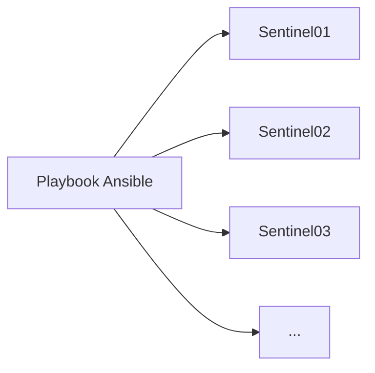
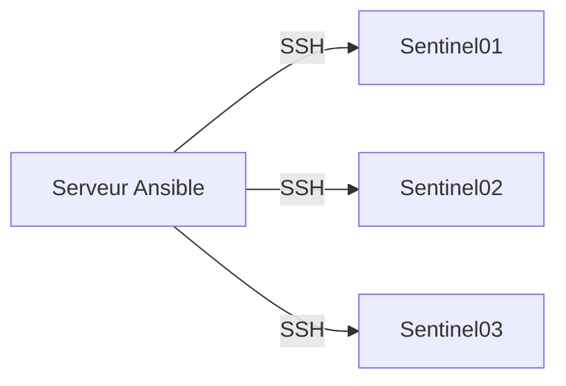
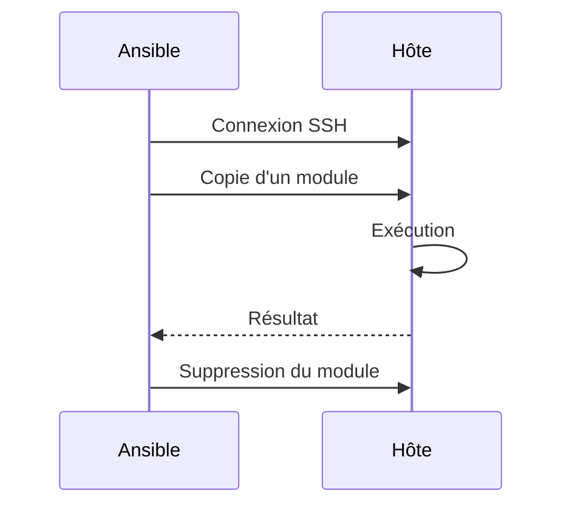
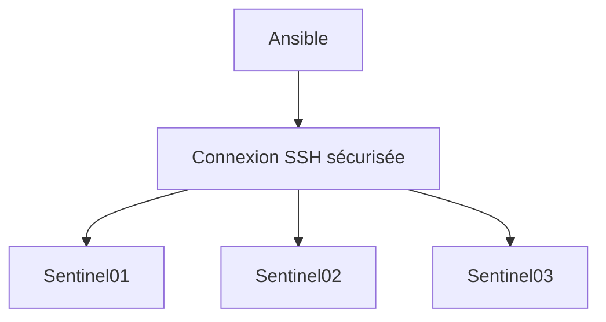

# Chapitre 9.1 — Pourquoi automatiser avec Ansible ?

> **Campagne 9 — Industrialisation avec Ansible**

> *« Un administrateur sait configurer un serveur. Un ingénieur est capable d'en configurer mille de manière identique. »*

---

## Vous êtes ici

```text
PARTIE II — Industrialiser la sécurité

Campagne 9

► 9.1 Pourquoi automatiser avec Ansible ?
  9.2 Comprendre l'architecture d'Ansible
  9.3 Inventaires
  9.4 Premiers playbooks
  9.5 Variables et templates
  9.6 Les rôles Ansible
  9.7 Déployer Sentinel avec Ansible
  9.8 Intégrer Sentinel à FreeIPA
  9.9 Industrialiser le laboratoire
  9.10 Mission : déployer l'infrastructure Sentinel
```

Dans la prochaine partie, nous verrons **pourquoi Ansible est dit "agentless"**, comment il communique avec les serveurs et pourquoi cette architecture est devenue un standard dans l'administration des infrastructures Linux.

---

## Objectifs pédagogiques

À la fin de ce chapitre, vous serez capable de :

- expliquer ce que l'automatisation apporte à l'administration système ;
- identifier les décisions de sécurité associées ;
- appliquer ces principes au laboratoire Sentinel.

---

## Pourquoi ce chapitre existe

Ce chapitre explique pourquoi l'automatisation devient nécessaire lorsque le nombre de serveurs augmente et pourquoi Ansible est adapté au laboratoire Sentinel.

---

## Pourquoi cette campagne ?

Depuis le début de la formation, toutes les opérations ont été réalisées manuellement.

Nous avons notamment :

- installé AlmaLinux ;
- sécurisé SSH ;
- configuré `firewalld` ;
- créé des services `systemd` ;
- intégré les serveurs à FreeIPA ;
- obtenu des certificats ;
- construit des politiques de sécurité.

Cette approche était volontaire.

Avant d'automatiser une tâche, il faut parfaitement comprendre ce qu'elle réalise.

Nous allons maintenant franchir une nouvelle étape.

Au lieu d'exécuter les commandes une par une, nous allons demander à Ansible de les exécuter à notre place.

---

### Objectifs de la campagne

À la fin de cette campagne, vous serez capable de :

- comprendre l'architecture d'Ansible ;
- administrer plusieurs serveurs simultanément ;
- écrire des playbooks propres et réutilisables ;
- créer des rôles Ansible pour Sentinel ;
- automatiser l'intégration à FreeIPA ;
- industrialiser le déploiement complet d'un serveur Sentinel.

L'objectif n'est pas d'apprendre Ansible comme un simple outil.

L'objectif est de construire une infrastructure reproductible.

---

## Pourquoi Ansible ?

Imaginons que dix nouveaux serveurs doivent être déployés.

Sans automatisation, il faut répéter toutes les opérations :

```text
Installation

↓

Configuration SSH

↓

Configuration du pare-feu

↓

Installation des paquets

↓

Création des comptes

↓

Configuration systemd

↓

Intégration FreeIPA

↓

Obtention des certificats
```

Puis recommencer encore et encore.

Cette méthode fonctionne.

Mais elle présente plusieurs inconvénients :

- elle est lente ;
- elle est source d'erreurs ;
- elle produit souvent des serveurs légèrement différents.

---

## Avec Ansible

L'idée est radicalement différente.

Nous décrivons **l'état attendu**.

Ansible se charge ensuite de rendre chaque machine conforme à cette description.



Le même playbook est exécuté partout.

Chaque serveur converge vers la même configuration.

Cette notion de **convergence** sera au cœur de toute la campagne.

---

## Pourquoi Ansible est devenu un standard

De nombreux outils permettent d'automatiser l'administration d'un parc informatique.

Parmi les plus connus :

- Puppet ;
- Chef ;
- Salt ;
- Ansible.

Tous poursuivent le même objectif :

> Éviter les configurations manuelles répétitives.

Alors pourquoi Ansible est-il devenu si populaire ?

La première raison est sa simplicité.

---

## Une architecture sans agent

Contrairement à beaucoup d'autres solutions, Ansible ne nécessite généralement **aucun agent** installé sur les machines administrées.

On parle d'architecture **agentless**.



Les serveurs distants n'exécutent aucun démon Ansible.

Ils possèdent simplement :

- un serveur SSH ;
- Python (dans la plupart des cas).

Cela réduit considérablement la complexité du déploiement.

---

## Comment Ansible travaille-t-il ?

Le fonctionnement est beaucoup plus simple qu'on ne l'imagine.

Lorsqu'un playbook est lancé :

1. Ansible ouvre une connexion SSH.
2. Il copie temporairement un petit module Python.
3. Le module est exécuté.
4. Le résultat est récupéré.
5. Le module temporaire est supprimé.



Le serveur distant ne conserve donc pratiquement aucune trace d'Ansible en dehors des modifications réellement demandées.

---

## Pourquoi est-ce intéressant ?

Cette architecture apporte plusieurs avantages.

Tout d'abord, il n'y a pas de service supplémentaire à maintenir sur chaque serveur.

Ensuite, les mises à jour d'Ansible sont réalisées uniquement sur le poste d'administration.

Enfin, la communication repose sur SSH, un protocole que nous avons déjà sécurisé lors des premières campagnes.

Autrement dit, nous réutilisons une brique que nous maîtrisons déjà.

---

## L'importance de SSH

Dans notre laboratoire, SSH devient le véritable canal d'administration.



La sécurité d'Ansible dépend donc directement de celle de SSH.

Les bonnes pratiques étudiées précédemment prennent ici tout leur sens :

- authentification par clé ;
- limitation des comptes autorisés ;
- durcissement de `sshd` ;
- journalisation des connexions.

Une mauvaise configuration SSH compromettrait également l'automatisation.

---

## Une conséquence importante

Comme Ansible utilise SSH, il peut administrer des serveurs très différents.

Par exemple :

- AlmaLinux ;
- Rocky Linux ;
- Debian ;
- Ubuntu ;
- Fedora.

À condition :

- que SSH soit accessible ;
- que Python soit disponible (ou qu'un autre interpréteur compatible soit configuré).

Cette indépendance explique en grande partie son succès dans les environnements hétérogènes.

## Synthèse

Le chapitre **Pourquoi automatiser avec Ansible ?** établit une brique du socle de sécurité Sentinel.

Avant de poursuivre, vérifiez que vous savez :

- expliquer le rôle des mécanismes présentés ;
- distinguer leur configuration de leur état réellement observé ;
- valider leur comportement dans le laboratoire ;
- conserver une configuration explicite, vérifiable et reproductible.

## Pour aller plus loin

Le chapitre suivant présente les composants fondamentaux d'Ansible : le **nœud de contrôle**, les **nœuds administrés**, les **inventaires** et les **modules**.

---

← [8.10 — Mission : administrer avec FreeIPA](../campagne_08/8.10-mission-administration-freeipa.md) · [9.2 — Comprendre l'architecture d'Ansible](9.2-comprendre-architecture-ansible.md) →
