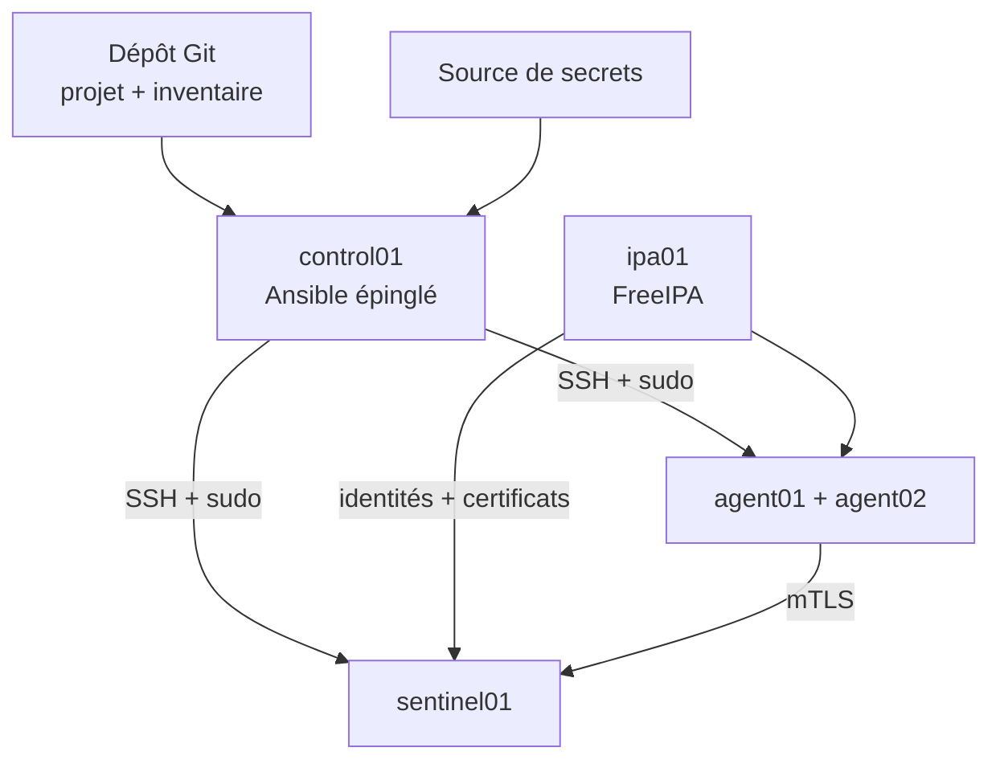

# Chapitre 9.10 — Mission : reconstruire Sentinel avec Ansible

> **Campagne 9 — Déploiement avec Ansible**
>
> *« La preuve d'automatisation n'est pas le playbook : c'est une plateforme reconstruite, conforme et reproductible. »*

## Vous êtes ici

```text
Partie II — Industrialiser la sécurité

Campagne 9 — Déploiement avec Ansible

      9.1 Architecture Ansible
      9.2 Composants et idempotence
      9.3 Inventaires
      9.4 Premiers playbooks
      9.5 Variables et templates
      9.6 Rôles Ansible
      9.7 Déploiement de Sentinel
      9.8 Intégration à FreeIPA
      9.9 Industrialisation du projet
   ► 9.10 Mission de déploiement
```

## Objectifs pédagogiques

À la fin de cette mission, vous serez capable de :

- reconstruire le déploiement Sentinel `0.6.0` depuis un dépôt ;
- conserver les protections Linux et FreeIPA des campagnes précédentes ;
- démontrer idempotence, refus attendus et diagnostic ;
- organiser secrets, dépendances, preuves et retour arrière ;
- faire relire le projet par un autre administrateur.

## Pourquoi ce chapitre existe

Les chapitres précédents isolent les concepts. Une exploitation réelle ne rencontre pas « un exercice de template » puis « un exercice de certificat » : elle doit enchaîner réseau, identité, fichiers, systemd, SELinux, TLS et tests sans laisser d'état partiel.

La mission fournit des critères, pas une suite de commandes à recopier. Votre dépôt doit produire les résultats et expliquer les décisions.

## Contexte

L'entreprise veut pouvoir reconstruire `sentinel01` après perte de la VM. Le domaine `SENTINEL.EXAMPLE.TEST` et `ipa01` existent déjà. Le code applicatif est le checkpoint `0.6.0`.

Le périmètre minimal :

| Hôte | Fonction |
|---|---|
| `control01` | nœud de contrôle Ansible |
| `ipa01` | DNS, Kerberos, annuaire et CA FreeIPA |
| `sentinel01` | serveur Sentinel |
| `agent01` | client mTLS autorisé |
| `agent02` | client IdM de confiance mais non autorisé dans Sentinel |

Les adresses documentaires de la campagne 8 sont adaptées au laboratoire isolé.

## Contraintes

- Sentinel reste en version `0.6.0` ;
- aucune clé privée n'entre dans Git ni ne transite par le contrôleur ;
- les secrets ne sont pas affichés dans les preuves ;
- SSH conserve la vérification des clés d'hôtes ;
- le compte d'automatisation n'utilise pas une connexion directe `root` ;
- SELinux reste `Enforcing` et Firewalld actif ;
- les règles HBAC et sudo restent limitées ;
- les collections sont épinglées ;
- une exécution partielle ne doit pas être présentée comme un succès ;
- le second passage complet doit converger vers `changed=0`.

## Architecture attendue



Le contrôleur distribue l'intention. FreeIPA conserve les identités. Les hôtes conservent leurs clés privées. Sentinel décide de l'autorisation de l'API.

## État de départ

Préparez :

- des VM AlmaLinux supportées ;
- DNS direct, inverse et SRV cohérents ;
- temps synchronisé ;
- accès SSH du compte d'automatisation ;
- règles `sudo` adaptées ;
- domaine FreeIPA sain ;
- snapshot ou mécanisme de reconstruction du laboratoire.

Conservez l'inventaire initial sans secret et la sortie de :

```bash
ansible --version
ansible-config dump --only-changed
ansible-galaxy collection list
ansible-inventory --graph
ansible all -m ansible.builtin.ping
```

## Lot 1 — Qualifier le projet

Livrez :

1. arborescence du dépôt ;
2. `requirements.yml` épinglé ;
3. `ansible.cfg` sans secret et sans désactivation de la confiance SSH ;
4. inventaire par FQDN et groupes fonctionnels ;
5. variables publiques documentées ;
6. fichier Vault réel exclu ou chiffré et exemple sans secret ;
7. résultats lint, syntaxe, inventaire et sélection d'hôtes.

Échec attendu : une variable obligatoire manque. La qualification doit échouer avant toute modification distante.

## Lot 2 — Enrôler les hôtes

Automatisez l'enrôlement de `sentinel01`, `agent01` et `agent02` avec la collection FreeIPA.

Preuves :

- FQDN, A/PTR et SRV ;
- état du client IPA ;
- principal `host/...` présent dans le `keytab` sans afficher les clés ;
- domaine SSSD en ligne ;
- résolution de l'utilisateur `alice` ;
- test HBAC autorisé et refus prévu ;
- règles sudo visibles pour la fonction attendue seulement.

Échec attendu : une VM témoin sans découverte DNS est refusée par les précontrôles et n'est pas enrôlée partiellement.

## Lot 3 — Déployer Sentinel

Le rôle local doit :

1. valider ses entrées et la plateforme ;
2. créer le compte système ;
3. créer les chemins avec les modes attendus ;
4. copier le checkpoint `0.6.0` sans modification ;
5. rendre puis valider la configuration ;
6. déployer l'unité systemd durcie ;
7. restaurer les contextes SELinux ;
8. activer et démarrer le service ;
9. vérifier version, configuration, service et healthcheck.

Le compte `sentinel` lit son code et sa configuration, écrit son état, mais ne modifie ni le code ni l'unité.

Échec attendu : un port invalide ou une configuration mTLS incomplète est refusé avant le remplacement du fichier actif.

## Lot 4 — Automatiser les certificats

Créez les principaux et suivis nécessaires sans copier de clé privée :

- certificat serveur `sentinel01` ;
- certificat client du healthcheck ;
- certificat client `agent01` autorisé ;
- certificat client `agent02` fiable mais absent de la liste.

Preuves :

- principal et SAN cohérents ;
- CA émettrice attendue ;
- état `MONITORING` ;
- permissions de la clé ;
- dates et usages du certificat ;
- configuration Sentinel contenant les chemins, pas les clés.

L'ordre doit empêcher l'activation de mTLS avant disponibilité des matériaux.

## Lot 5 — Tester la sécurité de bout en bout

Exécutez au minimum :

| Scénario | Résultat attendu |
|---|---|
| aucun certificat client | échec de négociation TLS |
| certificat d'une CA inconnue | échec de négociation TLS |
| certificat IdM `agent02` | HTTP `403` |
| certificat IdM `agent01` sur `/health` | HTTP `200` |
| `agent01` sur `/ready` avec dépendance saine | HTTP `200` |
| route inconnue avec identité autorisée | HTTP `404` |
| configuration invalide au redéploiement | échec Ansible, ancien service préservé |
| utilisateur hors HBAC | accès SSH refusé |

Chaque refus doit être attribué à sa couche : SSH/HBAC, TLS, autorisation Sentinel, routage ou disponibilité.

## Lot 6 — Prouver l'idempotence

Après un premier passage réussi :

```bash
ansible-playbook playbooks/site.yml \
  --limit 'sentinel_servers:sentinel_agents'
```

Relancez exactement le même commit, le même inventaire et les mêmes versions de dépendances. Le résultat attendu est `changed=0` sur tous les hôtes.

Si une tâche change encore :

1. identifiez la première tâche instable ;
2. comparez son entrée et son état observé ;
3. corrigez la détection ou la donnée ;
4. recommencez les deux passages depuis un état connu ;
5. documentez la cause.

Ne modifiez pas `changed_when` uniquement pour rendre le récapitulatif vert.

## Lot 7 — Simuler une reconstruction

Sur une VM Sentinel vierge ou restaurée avant déploiement :

1. conservez le même FQDN et le plan d'adressage prévu ;
2. révoquez ou traitez l'ancienne identité selon la procédure de laboratoire ;
3. exécutez le projet depuis le commit qualifié ;
4. réobtenez les clés et certificats sur le nouvel hôte ;
5. restaurez uniquement les données métier prévues ;
6. rejouez la campagne d'acceptation ;
7. comparez les preuves à l'instance précédente.

Une image clonée avec l'ancien `keytab` et les anciennes clés ne démontre pas une reconstruction d'identité.

## Diagnostic imposé

Tirez au sort ou faites choisir par un autre administrateur deux incidents :

- FQDN différent de l'inventaire ;
- SRV Kerberos absent ;
- secret Vault indisponible ;
- collection de mauvaise version ;
- template Sentinel invalide ;
- permission de clé trop large ;
- `keytab` périmé ;
- certificat non suivi ;
- AVC SELinux ;
- handler de redémarrage en échec ;
- SAN fiable mais non autorisé.

Pour chacun, produisez :

```text
symptôme :
couche suspectée :
preuve discriminante :
cause racine :
correction minimale :
test après correction :
retour arrière :
```

Corrections interdites : désactiver SELinux, arrêter Firewalld, désactiver la vérification SSH, accorder `sudo ALL`, activer HBAC `allow_all`, publier un secret ou ajouter tous les SAN à la liste.

## Livrables attendus

```text
campagne-09/
├── architecture.md
├── versions-dependances.md
├── matrice-hotes-groupes.md
├── matrice-secrets.md
├── rapport-idempotence.md
├── rapport-acceptation.md
├── preuves-expurgees/
├── incidents/
└── retour-arriere.md
```

Le projet Ansible reste sous `sentinel/labs/ansible/`. Les preuves réelles peuvent rester dans un stockage contrôlé si elles contiennent des noms ou journaux internes.

## Critères de réussite

- le périmètre de chaque play est explicite ;
- les dépendances sont épinglées et identifiables ;
- aucun secret ou clé privée n'apparaît dans Git ou les logs remis ;
- les rôles ont une responsabilité et une interface documentées ;
- la configuration invalide est refusée avant redémarrage ;
- les protections systemd, SELinux, Firewalld, HBAC et sudo restent actives ;
- les certificats sont suivis et renouvelables ;
- les refus apparaissent à la bonne couche ;
- le second passage affiche `changed=0` ;
- une reconstruction complète aboutit au même contrat fonctionnel ;
- un autre administrateur peut relire et rejouer la procédure.

## Retour arrière

Le plan précise :

1. commit et inventaire de dernier état connu ;
2. ordre de restauration de la configuration et du code ;
3. traitement des certificats et identités créés ;
4. restauration des données métier compatibles ;
5. contrôles avant remise en service ;
6. condition d'abandon de la procédure.

Un retour arrière ne restaure pas un secret révoqué ni une identité compromise. Dans ce cas, il faut reprovisionner la confiance.

## Jalon Sentinel — déploiement reproductible de `0.6.0`

### État de départ

Sentinel `0.6.0` est fonctionnel et intégré manuellement à FreeIPA.

### Besoin

Reconstruire l'ensemble de son infrastructure d'exécution sur plusieurs hôtes.

### Modification

Le code applicatif reste identique. Le nouveau jalon est le projet Ansible : inventaires, rôles, templates, dépendances, secrets externes et tests.

### Compatibilité

Les CLI, routes, données et paramètres `0.6.0` sont conservés. La campagne 10 pourra remplacer la copie des sources par un RPM sans changer le contrat d'exploitation.

### Preuves

- sept tests Python du checkpoint ;
- déploiement et reconstruction réussis ;
- tests de sécurité de bout en bout ;
- second passage sans changement ;
- dépendances et commit identifiés.

### Échecs attendus

DNS incomplet, secret absent, template invalide, certificat non autorisé et politique d'accès refusée sont observés sans neutraliser les protections.

### Livrable

Le commit du projet Ansible qualifié devient l'entrée de la campagne 10 consacrée au paquet RPM.

## Synthèse

- l'automatisation se prouve par une reconstruction et non par la seule présence de YAML ;
- inventaire, rôles, secrets et dépendances possèdent des frontières distinctes ;
- la convergence au second passage révèle la stabilité du projet ;
- les validations négatives empêchent un état partiel ou trop permissif ;
- les clés privées restent sur leurs hôtes et les secrets sont minimisés ;
- Sentinel conserve son contrat `0.6.0` ;
- la prochaine amélioration remplace le déploiement de sources par un paquet géré.

## Infographie de révision

```text
INTENTION VERSIONNÉE
  inventaire · variables · rôles · dépendances
                  ↓
CONVERGENCE
  FreeIPA · certificats · Sentinel · protections Linux
                  ↓
ACCEPTATION
  fonctions · refus · idempotence · reconstruction
                  ↓
PROMOTION
  commit qualifié · preuves · retour arrière
```

## Pour aller plus loin

La campagne 10 transforme Sentinel en paquet RPM. Ansible n'aura plus à copier les sources : il sélectionnera une version de paquet, vérifiera sa signature et orchestrera sa mise à niveau.

[Continuer vers la campagne 10 — Construire un paquet RPM](../campagne_10/10.1-construire-paquet-rpm.md)

Références : [Ansible playbooks](https://docs.ansible.com/ansible/latest/playbook_guide/playbooks_intro.html), [Testing strategies](https://docs.ansible.com/ansible/latest/reference_appendices/test_strategies.html), [FreeIPA Ansible collection](https://github.com/freeipa/ansible-freeipa) et [Ansible Vault](https://docs.ansible.com/ansible/latest/vault_guide/index.html).
