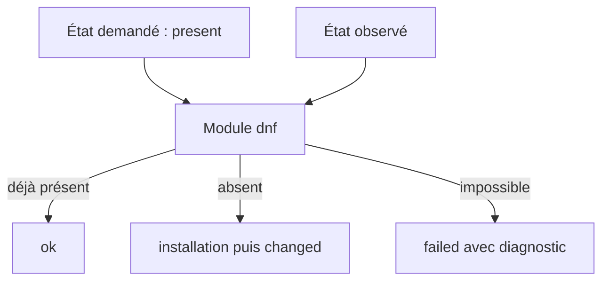

# Chapitre 9.2 — Comprendre les composants et l'idempotence Ansible

> **Campagne 9 — Déploiement avec Ansible**
>
> *« Une tâche fiable décrit un état, distingue l'observation du changement et explique son échec. »*

## Vous êtes ici

```text
Partie II — Industrialiser la sécurité

Campagne 9 — Déploiement avec Ansible

      9.1 Architecture Ansible
    ► 9.2 Composants et idempotence
      9.3 Inventaires
      9.4 Premiers playbooks
      9.5 Variables et templates
      9.6 Rôles Ansible
      9.7 Déploiement de Sentinel
      9.8 Intégration à FreeIPA
      9.9 Industrialisation du projet
      9.10 Mission de déploiement
```

## Objectifs pédagogiques

À la fin de ce chapitre, vous serez capable de :

- lire l'anatomie d'une tâche Ansible ;
- choisir un module spécialisé plutôt que `shell` ;
- interpréter `ok`, `changed`, `failed` et `skipped` ;
- expliquer et tester l'idempotence ;
- contrôler explicitement les changements et erreurs d'une commande.

## Pourquoi ce chapitre existe

Une commande SSH peut installer un paquet. Le problème apparaît quand elle est relancée, quand le paquet existe déjà, quand la distribution diffère ou quand il faut expliquer ce qui a changé.

Les modules Ansible encapsulent cette connaissance. Ils reçoivent des arguments, observent l'état courant, calculent une action et renvoient un résultat structuré.

## Anatomie d'une tâche

Une tâche associe un nom lisible à un module et à ses paramètres :

```yaml
- name: Installer le moteur Python de Sentinel
  ansible.builtin.package:
    name: python3
    state: present
```

Le nom décrit le résultat attendu. `ansible.builtin.package` est le **FQCN** (*Fully Qualified Collection Name*) du module. L'écriture complète indique d'où vient le module et évite des ambiguïtés entre collections.

Le module `package` choisit le gestionnaire adapté à l'hôte. Pour une option propre à DNF, utilisez `ansible.builtin.dnf`. Un module générique simplifie les cas communs ; il ne masque pas toutes les différences de distribution.

## Module, action et plugin

Le vocabulaire peut dérouter un débutant :

| Terme | Fonction |
|---|---|
| module | code qui inspecte ou modifie une ressource |
| action plugin | préparation effectuée côté contrôleur avant ou autour du module |
| connection plugin | transport utilisé pour atteindre l'hôte |
| lookup ou filtre | lecture ou transformation de données côté contrôleur |
| callback | présentation ou export des résultats |

Vous n'avez pas besoin d'écrire ces extensions pour utiliser Ansible. Les distinguer aide toutefois à comprendre où s'exécute une opération et où peut circuler un secret.

## Un état plutôt qu'une commande

Comparez :

```yaml
- name: Installer Python avec une commande
  ansible.builtin.shell: dnf install -y python3
```

et :

```yaml
- name: Garantir la présence de Python
  ansible.builtin.dnf:
    name: python3
    state: present
```

La première tâche lance un shell à chaque passage et doit interpréter elle-même les codes de retour. La seconde connaît le paquet, interroge DNF et ne modifie rien si l'état est déjà conforme.



## L'idempotence

Une opération est **idempotente** lorsque la répéter avec les mêmes entrées converge vers le même état sans changement supplémentaire.

Pour Sentinel :

1. le premier passage crée le compte, les répertoires, la configuration et le service ;
2. le second constate que ces objets sont conformes ;
3. son récapitulatif doit afficher `changed=0`.

Idempotent ne veut pas dire « la tâche ne change jamais rien ». Elle change ce qui est nécessaire, puis se stabilise.

Un playbook peut perdre cette propriété même avec de bons modules : contenu généré avec une date courante, secret renouvelé à chaque passage, ordre instable dans un template ou handler notifié sans véritable changement.

💎 **Point d'expertise** — l'idempotence est une propriété du scénario complet, pas un label magique attaché au module. Le test décisif reste deux exécutions successives sur un état contrôlé.

## Lire les résultats

Les états principaux sont :

| Résultat | Interprétation |
|---|---|
| `ok` | tâche réussie sans changement déclaré |
| `changed` | tâche réussie et état modifié |
| `failed` | tâche en échec pour cet hôte |
| `skipped` | condition ou sélection non satisfaite |
| `unreachable` | connexion ou exécution distante impossible |
| `rescued` | erreur traitée par un bloc `rescue` |

Le récapitulatif n'est pas une décoration. Une hausse inattendue de `changed` au second passage peut signaler une dérive, un template instable ou une mauvaise détection d'état.

## `command`, `shell` et modules spécialisés

`ansible.builtin.command` exécute directement un programme. `ansible.builtin.shell` passe par un interpréteur de commandes et permet redirections, tubes et expansions.

Utilisez un module spécialisé lorsqu'il existe. Sinon :

- préférez `command` si aucune fonction du shell n'est nécessaire ;
- utilisez `shell` seulement quand la syntaxe du shell est réellement voulue ;
- fournissez des arguments structurés avec `argv` lorsqu'ils évitent des problèmes de quoting ;
- rendez le changement et l'échec observables.

Exemple de contrôle sans modification :

```yaml
- name: Vérifier la configuration Sentinel
  ansible.builtin.command:
    argv:
      - /usr/bin/python3
      - /opt/sentinel/src/sentinel.py
      - --config
      - /etc/sentinel/sentinel.conf
      - --check-config
  register: sentinel_check
  changed_when: false
```

Le résultat enregistré possède notamment `rc`, `stdout`, `stderr`, `failed` et `changed`. `changed_when: false` est juste ici parce que la commande vérifie sans modifier.

Pour une commande dont certains codes sont acceptables :

```yaml
- name: Rechercher le suivi du certificat Sentinel
  ansible.builtin.command:
    argv:
      - getcert
      - list
      - -f
      - /etc/sentinel/tls/server.crt
  register: certificate_tracking
  changed_when: false
  failed_when: certificate_tracking.rc not in [0, 1]
```

Ne mettez pas `failed_when: false` par réflexe : cela transforme une panne en faux succès.

## Mode vérification et diff

Le mode `--check` demande aux modules compatibles de prévoir leurs changements sans les appliquer. `--diff` montre les différences prises en charge, notamment pour certains fichiers et templates.

```bash
ansible-playbook playbooks/deploy-sentinel.yml --check --diff
```

Ces modes sont précieux, mais ils ne constituent pas une transaction. Tous les modules ne simulent pas tout ; une tâche ultérieure peut dépendre d'un fichier que le mode check n'a pas réellement créé. Lisez les attributs `check_mode` et `diff_mode` de la documentation du module.

⚠️ **Piège classique** — un diff peut contenir une configuration sensible. N'activez pas `--diff` sur un fichier secret et ne considérez pas `no_log: true` comme une autorisation de mélanger secrets et données ordinaires.

## Faits, variables enregistrées et décisions

Ansible peut collecter des **facts** sur l'hôte : système, architecture, interfaces ou mémoire. Une tâche peut aussi enregistrer son résultat avec `register`.

```yaml
- name: Refuser une distribution hors périmètre
  ansible.builtin.assert:
    that:
      - ansible_facts.os_family == "RedHat"
      - ansible_facts.distribution_major_version | int >= 9
    fail_msg: "Le rôle Sentinel exige une distribution compatible RHEL 9 ou ultérieure."
```

Les faits décrivent l'environnement observé. Les variables d'inventaire expriment l'intention. Les confondre conduit à faire dépendre une politique d'un détail accidentel de la machine.

## Laboratoire — prouver la convergence

Créez un playbook temporaire :

```yaml
---
- name: Préparer le moteur Sentinel
  hosts: sentinel_servers
  become: true
  tasks:
    - name: Installer Python
      ansible.builtin.package:
        name: python3
        state: present

    - name: Garantir l'existence du compte Sentinel
      ansible.builtin.user:
        name: sentinel
        system: true
        shell: /sbin/nologin
        create_home: false
        state: present
```

Exécutez-le deux fois et conservez les deux récapitulatifs :

```bash
ansible-playbook prepare-sentinel.yml
ansible-playbook prepare-sentinel.yml
```

Le second passage doit converger vers `changed=0`. Modifiez ensuite volontairement le shell du compte, relancez et expliquez pourquoi un seul changement réapparaît.

## Impact sur Sentinel

Cette étape n'installe pas encore l'application complète. Elle établit le contrat de tous les chapitres suivants : chaque tâche doit annoncer son état, échouer clairement et se stabiliser au second passage.

## Synthèse

- une tâche nommée appelle un module avec des arguments structurés ;
- les FQCN identifient sans ambiguïté la collection du module ;
- un module spécialisé connaît l'objet qu'il administre ;
- l'idempotence se prouve avec deux passages, elle ne se suppose pas ;
- `command` et `shell` demandent une gestion explicite de `changed` et `failed` ;
- `--check` et `--diff` assistent la revue sans garantir une transaction complète ;
- faits et résultats enregistrés permettent des décisions explicables.

## Infographie de révision

```text
INTENTION
  state · variables · conditions
       ↓
MODULE
  observe · compare · agit
       ↓
RÉSULTAT
  ok · changed · failed · skipped
       ↓
PREUVE
  second passage : changed=0
```

## Pour aller plus loin

Le moteur sait maintenant agir. Il faut encore lui dire précisément quels hôtes représentent les serveurs Sentinel, les agents et les clients FreeIPA.

[Continuer vers le chapitre 9.3 — Inventaires](9.3-inventaires.md)

Références : [Ansible.Builtin collection](https://docs.ansible.com/ansible/latest/collections/ansible/builtin/index.html), [Using modules](https://docs.ansible.com/ansible/latest/module_plugin_guide/modules_intro.html) et [Validating tasks: check mode and diff mode](https://docs.ansible.com/ansible/latest/playbook_guide/playbooks_checkmode.html).
