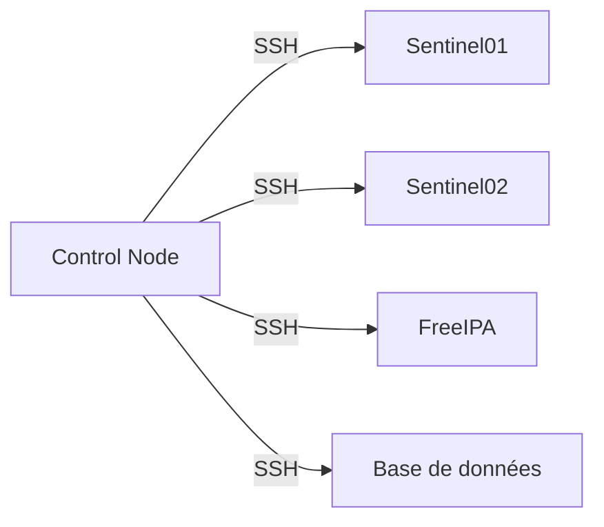
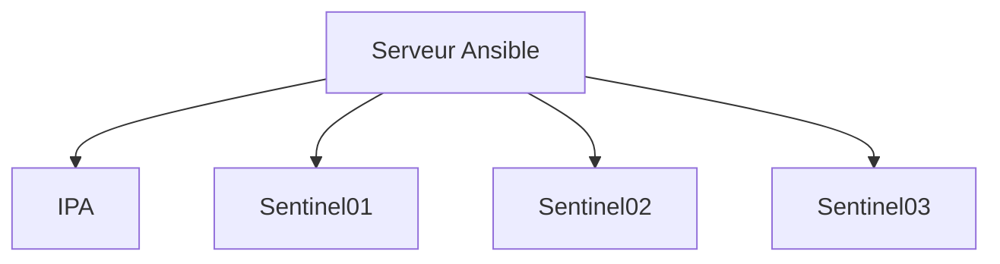
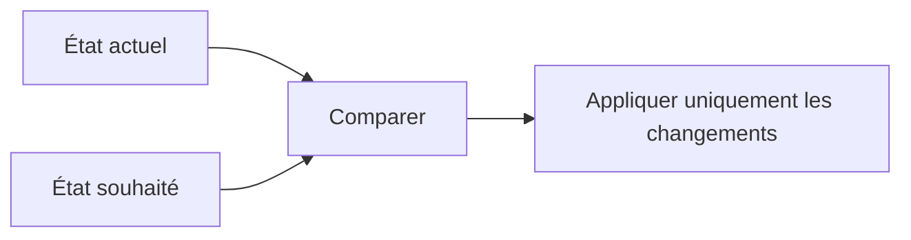
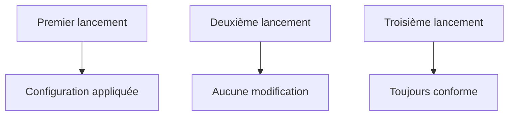
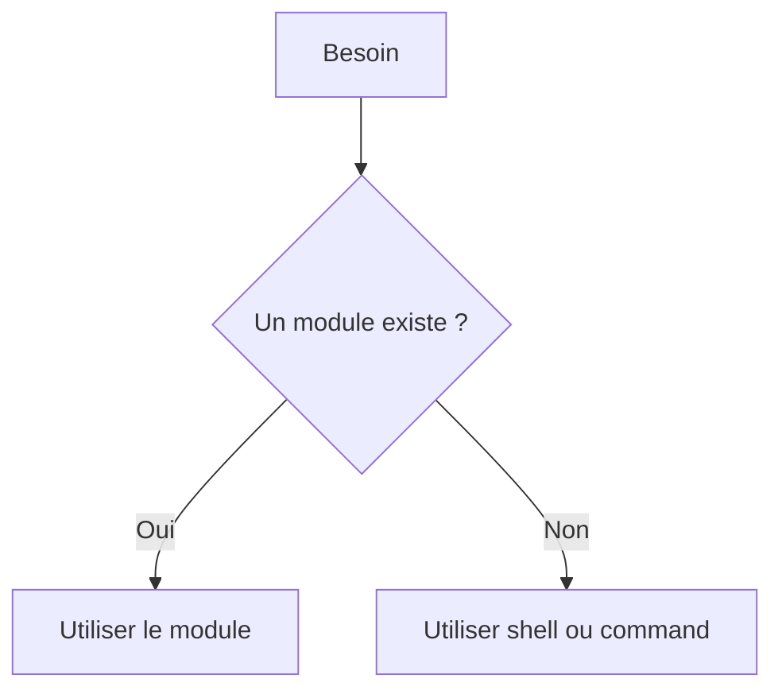
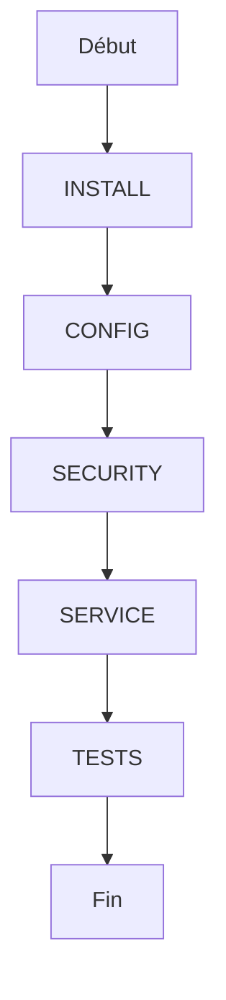

# Chapitre 9.2 — Comprendre l'architecture d'Ansible

> **Campagne 9 — Industrialisation avec Ansible**

## Vous êtes ici

```text
PARTIE II — Industrialiser la sécurité

Campagne 9

  9.1 Pourquoi automatiser avec Ansible ? ✔
► 9.2 Comprendre l'architecture d'Ansible
  9.3 Inventaires
  9.4 Premiers playbooks
  9.5 Variables et templates
  9.6 Les rôles Ansible
  9.7 Déployer Sentinel avec Ansible
  9.8 Intégrer Sentinel à FreeIPA
  9.9 Industrialiser le laboratoire
  9.10 Mission : déployer l'infrastructure Sentinel
```
---

## Objectifs pédagogiques

À la fin de ce chapitre, vous serez capable de :

- identifier le nœud de contrôle, les nœuds administrés, les inventaires et les modules ;
- identifier les décisions de sécurité associées ;
- appliquer ces principes au laboratoire Sentinel.

---

## Pourquoi ce chapitre existe

Ce chapitre fournit le modèle mental nécessaire pour comprendre comment Ansible transforme un état déclaré en opérations exécutées à distance sur les hôtes du laboratoire.

---

Avant d'écrire notre premier playbook, il est indispensable de comprendre l'architecture d'Ansible.

Contrairement à ce que l'on pourrait penser, elle est très simple.

On distingue essentiellement deux catégories de machines :

- le **nœud de contrôle** (*Control Node*) ;
- les **nœuds administrés** (*Managed Nodes*).



Toute l'intelligence d'Ansible réside sur le **Control Node**.

Les autres serveurs exécutent simplement les actions demandées.

## Le nœud de contrôle

Le **Control Node** est la machine depuis laquelle les playbooks sont exécutés.

Dans notre laboratoire, il pourra s'agir par exemple de :

```text
admin01.lab.sentinel.test
```

ou simplement de votre machine d'administration.

C'est sur cette machine que l'on retrouvera :

- Ansible ;
- les playbooks ;
- les rôles ;
- les inventaires ;
- les variables ;
- les clés SSH.

Il s'agit en quelque sorte du poste de pilotage de l'infrastructure.

---

## Les nœuds administrés

Les serveurs administrés ne connaissent pas Ansible.

Ils exécutent simplement les opérations qui leur sont demandées.

Dans notre laboratoire, il s'agira par exemple de :

```text
ipa01.lab.sentinel.test

sentinel01.lab.sentinel.test

sentinel02.lab.sentinel.test
```

Tous pourront être administrés depuis le même poste.



L'ajout d'un nouveau serveur ne nécessite donc pas d'installer un nouvel agent.

Il suffit qu'il soit joignable en SSH.

---

## Les modules

Ansible ne possède pas une seule commande capable de tout faire.

Il s'appuie sur des **modules**.

Chaque module réalise une tâche précise.

Quelques exemples :

| Module | Fonction |
|---------|----------|
| `dnf` | Installer des paquets |
| `service` | Gérer un service |
| `copy` | Copier un fichier |
| `template` | Déployer un modèle Jinja2 |
| `user` | Gérer les comptes locaux |
| `file` | Gérer les permissions et les répertoires |

Un playbook est essentiellement une succession d'appels à ces modules.

---

## Pourquoi des modules ?

Prenons un exemple simple.

Pour installer un paquet manuellement.

```bash
sudo dnf install nginx
```

Avec Ansible, nous n'allons pas exécuter cette commande.

Nous allons déclarer :

```yaml
- name: Installer nginx
  dnf:
    name: nginx
    state: present
```

Ce changement de philosophie est fondamental.

Nous ne décrivons plus **comment** installer le paquet.

Nous décrivons **l'état souhaité**.

Ansible choisit ensuite les actions nécessaires pour atteindre cet état.

C'est ce qu'on appelle une approche **déclarative**.

Dans la prochaine partie, nous verrons pourquoi cette approche permet à Ansible d'être **idempotent**, une propriété essentielle pour l'automatisation fiable des infrastructures.

## Déclaratif contre impératif

L'une des différences les plus importantes entre un script Shell et un playbook Ansible réside dans leur manière de décrire une action.

Un script Shell est **impératif**.

Il décrit précisément les opérations à effectuer.

Par exemple :

```bash
dnf install -y nginx

systemctl enable nginx

systemctl start nginx
```

Le script donne des ordres successifs.

---

## L'approche déclarative

Avec Ansible, nous exprimons un objectif.

Par exemple :

```yaml
- name: Installer nginx
  dnf:
    name: nginx
    state: present
```

Nous ne demandons pas :

> Exécute la commande `dnf install`.

Nous demandons :

> Le paquet **doit être installé**.

Si le paquet est déjà présent, Ansible ne fait rien.

Cette différence paraît subtile.

Elle change pourtant complètement la manière d'administrer une infrastructure.

---

## La notion d'état

Ansible travaille en permanence avec deux notions.

```text
État actuel

↓

État souhaité
```

Son travail consiste à réduire l'écart entre les deux.



Cette manière de raisonner est appelée **convergence**.

Chaque exécution rapproche la machine de l'état attendu.

---

## L'idempotence

Une conséquence directe de cette approche est l'**idempotence**.

Une tâche idempotente peut être exécutée plusieurs fois sans produire d'effets indésirables.

Prenons un exemple.

Le paquet `nginx` est déjà installé.

Le playbook est relancé.

Ansible constate que l'état attendu est déjà atteint.

Le résultat est :

```text
ok
```

Aucune modification n'est effectuée.

À l'inverse, si le paquet est absent.

Le résultat sera :

```text
changed
```

Le paquet sera installé.

Une exécution supplémentaire produira ensuite :

```text
ok
```

---

## Pourquoi est-ce si important ?

Dans une infrastructure de plusieurs centaines de serveurs, il est courant de relancer régulièrement les mêmes playbooks.

Sans idempotence, chaque exécution risquerait de :

- modifier inutilement les fichiers ;
- redémarrer les services ;
- créer des utilisateurs en double ;
- produire des effets imprévisibles.

Grâce à l'idempotence, il devient possible d'exécuter les playbooks aussi souvent que nécessaire.



Cette propriété est l'une des principales raisons pour lesquelles Ansible est devenu un outil de référence pour l'administration des infrastructures.

---

## Quand l'idempotence est-elle perdue ?

Tous les modules Ansible sont conçus pour être idempotents.

En revanche, certaines commandes Shell ne le sont pas.

Par exemple :

```yaml
- name: Ajouter une ligne
  shell: echo "test" >> fichier.txt
```

À chaque exécution, une nouvelle ligne sera ajoutée.

Le résultat sera différent.

L'idempotence est perdue.

C'est pourquoi, autant que possible, il est préférable d'utiliser les modules Ansible plutôt que les commandes Shell.

Nous verrons dans les prochains chapitres comment choisir le bon module pour chaque situation.

## Pourquoi éviter le module `shell` ?

Lorsque l'on débute avec Ansible, un réflexe fréquent consiste à reproduire les commandes que l'on tape habituellement dans un terminal.

Par exemple :

```yaml
- name: Installer nginx
  shell: dnf install -y nginx
```

Cette tâche fonctionne.

Mais elle ne profite pratiquement d'aucun des avantages d'Ansible.

---

## Les limites du module `shell`

Avec `shell`, Ansible ne comprend pas réellement ce que fait la commande.

Il sait seulement :

- qu'une commande a été exécutée ;
- son code de retour ;
- sa sortie standard ;
- sa sortie d'erreur.

Il ne sait pas répondre à des questions comme :

- Le paquet était-il déjà installé ?
- Le service était-il déjà démarré ?
- Fallait-il réellement effectuer une modification ?

Autrement dit, Ansible perd une partie de son intelligence.

---

## Le module spécialisé

Comparons maintenant avec le module `dnf`.

```yaml
- name: Installer nginx
  dnf:
    name: nginx
    state: present
```

Cette fois, le module connaît le fonctionnement de DNF.

Il est capable de :

- vérifier si le paquet est déjà installé ;
- déterminer si une action est nécessaire ;
- retourner un état fiable (`ok` ou `changed`) ;
- gérer correctement les erreurs.


Le résultat est beaucoup plus fiable qu'une simple commande Shell.

---

## Les modules sont des API

Une bonne manière de voir Ansible est de considérer les modules comme des API.

Le module `service` ne lance pas simplement :

```bash
systemctl start
```

Il dialogue avec le gestionnaire de services.

Le module `user` ne lance pas seulement :

```bash
useradd
```

Il manipule les comptes utilisateurs de manière structurée.

Le module `file` ne se contente pas d'exécuter :

```bash
chmod
```

Il vérifie également :

- les permissions ;
- le propriétaire ;
- le groupe ;
- le type de fichier.

Chaque module encapsule ainsi une logique métier.

---

## Quand utiliser `shell` ?

Faut-il alors bannir complètement `shell` ?

Non.

Certaines situations ne disposent pas encore d'un module dédié.

Par exemple :

- exécuter un outil interne à l'entreprise ;
- lancer un script spécifique ;
- utiliser une commande très particulière.

Dans ce cas, `shell` est parfaitement adapté.

En revanche, lorsqu'un module officiel existe, il est presque toujours préférable de l'utiliser.

---

## Une règle simple

Avec l'expérience, une règle pratique se dégage.



Cette règle améliore :

- la lisibilité des playbooks ;
- leur portabilité ;
- leur idempotence ;
- leur maintenance.

Elle sera appliquée tout au long de cette campagne lorsque nous construirons l'automatisation complète de Sentinel.

## Le premier principe d'un bon playbook

Lorsqu'un playbook devient volumineux, la tentation est grande d'y placer toutes les opérations.

Par exemple :

- installer les paquets ;
- créer les utilisateurs ;
- configurer SSH ;
- ouvrir le pare-feu ;
- copier les certificats ;
- déployer Sentinel.

Au bout de quelques semaines, le fichier devient difficile à comprendre.

Une bonne pratique consiste à appliquer le principe suivant.

> **Une tâche = une responsabilité.**

---

## Découper les tâches

Au lieu d'écrire un énorme bloc.

```text
Déployer Sentinel
```

Il est préférable de raisonner par étapes.


Chaque tâche poursuit un objectif précis.

Cette organisation facilite énormément la maintenance.

---

## Donner un nom explicite

Chaque tâche doit posséder un nom.

Par exemple :

```yaml
- name: Installer Sentinel
```

ou :

```yaml
- name: Créer le compte système Sentinel
```

Évitez les formulations trop vagues.

Par exemple :

```yaml
- name: Configuration
```

ou :

```yaml
- name: Divers
```

Le nom doit permettre de comprendre immédiatement ce que fait la tâche.

Lorsque le playbook contient plusieurs centaines de lignes, cette discipline devient indispensable.

---

## Une tâche doit être vérifiable

Une bonne tâche produit un résultat facilement observable.

Par exemple :

```yaml
- name: Installer le paquet Sentinel
```

peut être vérifiée avec :

```bash
rpm -q sentinel
```

Ou encore :

```yaml
- name: Activer le service Sentinel
```

peut être contrôlée par :

```bash
systemctl status sentinel
```

Chaque tâche devrait pouvoir être validée indépendamment des autres.

---

## Concevoir un playbook comme une procédure

Un playbook doit être lu comme une documentation technique.

Un administrateur doit pouvoir comprendre le déroulement simplement en lisant les noms des tâches.



Cette structure est bien plus lisible qu'un long script Shell mélangeant toutes les opérations.

---

## Synthèse

Lorsque vous écrivez un playbook, posez-vous toujours la question suivante.

> **Si une seule étape échoue, saurai-je immédiatement laquelle ?**

Si la réponse est non, votre playbook est probablement trop complexe.

## Pour aller plus loin

Le chapitre suivant construit l'inventaire qui indique à cette architecture quels hôtes administrer et comment les regrouper.

---

← [9.1 — Pourquoi automatiser avec Ansible ?](9.1-pourquoi-automatiser-avec-ansible.md) · [9.3 — Inventaires](9.3-inventaires.md) →
