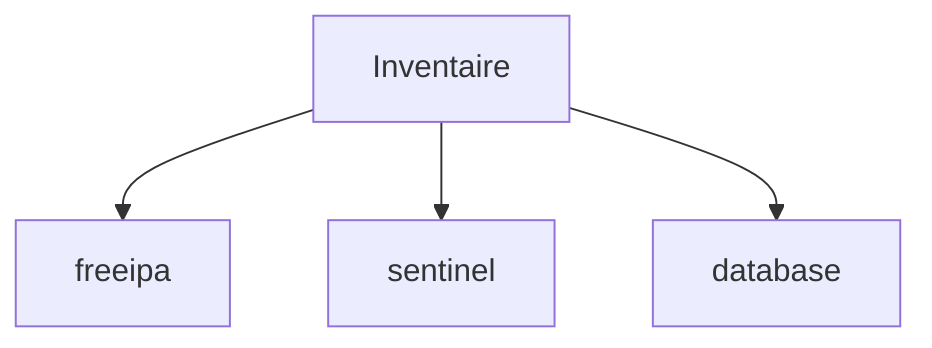
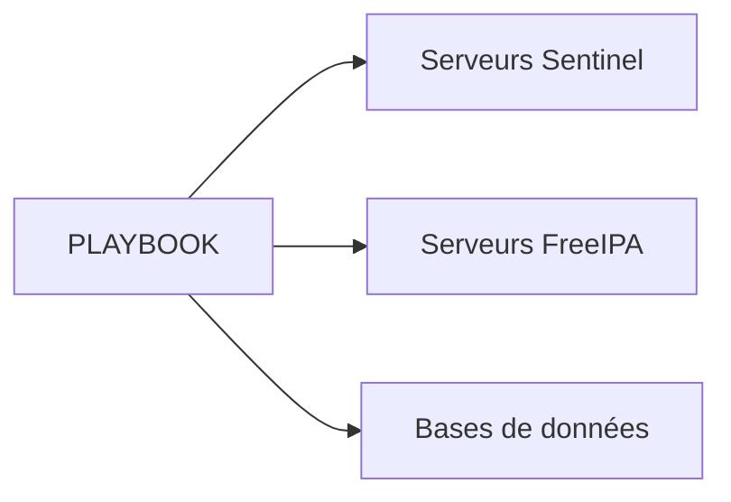
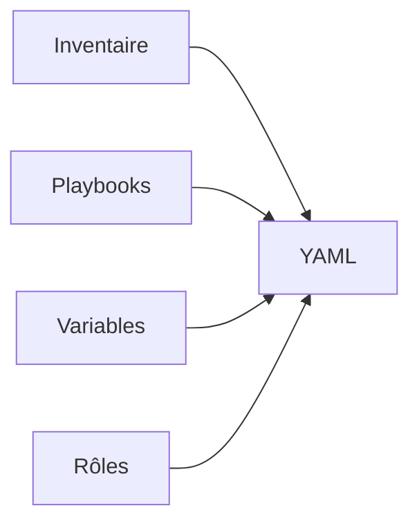
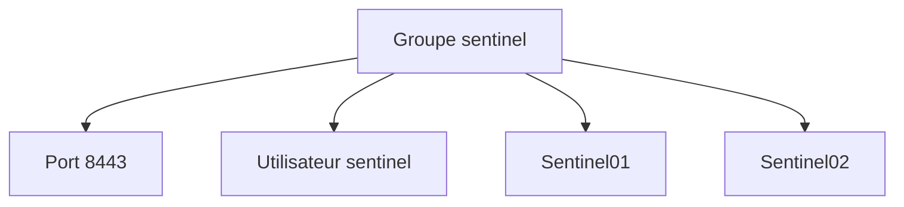
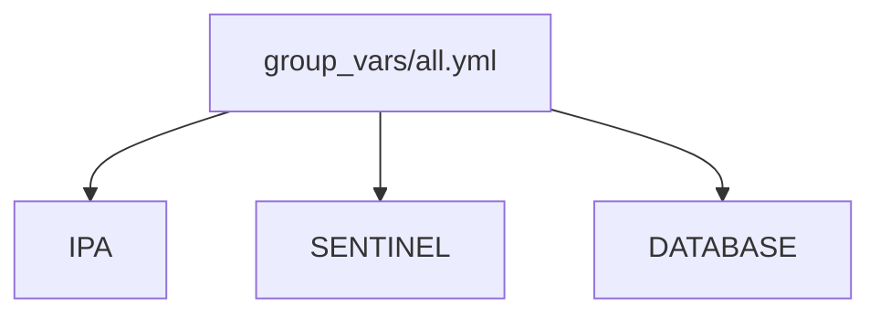
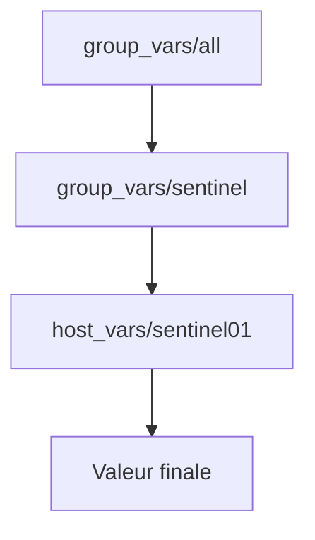

# Chapitre 9.3 — Inventaires

> **Campagne 9 — Industrialisation avec Ansible**

## Vous êtes ici

```text
PARTIE II — Industrialiser la sécurité

Campagne 9

  9.1 Pourquoi automatiser avec Ansible ? ✔
  9.2 Comprendre l'architecture d'Ansible ✔
► 9.3 Inventaires
  9.4 Premiers playbooks
  9.5 Variables et templates
  9.6 Les rôles Ansible
  9.7 Déployer Sentinel avec Ansible
  9.8 Intégrer Sentinel à FreeIPA
  9.9 Industrialiser le laboratoire
  9.10 Mission : déployer l'infrastructure Sentinel
```

---

## Objectifs pédagogiques

À la fin de ce chapitre, vous serez capable de :

- expliquer les notions essentielles liées à **Inventaires** ;
- identifier les décisions de sécurité associées ;
- appliquer ces principes au laboratoire Sentinel.

---

## Pourquoi ce chapitre existe

Ce chapitre fournit le modèle mental et les pratiques nécessaires pour aborder **Inventaires** dans un socle AlmaLinux sécurisé et reproductible.

---

Jusqu'à présent, nous avons répondu à une question.

> **Comment Ansible agit-il ?**

Il reste maintenant à répondre à une autre.

> **Sur quelles machines doit-il agir ?**

La réponse se trouve dans l'**inventaire** (*Inventory*).

## Qu'est-ce qu'un inventaire ?

L'inventaire est la liste des machines qu'Ansible peut administrer.

Dans sa forme la plus simple, il peut contenir :

```text
sentinel01.lab.sentinel.test

sentinel02.lab.sentinel.test

ipa01.lab.sentinel.test
```

Ansible utilisera cette liste pour savoir où exécuter les playbooks.

Sans inventaire, il ne sait pas quelles machines existent.

---

## Une première organisation

Très rapidement, il devient intéressant de regrouper les machines.

Par exemple :

```text
[freeipa]

ipa01.lab.sentinel.test

[sentinel]

sentinel01.lab.sentinel.test

sentinel02.lab.sentinel.test

[database]

db01.lab.sentinel.test
```

Chaque groupe représente un rôle dans l'infrastructure.



Cette organisation sera très utilisée dans les campagnes suivantes.

---

## Pourquoi créer des groupes ?

Imaginons le playbook suivant.

```text
Installer Sentinel
```

Il ne doit évidemment pas être exécuté sur :

```text
ipa01
```

Grâce aux groupes, il suffit de cibler :

```text
sentinel
```

Tous les serveurs Sentinel recevront automatiquement la configuration.

Les autres ne seront pas concernés.

Cette approche permet de réutiliser un même playbook sur des infrastructures de tailles très différentes.

---

## Les groupes représentent des rôles

Une erreur fréquente consiste à créer des groupes à partir de critères techniques.

Par exemple :

```text
serveur1

serveur2

serveur3
```

Ces noms n'apportent aucune information.

Préférez toujours des groupes représentant une fonction.

Par exemple :

```text
freeipa

sentinel

database

monitoring

backup
```

Le playbook devient alors beaucoup plus lisible.



Le nom du groupe décrit immédiatement son rôle dans l'architecture.

---

## Notre laboratoire

Tout au long de cette formation, nous utiliserons une organisation proche de celle-ci.

```text
all

├── freeipa

│     └── ipa01

├── sentinel

│     ├── sentinel01

│     └── sentinel02

└── admin

      └── admin01
```

Cette structure évoluera progressivement à mesure que notre laboratoire s'enrichira.

Elle servira de base à tous les playbooks développés dans les prochains chapitres.

Dans la prochaine partie, nous verrons les différents formats d'inventaire, et notamment pourquoi le format **YAML** est aujourd'hui largement préféré au format **INI** pour les infrastructures modernes.

## Les formats d'inventaire

Ansible accepte plusieurs formats d'inventaire.

Les deux plus courants sont :

- le format **INI** ;
- le format **YAML**.

Les deux décrivent les mêmes informations.

Ils diffèrent uniquement par leur syntaxe.

---

## Le format INI

Historiquement, Ansible utilisait principalement le format INI.

Par exemple :

```ini
[freeipa]
ipa01.lab.sentinel.test

[sentinel]
sentinel01.lab.sentinel.test
sentinel02.lab.sentinel.test

[admin]
admin01.lab.sentinel.test
```

Ce format est simple à lire.

Il reste très répandu dans les anciens projets.

En revanche, il devient rapidement limité lorsqu'il faut gérer de nombreuses variables.

---

## Le format YAML

Le format YAML est aujourd'hui recommandé pour les nouveaux projets.

Le même inventaire devient :

```yaml
all:
  children:

    freeipa:
      hosts:
        ipa01.lab.sentinel.test:

    sentinel:
      hosts:
        sentinel01.lab.sentinel.test:
        sentinel02.lab.sentinel.test:

    admin:
      hosts:
        admin01.lab.sentinel.test:
```

À première vue, il paraît plus verbeux.

En réalité, il devient beaucoup plus lisible dès que l'infrastructure grandit.

---

## Pourquoi préférer YAML ?

Le principal avantage est la cohérence.

Les playbooks Ansible sont déjà écrits en YAML.

Les variables également.

Les rôles utilisent eux aussi du YAML.

En utilisant un inventaire YAML, toute l'infrastructure repose sur le même langage.



Cette homogénéité facilite énormément la lecture et la maintenance.

---

## Les groupes imbriqués

Le format YAML permet également de construire des hiérarchies.

Par exemple :

```yaml
all:
  children:

    linux:
      children:

        freeipa:

        sentinel:

        database:
```

On obtient alors une organisation logique.

```text
all

└── linux

    ├── freeipa

    ├── sentinel

    └── database
```

Un playbook exécuté sur :

```text
linux
```

s'appliquera automatiquement à tous les serveurs Linux.

---

## Une bonne pratique

Évitez de créer des groupes uniquement parce qu'ils contiennent une seule machine.

Par exemple :

```text
serveur-web-1

serveur-web-2

serveur-web-3
```

Préférez :

```text
webservers
```

Même si ce groupe ne contient qu'un seul hôte aujourd'hui.

Votre inventaire doit représenter **les rôles de l'infrastructure**, pas son état actuel.

C'est cette vision qui permettra à votre architecture de grandir sans avoir à être entièrement réorganisée.

## Les variables d'inventaire

Un inventaire ne contient pas uniquement des noms de machines.

Il peut également contenir des **variables**.

Ces variables décrivent des informations propres :

- à un hôte ;
- à un groupe ;
- voire à l'ensemble de l'infrastructure.

Prenons un exemple simple.

```yaml
all:
  children:

    sentinel:
      hosts:

        sentinel01.lab.sentinel.test:
          ansible_host: 192.168.56.20

        sentinel02.lab.sentinel.test:
          ansible_host: 192.168.56.21
```

Ici :

- le nom de l'hôte reste son FQDN ;
- `ansible_host` indique l'adresse réellement utilisée par SSH.

---

## Pourquoi distinguer le nom et l'adresse ?

Cette distinction est très utile.

Imaginons que votre DNS ne soit pas encore disponible.

Vous pouvez écrire :

```yaml
hosts:

  sentinel01:
    ansible_host: 192.168.56.20
```

Le playbook utilisera l'adresse IP.

Plus tard, il suffira de modifier une seule variable.

Le reste des playbooks restera inchangé.

---

## Les variables de groupe

Les variables peuvent également être définies pour tout un groupe.

Par exemple :

```yaml
sentinel:

  vars:

    sentinel_port: 8443

    sentinel_user: sentinel

  hosts:

    sentinel01:

    sentinel02:
```

Les deux serveurs héritent automatiquement de ces valeurs.



Une modification du groupe est immédiatement appliquée à tous les serveurs concernés.

---

## Éviter les duplications

Imaginons que dix serveurs Sentinel utilisent tous le même port.

La mauvaise approche serait :

```yaml
sentinel01:
  sentinel_port: 8443

sentinel02:
  sentinel_port: 8443

sentinel03:
  sentinel_port: 8443
```

La bonne approche consiste à définir cette valeur une seule fois.

```yaml
sentinel:

  vars:

    sentinel_port: 8443
```

On applique ici un principe fondamental de l'ingénierie logicielle :

> **Ne pas se répéter** (*Don't Repeat Yourself* ou **DRY**).

Moins une information est dupliquée, moins elle risque de devenir incohérente.

---

## Les variables spécifiques à un hôte

Toutes les informations ne sont cependant pas communes.

Chaque serveur peut posséder :

- une adresse IP différente ;
- un nom DNS différent ;
- un certificat spécifique ;
- un volume de stockage particulier.

Ces informations restent naturellement définies au niveau de chaque hôte.

L'objectif est donc de placer chaque variable **au niveau le plus pertinent** :

- commune → groupe ;
- spécifique → hôte.

C'est cette organisation qui permettra de construire des playbooks simples, lisibles et facilement maintenables dans les chapitres suivants.

## Les fichiers `host_vars` et `group_vars`

Lorsque l'infrastructure grandit, placer toutes les variables dans le fichier d'inventaire devient rapidement peu pratique.

Ansible propose alors une organisation beaucoup plus élégante.

Les variables sont déplacées dans des répertoires dédiés.

```text
inventory/

├── hosts.yml

├── group_vars/

│   ├── all.yml

│   ├── sentinel.yml

│   └── freeipa.yml

└── host_vars/

    ├── sentinel01.yml

    ├── sentinel02.yml

    └── ipa01.yml
```

Cette structure est aujourd'hui la plus utilisée dans les projets professionnels.

---

## Les variables communes

Prenons un exemple.

Tous les serveurs Sentinel utilisent :

- le même utilisateur système ;
- le même répertoire d'installation ;
- le même port HTTPS.

Ces variables peuvent être placées dans :

```text
group_vars/sentinel.yml
```

Par exemple :

```yaml
sentinel_user: sentinel

sentinel_port: 8443

sentinel_install_dir: /opt/sentinel
```

Tous les hôtes appartenant au groupe `sentinel` hériteront automatiquement de ces valeurs.

---

## Les variables propres à un hôte

En revanche, chaque serveur possède une identité différente.

Par exemple :

```text
sentinel01

↓

192.168.56.20
```

```text
sentinel02

↓

192.168.56.21
```

Ces informations peuvent être placées dans :

```text
host_vars/sentinel01.yml
```

```yaml
sentinel_ip: 192.168.56.20

sentinel_dns: sentinel01.lab.sentinel.test
```

et :

```text
host_vars/sentinel02.yml
```

```yaml
sentinel_ip: 192.168.56.21

sentinel_dns: sentinel02.lab.sentinel.test
```

Chaque machine possède ainsi sa propre description.

---

## Les variables globales

Certaines informations concernent toute l'infrastructure.

Par exemple :

- le domaine FreeIPA ;
- le royaume Kerberos ;
- le serveur NTP ;
- le serveur DNS principal.

Ces variables peuvent être placées dans :

```text
group_vars/all.yml
```

```yaml
domain_name: lab.sentinel.test

kerberos_realm: LAB.SENTINEL.TEST

dns_server: ipa01.lab.sentinel.test

ntp_server: ipa01.lab.sentinel.test
```



Tous les groupes héritent automatiquement de ces variables.

---

## Pourquoi cette organisation est-elle importante ?

Cette séparation présente plusieurs avantages.

Une personne chargée du réseau peut modifier :

```text
group_vars/all.yml
```

sans risquer de modifier la configuration de Sentinel.

À l'inverse, un développeur travaillant sur Sentinel pourra intervenir dans :

```text
group_vars/sentinel.yml
```

sans toucher aux paramètres globaux de l'infrastructure.

Cette organisation facilite :

- la relecture ;
- la maintenance ;
- le travail en équipe ;
- la gestion des versions avec Git.

C'est cette structure que nous adopterons pour l'ensemble des playbooks développés dans cette formation.

## La priorité des variables

À ce stade, une question se pose naturellement.

Que se passe-t-il si une même variable est définie à plusieurs endroits ?

Par exemple.

Dans :

```text
group_vars/all.yml
```

```yaml
sentinel_port: 8443
```

Puis dans :

```text
group_vars/sentinel.yml
```

```yaml
sentinel_port: 9443
```

Quelle valeur sera utilisée ?

---

## Le principe de surcharge

Ansible applique un ordre de priorité.

La règle générale est simple.

> **La définition la plus spécifique l'emporte.**

Ainsi :

```text
group_vars/all.yml

↓

group_vars/sentinel.yml

↓

host_vars/sentinel01.yml
```

Chaque niveau peut remplacer le précédent.



Cette hiérarchie permet de définir un comportement commun tout en autorisant des exceptions.

---

## Un exemple concret

Imaginons que tous les serveurs Sentinel utilisent le port HTTPS :

```yaml
sentinel_port: 8443
```

Mais qu'un serveur particulier doive utiliser :

```yaml
sentinel_port: 9443
```

Il suffit alors de définir cette variable dans :

```text
host_vars/sentinel02.yml
```

```yaml
sentinel_port: 9443
```

Le reste de l'infrastructure continuera d'utiliser :

```text
8443
```

sans aucune modification supplémentaire.

---

## Une bonne pratique

Cette possibilité est très pratique.

Elle doit cependant rester exceptionnelle.

Si chaque serveur possède ses propres valeurs, les playbooks deviennent rapidement difficiles à comprendre.

Il est préférable de :

- mutualiser tout ce qui peut l'être ;
- réserver les variables spécifiques aux véritables exceptions.

Autrement dit :

> **Cherchez d'abord ce qui est commun avant de gérer ce qui est différent.**

---

## Une architecture évolutive

En suivant cette organisation, notre laboratoire pourra évoluer très facilement.

```text
group_vars/

    all.yml

    freeipa.yml

    sentinel.yml

host_vars/

    sentinel01.yml

    sentinel02.yml

    sentinel03.yml

    ipa01.yml
```

L'ajout d'un nouveau serveur nécessitera généralement :

1. une entrée dans l'inventaire ;
2. éventuellement un fichier dans `host_vars`.

Les playbooks, eux, resteront inchangés.

C'est précisément ce qui permet à une infrastructure Ansible de passer de quelques serveurs à plusieurs centaines sans réécriture complète des automatisations.

## Synthèse

Le chapitre **Inventaires** établit une brique du socle de sécurité Sentinel.

Avant de poursuivre, vérifiez que vous savez :

- expliquer le rôle des mécanismes présentés ;
- distinguer leur configuration de leur état réellement observé ;
- valider leur comportement dans le laboratoire ;
- conserver une configuration explicite, vérifiable et reproductible.

## Pour aller plus loin

Le chapitre suivant utilise cet inventaire pour cibler et exécuter un premier playbook Ansible.

---

← [9.2 — Comprendre l'architecture d'Ansible](9.2-comprendre-architecture-ansible.md) · [9.4 — Premiers playbooks](9.4-premiers-playbooks.md) →
