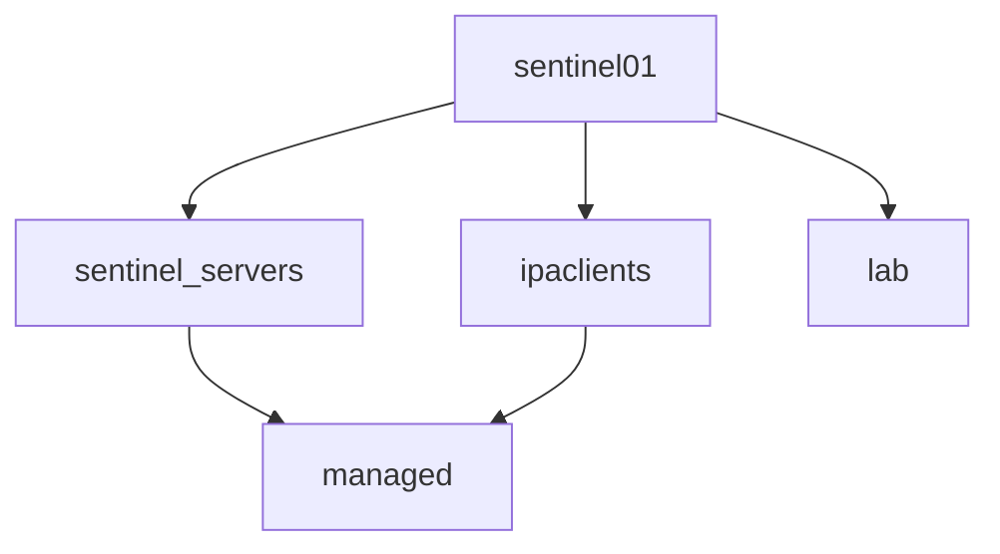
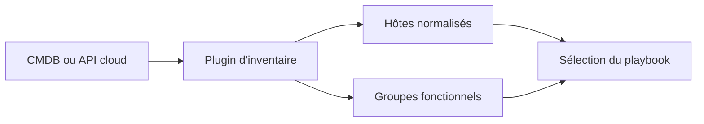

# Chapitre 9.3 — Construire les inventaires Ansible

> **Campagne 9 — Déploiement avec Ansible**
>
> *« Un inventaire utile ne dresse pas seulement une liste : il exprime les fonctions et les frontières de déploiement. »*

## Vous êtes ici

```text
Partie II — Industrialiser la sécurité

Campagne 9 — Déploiement avec Ansible

      9.1 Architecture Ansible
      9.2 Composants et idempotence
    ► 9.3 Inventaires
      9.4 Premiers playbooks
      9.5 Variables et templates
      9.6 Rôles Ansible
      9.7 Déploiement de Sentinel
      9.8 Intégration à FreeIPA
      9.9 Industrialisation du projet
      9.10 Mission de déploiement
```

## Objectifs pédagogiques

À la fin de ce chapitre, vous serez capable de :

- représenter des hôtes et groupes en inventaire YAML ;
- distinguer nom d'inventaire, FQDN et adresse de connexion ;
- organiser `group_vars` et `host_vars` ;
- cibler un sous-ensemble avec des motifs et `--limit` ;
- vérifier l'inventaire résolu avant toute modification.

## Pourquoi ce chapitre existe

Une automatisation correcte appliquée au mauvais hôte reste un incident. L'inventaire établit la carte utilisée par Ansible : identités des machines, fonctions, environnements et paramètres de connexion.

Il ne doit pas reproduire toutes les données d'une CMDB ni devenir un coffre de secrets. Il contient les informations nécessaires pour sélectionner et configurer les cibles.

## Hôte, alias et adresse

Dans un inventaire :

```yaml
sentinel01.sentinel.example.test:
  ansible_host: 192.0.2.20
```

`sentinel01.sentinel.example.test` est le nom de l'hôte pour Ansible. `ansible_host` est l'adresse utilisée pour la connexion. Cette séparation permet de conserver un identifiant stable tout en adaptant un réseau de laboratoire.

Dans notre architecture, le FQDN est également important pour DNS, Kerberos et TLS. Utiliser un alias arbitraire comme `srv1` masque ces relations ; le FQDN constitue donc le nom d'inventaire privilégié.

## Construire des groupes fonctionnels

Un hôte peut appartenir à plusieurs groupes. La machine `sentinel01` est à la fois :

- un serveur Sentinel ;
- un client FreeIPA ;
- un système de l'environnement de laboratoire.



Les groupes décrivent une fonction ou un périmètre. Évitez les catégories éphémères comme `serveurs_a_corriger_mardi` : utilisez un `--limit`, une variable explicite ou un système de suivi pour l'opération temporaire.

## L'inventaire YAML du laboratoire

Le projet de référence utilise :

```yaml
---
all:
  children:
    ipa_servers:
      hosts:
        ipa01.sentinel.example.test:
          ansible_host: 192.0.2.10

    sentinel_servers:
      hosts:
        sentinel01.sentinel.example.test:
          ansible_host: 192.0.2.20

    sentinel_agents:
      hosts:
        agent01.sentinel.example.test:
          ansible_host: 192.0.2.30

    ipaclients:
      children:
        sentinel_servers: {}
        sentinel_agents: {}
```

Le groupe `ipaclients` réutilise deux groupes enfants au lieu de recopier leurs hôtes. Ajouter `agent02` à `sentinel_agents` l'intègre alors naturellement au périmètre des clients IdM.

Ansible accepte aussi le format INI. YAML devient intéressant ici parce que la hiérarchie, les listes et les types booléens restent visibles. Le bon choix demeure celui que l'équipe relit correctement et valide automatiquement.

## Variables communes et exceptions

L'arborescence sépare les valeurs par périmètre :

```text
inventories/lab/
├── hosts.yml
├── group_vars/
│   ├── all.yml
│   ├── ipaclients.yml
│   └── sentinel_servers.yml
└── host_vars/
    └── sentinel01.sentinel.example.test.yml
```

Dans `group_vars/all.yml` :

```yaml
---
ansible_user: ansible
ansible_become: true
ansible_python_interpreter: /usr/bin/python3
```

Dans `group_vars/sentinel_servers.yml` :

```yaml
---
sentinel_version: "0.6.0"
sentinel_listen_port: 8443
sentinel_service_user: sentinel
```

Les variables d'hôte servent aux véritables exceptions, par exemple une interface ou une adresse particulière. Si chaque hôte possède un grand fichier différent, l'automatisation reproduit probablement une dérive au lieu de définir un standard.

## Comprendre la précédence sans en abuser

Une variable peut être définie à plusieurs niveaux. Ansible applique des règles de précédence ; les variables passées avec `--extra-vars` figurent notamment parmi les plus prioritaires.

Cette puissance ne doit pas devenir une méthode de configuration quotidienne :

```bash
ansible-playbook site.yml -e sentinel_port=9999
```

Cette commande peut masquer la valeur versionnée et rendre le déploiement impossible à reproduire. Utilisez `--extra-vars` pour des entrées volontairement externes et tracées, pas pour corriger discrètement un inventaire.

Pour comprendre la valeur finale :

```bash
ansible-inventory --host sentinel01.sentinel.example.test
```

La documentation officielle distingue la précédence des mots-clés, options de configuration, variables et options de ligne de commande. Retenez surtout qu'une valeur finale doit pouvoir être expliquée par un lecteur du projet.

## Sélectionner sans se tromper

Les **patterns** ciblent des groupes et leurs combinaisons :

```bash
ansible sentinel_servers --list-hosts
ansible 'ipaclients:&sentinel_servers' --list-hosts
ansible 'all:!ipa_servers' --list-hosts
```

- `:` forme une union ou une exclusion selon le préfixe ;
- `&` demande une intersection ;
- `!` exclut un ensemble.

Avant une action sensible, utilisez `--list-hosts`, puis un `--limit` explicite :

```bash
ansible-playbook playbooks/deploy-sentinel.yml \
  --limit sentinel01.sentinel.example.test \
  --list-hosts
```

`--limit` réduit le périmètre du playbook ; il n'ajoute pas un hôte absent de son motif `hosts`.

⚠️ **Piège classique** — exécuter `hosts: all` puis compter sur la mémoire de l'opérateur pour ajouter `--limit`. Le périmètre sûr doit d'abord être exprimé dans le playbook ; la limite sert de réduction supplémentaire.

## Inventaire statique et inventaire dynamique

Un petit laboratoire se décrit bien dans Git. Dans un cloud ou un grand parc, un plugin d'inventaire peut interroger une source d'autorité et construire les groupes à partir de métadonnées.



Dynamique ne signifie pas imprévisible. Épinglez le plugin, filtrez les états acceptés, définissez les règles de groupes et archivez une représentation expurgée pour diagnostiquer un déploiement.

## Les secrets n'appartiennent pas à l'inventaire en clair

Une adresse, un port ou un nom de groupe peut être versionné. Un mot de passe FreeIPA, une clé privée ou un mot de passe `become` ne doit pas apparaître en clair dans `hosts.yml` ou `group_vars`.

Le chapitre 9.9 utilisera Ansible Vault et un mécanisme externe pour fournir les secrets. Le chiffrement d'un fichier réduit le risque de lecture accidentelle ; il ne supprime ni le contrôle des accès, ni la rotation, ni le risque pendant le déchiffrement.

## Laboratoire — inspecter avant d'agir

Depuis `sentinel/labs/ansible/` :

```bash
ansible-inventory --graph
ansible-inventory --list
ansible-inventory --host sentinel01.sentinel.example.test
ansible sentinel_servers --list-hosts
ansible ipaclients -m ansible.builtin.ping
```

Produisez un tableau de preuve :

| Contrôle | Attendu |
|---|---|
| `--graph` | hiérarchie et groupes enfants corrects |
| `--host` | variables résolues sans secret en clair |
| `--list-hosts` | uniquement le périmètre annoncé |
| `ping` | connexion et Python fonctionnels |

Ajoutez temporairement un nom inexistant à `sentinel_agents`. Observez `unreachable`, puis retirez l'entrée. Ne contournez pas l'échec avec `ignore_unreachable` : l'exercice doit montrer que l'inventaire est une dépendance vérifiée.

## Impact sur Sentinel

Sentinel n'est pas encore déployé. Son périmètre est maintenant stable : `sentinel_servers` recevra l'application ; `ipaclients` recevra l'intégration FreeIPA ; `sentinel_agents` servira aux vérifications mTLS.

## Synthèse

- l'inventaire associe des identités d'hôtes, des groupes et des paramètres de connexion ;
- le FQDN relie clairement Ansible, DNS, Kerberos et TLS ;
- les groupes décrivent des fonctions et peuvent être imbriqués ;
- `group_vars` porte le standard, `host_vars` les exceptions justifiées ;
- les patterns et `--limit` doivent être inspectés avant une action ;
- les secrets ne sont pas stockés en clair dans l'inventaire ;
- `ansible-inventory` permet de relire la vérité résolue par le moteur.

## Infographie de révision

```text
INVENTAIRE
  FQDN · adresse · groupes
        ↓
VARIABLES
  all · fonction · exception
        ↓
SÉLECTION
  pattern · intersection · limit
        ↓
CONTRÔLE
  graph · host · list-hosts · ping
```

## Pour aller plus loin

Les cibles sont connues. Le chapitre suivant assemble tâches, handlers, conditions et contrôles dans les premiers playbooks structurés.

[Continuer vers le chapitre 9.4 — Premiers playbooks](9.4-premiers-playbooks.md)

Références : [How to build your inventory](https://docs.ansible.com/ansible/latest/inventory_guide/intro_inventory.html), [Patterns: targeting hosts and groups](https://docs.ansible.com/ansible/latest/inventory_guide/intro_patterns.html) et [Controlling how Ansible behaves: precedence rules](https://docs.ansible.com/ansible/latest/reference_appendices/general_precedence.html).
