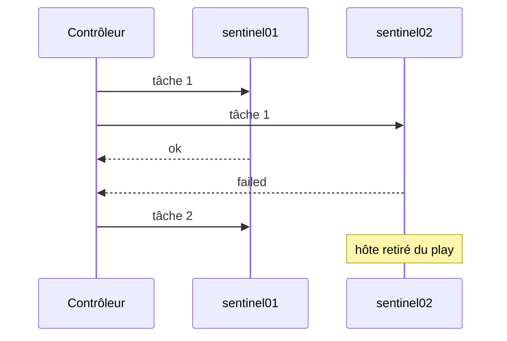

# Chapitre 9.4 — Écrire les premiers playbooks

> **Campagne 9 — Déploiement avec Ansible**
>
> *« Un playbook est une procédure exécutable dont le périmètre, les décisions et les preuves sont relisibles. »*

## Vous êtes ici

```text
Partie II — Industrialiser la sécurité

Campagne 9 — Déploiement avec Ansible

      9.1 Architecture Ansible
      9.2 Composants et idempotence
      9.3 Inventaires
    ► 9.4 Premiers playbooks
      9.5 Variables et templates
      9.6 Rôles Ansible
      9.7 Déploiement de Sentinel
      9.8 Intégration à FreeIPA
      9.9 Industrialisation du projet
      9.10 Mission de déploiement
```

## Objectifs pédagogiques

À la fin de ce chapitre, vous serez capable de :

- structurer un play et ses tâches ;
- utiliser privilèges, conditions, handlers et tags ;
- enregistrer puis interpréter un résultat ;
- contrôler l'échec avec `block`, `rescue` et `always` ;
- limiter le risque d'un déploiement multi-hôte.

## Pourquoi ce chapitre existe

Les commandes *ad hoc* sont utiles pour observer ou intervenir ponctuellement. Elles ne suffisent pas à expliquer l'ordre, les conditions, les notifications et les validations d'un déploiement Sentinel.

Un playbook versionne cette orchestration. Il peut être relu avant exécution, testé en mode check et rejoué par un autre administrateur.

## Anatomie d'un play

```yaml
---
- name: Préparer les serveurs Sentinel
  hosts: sentinel_servers
  become: true
  gather_facts: true

  tasks:
    - name: Installer Python
      ansible.builtin.package:
        name: python3
        state: present
```

Un **play** associe :

- un ensemble d'hôtes ;
- des variables et paramètres d'exécution ;
- une liste ordonnée de tâches ;
- éventuellement des handlers, rôles ou stratégies.

Un fichier peut contenir plusieurs plays. Gardez toutefois une intention claire : préparer les clients IdM, déployer Sentinel puis vérifier ne sont pas nécessairement la même responsabilité.

## YAML : indentation et types

YAML représente listes et dictionnaires. Ici, le playbook est une liste de plays, et `tasks` une liste de tâches.

```yaml
sentinel_allowed_dns_names:
  - healthcheck.sentinel.example.test
  - agent01.sentinel.example.test

sentinel_tls_enabled: true
sentinel_listen_port: 8443
```

`true` est un booléen et `8443` un entier. Les chaînes qui ressemblent à des versions doivent être citées : `"0.6.0"`. Une indentation valide peut encore exprimer une structure incorrecte ; utilisez un linter et relisez les types.

## Ordre, parallélisme et portée d'un échec

Les tâches sont parcourues dans l'ordre. Par défaut, Ansible avance sur plusieurs hôtes selon sa stratégie et son nombre de *forks*. Si une tâche échoue sur `sentinel02`, cet hôte sort normalement du play tandis que les autres peuvent continuer.



Ce comportement évite qu'une panne locale bloque systématiquement tout le parc, mais il peut créer une version partiellement déployée. Pour une mise à jour contrôlée :

```yaml
- name: Mettre à jour Sentinel par lot
  hosts: sentinel_servers
  serial: 1
  max_fail_percentage: 0
```

`serial: 1` traite un hôte à la fois. Ce n'est pas une haute disponibilité automatique : les contrôles fonctionnels et la capacité restante doivent être conçus.

## Élévation avec `become`

Placez `become: true` au niveau du play lorsque la majorité des tâches le nécessite. Une tâche d'observation peut le désactiver localement.

Ansible ne contourne pas `sudo`. Le compte distant doit recevoir exactement les droits nécessaires. Un playbook qui fonctionne seulement avec `NOPASSWD: ALL` révèle une politique trop large ou une séparation de tâches insuffisante.

## Faits et conditions

Lorsque `gather_facts` est actif, Ansible collecte des informations avant les tâches. Elles permettent d'expliquer une décision :

```yaml
- name: Installer le paquet de politique SELinux
  ansible.builtin.package:
    name: policycoreutils-python-utils
    state: present
  when:
    - ansible_facts.os_family == "RedHat"
    - ansible_facts.selinux.status == "enabled"
```

Une condition ne doit pas cacher un périmètre incohérent. Si le rôle supporte uniquement AlmaLinux 9, une assertion explicite est préférable à des dizaines de tâches silencieusement ignorées.

## Enregistrer et exploiter un résultat

```yaml
- name: Lire la version déployée
  ansible.builtin.command:
    argv:
      - /usr/bin/python3
      - /opt/sentinel/src/sentinel.py
      - --version
  register: sentinel_version_output
  changed_when: false

- name: Vérifier la version attendue
  ansible.builtin.assert:
    that:
      - sentinel_version in sentinel_version_output.stdout
    fail_msg: >-
      Version attendue {{ sentinel_version }},
      sortie reçue {{ sentinel_version_output.stdout }}.
```

`register` crée une variable pour l'hôte courant. Elle n'est pas une base durable et disparaît après l'exécution. Utilisez-la pour décider ou prouver, pas pour inventer un état parallèle.

## Les handlers : agir seulement après un changement

Un handler est une tâche déclenchée par `notify`. Il s'exécute généralement à la fin du bloc de tâches du play et une seule fois, même si plusieurs tâches le notifient.

```yaml
tasks:
  - name: Déployer la configuration Sentinel
    ansible.builtin.template:
      src: sentinel.conf.j2
      dest: /etc/sentinel/sentinel.conf
      owner: root
      group: sentinel
      mode: "0640"
    notify: Redémarrer Sentinel

handlers:
  - name: Redémarrer Sentinel
    ansible.builtin.systemd_service:
      name: sentinel.service
      state: restarted
```

Le template notifie uniquement si son contenu ou ses métadonnées changent. Un redémarrage inconditionnel à chaque passage détruirait l'idempotence et la disponibilité.

Un handler n'est pas appelé si une tâche ultérieure échoue avant la phase des handlers. `meta: flush_handlers` peut forcer un point d'application, mais son emplacement doit correspondre à une frontière cohérente et validée.

## Blocs, secours et nettoyage

Les blocs regroupent des tâches et partagent des directives :

```yaml
- name: Déployer puis vérifier Sentinel
  block:
    - name: Appliquer le rôle Sentinel
      ansible.builtin.include_role:
        name: sentinel

    - name: Vérifier la disponibilité
      ansible.builtin.command:
        argv:
          - /usr/bin/python3
          - /opt/sentinel/src/sentinel.py
          - --config
          - /etc/sentinel/sentinel.conf
          - --healthcheck
      changed_when: false

  rescue:
    - name: Collecter le statut du service
      ansible.builtin.command: systemctl status sentinel.service --no-pager
      register: failed_service
      changed_when: false
      failed_when: false

  always:
    - name: Afficher l'hôte traité
      ansible.builtin.debug:
        msg: "Fin du scénario sur {{ inventory_hostname }}"
```

`rescue` sert ici à collecter un diagnostic, pas à déclarer artificiellement le déploiement réussi. Après le secours, utilisez une tâche qui fait échouer clairement le scénario ou laissez le statut refléter le résultat attendu.

⚠️ **Piège classique** — placer `ignore_errors: true` sur une installation pour « finir le playbook ». Les tâches suivantes travaillent alors sur un état inconnu et le récapitulatif devient trompeur.

## Tags et exécution partielle

Les tags aident à sélectionner des étapes :

```yaml
- name: Vérifier Sentinel
  ansible.builtin.import_tasks: verify.yml
  tags:
    - verify
```

```bash
ansible-playbook playbooks/deploy-sentinel.yml --tags verify
ansible-playbook playbooks/deploy-sentinel.yml --list-tags
```

Une exécution partielle doit rester cohérente. Taguer chaque tâche différemment permet des combinaisons que personne ne teste. Préférez quelques frontières : `install`, `configure`, `verify`.

## Commandes ad hoc et playbooks

Une commande ad hoc est adaptée à une question :

```bash
ansible sentinel_servers -m ansible.builtin.setup \
  -a 'filter=ansible_distribution*'
ansible sentinel_servers -m ansible.builtin.command \
  -a 'systemctl is-active sentinel.service'
```

Si l'opération doit être rejouée, revue, ordonnée ou testée, elle appartient à un playbook ou à un rôle.

## Laboratoire — préparer, vérifier, provoquer un refus

Écrivez `playbooks/prepare.yml` avec trois tâches :

1. assertion de la famille `RedHat` ;
2. installation de Python ;
3. création du compte système `sentinel`.

Puis exécutez :

```bash
ansible-playbook playbooks/prepare.yml --syntax-check
ansible-playbook playbooks/prepare.yml --check --diff
ansible-playbook playbooks/prepare.yml --limit sentinel01.sentinel.example.test
ansible-playbook playbooks/prepare.yml
ansible-playbook playbooks/prepare.yml
```

Échec attendu : remplacez temporairement la distribution admise dans l'assertion. Le playbook doit s'arrêter avec un message utile avant toute modification. Restaurez ensuite la condition correcte.

## Impact sur Sentinel

Le parcours complet prend forme : préparer, configurer, notifier puis vérifier. Le chapitre 9.7 l'appliquera à Sentinel `0.6.0` avec un rôle réutilisable et un test fonctionnel, pas seulement un processus `active`.

## Synthèse

- un play définit un périmètre, des privilèges et une orchestration ;
- les tâches s'ordonnent tandis que plusieurs hôtes peuvent avancer en parallèle ;
- `serial` réduit le lot mais ne remplace pas la conception de disponibilité ;
- les handlers réagissent aux vrais changements ;
- faits, conditions, résultats enregistrés et assertions rendent les décisions visibles ;
- `rescue` collecte ou corrige, il ne doit pas masquer une panne ;
- tags et commandes ad hoc restent des outils de sélection, pas une procédure parallèle.

## Infographie de révision

```text
PLAY
  hosts · become · facts · serial
       ↓
TÂCHES
  ordre · when · register · assert
       ↓
CHANGEMENTS
  notify → handler
       ↓
INCIDENT
  failed → rescue → preuve
```

## Pour aller plus loin

Les playbooks savent orchestrer. Il faut maintenant séparer les données du comportement et produire des fichiers adaptés à chaque environnement sans copier leur contenu.

[Continuer vers le chapitre 9.5 — Variables et templates](9.5-variables-templates.md)

Références : [Ansible playbooks](https://docs.ansible.com/ansible/latest/playbook_guide/playbooks_intro.html), [Handlers](https://docs.ansible.com/ansible/latest/playbook_guide/playbooks_handlers.html), [Blocks](https://docs.ansible.com/ansible/latest/playbook_guide/playbooks_blocks.html) et [Tags](https://docs.ansible.com/ansible/latest/playbook_guide/playbooks_tags.html).
