# Chapitre 9.5 — Variables et templates

> **Campagne 9 — Industrialisation avec Ansible**

> *« Les variables décrivent les différences entre les serveurs. Les templates transforment ces différences en fichiers de configuration. »*

---

## Vous êtes ici

```text
PARTIE II — Industrialiser la sécurité

Campagne 9

  9.1 Pourquoi automatiser avec Ansible ? ✔
  9.2 Comprendre l'architecture d'Ansible ✔
  9.3 Inventaires ✔
  9.4 Premiers playbooks ✔
► 9.5 Variables et templates
  9.6 Les rôles Ansible
  9.7 Déployer Sentinel avec Ansible
  9.8 Intégrer Sentinel à FreeIPA
  9.9 Industrialiser le laboratoire
  9.10 Mission : déployer l'infrastructure Sentinel
```

---

## Objectifs pédagogiques

À la fin de ce chapitre, vous serez capable de :

- comprendre le rôle des templates ;
- utiliser des variables dans un fichier de configuration ;
- générer automatiquement des fichiers adaptés à chaque serveur ;
- éviter la duplication des fichiers de configuration.

---

## Pourquoi ce chapitre existe

Ce chapitre fournit le modèle mental et les pratiques nécessaires pour aborder **Variables et templates** dans un socle AlmaLinux sécurisé et reproductible.

---

## Pourquoi utiliser un template ?

Imaginons que nous possédions deux serveurs Sentinel.

Le premier écoute sur :

```text
8443
```

Le second sur :

```text
9443
```

Si nous utilisons deux fichiers de configuration distincts.

```text
sentinel01.yml

sentinel02.yml
```

Ils seront presque identiques.

Une seule ligne changera.

Cette duplication est inutile.

---

## Une meilleure approche

Nous allons créer un seul fichier.

Il contiendra des variables.

Par exemple.

```yaml
server:

  port: {{ sentinel_port }}

tls:

  certificate: {{ sentinel_certificate }}

  private_key: {{ sentinel_private_key }}
```

Les parties entre :

```text
{{ ... }}
```

seront remplacées automatiquement lors du déploiement.

---

## Le moteur Jinja2

Les templates Ansible utilisent le moteur :

```text
Jinja2
```

Il s'agit d'un moteur de génération de texte.

Son fonctionnement est simple.

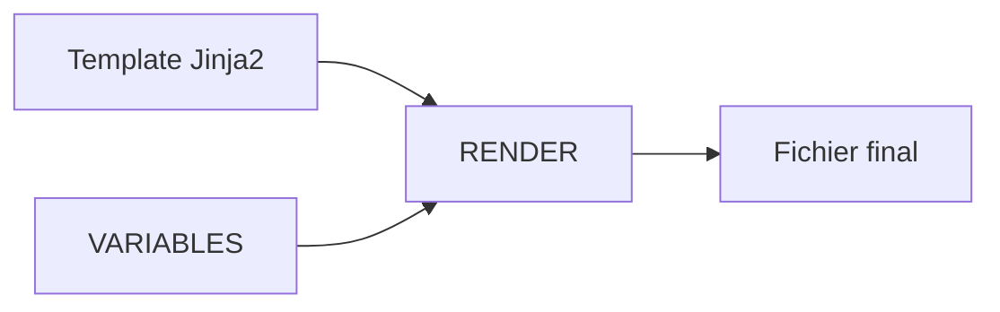

Le template contient des emplacements réservés.

Les variables viennent les remplir.

---

## Un premier exemple

Supposons :

```yaml
sentinel_port: 8443
```

Le template contient :

```yaml
port: {{ sentinel_port }}
```

Le fichier réellement copié sur le serveur devient :

```yaml
port: 8443
```

Le template reste inchangé.

Seule la variable change.

---

## Pourquoi est-ce si puissant ?

Imaginons maintenant cinquante serveurs.

Chaque machine possède :

- son nom DNS ;
- son certificat ;
- son adresse IP ;
- son port HTTPS.

Sans template.

Il faudrait maintenir cinquante fichiers.

Avec un template.

Un seul fichier suffit.

Les variables adaptent automatiquement son contenu à chaque serveur.

C'est cette capacité qui rend Ansible particulièrement adapté aux grandes infrastructures.

## Le module `template`

Créer un template ne suffit pas.

Il faut également le déployer sur les serveurs.

Pour cela, Ansible fournit le module :

```text
template
```

Sa syntaxe est très proche de celle du module `copy`.

Prenons un exemple.

```yaml
- name: Déployer la configuration Sentinel

  template:
    src: sentinel.yml.j2
    dest: /etc/sentinel/sentinel.yml
```

Le fichier :

```text
sentinel.yml.j2
```

est lu sur le nœud de contrôle.

Les variables sont remplacées.

Puis le fichier final est copié sur le serveur distant.

---

## Pourquoi l'extension `.j2` ?

Par convention, les templates utilisent l'extension :

```text
.j2
```

Par exemple.

```text
sentinel.yml.j2

sshd_config.j2

nginx.conf.j2
```

Cette extension n'est pas obligatoire.

Mais elle permet d'identifier immédiatement un fichier Jinja2.

Dans la quasi-totalité des projets professionnels, cette convention est respectée.

---

## Le cycle de génération

Le fonctionnement peut être représenté ainsi.

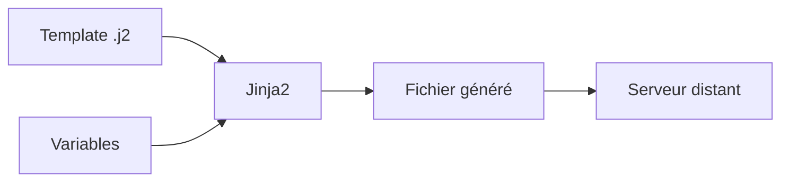

Le serveur distant ne reçoit jamais le template.

Il reçoit uniquement le fichier final.

Cette distinction est importante.

Jinja2 est exécuté sur le **Control Node**, pas sur le serveur administré.

---

## Déploiement intelligent

Le module `template` possède une propriété très intéressante.

Avant de remplacer un fichier.

Il compare le contenu généré avec le fichier déjà présent.

Si les deux sont identiques.

Le résultat est :

```text
ok
```

Aucune écriture n'est réalisée.

Si le contenu diffère.

Le résultat devient :

```text
changed
```

Le fichier est remplacé.

Cette optimisation participe directement à l'idempotence d'Ansible.

---

## Association avec un handler

Le cas le plus courant consiste à associer un template à un handler.

```yaml
- name: Déployer Sentinel

  template:
    src: sentinel.yml.j2
    dest: /etc/sentinel/sentinel.yml

  notify:

    - Restart Sentinel
```

Le fonctionnement est alors le suivant.

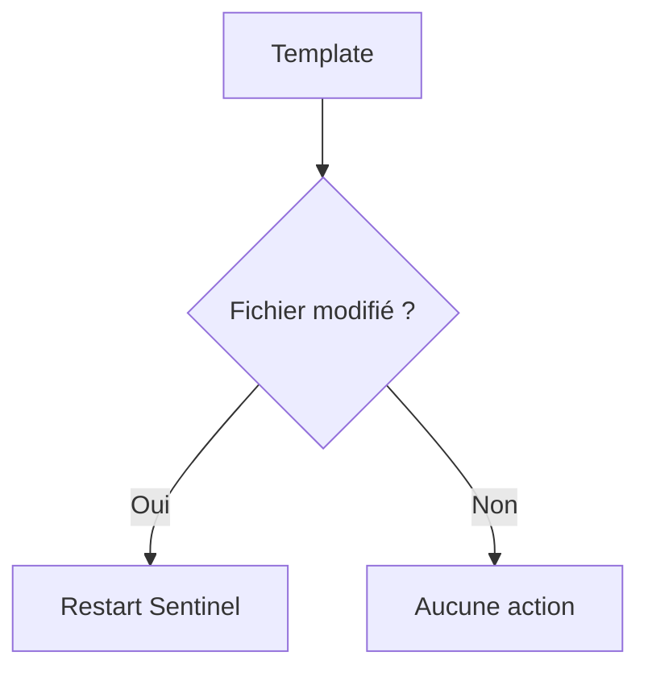

Ainsi, le service Sentinel n'est redémarré que si la configuration a réellement changé.

Cette combinaison `template` + `handler` constitue l'un des modèles les plus utilisés dans les projets Ansible professionnels.

## Les expressions Jinja2

Jusqu'à présent, nous avons utilisé Jinja2 uniquement pour remplacer une variable.

Par exemple.

```jinja2
{{ sentinel_port }}
```

Mais Jinja2 est beaucoup plus puissant.

Il permet également :

- d'effectuer des calculs ;
- d'appeler des fonctions ;
- d'utiliser des filtres ;
- de manipuler des chaînes de caractères.

Il s'agit d'un véritable langage de génération de texte.

---

## Plusieurs variables

Un template peut naturellement contenir plusieurs variables.

Par exemple.

```jinja2
server:

  host: {{ ansible_fqdn }}

  port: {{ sentinel_port }}

tls:

  certificate: {{ sentinel_certificate }}

  private_key: {{ sentinel_private_key }}
```

Lors du rendu.

Chaque expression est remplacée indépendamment.

Le résultat est un fichier parfaitement adapté à la machine concernée.

---

## Les filtres

Jinja2 propose de nombreux filtres.

Leur syntaxe est simple.

```jinja2
{{ variable | filtre }}
```

Par exemple.

```jinja2
{{ ansible_hostname | upper }}
```

produira :

```text
SENTINEL01
```

Ou encore.

```jinja2
{{ ansible_hostname | lower }}
```

produira :

```text
sentinel01
```

Les filtres permettent de transformer les données sans modifier les variables d'origine.

---

## Les valeurs par défaut

Il est fréquent qu'une variable soit facultative.

Le filtre :

```text
default
```

permet de définir une valeur de secours.

```jinja2
{{ sentinel_port | default(8443) }}
```

Si :

```text
sentinel_port
```

n'est pas définie.

Le résultat sera :

```text
8443
```

Cette technique rend les templates beaucoup plus robustes.

---

## Pourquoi utiliser les filtres ?

Prenons un exemple.

Nous souhaitons afficher le nom du serveur.

Mais uniquement en majuscules.

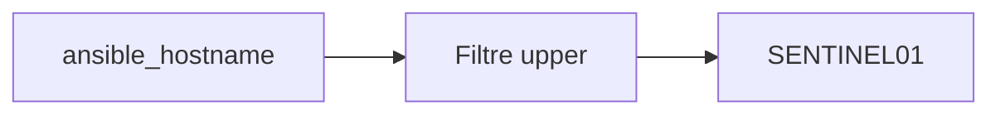

Le template reste très lisible.

La transformation est réalisée automatiquement.

---

## Une bonne pratique

Les templates doivent rester simples.

Ils servent à générer des fichiers de configuration.

Ils ne doivent pas contenir une logique métier complexe.

Une règle largement utilisée est la suivante.

> **Les décisions appartiennent au playbook. Les templates se contentent de mettre les données en forme.**

Cette séparation rend les projets beaucoup plus faciles à comprendre et à maintenir.

Dans la prochaine partie, nous découvrirons comment Jinja2 peut également générer automatiquement des portions entières de fichiers grâce aux structures de contrôle (`if`, `for`...), tout en conservant cette philosophie.

## Les conditions dans un template

Un template n'est pas limité au simple remplacement de variables.

Il peut également adapter le contenu généré en fonction de certaines conditions.

Prenons un exemple.

Notre application Sentinel peut fonctionner :

- avec TLS ;
- sans TLS.

Plutôt que de maintenir deux fichiers de configuration différents, un seul template suffit.

---

## Le bloc `if`

Jinja2 propose une syntaxe très proche de Python.

```jinja2


tls:

  enabled: true


```

Si la variable :

```text
sentinel_tls_enabled
```

vaut :

```text
true
```

la section TLS sera générée.

Sinon, elle sera totalement absente du fichier final.

---

## Résultat obtenu

Supposons :

```yaml
sentinel_tls_enabled: true
```

Le fichier généré sera :

```yaml
tls:

  enabled: true
```

Si la variable vaut :

```yaml
false
```

La section ne sera tout simplement pas produite.

Le fichier restera parfaitement valide.

---

## Une alternative avec `else`

Il est également possible de générer deux configurations différentes.

```jinja2


protocol: https



protocol: http


```

Le rendu dépendra automatiquement de la variable.

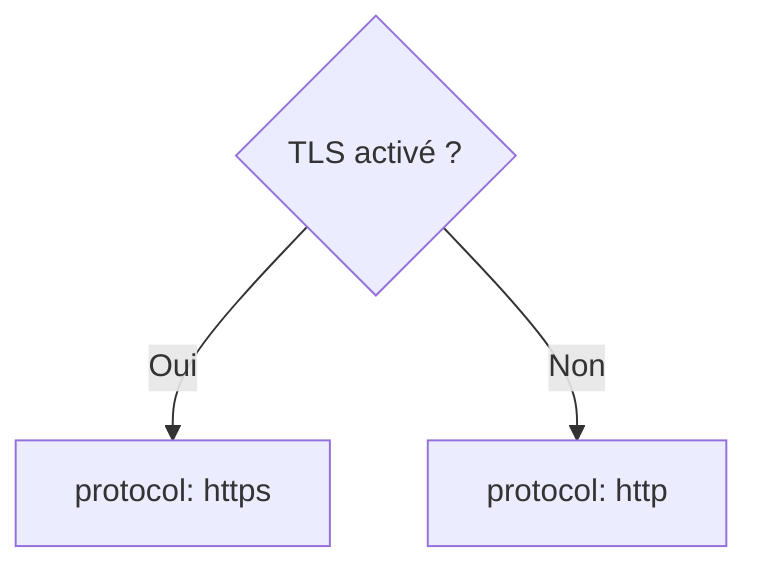

Un seul template couvre ainsi plusieurs scénarios.

---

## Quand utiliser une condition ?

Les conditions sont particulièrement utiles lorsque :

- une fonctionnalité est optionnelle ;
- un paramètre dépend du système ;
- un composant n'est présent que sur certains serveurs.

Par exemple.

Le serveur FreeIPA n'utilise probablement pas exactement la même configuration Sentinel qu'un simple agent.

Le template peut s'adapter automatiquement.

---

## Une bonne pratique

Les conditions doivent rester lisibles.

Si un template contient plusieurs dizaines de blocs :

```jinja2
if

else

elif

endif
```

il devient rapidement difficile à comprendre.

Dans ce cas, il est souvent préférable de :

- déplacer une partie de la logique dans le playbook ;
- ou créer deux templates différents si leurs contenus divergent fortement.

Un template doit avant tout rester un document facile à lire, même plusieurs mois après sa création.

## Les boucles dans un template

Les conditions permettent de choisir entre plusieurs configurations.

Mais il arrive également que certaines parties d'un fichier doivent être répétées.

Prenons un exemple.

Sentinel doit écouter sur plusieurs réseaux.

Plutôt que d'écrire plusieurs fois la même structure, Jinja2 permet d'utiliser une **boucle**.

---

## Le bloc `for`

La syntaxe est très proche de Python.

```jinja2


- {{ network }}


```

Supposons la variable suivante.

```yaml
sentinel_networks:

  - 192.168.1.0/24

  - 10.0.0.0/24

  - 172.16.0.0/16
```

Le fichier généré sera :

```yaml
- 192.168.1.0/24

- 10.0.0.0/24

- 172.16.0.0/16
```

Une seule boucle permet donc de générer un nombre quelconque d'entrées.

---

## Exemple avec des serveurs

Imaginons maintenant que Sentinel doive connaître la liste des autres nœuds du cluster.

Les variables peuvent contenir :

```yaml
sentinel_nodes:

  - sentinel01

  - sentinel02

  - sentinel03
```

Le template devient :

```jinja2
cluster:



  - {{ node }}


```

Le résultat final est construit automatiquement.

---

## Pourquoi les boucles sont-elles si utiles ?

Sans boucle.

Trois serveurs nécessitent trois lignes.

Dix serveurs nécessitent dix lignes.

Cent serveurs nécessitent cent lignes.

Avec une boucle.

Le template reste toujours identique.


Seules les données changent.

Le modèle reste stable.

---

## Les données pilotent le résultat

Cette approche est fondamentale.

Le template décrit **la forme**.

Les variables décrivent **le contenu**.

Autrement dit.

Le comportement de Sentinel est piloté par les données et non par une multitude de fichiers différents.

Cette philosophie est au cœur de l'automatisation moderne.

---

## Une bonne pratique

Les boucles doivent parcourir des listes simples et clairement nommées.

Par exemple.

```yaml
sentinel_nodes

trusted_networks

dns_servers

backup_targets
```

Évitez les structures de données trop complexes lorsque cela n'est pas nécessaire.

Plus les variables restent simples, plus les templates sont faciles à comprendre, à tester et à maintenir.

Dans la prochaine partie, nous découvrirons comment organiser ces templates dans un véritable projet Ansible afin de construire des playbooks propres, modulaires et facilement réutilisables.

## Les variables complexes

Jusqu'à présent, nous avons manipulé des variables simples.

Par exemple :

```yaml
sentinel_port: 8443
```

ou :

```yaml
sentinel_user: sentinel
```

En pratique, une infrastructure contient souvent des informations plus riches.

Ansible permet donc de manipuler des **structures de données**.

---

## Les listes

Une liste est une suite de valeurs.

Par exemple.

```yaml
trusted_networks:

  - 192.168.1.0/24

  - 10.10.0.0/16

  - 172.20.15.0/24
```

Chaque élément est accessible individuellement.

Ces listes sont très utilisées avec les boucles Jinja2.

---

## Les dictionnaires

Une autre structure très courante est le dictionnaire.

Par exemple.

```yaml
sentinel_tls:

  certificate: /etc/pki/tls/certs/sentinel.crt

  private_key: /etc/pki/tls/private/sentinel.key

  ca: /etc/ipa/ca.crt
```

Cette fois.

La variable contient plusieurs champs.

Ils sont accessibles individuellement.

```jinja2
{{ sentinel_tls.certificate }}
```

ou.

```jinja2
{{ sentinel_tls.private_key }}
```

Cette organisation est souvent plus lisible qu'une longue liste de variables indépendantes.

---

## Pourquoi utiliser un dictionnaire ?

Comparons deux approches.

Première possibilité.

```yaml
sentinel_certificate

sentinel_private_key

sentinel_ca
```

Deuxième possibilité.

```yaml
sentinel_tls:

  certificate:

  private_key:

  ca:
```

La seconde présente un avantage majeur.

Toutes les informations liées à TLS sont regroupées.

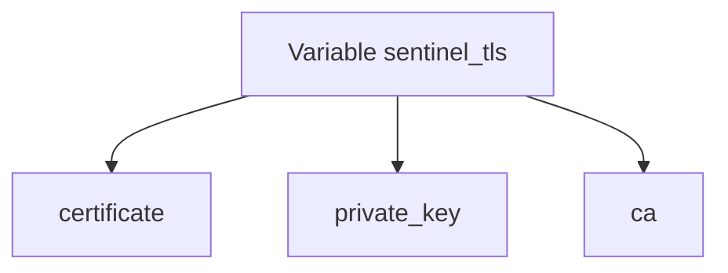

L'organisation devient beaucoup plus naturelle.

---

## Une structure adaptée à Sentinel

Dans notre projet, nous pourrions utiliser une organisation de ce type.

```yaml
sentinel:

  server:

    port: 8443

    bind: 0.0.0.0

  tls:

    enabled: true

    certificate: /etc/pki/tls/certs/sentinel.crt

    private_key: /etc/pki/tls/private/sentinel.key

    ca: /etc/ipa/ca.crt
```

Le template accédera ensuite aux différentes informations.

```jinja2
{{ sentinel.server.port }}

{{ sentinel.tls.enabled }}

{{ sentinel.tls.certificate }}
```

Cette hiérarchie reflète directement la structure logique de l'application.

---

## Une bonne pratique

Lorsque plusieurs variables concernent le même domaine fonctionnel, il est préférable de les regrouper dans un dictionnaire.

Cette organisation présente plusieurs avantages :

- une meilleure lisibilité ;
- moins de risque de collision entre les noms de variables ;
- une configuration plus proche de la structure réelle de l'application.

Nous utiliserons abondamment cette approche dans les rôles Ansible de Sentinel, où plusieurs dizaines de paramètres devront être organisés de manière claire et cohérente.

## Les templates dans un projet professionnel

Jusqu'à présent, nos exemples utilisaient un unique template.

Dans un projet réel, plusieurs dizaines de fichiers doivent souvent être générés.

Par exemple pour Sentinel.

- le fichier principal de configuration ;
- l'unité `systemd` ;
- la configuration des journaux ;
- la configuration TLS ;
- les fichiers d'environnement ;
- éventuellement la configuration de Nginx ou d'Apache.

Une bonne organisation devient alors indispensable.

---

## Une arborescence classique

La plupart des projets Ansible utilisent une structure proche de celle-ci.

```text
playbooks/

roles/

└── sentinel/

    ├── tasks/

    ├── handlers/

    ├── templates/

    │   ├── sentinel.yml.j2

    │   ├── sentinel.service.j2

    │   ├── logrotate.j2

    │   └── nginx.conf.j2

    ├── files/

    ├── vars/

    └── defaults/
```

Chaque template possède une responsabilité bien définie.

---

## Le répertoire `templates/`

Tous les fichiers nécessitant un rendu Jinja2 sont placés dans :

```text
templates/
```

Par exemple.

```text
templates/

    sentinel.yml.j2

    sentinel.service.j2

    nginx.conf.j2
```

Le module :

```yaml
template:
```

ira automatiquement y chercher les fichiers.

Cette convention est utilisée par tous les rôles Ansible.

---

## Les fichiers statiques

À l'inverse.

Certains fichiers ne contiennent aucune variable.

Par exemple :

- une image ;
- un certificat public ;
- un script shell ;
- un fichier HTML fixe.

Ces fichiers sont placés dans :

```text
files/
```

Ils sont ensuite copiés avec le module :

```yaml
copy:
```

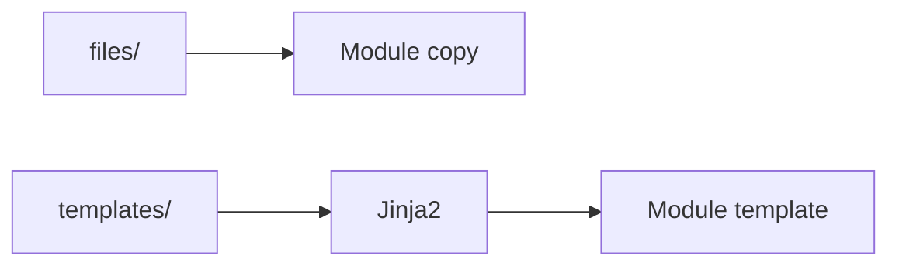

Cette distinction est très importante.

---

## Quand utiliser `copy` ?

Utilisez le module :

```yaml
copy
```

si le fichier est identique sur tous les serveurs.

Par exemple.

```text
README

logo.png

script.sh
```

Aucune transformation n'est nécessaire.

---

## Quand utiliser `template` ?

Utilisez :

```yaml
template
```

dès qu'une seule ligne dépend d'une variable.

Par exemple.

```yaml
port: {{ sentinel.server.port }}
```

Même si une unique variable apparaît dans le fichier.

Le bon choix reste :

```text
template
```

Cette règle est très largement appliquée dans les projets professionnels.

Elle garantit une séparation claire entre les fichiers statiques et les fichiers générés automatiquement.

## Les erreurs dans un template

Comme tout fichier de configuration, un template peut contenir des erreurs.

La différence est qu'elles peuvent apparaître à deux moments différents :

- pendant le rendu du template ;
- après le déploiement du fichier.

Comprendre cette distinction est essentiel.

---

## Les erreurs de rendu

La première catégorie concerne Jinja2 lui-même.

Prenons l'exemple suivant.

```jinja2
port: {{ sentinel_port }}
```

Mais la variable :

```text
sentinel_port
```

n'existe pas.

Le rendu du template échouera.

Le fichier ne sera jamais copié sur le serveur.

L'erreur est donc détectée très tôt.

---

## Les erreurs de configuration

À l'inverse.

Le template peut être parfaitement valide.

Mais produire un fichier incorrect.

Par exemple.

```yaml
port: 999999
```

Jinja2 n'y voit aucun problème.

Le fichier est généré.

En revanche.

Lors du démarrage.

Sentinel refusera cette configuration.

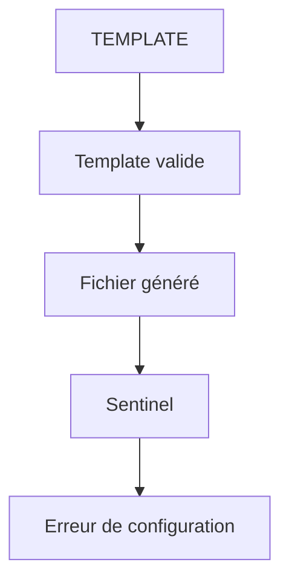

Le problème est donc découvert beaucoup plus tard.

---

## Valider avant de redémarrer

Une excellente pratique consiste à vérifier une configuration avant de redémarrer un service.

Par exemple.

```text
Template

↓

Validation

↓

Restart
```

Pour de nombreux logiciels.

Il existe une commande dédiée.

Par exemple.

```bash
nginx -t
```

ou encore.

```bash
sshd -t
```

Ces commandes analysent la configuration sans lancer réellement le service.

---

## Et pour Sentinel ?

Notre application Python devra adopter la même philosophie.

Il sera très intéressant de prévoir un mode.

```text
sentinel --check-config
```

qui vérifiera :

- la syntaxe du fichier YAML ;
- la présence des certificats ;
- les permissions ;
- la cohérence des paramètres.

Le playbook pourra alors exécuter cette vérification avant tout redémarrage.

Cela évitera de rendre le service indisponible à cause d'une erreur de configuration.

---

## Une bonne pratique

Dans un projet professionnel, le déploiement suit souvent cette séquence.

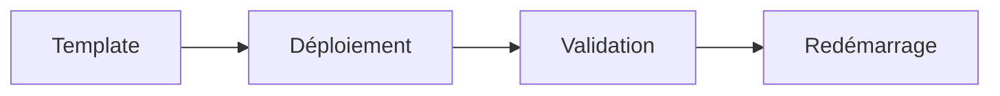

Cette approche présente plusieurs avantages.

- Les erreurs sont détectées le plus tôt possible.
- Le service n'est redémarré que si la nouvelle configuration est valide.
- Les interruptions de service sont limitées.

Nous appliquerons systématiquement cette méthode lors du déploiement de Sentinel dans les prochains chapitres.

## 💎 Le point d'expertise

Lorsqu'un administrateur débute avec Ansible, il considère souvent les templates comme de simples fichiers de configuration contenant quelques variables.

En réalité, un template représente une **description de configuration**.

Le fichier réellement présent sur le serveur n'est qu'une conséquence de cette description.

Cette nuance est importante.

Dans une infrastructure moderne, le fichier généré n'est plus la source de vérité.

La source de vérité est :

- le template ;
- les variables ;
- le playbook.

Le fichier présent sur le serveur peut être supprimé à tout moment.

Il sera recréé automatiquement.

---

## 🧠 Comment pense un architecte ?

Un architecte évite autant que possible les modifications manuelles.

Prenons un exemple.

Un administrateur ouvre :

```text
/etc/sentinel/sentinel.yml
```

et modifie directement :

```yaml
port: 8443
```

Le service fonctionne.

Quelques jours plus tard, le playbook est relancé.

Le template est regénéré.

La modification disparaît.

Ce comportement n'est pas un bug.

C'est exactement ce qui est attendu.

La configuration doit toujours provenir de la source de vérité.

---

## Infrastructure as Code

Cette philosophie porte un nom.

> **Infrastructure as Code (IaC)**

Le principe est simple.

Toute l'infrastructure est décrite dans des fichiers texte versionnés.

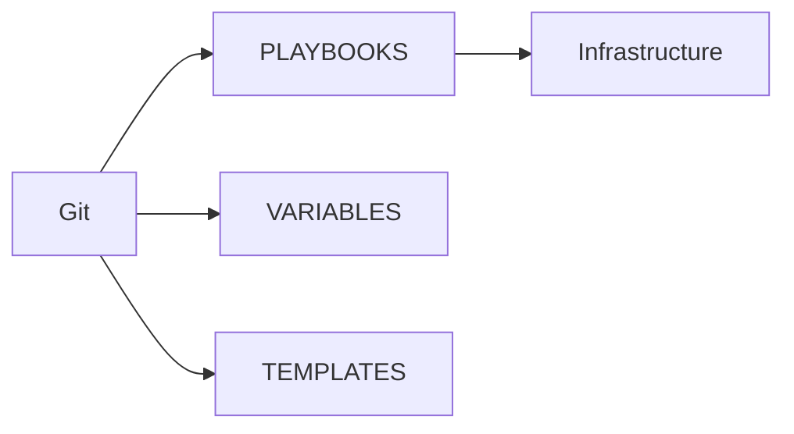

L'état des serveurs n'est plus défini par des modifications réalisées en production.

Il est défini par le dépôt Git.

Cette approche transforme profondément la manière d'administrer une infrastructure.

---

## ⚔️ Comment pense un attaquant ?

Un attaquant apprécie particulièrement les environnements où les modifications sont réalisées directement sur les serveurs.

Pourquoi ?

Parce qu'elles sont souvent :

- peu documentées ;
- difficiles à détecter ;
- oubliées avec le temps.

À l'inverse, lorsqu'un serveur est régulièrement reconstruit par Ansible :

- toute modification manuelle disparaît ;
- les écarts sont rapidement corrigés ;
- la dérive de configuration est fortement limitée.

L'automatisation devient ainsi un véritable mécanisme de sécurité.

---

## 📚 Culture technique

Les grandes plateformes cloud reposent largement sur cette philosophie.

Les serveurs sont souvent considérés comme **éphémères**.

En cas de problème.

Ils ne sont pas réparés.

Ils sont détruits.

Puis recréés automatiquement à partir :

- des playbooks ;
- des templates ;
- des variables.

Cette approche n'est possible que parce que toute la configuration est décrite sous forme de code.

C'est précisément ce que nous commençons à construire avec Sentinel.

---

## ⚠️ Piège classique

Une erreur très fréquente consiste à corriger un problème directement sur un serveur de production.

Quelques semaines plus tard.

Le playbook est relancé.

La correction disparaît.

L'administrateur pense qu'Ansible a « cassé » le serveur.

En réalité.

Le dépôt Git et les playbooks n'avaient jamais été mis à jour.

La bonne méthode est toujours la même.

1. Corriger le template ou le playbook.
2. Valider la modification.
3. Versionner le changement.
4. Redéployer.

Ainsi, toute l'infrastructure bénéficie automatiquement de la correction lors des prochains déploiements.

## Laboratoire AlmaLinux

### Objectif

Mettre en place un premier système de génération automatique de configuration pour Sentinel à l'aide de Jinja2.

À la fin de ce laboratoire, vous devrez être capable de :

- créer un template ;
- utiliser des variables ;
- déployer automatiquement la configuration ;
- redémarrer Sentinel uniquement si nécessaire.

---

### Étape 1 — Préparer les variables

Créez un fichier :

```text
group_vars/sentinel.yml
```

Définissez les variables suivantes.

```yaml
sentinel:

  server:

    port: 8443

    bind: 0.0.0.0

  tls:

    enabled: true

    certificate: /etc/pki/tls/certs/sentinel.crt

    private_key: /etc/pki/tls/private/sentinel.key

    ca: /etc/ipa/ca.crt
```

À ce stade, toutes les machines Sentinel partageront la même configuration.

---

### Étape 2 — Créer le template

Dans le rôle Sentinel, créez le fichier :

```text
templates/sentinel.yml.j2
```

Construisez un fichier de configuration en utilisant les variables précédentes.

Le template devra notamment faire apparaître :

- l'adresse d'écoute ;
- le port ;
- l'activation de TLS ;
- les chemins des certificats.

Aucune valeur ne devra être écrite en dur.

---

### Étape 3 — Déployer le template

Utilisez le module :

```yaml
template:
```

afin de générer automatiquement :

```text
/etc/sentinel/sentinel.yml
```

Le propriétaire, le groupe et les permissions devront être définis explicitement.

L'objectif est d'obtenir un fichier identique sur toutes les machines partageant les mêmes variables.

---

### Étape 4 — Ajouter un handler

Créez un handler.

Son rôle sera de redémarrer Sentinel.

Le handler ne devra être appelé que si le fichier de configuration a réellement changé.

Vérifiez que plusieurs modifications successives du template ne provoquent toujours qu'un seul redémarrage par exécution du playbook.

---

### Étape 5 — Vérifier le résultat

Exécutez plusieurs fois le playbook.

Le premier lancement devra produire :

```text
changed
```

Le second lancement, sans modification du template ni des variables, devra produire :

```text
ok
```

Ce comportement confirmera que votre déploiement est bien idempotent.

---

## Mission d'ingénieur

Votre objectif est maintenant d'améliorer ce laboratoire.

Ajoutez les fonctionnalités suivantes au template.

- Activation ou désactivation de TLS.
- Port HTTPS configurable.
- Nom DNS configurable.
- Liste des réseaux autorisés.
- Répertoire des journaux configurable.

Toutes ces informations devront être pilotées par les variables Ansible.

Le template devra fonctionner sans modification sur plusieurs serveurs possédant des configurations différentes.

---

## Impact sur Sentinel

À partir de ce laboratoire, la configuration de Sentinel ne sera plus administrée manuellement.

Elle sera entièrement générée à partir :

- des variables ;
- du template ;
- du playbook.

Chaque nouvelle modification devra être réalisée dans ces éléments, puis redéployée automatiquement.

Cette approche marque une étape importante dans la transition vers une véritable **Infrastructure as Code**.

## Grande synthèse du chapitre 9.5

Le chapitre 9.5 avait un objectif fondamental :

> **Séparer les données de leur représentation.**

Autrement dit :

- les **variables** décrivent les différences entre les serveurs ;
- les **templates** décrivent la structure des fichiers de configuration.

Cette séparation permet de générer automatiquement une infinité de configurations à partir d'un nombre réduit de fichiers.

---

## Les composants étudiés

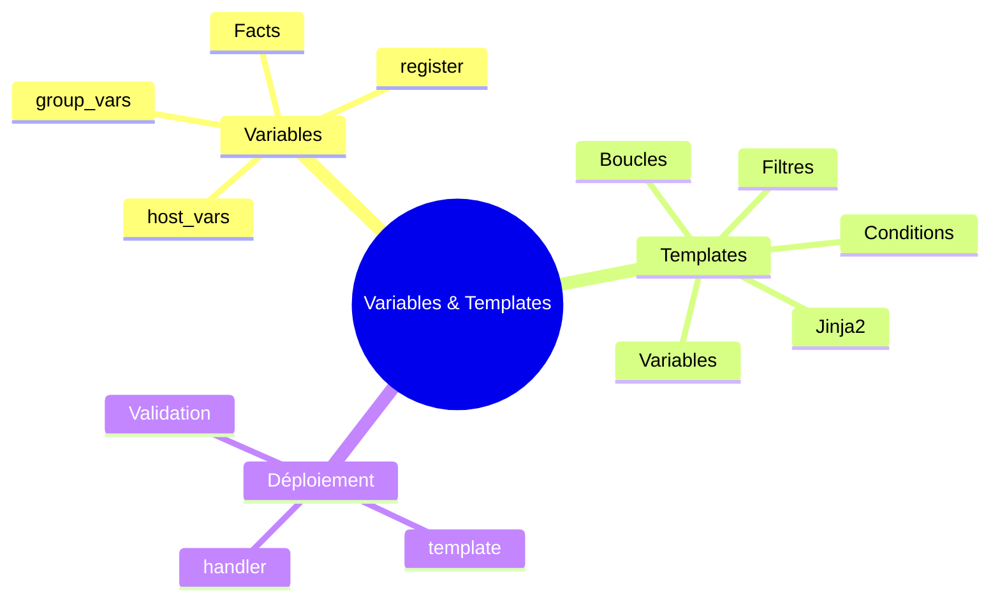

Toutes ces briques collaborent pour produire la configuration finale d'un serveur.

---

## Le cycle complet

Le processus suivi par Ansible peut être représenté ainsi.

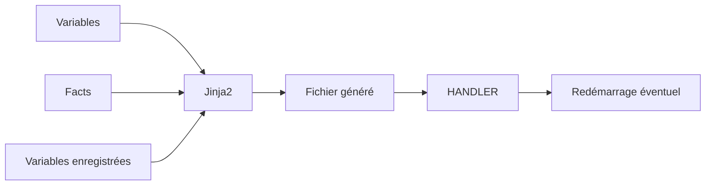

Chaque étape possède une responsabilité clairement définie.

---

## Les bonnes pratiques

Au cours de ce chapitre, plusieurs règles importantes ont émergé.

### Pour les variables

- regrouper les paramètres liés dans des dictionnaires ;
- éviter les duplications ;
- utiliser `group_vars` pour les paramètres communs ;
- réserver `host_vars` aux véritables exceptions.

---

### Pour les templates

- éviter la logique métier complexe ;
- privilégier les variables aux valeurs écrites en dur ;
- utiliser des conditions uniquement lorsqu'elles améliorent réellement la lisibilité ;
- conserver un template simple et facilement relisible.

---

### Pour le déploiement

- utiliser le module `template` plutôt que `copy` dès qu'une variable intervient ;
- associer les templates à des handlers ;
- valider les fichiers générés avant de redémarrer un service.

---

## Ce que Sentinel gagne

Grâce aux templates, Sentinel n'a plus besoin de maintenir plusieurs fichiers de configuration.

Un seul modèle suffit.

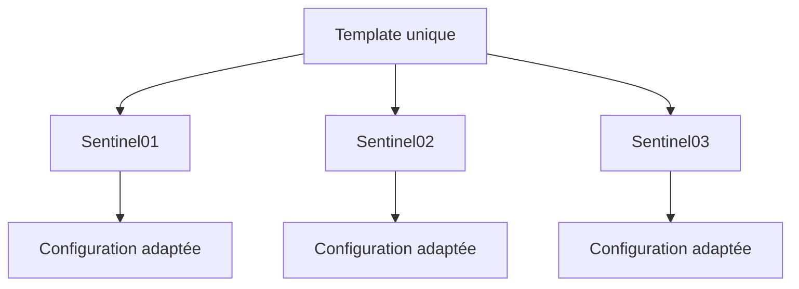

Chaque serveur reçoit une configuration correspondant exactement à ses variables.

Le modèle, lui, reste identique.

---

## Synthèse

Le chapitre **Variables et templates** établit une brique du socle de sécurité Sentinel.

Avant de poursuivre, vérifiez que vous savez :

- expliquer le rôle des mécanismes présentés ;
- distinguer leur configuration de leur état réellement observé ;
- valider leur comportement dans le laboratoire ;
- conserver une configuration explicite, vérifiable et reproductible.

## Pour aller plus loin

Nous savons désormais :

- écrire des playbooks ;
- utiliser des variables ;
- générer automatiquement des fichiers de configuration.

La prochaine étape consiste à organiser ces éléments dans une structure réutilisable.

C'est précisément le rôle des **rôles Ansible**.

Au lieu d'écrire un immense playbook, nous allons découper notre infrastructure en composants indépendants :

- un rôle pour Sentinel ;
- un rôle pour FreeIPA ;
- un rôle pour `firewalld` ;
- un rôle pour `systemd` ;
- un rôle pour la journalisation.

Cette approche constitue la base de pratiquement tous les projets Ansible professionnels et marquera une nouvelle étape dans l'industrialisation de notre laboratoire.

---

← [9.4 — Premiers playbooks](9.4-premiers-playbooks.md) · [9.6 — Les rôles Ansible](9.6-roles-ansible.md) →
