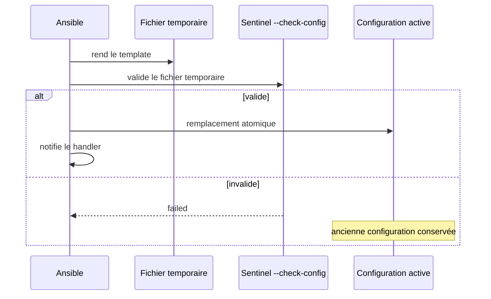

# Chapitre 9.5 — Piloter la configuration avec variables et templates

> **Campagne 9 — Déploiement avec Ansible**
>
> *« Le template décrit une forme stable ; les variables expriment les différences légitimes. »*

## Vous êtes ici

```text
Partie II — Industrialiser la sécurité

Campagne 9 — Déploiement avec Ansible

      9.1 Architecture Ansible
      9.2 Composants et idempotence
      9.3 Inventaires
      9.4 Premiers playbooks
    ► 9.5 Variables et templates
      9.6 Rôles Ansible
      9.7 Déploiement de Sentinel
      9.8 Intégration à FreeIPA
      9.9 Industrialisation du projet
      9.10 Mission de déploiement
```

## Objectifs pédagogiques

À la fin de ce chapitre, vous serez capable de :

- choisir des variables nommées et typées ;
- utiliser expressions, filtres, conditions et boucles Jinja ;
- distinguer `copy` et `template` ;
- valider un fichier avant de remplacer la configuration active ;
- générer la configuration Sentinel sans y intégrer de secret inutile.

## Pourquoi ce chapitre existe

Copier une configuration différente pour chaque serveur produit rapidement des fichiers presque identiques et impossibles à comparer. À l'inverse, un template rempli de conditions peut devenir un programme caché.

Le bon découpage conserve une structure lisible et place les différences légitimes dans des données explicites.

## Concevoir les variables comme une interface

Une variable utile possède :

- un nom lié à son rôle ;
- un type attendu ;
- une valeur par défaut sûre lorsqu'elle existe ;
- une documentation ;
- une validation avant usage.

```yaml
sentinel_version: "0.6.0"
sentinel_listen_address: 0.0.0.0
sentinel_listen_port: 8443
sentinel_tls_enabled: true
sentinel_allowed_dns_names:
  - healthcheck.sentinel.example.test
  - agent01.sentinel.example.test
```

Préfixer les variables d'un rôle réduit les collisions. `port` ou `user` devient ambigu dans un projet multi-rôle ; `sentinel_listen_port` et `sentinel_service_user` indiquent leur propriétaire.

Les valeurs dérivées n'ont pas besoin d'être dupliquées partout :

```yaml
sentinel_install_root: /opt/sentinel
sentinel_source_dir: "{{ sentinel_install_root }}/src"
```

Une dérivation courte est lisible. Une chaîne de dix variables calculées rend l'origine d'une valeur opaque.

## Variables définies et valeurs par défaut

Le filtre `default` évite une erreur lorsqu'une variable réellement optionnelle manque :

```jinja2
listen_address = {{ sentinel_listen_address | default('127.0.0.1') }}
```

Il ne doit pas inventer silencieusement une donnée obligatoire. Pour une identité ou un chemin de confiance, utilisez `mandatory` ou une assertion dans le rôle :

```yaml
- name: Vérifier les identités autorisées en mode mTLS
  ansible.builtin.assert:
    that:
      - not sentinel_tls_enabled or sentinel_allowed_dns_names | length > 0
    fail_msg: "Le mTLS exige au moins une identité DNS autorisée."
```

## Jinja sans masquer la configuration

Le moteur Jinja évalue `{{ expression }}` et les blocs `` dans un template.

### Expressions et filtres

```jinja2
listen_port = {{ sentinel_listen_port | int }}
level = {{ sentinel_log_level | upper }}
allowed_dns_names = {{ sentinel_allowed_dns_names | join(', ') }}
```

Les filtres transforment les données. Ils ne valident pas automatiquement leur sens : convertir `99999` en entier ne rend pas ce port valide. L'assertion du rôle doit contrôler la plage.

### Conditions

```jinja2
[tls]
enabled = {{ sentinel_tls_enabled | bool | lower }}

certificate = {{ sentinel_tls_certificate }}
private_key = {{ sentinel_tls_private_key }}
client_ca = {{ sentinel_tls_client_ca }}
require_client_certificate = true

```

La condition évite des paramètres sans objet lorsque TLS est désactivé. Si les variantes divergent sur la moitié du fichier, créez deux templates ou deux composants plutôt qu'une forêt de `if`.

### Boucles et structures

Une liste convient aux identités autorisées. Un dictionnaire convient à des objets nommés :

```yaml
sentinel_directories:
  config:
    path: /etc/sentinel
    mode: "0750"
  state:
    path: /var/lib/sentinel
    mode: "0750"
```

La tâche peut les parcourir :

```yaml
- name: Créer les répertoires Sentinel
  ansible.builtin.file:
    path: "{{ item.value.path }}"
    state: directory
    owner: sentinel
    group: sentinel
    mode: "{{ item.value.mode }}"
  loop: "{{ sentinel_directories | dict2items }}"
  loop_control:
    label: "{{ item.key }}"
```

Les structures réduisent la répétition lorsqu'elles représentent réellement le même type d'objet. Ne compressez pas des tâches de sécurité différentes dans une boucle uniquement pour gagner des lignes.

## `copy` ou `template`

| Module | À utiliser pour |
|---|---|
| `ansible.builtin.copy` | fichier statique identique pour toutes les cibles |
| `ansible.builtin.template` | contenu rendu avec des variables Jinja |

Une clé publique ou un script fixe peut être copié. `sentinel.conf`, dont le port, les chemins et les SAN varient, est un template.

Dans les deux cas, déclarez propriétaire, groupe et mode. Le contenu correct avec des permissions implicites reste un déploiement incomplet.

## Le template Sentinel

`roles/sentinel/templates/sentinel.conf.j2` :

```jinja2
# Ce fichier est géré par Ansible. Toute modification locale sera remplacée.
[server]
listen_address = {{ sentinel_listen_address }}
listen_port = {{ sentinel_listen_port }}

[storage]
state_directory = {{ sentinel_state_directory }}

[logging]
level = {{ sentinel_log_level }}

[tls]
enabled = {{ sentinel_tls_enabled | bool | lower }}
certificate = {{ sentinel_tls_certificate }}
private_key = {{ sentinel_tls_private_key }}
client_ca = {{ sentinel_tls_client_ca }}
require_client_certificate = {{ sentinel_require_client_certificate | bool | lower }}

[healthcheck]
server_name = {{ sentinel_healthcheck_server_name }}
certificate = {{ sentinel_healthcheck_certificate }}
private_key = {{ sentinel_healthcheck_private_key }}

[identity]
allowed_dns_names = {{ sentinel_allowed_dns_names | join(', ') }}
```

Les chemins de clés figurent dans le fichier, mais les clés elles-mêmes n'y figurent jamais. La configuration est sensible par son architecture ; elle n'est pas un coffre de matériaux cryptographiques.

## Valider avant de remplacer

Le module `template` peut lancer une commande de validation sur un fichier temporaire. Pour Sentinel :

```yaml
- name: Déployer une configuration Sentinel valide
  ansible.builtin.template:
    src: sentinel.conf.j2
    dest: /etc/sentinel/sentinel.conf
    owner: root
    group: sentinel
    mode: "0640"
    validate: >-
      /usr/bin/python3 /opt/sentinel/src/sentinel.py
      --config %s --check-config
  notify: Redémarrer Sentinel
```

`%s` est remplacé par le chemin temporaire. La commande est exécutée sans shell : n'ajoutez pas de tube ou de redirection. Si la validation échoue, le fichier actif n'est pas remplacé et le handler n'est pas notifié.



La validation peut lire les chemins de certificats. Le rôle doit donc créer ou obtenir les matériaux nécessaires avant d'activer TLS dans le template.

## Échappement et données non fiables

Jinja n'applique pas un échappement universel adapté à chaque format. Une chaîne sûre pour HTML ne l'est pas nécessairement pour INI, YAML ou une unité systemd.

N'intégrez pas une valeur non contrôlée dans une ligne de commande. Pour les paramètres Sentinel, utilisez des assertions simples : port dans une plage, niveau de log parmi une liste, chemins absolus, noms DNS attendus.

⚔️ **Regard attaquant** — une variable d'inventaire capable de modifier `ExecStart`, un chemin de destination ou le contenu d'un fichier privilégié devient une entrée d'exécution. La revue des variables fait partie de la revue de code.

## Laboratoire — provoquer une validation négative

1. créez les variables de `sentinel_servers` ;
2. rendez `sentinel.conf.j2` ;
3. déployez avec `validate` ;
4. observez le handler au premier passage ;
5. relancez et vérifiez `changed=0` ;
6. définissez temporairement `sentinel_listen_port: 70000` et ajoutez une assertion qui refuse cette valeur.

Commandes :

```bash
ansible-playbook playbooks/deploy-sentinel.yml --syntax-check
ansible-playbook playbooks/deploy-sentinel.yml --check --diff \
  --limit sentinel01.sentinel.example.test
ansible-playbook playbooks/deploy-sentinel.yml \
  --limit sentinel01.sentinel.example.test
```

Le refus attendu doit survenir avant le remplacement de `/etc/sentinel/sentinel.conf`. Conservez le message d'assertion et le hash du fichier actif avant/après.

## Impact sur Sentinel

Le produit reste `0.6.0`, mais sa configuration devient générée depuis une interface de variables. Toute modification locale est désormais une dérive : elle doit être remontée dans le projet ou volontairement remplacée au prochain passage.

## Synthèse

- les variables expriment les différences légitimes et possèdent un type attendu ;
- un préfixe de rôle rend leur responsabilité visible ;
- Jinja transforme des données sans valider automatiquement leur sens ;
- les conditions et boucles doivent clarifier la configuration, pas la compresser artificiellement ;
- `copy` gère le statique, `template` le contenu rendu ;
- `validate` protège la configuration active avant notification du service ;
- une configuration peut référencer des secrets sans les embarquer.

## Infographie de révision

```text
DONNÉES
  defaults · group_vars · host_vars
          ↓
TEMPLATE JINJA
  expressions · filtres · conditions
          ↓
VALIDATION
  fichier temporaire · --check-config
          ↓
APPLICATION
  remplacement · notify · handler
```

## Pour aller plus loin

La configuration est maintenant paramétrable. Le chapitre suivant regroupe tâches, templates, handlers et valeurs par défaut dans des rôles aux responsabilités explicites.

[Continuer vers le chapitre 9.6 — Rôles Ansible](9.6-roles-ansible.md)

Références : [Using variables](https://docs.ansible.com/ansible/latest/playbook_guide/playbooks_variables.html), [Templating Jinja2](https://docs.ansible.com/ansible/latest/playbook_guide/playbooks_templating.html), [ansible.builtin.template](https://docs.ansible.com/ansible/latest/collections/ansible/builtin/template_module.html) et [Filters](https://docs.ansible.com/ansible/latest/playbook_guide/playbooks_filters.html).
