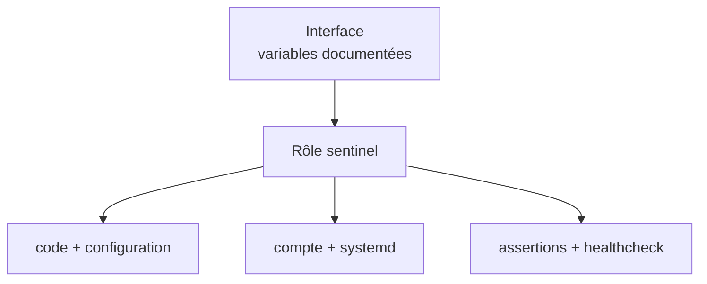
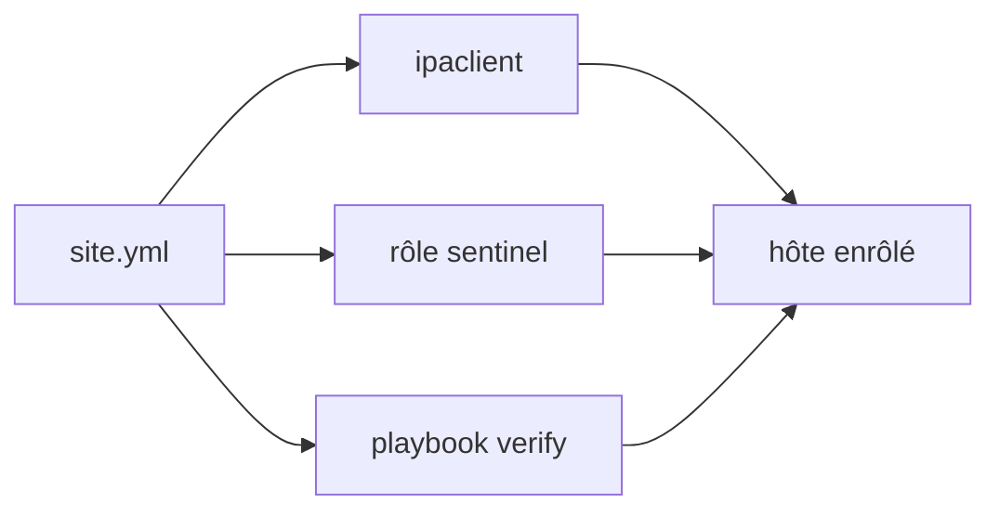

# Chapitre 9.6 — Concevoir des rôles Ansible réutilisables

> **Campagne 9 — Déploiement avec Ansible**
>
> *« Un rôle maintenable expose une intention stable et cache une implémentation que l'on peut tester séparément. »*

## Vous êtes ici

```text
Partie II — Industrialiser la sécurité

Campagne 9 — Déploiement avec Ansible

      9.1 Architecture Ansible
      9.2 Composants et idempotence
      9.3 Inventaires
      9.4 Premiers playbooks
      9.5 Variables et templates
    ► 9.6 Rôles Ansible
      9.7 Déploiement de Sentinel
      9.8 Intégration à FreeIPA
      9.9 Industrialisation du projet
      9.10 Mission de déploiement
```

## Objectifs pédagogiques

À la fin de ce chapitre, vous serez capable de :

- expliquer la responsabilité d'un rôle ;
- organiser tâches, handlers, templates, valeurs par défaut et métadonnées ;
- distinguer `defaults`, `vars`, `import_tasks` et `include_tasks` ;
- documenter l'interface publique d'un rôle ;
- découper le projet Sentinel sans créer de dépendances cachées.

## Pourquoi ce chapitre existe

Un playbook de plusieurs centaines de tâches peut fonctionner tout en restant difficile à tester et impossible à réutiliser. Les rôles regroupent les éléments d'une responsabilité : préparer un client FreeIPA, déployer Sentinel ou appliquer une politique commune.

Le découpage ne suit pas les fichiers uniquement. Il suit les résultats que l'équipe sait nommer, versionner et valider.

## Le rôle comme composant

Un bon rôle répond à quatre questions :

1. quel état garantit-il ?
2. quelles variables accepte-t-il ?
3. quels changements et redémarrages peut-il provoquer ?
4. comment prouver son résultat ?



Le rôle `sentinel` ne doit pas créer les utilisateurs FreeIPA, administrer la CA et configurer toute la machine. Ces responsabilités appartiennent à d'autres rôles ou collections.

## Arborescence d'un rôle

```text
roles/sentinel/
├── README.md
├── defaults/
│   └── main.yml
├── handlers/
│   └── main.yml
├── meta/
│   └── main.yml
├── tasks/
│   ├── main.yml
│   ├── validate.yml
│   ├── install.yml
│   ├── configure.yml
│   └── verify.yml
├── templates/
│   ├── sentinel.conf.j2
│   └── sentinel.service.j2
└── vars/
    └── main.yml
```

Tous les répertoires ne sont pas obligatoires. N'ajoutez pas des dossiers vides pour imiter une structure ; créez-les lorsque le rôle en a besoin.

La commande suivante produit un squelette plus complet :

```bash
ansible-galaxy role init roles/sentinel
```

Relisez et retirez les éléments inutiles avant le commit.

## `defaults` et `vars`

`defaults/main.yml` fournit les valeurs les plus faciles à surcharger :

```yaml
---
sentinel_version: "0.6.0"
sentinel_service_user: sentinel
sentinel_install_root: /opt/sentinel
sentinel_listen_port: 8443
sentinel_tls_enabled: false
```

Ces valeurs constituent une partie de l'interface publique. Une valeur par défaut doit permettre un comportement sûr ou obliger une validation explicite.

`vars/main.yml` possède une précédence plus forte et convient aux constantes internes rarement surchargées :

```yaml
---
sentinel_entrypoint: "{{ sentinel_install_root }}/src/sentinel.py"
sentinel_unit_name: sentinel.service
```

Ne placez pas toutes les variables dans `vars` pour empêcher l'utilisateur de les modifier. Cela rend le rôle rigide et pousse à utiliser des `extra-vars` encore plus prioritaires.

## Découper les tâches

`tasks/main.yml` reste un sommaire :

```yaml
---
- name: Valider les entrées du rôle
  ansible.builtin.import_tasks: validate.yml

- name: Installer Sentinel
  ansible.builtin.import_tasks: install.yml

- name: Configurer Sentinel
  ansible.builtin.import_tasks: configure.yml

- name: Vérifier Sentinel
  ansible.builtin.import_tasks: verify.yml
```

`import_tasks` est statique : Ansible charge le fichier lors de l'analyse du playbook. Les tags et erreurs de syntaxe deviennent visibles tôt.

`include_tasks` est dynamique : le fichier peut être choisi à l'exécution selon une variable ou une boucle. Il est utile pour une vraie variante dynamique, mais complique la vision de `--list-tasks`.

Pour Sentinel, l'ordre est stable ; `import_tasks` convient.

## Handlers et espace de noms

Les handlers d'un rôle rejoignent l'espace global du play. Donnez-leur un nom distinct ou utilisez `listen` :

```yaml
---
- name: Recharger systemd
  ansible.builtin.systemd_service:
    daemon_reload: true
  listen: Recharger les services Sentinel

- name: Redémarrer Sentinel
  ansible.builtin.systemd_service:
    name: sentinel.service
    state: restarted
  listen: Redémarrer Sentinel
```

Le template de l'unité notifie le rechargement de systemd et le redémarrage. Le template de configuration notifie seulement le redémarrage. Cette séparation évite un `daemon-reload` sans raison.

## Templates, fichiers et chemins

Dans un rôle, `src: sentinel.conf.j2` cherche naturellement sous `templates/`. Pour `copy`, un chemin relatif cherche sous `files/`.

Le checkpoint Sentinel reste la source de vérité du produit. Le rôle de laboratoire ne duplique pas tout le code Python dans `files/` : une variable contrôlée pointe vers `sentinel/labs/sentinel-app/checkpoints/0.6.0` sur le contrôleur, puis la tâche copie le répertoire `src/`.

Cette approche convient à la formation. La campagne 10 remplacera le déploiement de sources par un paquet RPM versionné, interface plus adaptée à la production.

## Métadonnées et dépendances

`meta/main.yml` peut indiquer les plateformes et dépendances :

```yaml
---
galaxy_info:
  role_name: sentinel
  description: Déploie le checkpoint Sentinel de la formation
  min_ansible_version: "2.14"
  platforms:
    - name: EL
      versions:
        - "9"
dependencies: []
```

Une dépendance de rôle dans `meta` s'applique automatiquement et peut surprendre l'orchestrateur. Pour le laboratoire, le playbook appelle explicitement `freeipa.ansible_freeipa.ipaclient` avant `sentinel`. L'ordre de confiance reste visible.

## Une interface documentée

Le `README.md` du rôle doit préciser :

- plateformes et versions testées ;
- variables obligatoires et valeurs par défaut ;
- fichiers créés et permissions ;
- handlers et interruptions possibles ;
- dépendances externes ;
- exemple minimal ;
- contrôles et modes de panne.

Exemple d'appel :

```yaml
- name: Déployer Sentinel
  hosts: sentinel_servers
  become: true
  roles:
    - role: sentinel
      sentinel_version: "0.6.0"
```

Le playbook orchestre ; le rôle porte l'implémentation. Répéter vingt paramètres dans chaque playbook indique que les valeurs doivent probablement vivre dans l'inventaire.

## Validation et compatibilité

La première tâche du rôle valide son contrat :

```yaml
- name: Valider les variables Sentinel
  ansible.builtin.assert:
    that:
      - sentinel_version == "0.6.0"
      - sentinel_listen_port | int >= 1024
      - sentinel_listen_port | int <= 65535
      - sentinel_source_checkpoint is directory
    fail_msg: "Variables ou checkpoint Sentinel non conformes."
```

Le test `directory` s'exécute côté contrôleur pour le chemin source. Les assertions sur les faits de l'hôte sont séparées afin que le message indique clairement quelle frontière a échoué.

L'interface peut évoluer, mais un renommage de variable doit être annoncé et éventuellement accompagné d'une période de compatibilité. Un rôle partagé est un produit interne, pas un répertoire de tâches jetables.

## Composition sans rôle géant

La campagne construit trois responsabilités :

| Composant | Résultat |
|---|---|
| collection `freeipa.ansible_freeipa` | enrôlement IdM supporté par le projet FreeIPA |
| rôle local `sentinel` | application, configuration, unité et vérification |
| playbooks | ordre, périmètres, secrets et campagne d'acceptation |



Cette composition réutilise l'expertise de la collection FreeIPA et conserve le code spécifique à Sentinel dans un rôle court.

## Laboratoire — créer le squelette du rôle

1. créez `roles/sentinel` ;
2. placez les valeurs publiques dans `defaults` ;
3. placez les constantes dérivées dans `vars` ;
4. découpez `validate`, `install`, `configure` et `verify` ;
5. ajoutez les deux templates et handlers ;
6. documentez le rôle ;
7. inspectez les tâches puis vérifiez la syntaxe.

```bash
ansible-playbook playbooks/deploy-sentinel.yml --list-tasks
ansible-playbook playbooks/deploy-sentinel.yml --syntax-check
ansible-playbook playbooks/deploy-sentinel.yml --check --diff \
  --limit sentinel01.sentinel.example.test
```

Échec attendu : fournissez un `sentinel_source_checkpoint` inexistant. Le rôle doit refuser avant de créer un compte ou un fichier distant.

## Impact sur Sentinel

Le rôle devient l'unité de déploiement de Sentinel `0.6.0`. Il ne modifie pas le produit, mais fixe son interface d'installation avant que le chapitre 9.7 ne complète les tâches et preuves de bout en bout.

## Synthèse

- un rôle regroupe une responsabilité et expose une interface de variables ;
- `defaults` est surchargeable, `vars` convient aux constantes internes ;
- `tasks/main.yml` reste lisible grâce aux imports par étape ;
- les handlers d'un rôle doivent avoir des notifications explicites ;
- le rôle Sentinel ne duplique pas les responsabilités FreeIPA ;
- les dépendances implicites sont limitées afin que l'orchestration reste visible ;
- documentation, validation et tests font partie du rôle.

## Infographie de révision

```text
RÔLE SENTINEL
├─ interface : defaults + README
├─ logique    : validate · install · configure · verify
├─ rendu      : templates
├─ réaction   : handlers
└─ contrat    : meta + tests

Le playbook orchestre ; le rôle garantit son état.
```

## Pour aller plus loin

Le squelette est prêt. Le chapitre suivant remplit le rôle pour installer réellement le checkpoint `0.6.0`, l'exécuter avec systemd et tester sa fonction.

[Continuer vers le chapitre 9.7 — Déployer Sentinel](9.7-deployer-sentinel-ansible.md)

Références : [Roles](https://docs.ansible.com/ansible/latest/playbook_guide/playbooks_reuse_roles.html), [Re-using Ansible artifacts](https://docs.ansible.com/ansible/latest/playbook_guide/playbooks_reuse.html) et [ansible-galaxy role](https://docs.ansible.com/ansible/latest/cli/ansible-galaxy.html).
