# Chapitre 9.7 — Déployer Sentinel avec Ansible

> **Campagne 9 — Industrialisation avec Ansible**

> *« Un déploiement réussi n'est pas celui qui fonctionne une fois. C'est celui qui fonctionne de manière identique à chaque exécution. »*

---

## Vous êtes ici

```text
PARTIE III — Industrialiser les déploiements

Campagne 9

  9.1 Pourquoi Ansible ? ✔
  9.2 Architecture d'Ansible ✔
  9.3 Inventaires ✔
  9.4 Premiers playbooks ✔
  9.5 Variables et templates ✔
  9.6 Les rôles ✔
► 9.7 Déployer Sentinel
  9.8 Intégrer FreeIPA
  9.9 Industrialiser le laboratoire
  9.10 Mission : déploiement complet d'une infrastructure
```

---

## Objectifs pédagogiques

À la fin de ce chapitre, vous serez capable de :

- construire un rôle Sentinel complet ;
- déployer automatiquement l'application ;
- organiser les différentes étapes du déploiement ;
- vérifier qu'un serveur est correctement configuré.

---

## Pourquoi ce chapitre existe

Ce chapitre fournit le modèle mental et les pratiques nécessaires pour aborder **Déployer Sentinel avec Ansible** dans un socle AlmaLinux sécurisé et reproductible.

---

## Notre objectif

Jusqu'à présent, nous avons étudié les mécanismes d'Ansible.

Nous allons maintenant les mettre en pratique.

À partir de ce chapitre, notre objectif est de pouvoir déployer un nouveau serveur Sentinel à l'aide d'une seule commande.

Autrement dit.

Le travail manuel réalisé dans les campagnes précédentes va progressivement disparaître.

---

## Que devra faire le rôle Sentinel ?

Le rôle devra être capable de préparer entièrement un serveur.

Les principales étapes seront les suivantes.

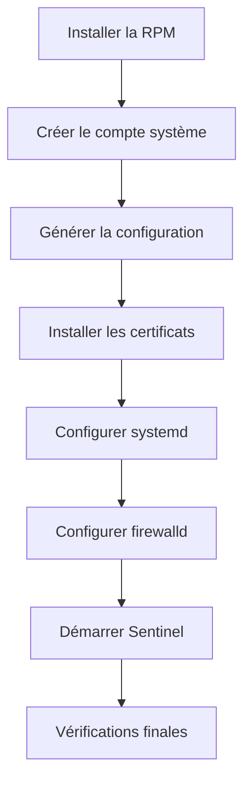

Chaque étape sera développée dans un fichier de tâches dédié.

---

## Une progression incrémentale

Il serait possible d'écrire immédiatement un rôle complet.

Ce n'est cependant pas la meilleure approche.

Nous allons procéder progressivement.

À chaque étape.

Le rôle devra rester :

- fonctionnel ;
- exécutable ;
- idempotent.

Cette méthode facilite énormément le débogage.

Si une erreur apparaît.

Elle proviendra très probablement de la dernière fonctionnalité ajoutée.

---

## Une architecture cible

À la fin du chapitre, notre rôle ressemblera à ceci.

```text
roles/

└── sentinel/

    ├── defaults/

    ├── files/

    ├── handlers/

    ├── tasks/

    │   ├── main.yml

    │   ├── install.yml

    │   ├── user.yml

    │   ├── config.yml

    │   ├── tls.yml

    │   ├── service.yml

    │   └── verify.yml

    ├── templates/

    └── vars/
```

Chaque fichier possédera une responsabilité unique.

---

## Une philosophie importante

Tout au long de ce chapitre, nous respecterons une règle simple.

> **Un serveur fraîchement installé doit pouvoir être entièrement configuré par Ansible, sans intervention manuelle.**

Autrement dit.

Si un nouveau serveur AlmaLinux est ajouté au laboratoire.

Il suffira :

1. de l'ajouter dans l'inventaire ;
2. d'exécuter le playbook.

L'ensemble du reste devra être réalisé automatiquement.

C'est précisément cette capacité qui distingue une infrastructure industrialisée d'une administration manuelle.

## Étape 1 — Installer Sentinel

La première responsabilité du rôle consiste à installer l'application.

Tant que Sentinel n'est pas présent sur le serveur, aucune des étapes suivantes n'a de sens.

Nous allons donc commencer par la gestion du paquet RPM.

---

## Le fichier `install.yml`

Créons un premier fichier.

```text
roles/

└── sentinel/

    └── tasks/

        └── install.yml
```

Ce fichier contiendra exclusivement les opérations liées à l'installation de l'application.

Aucune configuration ne devra y apparaître.

---

## Installer le paquet

Le module le plus adapté est naturellement :

```yaml
dnf:
```

Par exemple.

```yaml
- name: Installer Sentinel

  dnf:

    name: sentinel

    state: present
```

La signification de :

```yaml
state: present
```

est importante.

Elle indique que le paquet doit être installé.

Peu importe qu'il le soit déjà ou non.

Ansible déterminera lui-même si une action est nécessaire.

---

## Pourquoi ne pas utiliser `latest` ?

Le module `dnf` accepte également :

```yaml
state: latest
```

Cette option demande à Ansible d'installer systématiquement la version la plus récente disponible.

Dans notre laboratoire, nous éviterons cette approche.

Nous souhaitons que les mises à jour soient des décisions explicites.

Un déploiement ne doit pas changer de version simplement parce qu'un nouveau paquet est apparu dans un dépôt.

---

## Vérifier le résultat

Après l'installation.

Une vérification simple consiste à contrôler la présence du paquet.

```bash
rpm -q sentinel
```

Ou encore.

```bash
dnf info sentinel
```

Ces commandes permettent de confirmer que l'installation s'est correctement déroulée.

---

## Une responsabilité unique

Le fichier :

```text
install.yml
```

ne doit rien faire d'autre.

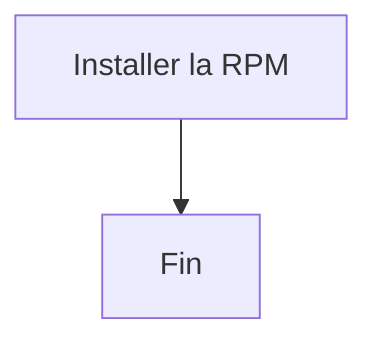

Il ne crée pas :

- le compte système ;
- les répertoires ;
- la configuration ;
- le service.

Ces opérations appartiennent à d'autres fichiers.

Cette discipline peut sembler stricte.

Elle permet pourtant d'obtenir des rôles beaucoup plus faciles à maintenir.

Quelques mois plus tard, lorsqu'un problème concernera uniquement l'installation du paquet, vous saurez immédiatement dans quel fichier intervenir, sans avoir à parcourir plusieurs centaines de lignes de code.

## Étape 2 — Créer le compte système

Une fois l'application installée, il est temps de préparer son identité sur le système.

Comme nous l'avons vu dans les premières campagnes de cette formation, un service ne devrait jamais s'exécuter sous le compte `root` lorsqu'il peut fonctionner avec des privilèges plus limités.

Nous allons donc créer un utilisateur dédié à Sentinel.

---

## Pourquoi un compte dédié ?

L'utilisation d'un compte spécifique présente plusieurs avantages.

- Isolation des permissions.
- Journalisation plus claire.
- Réduction de la surface d'attaque.
- Respect du principe du moindre privilège.

Si Sentinel était compromis, l'attaquant n'obtiendrait que les droits associés à cet utilisateur.

---

## Le fichier `user.yml`

Créons un nouveau fichier.

```text
roles/

└── sentinel/

    └── tasks/

        └── user.yml
```

Comme précédemment.

Ce fichier ne devra traiter qu'une seule responsabilité :

> préparer le compte système.

---

## Le module `user`

Ansible fournit un module spécialement conçu pour gérer les utilisateurs.

Un premier exemple pourrait être :

```yaml
- name: Créer le compte système Sentinel

  user:

    name: sentinel

    system: true

    shell: /sbin/nologin

    create_home: false
```

Chaque paramètre mérite d'être compris.

---

## Analyse des paramètres

```yaml
system: true
```

Demande la création d'un compte système.

Ce type de compte est destiné aux services et non aux utilisateurs humains.

---

```yaml
shell: /sbin/nologin
```

Empêche toute connexion interactive.

Même si un mot de passe était défini par erreur, le compte ne pourrait pas être utilisé pour ouvrir une session.

---

```yaml
create_home: false
```

Indique qu'aucun répertoire personnel ne doit être créé.

Sentinel n'en a généralement pas besoin.

Cette option évite la création de fichiers inutiles.

---

## Le résultat attendu

Après l'exécution du rôle.

Le système doit contenir un utilisateur similaire à celui-ci.

```text
sentinel:x:995:995::/:/sbin/nologin
```

Le numéro d'UID pourra varier selon la machine.

En revanche.

Les caractéristiques du compte devront rester identiques.

---

## Une responsabilité clairement identifiée

Le rôle commence maintenant à prendre forme.

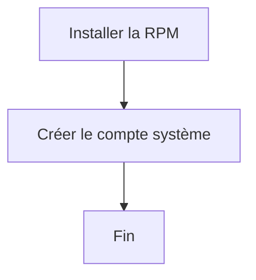

À ce stade, Sentinel est installé et possède une identité dédiée sur le système.

Aucune configuration n'a encore été déployée.

Aucun service n'a été démarré.

Chaque étape prépare simplement la suivante.

Cette progression contrôlée est l'une des clés d'un rôle Ansible robuste et facilement maintenable.

## Étape 3 — Préparer l'arborescence de Sentinel

L'application est maintenant installée.

Le compte système existe.

Il reste à préparer les différents répertoires dont Sentinel aura besoin.

Cette étape est souvent négligée.

Pourtant, une arborescence correctement définie simplifie :

- les sauvegardes ;
- la gestion des permissions ;
- les mises à jour ;
- le diagnostic.

---

## Quels répertoires créer ?

Pour notre projet, nous retiendrons l'organisation suivante.

```text
/etc/sentinel/

Configuration

/var/lib/sentinel/

Données persistantes

/var/log/sentinel/

Journaux

/run/sentinel/

Fichiers temporaires
```

Chaque répertoire possède une responsabilité clairement identifiée.

---

## Le module `file`

La création d'un répertoire s'effectue avec le module :

```yaml
file:
```

Par exemple.

```yaml
- name: Créer le répertoire de configuration

  file:

    path: /etc/sentinel

    state: directory

    owner: root

    group: sentinel

    mode: "0750"
```

Le module vérifie automatiquement si le répertoire existe déjà.

Si c'est le cas.

Aucune modification n'est réalisée.

---

## Préparer les données

Le répertoire contenant les données de Sentinel doit appartenir au compte système.

```yaml
- name: Créer le répertoire des données

  file:

    path: /var/lib/sentinel

    state: directory

    owner: sentinel

    group: sentinel

    mode: "0750"
```

Ainsi, le service pourra y écrire sans disposer de privilèges supplémentaires.

---

## Les journaux

Les journaux suivent le même principe.

```yaml
- name: Créer le répertoire des journaux

  file:

    path: /var/log/sentinel

    state: directory

    owner: sentinel

    group: sentinel

    mode: "0750"
```

Cette séparation permettra plus tard d'intégrer facilement `logrotate` sans modifier le reste du rôle.

---

## Pourquoi définir explicitement les permissions ?

Une erreur fréquente consiste à compter sur les permissions par défaut du système.

Par exemple.

```yaml
state: directory
```

sans préciser :

```yaml
owner

group

mode
```

Le résultat dépend alors :

- du compte ayant créé le répertoire ;
- de l'`umask` ;
- de la distribution.

À l'inverse, définir explicitement ces paramètres garantit un comportement identique sur tous les serveurs.

---

## Une nouvelle étape du déploiement

Notre rôle poursuit progressivement la préparation de l'environnement.

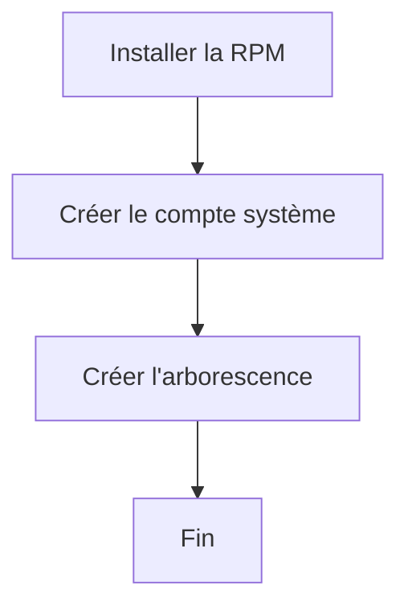

À ce stade, le serveur possède :

- l'application Sentinel ;
- son compte système ;
- une arborescence conforme aux conventions Linux.

Le prochain objectif sera de générer automatiquement le fichier de configuration à partir d'un template Jinja2.

## Étape 4 — Générer la configuration

L'application est installée.

L'utilisateur système existe.

L'arborescence est prête.

Nous pouvons désormais générer le fichier de configuration de Sentinel.

C'est la première fois que nous allons exploiter pleinement les mécanismes étudiés dans les chapitres précédents :

- les variables ;
- les templates Jinja2 ;
- le module `template` ;
- les handlers.

---

## Le template

Dans le rôle Sentinel, créons le fichier :

```text
roles/

└── sentinel/

    └── templates/

        └── sentinel.conf.j2
```

Ce fichier représentera **l'unique modèle officiel** de la configuration.

Par exemple.

```jinja2
[server]
listen_address = {{ sentinel.server.listen_address }}
listen_port = {{ sentinel.server.listen_port }}

[storage]
state_directory = /var/lib/sentinel

[logging]
level = {{ sentinel.logging.level }}

[tls]
enabled = {{ sentinel.tls.enabled | bool | lower }}
certificate = /etc/sentinel/tls/server.crt
private_key = /etc/sentinel/tls/server.key
client_ca = /etc/sentinel/tls/clients-ca.crt
require_client_certificate = true

[healthcheck]
server_name = {{ sentinel.healthcheck.server_name }}
certificate = /etc/sentinel/tls/healthcheck.crt
private_key = /etc/sentinel/tls/healthcheck.key

[identity]
allowed_dns_names = {{ sentinel.identity.allowed_dns_names | join(', ') }}
```

La valeur de `sentinel.healthcheck.server_name` doit être le nom DNS présent dans le SAN du certificat serveur, par exemple `sentinel.sentinel.lab`. Elle est distincte de l'adresse d'écoute : l'application peut se lier à une adresse IP tout en vérifiant une identité TLS DNS.

Aucune valeur n'est écrite en dur.

Toute la configuration provient des variables du rôle ou de l'inventaire.

---

## Déployer le template

Le fichier est ensuite généré avec le module :

```yaml
template:
```

Par exemple.

```yaml
- name: Générer la configuration Sentinel

  template:

    src: sentinel.conf.j2

    dest: /etc/sentinel/sentinel.conf

    owner: root

    group: sentinel

    mode: "0640"

  notify:

    - Restart Sentinel
```

À chaque exécution.

Ansible compare le contenu généré avec le fichier déjà présent.

Seules les différences sont appliquées.

---

## Pourquoi ces permissions ?

Le choix des permissions est important.

```text
0640
```

signifie :

- lecture/écriture pour `root` ;
- lecture pour le groupe `sentinel` ;
- aucun accès pour les autres utilisateurs.

Ainsi :

- seul l'administrateur peut modifier la configuration ;
- le service peut la lire ;
- les autres comptes du système ne peuvent pas consulter son contenu.

Cette politique respecte le principe du moindre privilège.

---

## Le rôle du handler

La tâche notifie :

```text
Restart Sentinel
```

uniquement si le fichier a réellement changé.

Le comportement est alors le suivant.

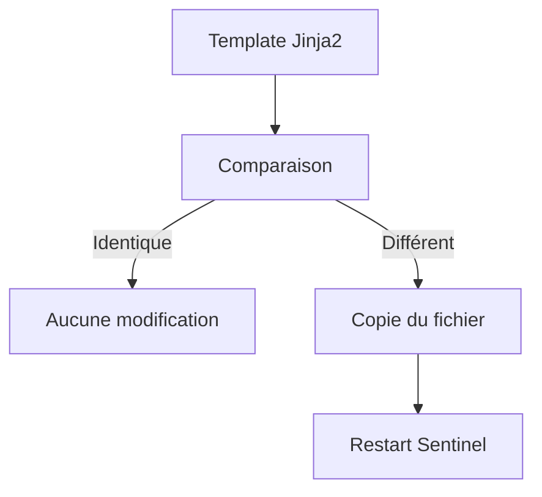

Le service n'est jamais redémarré inutilement.

---

## Une configuration pilotée par les variables

Imaginons qu'un nouveau serveur doive écouter sur un autre port.

Aucune modification du template n'est nécessaire.

Il suffit de définir :

```yaml
sentinel:

  server:

    listen_port: 9443
```

dans les variables appropriées.

Le prochain déploiement générera automatiquement un fichier adapté à ce serveur.

Le même template peut ainsi servir à un, dix ou cent serveurs sans être dupliqué.

C'est l'un des principes fondamentaux de l'Infrastructure as Code : **les modèles restent stables, seules les données évoluent.**

## Étape 5 — Déployer le service `systemd`

À ce stade, Sentinel est :

- installé ;
- configuré ;
- prêt à être lancé.

Il reste maintenant à indiquer au système **comment** démarrer l'application.

Sous AlmaLinux, cette responsabilité appartient à **systemd**.

Nous allons donc générer automatiquement l'unité de service.

---

## Pourquoi générer l'unité ?

Il serait possible de copier un fichier fixe.

Cependant, certaines informations peuvent varier d'un environnement à l'autre.

Par exemple :

- le chemin de l'exécutable ;
- le fichier de configuration ;
- les options de démarrage ;
- l'utilisateur du service ;
- les limites de ressources.

L'unité `systemd` devient donc un excellent candidat pour un template.

---

## Le template `systemd`

Créons le fichier :

```text
roles/

└── sentinel/

    └── templates/

        └── sentinel.service.j2
```

Un exemple simplifié pourrait être :

```ini
[Unit]
Description=Sentinel Security Platform
After=network-online.target

[Service]
Type=notify

NotifyAccess=main

User={{ sentinel.user }}

Group={{ sentinel.group }}

ExecStartPre={{ sentinel.install_dir }}/bin/sentinel \
    --config /etc/sentinel/sentinel.conf --check-config

ExecStart={{ sentinel.install_dir }}/bin/sentinel \
    --config /etc/sentinel/sentinel.conf serve

ExecStartPost={{ sentinel.install_dir }}/bin/sentinel \
    --config /etc/sentinel/sentinel.conf --healthcheck

Restart=on-failure

RestartSec=5s

WatchdogSec=10s

[Install]
WantedBy=multi-user.target
```

Comme précédemment.

Toutes les valeurs variables proviennent de l'inventaire ou des valeurs par défaut du rôle.

---

## Déployer l'unité

Le fichier est installé grâce au module :

```yaml
template:
```

```yaml
- name: Déployer l'unité systemd

  template:

    src: sentinel.service.j2

    dest: /etc/systemd/system/sentinel.service

    owner: root

    group: root

    mode: "0644"

  notify:

    - Reload systemd

    - Restart Sentinel
```

Deux handlers sont cette fois notifiés.

---

## Pourquoi recharger `systemd` ?

Contrairement à une simple application.

`systemd` conserve les unités en mémoire.

Lorsqu'un fichier :

```text
/etc/systemd/system/sentinel.service
```

est modifié.

Il faut exécuter :

```bash
systemctl daemon-reload
```

pour que `systemd` relise sa configuration.

Le handler correspondant pourra être défini ainsi.

```yaml
- name: Reload systemd

  systemd_service:

    daemon_reload: true
```

Sans cette étape, les modifications apportées à l'unité ne seraient pas prises en compte.

---

## Une séparation des responsabilités

À ce stade, notre rôle est structuré de manière claire.

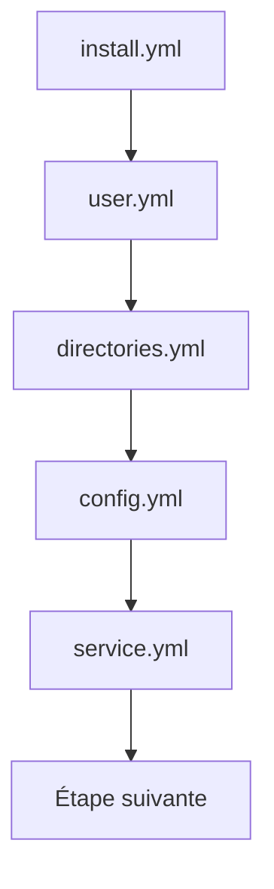

Chaque fichier traite un aspect précis du déploiement.

Cette organisation présente un avantage considérable.

Si un problème concerne uniquement l'unité `systemd`, il est immédiatement localisé dans le fichier correspondant, sans avoir à parcourir l'ensemble du rôle.

C'est cette modularité qui rend les rôles Ansible particulièrement adaptés aux projets de grande taille.

## Étape 6 — Activer et démarrer le service

L'unité `systemd` est maintenant présente sur le serveur.

Elle est connue de `systemd` grâce au rechargement du démon.

Il reste désormais à rendre le service opérationnel.

Cette étape consiste à :

- activer le service au démarrage ;
- démarrer le service ;
- vérifier qu'il fonctionne correctement.

---

## Activer le service

Sous `systemd`, un service peut être :

- installé mais désactivé ;
- activé mais arrêté ;
- activé et démarré.

Notre objectif est d'obtenir le troisième état.

Le module le plus adapté est :

```yaml
systemd_service:
```

Par exemple.

```yaml
- name: Activer et démarrer Sentinel

  systemd_service:

    name: sentinel

    enabled: true

    state: started
```

Cette tâche est entièrement idempotente.

---

## Que signifient ces paramètres ?

```yaml
enabled: true
```

Indique que Sentinel devra démarrer automatiquement lors du prochain démarrage du serveur.

En pratique, Ansible crée les liens symboliques nécessaires dans les répertoires de `systemd`.

---

```yaml
state: started
```

Demande à `systemd` de s'assurer que le service est actuellement en cours d'exécution.

Si Sentinel est déjà démarré.

Aucune action ne sera réalisée.

Si le service est arrêté.

Il sera lancé automatiquement.

---

## Pourquoi ne pas utiliser `restarted` ?

Une erreur fréquente consiste à écrire :

```yaml
state: restarted
```

Cette option redémarre systématiquement le service.

Même lorsqu'aucune modification n'a été apportée.

On perd alors une partie des bénéfices de l'idempotence.

Dans un rôle bien conçu.

Les redémarrages doivent être réservés aux handlers.

Les tâches classiques doivent simplement garantir que le service est :

```text
started
```

---

## Le déroulement complet

Le démarrage intervient naturellement après les étapes précédentes.

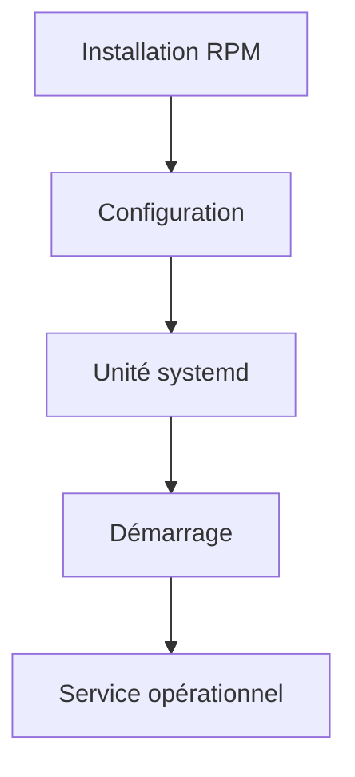

Chaque étape prépare la suivante.

Aucune n'est réalisée prématurément.

---

## Une responsabilité bien définie

Le fichier :

```text
service.yml
```

ne doit contenir que les opérations relatives au cycle de vie du service.

Par exemple :

- activation ;
- démarrage ;
- arrêt éventuel ;
- rechargement.

En revanche, il ne doit pas :

- copier des fichiers ;
- créer des utilisateurs ;
- modifier le pare-feu.

Cette séparation rend le rôle beaucoup plus facile à maintenir.

Lorsqu'un incident concerne uniquement le fonctionnement du service, un administrateur sait immédiatement où chercher sans parcourir l'ensemble du projet.

## Étape 7 — Vérifier le déploiement

Le service est désormais installé et démarré.

Un administrateur débutant pourrait considérer que le travail est terminé.

En réalité, une infrastructure industrialisée ne s'arrête jamais au déploiement.

Elle vérifie systématiquement que le résultat obtenu correspond à l'objectif attendu.

Cette étape est souvent appelée **validation post-déploiement**.

---

## Pourquoi vérifier ?

Un service peut être :

- installé ;
- démarré ;
- mais inutilisable.

Par exemple :

- le port TCP n'est pas ouvert ;
- le certificat TLS est absent ;
- un fichier possède de mauvaises permissions ;
- le service redémarre en boucle.

Le simple fait que `systemd` indique *active (running)* n'est donc pas une garantie suffisante.

---

## Une checklist de validation

Pour Sentinel, une première série de contrôles pourrait être :

- la RPM est installée ;
- le service est actif ;
- le service est activé au démarrage ;
- le fichier de configuration existe ;
- les certificats sont présents ;
- le port HTTPS est à l'écoute.

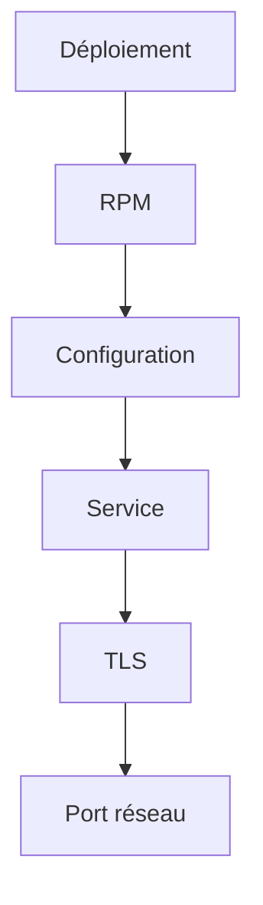

Chaque contrôle valide une couche différente de l'application.

---

## Vérifier le service

Le module :

```yaml
systemd_service:
```

permet également d'obtenir des informations sur un service.

Le résultat peut être enregistré.

```yaml
- name: Lire l'état du service

  systemd_service:

    name: sentinel

  register: sentinel_systemd
```

Les informations récupérées pourront ensuite être utilisées dans d'autres tâches.

Par exemple pour produire un rapport ou interrompre le playbook.

---

## Vérifier le port réseau

Une autre vérification consiste à confirmer que Sentinel écoute bien sur le port attendu.

Cette étape peut être réalisée de différentes manières.

Par exemple avec :

```bash
ss -lnt
```

ou encore :

```bash
ss -ltnp
```

Dans les chapitres suivants, nous verrons qu'Ansible dispose également de modules spécialisés permettant d'effectuer ce type de contrôle sans recourir systématiquement à une commande Shell.

---

## Une philosophie importante

Dans un projet professionnel, un déploiement n'est considéré comme réussi que lorsque les vérifications finales sont validées.

Autrement dit.

Le rôle ne doit pas seulement :

- installer ;
- configurer ;
- démarrer.

Il doit également **prouver** que l'application est opérationnelle.

Cette approche réduit considérablement le risque de découvrir un incident plusieurs heures après un déploiement.

Elle transforme le playbook en véritable procédure d'installation **et de validation**.

C'est cette philosophie que nous appliquerons désormais à toutes les automatisations développées pour Sentinel.

## Étape 8 — Gérer les échecs proprement

Dans les exemples précédents, nous avons supposé que toutes les tâches réussissaient.

En réalité, un déploiement peut échouer pour de nombreuses raisons.

Par exemple :

- un dépôt RPM est indisponible ;
- un certificat est expiré ;
- le serveur FreeIPA est inaccessible ;
- le disque est plein ;
- une dépendance est absente.

Un bon rôle ne cherche pas à masquer ces erreurs.

Il les détecte rapidement et s'arrête proprement.

---

## Le comportement par défaut

Lorsqu'une tâche échoue.

Ansible interrompt immédiatement l'exécution pour l'hôte concerné.

Par exemple.

```yaml
- name: Installer Sentinel

  dnf:

    name: sentinel

    state: present
```

Si le paquet est introuvable.

Les tâches suivantes ne seront pas exécutées.

Cette stratégie évite de poursuivre un déploiement déjà incohérent.

---

## Les blocs

Ansible permet de regrouper plusieurs tâches dans un bloc.

```yaml
- block:

    - name: Installer Sentinel
      dnf:
        name: sentinel
        state: present

    - name: Déployer la configuration
      template:
        src: sentinel.yml.j2
        dest: /etc/sentinel/sentinel.yml
```

À première vue.

Ce bloc ne change pas le comportement.

Son intérêt apparaît lorsque l'on ajoute une gestion des erreurs.

---

## Le bloc `rescue`

Une section :

```yaml
rescue:
```

est exécutée uniquement si une tâche du bloc échoue.

Exemple.

```yaml
- block:

    - name: Installer Sentinel
      dnf:
        name: sentinel
        state: present

  rescue:

    - name: Signaler l'échec
      debug:
        msg: "Le déploiement de Sentinel a échoué."
```

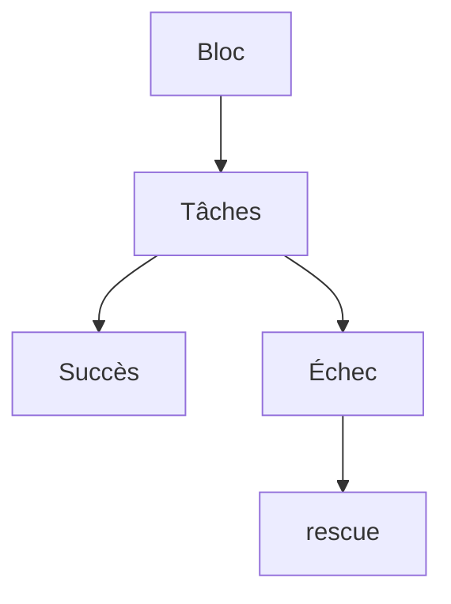

Le rôle peut ainsi produire un diagnostic plus clair avant de s'arrêter.

---

## Le bloc `always`

Une troisième section existe.

```yaml
always:
```

Les tâches qu'elle contient sont exécutées dans tous les cas.

Succès ou échec.

Par exemple.

```yaml
always:

  - name: Afficher la fin du déploiement

    debug:
      msg: "Fin du rôle Sentinel."
```

Cette section est particulièrement utile pour :

- supprimer des fichiers temporaires ;
- fermer des ressources ;
- produire un rapport final ;
- collecter des journaux en cas d'incident.

---

## Quand utiliser ces mécanismes ?

Il ne faut pas entourer chaque tâche d'un bloc.

En revanche, ils sont très utiles lorsque plusieurs opérations forment une seule étape logique.

Par exemple :

- installation d'un composant ;
- migration d'une base de données ;
- renouvellement d'un certificat ;
- intégration à FreeIPA.

Ces opérations doivent réussir dans leur ensemble.

En cas d'échec, il est souvent préférable de produire un message explicite plutôt que de laisser l'administrateur interpréter une simple erreur technique.

Cette approche améliore considérablement la qualité des rôles et facilite leur utilisation dans des environnements de production.

## Vérifier avant d'agir

L'une des qualités d'un bon rôle Ansible est de limiter les opérations inutiles.

Autrement dit.

Avant d'effectuer une action potentiellement coûteuse ou risquée, le rôle doit vérifier si elle est réellement nécessaire.

Cette philosophie est au cœur de l'idempotence.

---

## Le principe

Prenons un exemple.

Un certificat TLS doit être installé.

La mauvaise approche consiste à le recopier systématiquement.

```text
Copie

↓

Redémarrage

↓

Service indisponible quelques secondes
```

À chaque exécution.

Même si rien n'a changé.

---

## Une approche plus intelligente

Ansible compare automatiquement de nombreux éléments.

Par exemple.

- le contenu d'un fichier ;
- les permissions ;
- le propriétaire ;
- le groupe.

Si aucune différence n'est détectée.

La tâche renvoie simplement :

```text
ok
```

Aucune modification n'est réalisée.

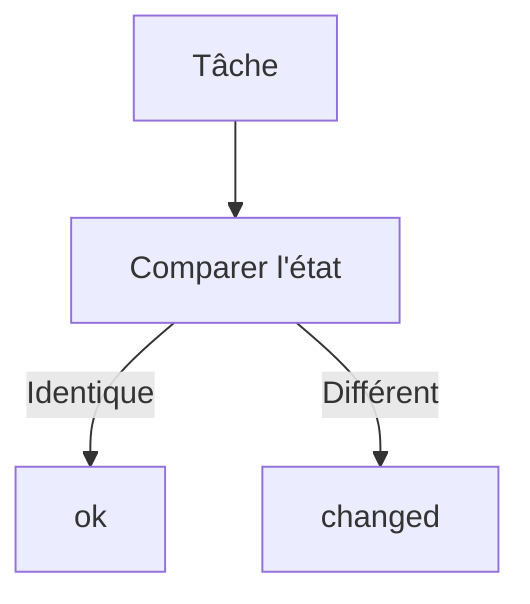

Le système reste stable.

---

## Vérifier les prérequis

Avant de déployer Sentinel, plusieurs conditions doivent être réunies.

Par exemple.

- le compte système existe ;
- les répertoires sont présents ;
- les certificats sont disponibles ;
- le domaine FreeIPA est accessible.

Plutôt que de laisser une erreur apparaître plus tard.

Le rôle peut contrôler ces prérequis dès le début.

Cette stratégie permet de produire des messages d'erreur beaucoup plus explicites.

---

## Le module `assert`

Ansible fournit un module spécialement conçu pour exprimer des préconditions.

```yaml
- name: Vérifier que TLS est activé

  assert:

    that:

      - sentinel.tls.enabled

    fail_msg: "TLS doit être activé."

    success_msg: "Configuration TLS valide."
```

Le rôle devient alors capable d'indiquer précisément pourquoi il refuse de poursuivre le déploiement.

---

## Pourquoi utiliser `assert` ?

Sans vérification.

Le playbook pourrait échouer beaucoup plus loin.

Par exemple lors du démarrage de Sentinel.

Le diagnostic serait alors plus difficile.

Avec :

```yaml
assert
```

l'erreur apparaît immédiatement.

Elle est généralement plus simple à comprendre.

---

## Une philosophie d'ingénierie

Dans une infrastructure moderne.

Un rôle ne doit pas seulement appliquer une configuration.

Il doit également vérifier que les hypothèses sur lesquelles il repose sont vraies.

Cette approche présente plusieurs avantages.

- Les erreurs sont détectées plus tôt.
- Les messages sont plus explicites.
- Le diagnostic est simplifié.
- Les déploiements deviennent plus fiables.

Cette manière de concevoir les rôles est très répandue dans les projets d'entreprise, où la qualité des messages d'erreur est presque aussi importante que la réussite du déploiement lui-même.

## Les vérifications finales avec `assert`

Le module `assert` n'est pas uniquement destiné à contrôler des prérequis.

Il peut également être utilisé à la fin d'un rôle afin de vérifier que le résultat obtenu correspond bien à l'objectif attendu.

Cette approche transforme le rôle en véritable procédure de validation.

---

## Une logique en deux temps

Le déroulement du rôle devient alors :

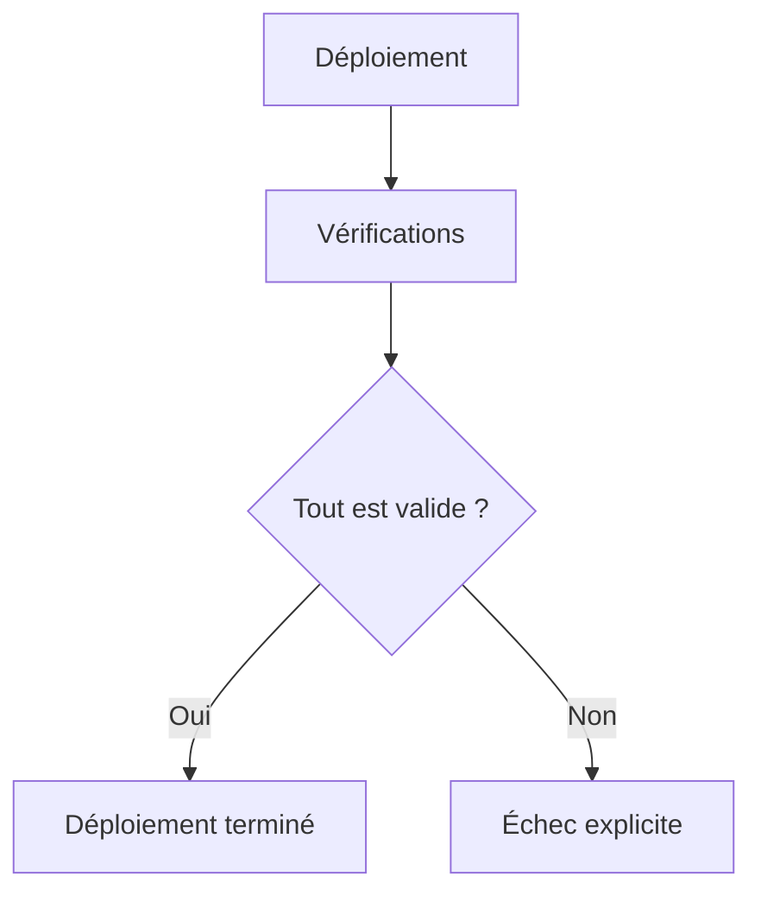

Le rôle ne se contente plus de modifier le système.

Il confirme que celui-ci est dans l'état attendu.

---

## Vérifier les éléments essentiels

Dans le cas de Sentinel, plusieurs points peuvent être contrôlés.

Par exemple.

- le service est actif ;
- le fichier de configuration existe ;
- les certificats sont présents ;
- le port HTTPS est défini ;
- les répertoires attendus existent.

Chaque vérification documente implicitement les exigences du projet.

---

## Exemple

Supposons que le rôle ait enregistré l'état du service.

```yaml
- name: Lire l'état de Sentinel

  systemd_service:

    name: sentinel

  register: sentinel_service
```

Une vérification pourrait ensuite être réalisée.

```yaml
- name: Vérifier que Sentinel est actif

  assert:

    that:

      - sentinel_service.status.ActiveState == "active"

    fail_msg: "Le service Sentinel n'est pas actif."

    success_msg: "Sentinel fonctionne correctement."
```

Le playbook devient immédiatement plus explicite.

---

## Une documentation vivante

Les assertions présentent un avantage souvent sous-estimé.

Elles décrivent les attentes du rôle.

Un nouvel administrateur peut les lire pour comprendre immédiatement les conditions de réussite.

Par exemple.

```text
Le service doit être actif.

↓

Le certificat doit être présent.

↓

Le fichier de configuration doit exister.
```

Les vérifications deviennent une forme de documentation technique directement exécutable.

---

## Une bonne pratique

Les assertions doivent porter sur les éléments importants.

En revanche, il est inutile de vérifier chaque détail du système.

Concentrez-vous sur les points dont dépend réellement le bon fonctionnement de l'application.

Pour Sentinel, cela signifie notamment :

- l'identité du service ;
- sa configuration ;
- son état ;
- ses certificats ;
- son accessibilité.

En appliquant systématiquement cette méthode, vos rôles ne se contenteront plus de déployer une application.

Ils seront capables de démontrer automatiquement que le déploiement est réellement opérationnel.

## Jalon Sentinel — version 0.6.0 inchangée

La campagne Ansible ne développe pas Sentinel 0.7.0. Elle déploie exactement le checkpoint 0.6.0 qualifié avec FreeIPA. Le changement porte sur la reproductibilité de l'installation, de la configuration, des certificats et des preuves.

### Épingler le produit attendu

Définissez dans les valeurs par défaut du rôle :

```yaml
sentinel_version: "0.6.0"
sentinel_package_release: "1"
sentinel_package_nevra: >-
  sentinel-{{ sentinel_version }}-{{ sentinel_package_release }}.el9.noarch
```

Le dépôt utilisé pendant cette campagne peut contenir un RPM pédagogique produit en amont. N'utilisez pas `latest` : la version déployée doit être une décision relue.

Après installation, interrogez les deux sources de vérité visibles :

```yaml
- name: Lire la version annoncée par Sentinel
  ansible.builtin.command:
    argv:
      - /opt/sentinel/bin/sentinel
      - --version
  register: sentinel_cli_version
  changed_when: false
  failed_when: sentinel_cli_version.stdout != "sentinel 0.6.0"

- name: Lire les paquets installés
  ansible.builtin.package_facts:
    manager: auto

- name: Vérifier la version du paquet Sentinel
  ansible.builtin.assert:
    that:
      - ansible_facts.packages.sentinel is defined
      - ansible_facts.packages.sentinel[0].version == sentinel_version
```

Une version CLI correcte dans un mauvais paquet, ou un bon paquet dont l'exécutable a été remplacé, doit déclencher une investigation. La campagne 10 approfondira cette chaîne avec RPM.

### Tester la fonction, pas seulement le processus

Après le flush des handlers, interrogez `/ready` avec l'identité dédiée :

```yaml
- name: Vérifier la disponibilité mTLS de Sentinel
  ansible.builtin.uri:
    url: "https://{{ inventory_hostname }}:{{ sentinel.server.listen_port }}/ready"
    method: GET
    ca_path: /etc/pki/ca-trust/source/anchors/ipa-ca.crt
    client_cert: /etc/sentinel/tls/healthcheck.crt
    client_key: /etc/sentinel/tls/healthcheck.key
    return_content: true
    status_code: 200
  register: sentinel_ready
  changed_when: false

- name: Vérifier le contrat de disponibilité
  ansible.builtin.assert:
    that:
      - sentinel_ready.json.status == "ready"
```

Complétez ce succès par un test exécuté depuis un hôte ou avec un certificat non autorisé. Selon la couche testée, le résultat attendu est un échec TLS ou HTTP 403. Ne désactivez jamais `validate_certs` pour faire réussir le playbook.

Le livrable du jalon comprend le rôle, l'inventaire sans secret, le diff du second passage idempotent et le résultat fonctionnel sur au moins deux hôtes. Le commit de l'application reste identique sur les deux machines.

## Industrialiser le rôle Sentinel

Au cours de ce chapitre, nous avons construit progressivement le rôle `sentinel`.

Pris individuellement, chacun de ses fichiers reste relativement simple.

C'est leur combinaison qui permet d'obtenir un déploiement entièrement automatisé.

---

## L'architecture finale

À ce stade, notre rôle possède une structure proche de celle-ci.

```text
roles/

└── sentinel/

    ├── defaults/
    │   └── main.yml

    ├── files/

    ├── handlers/
    │   └── main.yml

    ├── tasks/
    │   ├── main.yml
    │   ├── install.yml
    │   ├── user.yml
    │   ├── directories.yml
    │   ├── config.yml
    │   ├── systemd.yml
    │   ├── service.yml
    │   └── verify.yml

    ├── templates/
    │   ├── sentinel.yml.j2
    │   └── sentinel.service.j2

    ├── vars/
    │   └── main.yml

    └── meta/
        └── main.yml
```

Chaque élément possède une responsabilité unique.

---

## Le déroulement complet

Le rôle exécute maintenant une véritable chaîne de déploiement.

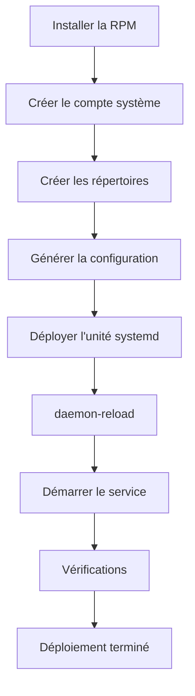

Chaque étape prépare naturellement la suivante.

---

## Ce que le rôle garantit

Après son exécution.

Le serveur possède automatiquement :

- l'application installée ;
- un compte système dédié ;
- une arborescence conforme ;
- une configuration générée automatiquement ;
- une unité `systemd` à jour ;
- un service démarré ;
- une validation finale.

Aucune intervention manuelle n'est nécessaire.

---

## Ce qui reste volontairement en dehors du rôle

Le rôle `sentinel` ne cherche pas à tout gérer.

Par exemple.

La configuration :

- de FreeIPA ;
- du pare-feu ;
- de Chrony ;
- de SELinux ;
- des dépôts RPM.

appartient à d'autres rôles.

Cette séparation respecte le principe de responsabilité unique.

Elle facilite énormément la maintenance.

---

## Une vision d'ensemble

Nous sommes désormais capables de déployer une application de manière entièrement automatisée.

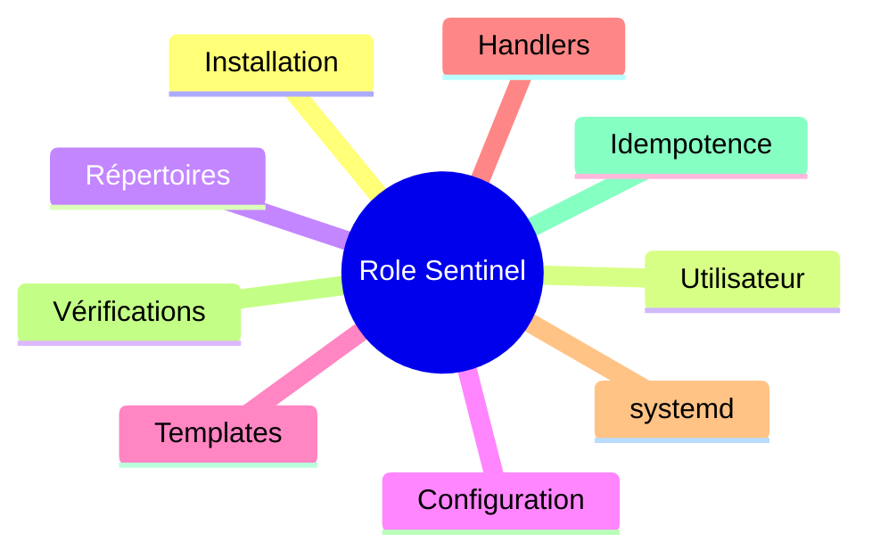

Toutes ces briques sont maintenant réunies dans un composant unique, réutilisable et facilement testable.

---

## Ce que nous avons réellement construit

Au-delà du simple rôle Ansible, nous avons progressivement mis en place plusieurs principes fondamentaux de l'ingénierie des infrastructures.

- Découpage par responsabilités.
- Idempotence.
- Infrastructure as Code.
- Validation automatique.
- Configuration pilotée par les données.
- Réutilisation des composants.

Ces principes s'appliquent bien au-delà d'Ansible.

On les retrouve dans la majorité des outils modernes d'automatisation et d'orchestration.

Le rôle Sentinel constitue ainsi une première brique d'une plateforme industrialisée.

Dans la campagne suivante, nous franchirons une nouvelle étape en intégrant automatiquement les serveurs au domaine **FreeIPA**, en obtenant leurs certificats et en construisant une chaîne de confiance entièrement automatisée.

## Synthèse

Le chapitre **Déployer Sentinel avec Ansible** établit une brique du socle de sécurité Sentinel.

Avant de poursuivre, vérifiez que vous savez :

- expliquer le rôle des mécanismes présentés ;
- distinguer leur configuration de leur état réellement observé ;
- valider leur comportement dans le laboratoire ;
- conserver une configuration explicite, vérifiable et reproductible.

---

← [9.6 — Les rôles Ansible](9.6-roles-ansible.md) · [9.8 — Intégrer Sentinel à FreeIPA](9.8-integrer-sentinel-freeipa.md) →
