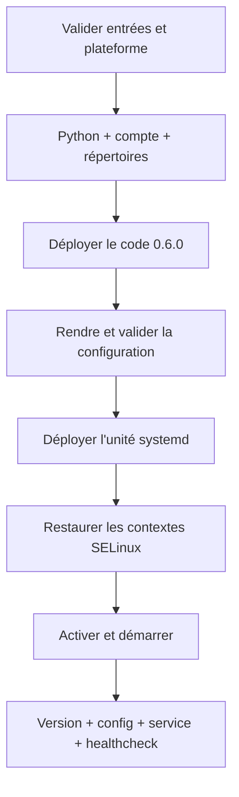

# Chapitre 9.7 — Déployer Sentinel avec Ansible

> **Campagne 9 — Déploiement avec Ansible**
>
> *« Un déploiement est terminé lorsque le service attendu fonctionne, refuse ce qu'il doit refuser et converge au second passage. »*

## Vous êtes ici

```text
Partie II — Industrialiser la sécurité

Campagne 9 — Déploiement avec Ansible

      9.1 Architecture Ansible
      9.2 Composants et idempotence
      9.3 Inventaires
      9.4 Premiers playbooks
      9.5 Variables et templates
      9.6 Rôles Ansible
    ► 9.7 Déploiement de Sentinel
      9.8 Intégration à FreeIPA
      9.9 Industrialisation du projet
      9.10 Mission de déploiement
```

## Objectifs pédagogiques

À la fin de ce chapitre, vous serez capable de :

- déployer le checkpoint Sentinel `0.6.0` depuis le projet Ansible ;
- gérer compte, arborescence, configuration et unité systemd ;
- préserver permissions et contextes SELinux ;
- valider version, configuration, service et fonction ;
- prouver l'idempotence et diagnostiquer un déploiement incomplet.

## Pourquoi ce chapitre existe

Un service `active` ne prouve pas que la bonne version tourne, que la configuration a été acceptée ou que `/ready` répond. Inversement, copier le code sans créer le compte et les permissions attendues contourne les protections des campagnes précédentes.

Le rôle `sentinel` automatise l'état complet sans modifier le code Python. La campagne 10 remplacera cette installation depuis les sources par un paquet RPM ; cette étape rend justement visible ce que le futur paquet devra prendre en charge.

## Contrat du rôle

Le rôle garantit :

| Objet | État attendu |
|---|---|
| version | checkpoint `0.6.0` explicitement sélectionné |
| compte | utilisateur système `sentinel`, sans shell interactif |
| code | `/opt/sentinel/src`, non modifiable par le service |
| configuration | `/etc/sentinel/sentinel.conf`, validée avant remplacement |
| données | `/var/lib/sentinel`, accessible au compte de service |
| unité | `/etc/systemd/system/sentinel.service` |
| service | activé et démarré |
| preuve | version, `--check-config`, état systemd et healthcheck |

Le rôle ne crée pas de CA, ne transporte pas de clé privée et ne désactive ni SELinux ni Firewalld.

## Variables essentielles

```yaml
sentinel_version: "0.6.0"
sentinel_source_checkpoint: >-
  {{ playbook_dir }}/../../sentinel-app/checkpoints/{{ sentinel_version }}
sentinel_service_user: sentinel
sentinel_install_root: /opt/sentinel
sentinel_config_path: /etc/sentinel/sentinel.conf
sentinel_state_directory: /var/lib/sentinel
sentinel_tls_enabled: false
```

TLS reste désactivé pendant le premier déploiement isolé. Le chapitre 9.8 enrôle l'hôte, obtient les certificats, puis active mTLS. Cette progression évite de demander à `--check-config` de lire des fichiers qui n'existent pas encore.

## Valider avant de modifier

`roles/sentinel/tasks/validate.yml` :

```yaml
---
- name: Valider les entrées du rôle Sentinel
  ansible.builtin.assert:
    that:
      - sentinel_version == "0.6.0"
      - sentinel_source_checkpoint is directory
      - sentinel_listen_port | int >= 1024
      - sentinel_listen_port | int <= 65535
      - not sentinel_tls_enabled or sentinel_allowed_dns_names | length > 0
    fail_msg: "Le contrat du rôle Sentinel n'est pas satisfait."

- name: Valider la plateforme administrée
  ansible.builtin.assert:
    that:
      - ansible_facts.os_family == "RedHat"
      - ansible_facts.distribution_major_version | int >= 9
```

La première assertion vérifie les entrées et le checkpoint côté contrôleur. La seconde utilise les faits de l'hôte. Elles précèdent toute mutation.

## Installer le moteur, le compte et le code

```yaml
---
- name: Installer les dépendances d'exécution
  ansible.builtin.package:
    name:
      - python3
    state: present

- name: Créer le compte système Sentinel
  ansible.builtin.user:
    name: "{{ sentinel_service_user }}"
    system: true
    create_home: false
    shell: /sbin/nologin
    state: present

- name: Créer les répertoires Sentinel
  ansible.builtin.file:
    path: "{{ item.path }}"
    state: directory
    owner: "{{ item.owner }}"
    group: "{{ item.group }}"
    mode: "{{ item.mode }}"
  loop:
    - path: "{{ sentinel_install_root }}/src"
      owner: root
      group: "{{ sentinel_service_user }}"
      mode: "0750"
    - path: /etc/sentinel
      owner: root
      group: "{{ sentinel_service_user }}"
      mode: "0750"
    - path: "{{ sentinel_state_directory }}"
      owner: "{{ sentinel_service_user }}"
      group: "{{ sentinel_service_user }}"
      mode: "0750"

- name: Déployer les sources Sentinel
  ansible.builtin.copy:
    src: "{{ sentinel_source_checkpoint }}/src/"
    dest: "{{ sentinel_install_root }}/src/"
    owner: root
    group: "{{ sentinel_service_user }}"
    mode: "0640"
  notify: Redémarrer Sentinel
```

Le processus lit le code mais ne peut pas le modifier. Le mode `0640` suffit puisque Python ouvre le fichier ; le bit exécutable n'est pas nécessaire lorsque l'unité appelle explicitement `/usr/bin/python3`.

Le déploiement de sources est volontairement pédagogique. Il duplique des fichiers et ne fournit pas les transactions, la base de paquets ni les scripts de migration d'un RPM.

## Générer la configuration

La tâche du chapitre 9.5 rend puis valide le template :

```yaml
- name: Déployer la configuration Sentinel
  ansible.builtin.template:
    src: sentinel.conf.j2
    dest: "{{ sentinel_config_path }}"
    owner: root
    group: "{{ sentinel_service_user }}"
    mode: "0640"
    validate: >-
      /usr/bin/python3 {{ sentinel_install_root }}/src/sentinel.py
      --config %s --check-config
  notify: Redémarrer Sentinel
```

Ajoutez `backup: true` seulement si la procédure explique la rétention et protège les anciennes configurations. Une sauvegarde automatique dans `/etc` n'est pas un plan de retour arrière complet.

## Déployer une unité systemd durcie

`roles/sentinel/templates/sentinel.service.j2` :

```ini
[Unit]
Description=Sentinel {{ sentinel_version }}
After=network-online.target
Wants=network-online.target

[Service]
Type=simple
User={{ sentinel_service_user }}
Group={{ sentinel_service_user }}
ExecStart=/usr/bin/python3 {{ sentinel_install_root }}/src/sentinel.py --config {{ sentinel_config_path }} serve
ExecStartPre=/usr/bin/python3 {{ sentinel_install_root }}/src/sentinel.py --config {{ sentinel_config_path }} --check-config
Restart=on-failure
RestartSec=5s
NoNewPrivileges=true
PrivateTmp=true
ProtectSystem=strict
ProtectHome=true
ReadWritePaths={{ sentinel_state_directory }}

[Install]
WantedBy=multi-user.target
```

Le template conserve les protections de la campagne 5. Il ne remplace pas la politique SELinux de la campagne 6 : DAC, sandbox systemd et MAC s'additionnent.

```yaml
- name: Déployer l'unité Sentinel
  ansible.builtin.template:
    src: sentinel.service.j2
    dest: /etc/systemd/system/sentinel.service
    owner: root
    group: root
    mode: "0644"
  notify:
    - Recharger systemd
    - Redémarrer Sentinel
```

## Restaurer les contextes SELinux

Ansible ne doit pas attribuer au hasard des contextes avec `chcon`. La règle persistante, créée lors de la campagne 6, reste la source de vérité. Après création des chemins :

```yaml
- name: Restaurer les contextes SELinux attendus
  ansible.builtin.command:
    argv:
      - restorecon
      - -RF
      - /opt/sentinel
      - /etc/sentinel
      - /var/lib/sentinel
  changed_when: false
```

`restorecon` peut modifier des contextes, mais sa sortie n'offre pas ici une détection simple et stable. Le rôle le traite comme une réconciliation ; une vérification séparée avec `matchpathcon -V` produit la preuve.

## Activer le service avec des handlers précis

```yaml
handlers:
  - name: Recharger systemd
    ansible.builtin.systemd_service:
      daemon_reload: true

  - name: Redémarrer Sentinel
    ansible.builtin.systemd_service:
      name: sentinel.service
      state: restarted
```

La tâche d'état courant ne force aucun redémarrage :

```yaml
- name: Activer et démarrer Sentinel
  ansible.builtin.systemd_service:
    name: sentinel.service
    enabled: true
    state: started
```

Si un template a changé, le handler redémarre. Sinon, `state: started` laisse le processus en place.

## Vérifier le produit et sa fonction

Une vérification progressive localise mieux la panne :

```yaml
- name: Vérifier la version Sentinel
  ansible.builtin.command:
    argv:
      - /usr/bin/python3
      - "{{ sentinel_install_root }}/src/sentinel.py"
      - --version
  register: version_result
  changed_when: false

- name: Vérifier la configuration installée
  ansible.builtin.command:
    argv:
      - /usr/bin/python3
      - "{{ sentinel_install_root }}/src/sentinel.py"
      - --config
      - "{{ sentinel_config_path }}"
      - --check-config
  changed_when: false

- name: Vérifier que systemd voit le service actif
  ansible.builtin.command: systemctl is-active sentinel.service
  changed_when: false

- name: Exécuter le healthcheck Sentinel
  ansible.builtin.command:
    argv:
      - /usr/bin/python3
      - "{{ sentinel_install_root }}/src/sentinel.py"
      - --config
      - "{{ sentinel_config_path }}"
      - --healthcheck
  changed_when: false
```

Après les commandes, des assertions contrôlent la version et les codes de retour. Le healthcheck exerce l'interface prévue par le produit, contrairement à une simple présence de processus.

## Ordre de convergence



Chaque étape prépare la suivante. Une vérification finale ne compense pas une dépendance implicite dans l'ordre.

## Diagnostic d'un échec

| Symptôme Ansible | Première preuve |
|---|---|
| template refusé | sortie de `--check-config` et fichier temporaire expurgé |
| handler échoue | `systemctl status` et `journalctl -u sentinel` |
| service actif, healthcheck en échec | configuration, certificats, `/ready`, journaux applicatifs |
| AVC SELinux | `ausearch -m AVC -ts recent -c sentinel -i` |
| second passage change encore | tâche `changed`, diff, données instables |

N'ajoutez pas `failed_when: false` à la vérification. Utilisez un bloc `rescue` pour collecter le diagnostic puis faites échouer le play avec le contexte utile.

## Jalon Sentinel — infrastructure `0.6.0`

### État de départ

Le code `0.6.0` et ses sept tests existent depuis la campagne 8. L'installation est encore décrite manuellement.

### Besoin

Reconstruire le service sur un hôte conforme sans changer son code ni affaiblir systemd, SELinux ou les permissions.

### Modification

Le rôle `sentinel` ajoute l'infrastructure versionnée : variables, tâches, templates, handlers et preuves.

### Compatibilité

Les options CLI, routes HTTP, configuration et données restent celles de `0.6.0`. La source du checkpoint est copiée telle quelle.

### Preuves

- tests Python du checkpoint réussis sur le contrôleur ;
- premier déploiement fonctionnel ;
- second passage avec `changed=0` ;
- version et configuration attendues ;
- service actif et healthcheck réussi ;
- aucun AVC inattendu.

### Échec attendu

Déployez temporairement un template avec un port hors plage. L'assertion ou `--check-config` doit refuser le fichier avant le redémarrage, et l'ancienne instance doit rester exploitable.

### Livrable

Le rôle et le playbook deviennent l'entrée du chapitre 9.8, qui ajoute l'identité FreeIPA et les certificats sans modifier le code.

## Synthèse

- le rôle déploie un état complet, pas seulement des fichiers ;
- compte, chemins, modes, systemd et SELinux préservent les protections acquises ;
- la configuration est validée avant remplacement ;
- les handlers redémarrent uniquement après un vrai changement ;
- version, configuration, service et healthcheck prouvent des couches différentes ;
- deux exécutions successives établissent l'idempotence ;
- Sentinel reste `0.6.0`, seul son déploiement devient reproductible.

## Infographie de révision

```text
CHECKPOINT 0.6.0
       ↓
RÔLE SENTINEL
  compte · code · config · unité
       ↓
PROTECTIONS CONSERVÉES
  permissions · systemd · SELinux
       ↓
ACCEPTATION
  version · config · active · healthcheck
       ↓
SECOND PASSAGE : changed=0
```

## Pour aller plus loin

Le service fonctionne encore sans TLS dans cette étape contrôlée. Le chapitre suivant automatise l'enrôlement FreeIPA et le passage ordonné vers les certificats mTLS de la campagne 8.

[Continuer vers le chapitre 9.8 — Intégrer Sentinel à FreeIPA](9.8-integrer-sentinel-freeipa.md)

Références : [ansible.builtin.copy](https://docs.ansible.com/ansible/latest/collections/ansible/builtin/copy_module.html), [ansible.builtin.systemd_service](https://docs.ansible.com/ansible/latest/collections/ansible/builtin/systemd_service_module.html), [ansible.builtin.assert](https://docs.ansible.com/ansible/latest/collections/ansible/builtin/assert_module.html) et [Error handling in playbooks](https://docs.ansible.com/ansible/latest/playbook_guide/playbooks_error_handling.html).
