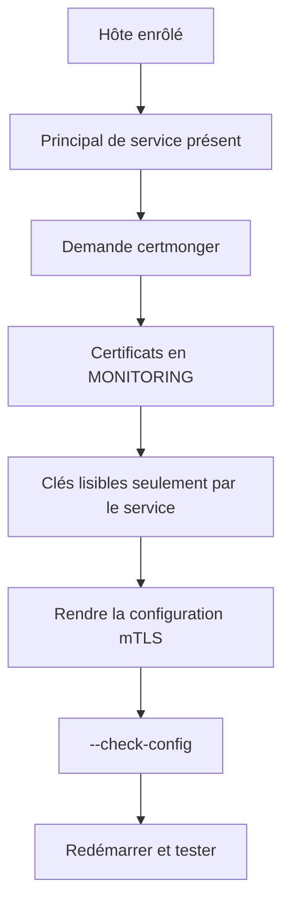

# Chapitre 9.8 — Automatiser l'intégration de Sentinel à FreeIPA

> **Campagne 9 — Déploiement avec Ansible**
>
> *« L'automatisation de l'identité doit réduire les manipulations de secrets, pas les multiplier sur le contrôleur. »*

## Vous êtes ici

```text
Partie II — Industrialiser la sécurité

Campagne 9 — Déploiement avec Ansible

      9.1 Architecture Ansible
      9.2 Composants et idempotence
      9.3 Inventaires
      9.4 Premiers playbooks
      9.5 Variables et templates
      9.6 Rôles Ansible
      9.7 Déploiement de Sentinel
    ► 9.8 Intégration à FreeIPA
      9.9 Industrialisation du projet
      9.10 Mission de déploiement
```

## Objectifs pédagogiques

À la fin de ce chapitre, vous serez capable de :

- utiliser la collection officielle `freeipa.ansible_freeipa` ;
- préparer DNS, temps et secrets avant l'enrôlement ;
- joindre des hôtes sans réécrire `ipa-client-install` dans un shell ;
- organiser la demande et le suivi local des certificats Sentinel ;
- activer mTLS seulement après validation de toute la chaîne.

## Pourquoi ce chapitre existe

La campagne 8 a construit manuellement les identités, l'enrôlement, les certificats et l'autorisation mTLS. Reproduire ces étapes avec une longue commande `ipa-client-install` et plusieurs `getcert request` ne suffit pas : il faut reconnaître l'état existant, protéger les secrets et conserver les clés sur leurs hôtes.

La collection du projet FreeIPA fournit des rôles et modules dédiés. Le projet Sentinel l'orchestre au lieu de réimplémenter son expertise.

## Épingler la collection

`requirements.yml` :

```yaml
---
collections:
  - name: freeipa.ansible_freeipa
    version: "1.16.0"
```

Installation :

```bash
ansible-galaxy collection install -r requirements.yml
ansible-galaxy collection list freeipa.ansible_freeipa
```

Épingler la version rend les exécutions comparables. Une montée de collection est une modification à tester et relire, pas un effet de bord du prochain contrôleur.

## Préconditions : le DNS et le temps d'abord

Avant l'enrôlement, vérifiez sur chaque client :

- FQDN stable ;
- résolution A/AAAA et PTR prévue ;
- découverte SRV du domaine ;
- heure synchronisée ;
- accès réseau aux services IdM.

```yaml
- name: Vérifier le FQDN du client
  ansible.builtin.assert:
    that:
      - ansible_facts.fqdn == inventory_hostname
    fail_msg: >-
      Le FQDN {{ ansible_facts.fqdn }} ne correspond pas
      à l'identité d'inventaire {{ inventory_hostname }}.

- name: Vérifier la découverte LDAP du domaine
  ansible.builtin.command:
    argv:
      - dig
      - +short
      - SRV
      - _ldap._tcp.sentinel.example.test
  register: ldap_srv
  changed_when: false
  failed_when: ldap_srv.rc != 0 or ldap_srv.stdout | length == 0
```

Un contournement dans `/etc/hosts` ne fournit pas les SRV. Le rôle doit s'arrêter avant d'inscrire partiellement l'hôte.

## Groupes d'inventaire et variables IdM

L'inventaire contient :

```yaml
ipa_servers:
  hosts:
    ipa01.sentinel.example.test:

ipaclients:
  children:
    sentinel_servers: {}
    sentinel_agents: {}
```

`group_vars/ipaclients.yml` :

```yaml
---
ipaclient_domain: sentinel.example.test
ipaclient_realm: SENTINEL.EXAMPLE.TEST
ipaclient_servers:
  - ipa01.sentinel.example.test
ipaclient_mkhomedir: true
ipaclient_no_ntp: true
ipaadmin_principal: admin
```

`ipaclient_no_ntp: true` signifie ici que le laboratoire gère déjà `chronyd` selon sa politique. Ne désactivez pas la configuration du temps sans fournir et vérifier une autre source.

Le mot de passe de l'administrateur n'apparaît pas dans ce fichier.

## Fournir le secret à la durée de l'exécution

Créez un fichier chiffré hors des exemples publics :

```bash
ansible-vault create inventories/lab/group_vars/ipaclients/vault.yml
```

Contenu déchiffré :

```yaml
vault_ipaadmin_password: valeur-fournie-par-le-gestionnaire-de-secrets
```

Le playbook associe explicitement la variable attendue :

```yaml
vars:
  ipaadmin_password: "{{ vault_ipaadmin_password }}"
```

Ansible Vault chiffre des données au repos. Le secret existe en mémoire pendant l'exécution et peut être divulgué par un module, un `debug`, une trace ou un processus enfant. Restreignez les logs et utilisez `no_log: true` sur les tâches qui manipulent réellement le secret, sans cacher tout le playbook.

Une alternative plus forte utilise un keytab administratif ou un secret à usage unique selon la procédure IdM. Le choix dépend de la capacité de révocation et du système de secrets de l'entreprise.

## Appeler le rôle `ipaclient`

`playbooks/enroll-freeipa.yml` :

```yaml
---
- name: Enrôler les clients FreeIPA
  hosts: ipaclients
  become: true
  gather_facts: true
  vars:
    ipaadmin_password: "{{ vault_ipaadmin_password }}"
  roles:
    - role: freeipa.ansible_freeipa.ipaclient
      state: present
```

La collection reconnaît un client déjà enrôlé et gère les opérations nécessaires. N'ajoutez pas `force_join` pour faire disparaître un échec : une identité existante, un `keytab` incohérent ou un DNS incorrect doit être diagnostiqué.

Après l'exécution :

```bash
ansible ipaclients -m ansible.builtin.command \
  -a 'ipa-client-install --status'
ansible ipaclients -m ansible.builtin.command \
  -a 'klist -k /etc/krb5.keytab'
ansible ipaclients -m ansible.builtin.command \
  -a 'sssctl domain-status sentinel.example.test'
```

Ces commandes de preuve ne doivent pas afficher les clés. Un principal visible ne prouve pas encore que HBAC, sudo et mTLS fonctionnent.

## Préserver SSSD et les politiques

Le rôle IdM configure SSSD selon les options d'enrôlement. Ne remplacez pas ensuite `/etc/sssd/sssd.conf` par un template générique : vous risqueriez de perdre les fournisseurs, permissions `0600`, domaines et paramètres gérés par le client IPA.

Les règles HBAC et sudo sont administrées dans FreeIPA. Le projet peut utiliser les modules de la collection pour déclarer ces objets, mais leur cycle de vie doit rester distinct du déploiement de l'application.

🧠 **Regard architecte** — l'hôte consomme l'identité via SSSD ; Sentinel consomme des certificats mTLS. Faire interroger LDAP directement par l'application recréerait une dépendance et un cache d'autorisation que le jalon `0.6.0` a volontairement évités.

## Demander les certificats sur l'hôte qui détient la clé

Le serveur et le healthcheck possèdent des identités distinctes :

```text
serveur      : HTTP/sentinel01.sentinel.example.test
SAN serveur  : sentinel01.sentinel.example.test
healthcheck  : identité cliente dédiée
agent01      : identité cliente propre à agent01
```

`certmonger` génère ou suit les clés localement. L'automatisation prépare le répertoire avec des permissions strictes, vérifie si une demande existe, puis crée le suivi uniquement lorsqu'il manque.

```yaml
- name: Créer le répertoire TLS de Sentinel
  ansible.builtin.file:
    path: /etc/sentinel/tls
    state: directory
    owner: root
    group: sentinel
    mode: "0750"

- name: Rechercher le certificat serveur suivi
  ansible.builtin.command:
    argv:
      - getcert
      - list
      - -f
      - /etc/sentinel/tls/server.crt
  register: server_tracking
  changed_when: false
  failed_when: server_tracking.rc not in [0, 1]

- name: Demander le certificat serveur à IdM
  ansible.builtin.command:
    argv:
      - getcert
      - request
      - -c
      - IPA
      - -f
      - /etc/sentinel/tls/server.crt
      - -k
      - /etc/sentinel/tls/server.key
      - -K
      - HTTP/sentinel01.sentinel.example.test
      - -D
      - sentinel01.sentinel.example.test
  when: server_tracking.rc == 1
  notify: Redémarrer Sentinel
```

Le principal et le SAN doivent venir de variables liées à `inventory_hostname`, pas être codés pour tous les hôtes. La tâche d'exemple montre le contrat, tandis que le rôle final les paramètre.

L'idempotence ne s'arrête pas à la présence du fichier : `getcert list` doit montrer `MONITORING`, les chemins et la CA attendus. Un certificat expiré présent sur disque n'est pas un succès.

## Ordonner la bascule mTLS

L'activation suit une chaîne stricte :



Activer la configuration avant l'émission provoquerait un arrêt. Copier provisoirement une clé privée depuis le contrôleur résoudrait le symptôme en détruisant le modèle de confiance.

## Vérifier trois couches

### Domaine

```bash
getent passwd alice
id alice
kinit alice
klist
sssctl user-checks alice
```

### Certificats

```bash
sudo getcert list
sudo -u sentinel test -r /etc/sentinel/tls/server.key
openssl x509 -in /etc/sentinel/tls/server.crt \
  -noout -subject -issuer -dates -ext subjectAltName
```

### Sentinel

Rejouez les trois scénarios de la campagne 8 :

1. client sans certificat → échec TLS ;
2. certificat IdM dont le SAN n'est pas autorisé → HTTP `403` ;
3. `agent01` autorisé → réponse de la route attendue.

Un playbook de vérification peut appeler `ansible.builtin.uri` depuis l'hôte agent avec ses chemins locaux. Les clés ne sont jamais rapatriées sur le contrôleur.

## Retour arrière

Le retour arrière applicatif restaure ensemble configuration et code connus. Pour l'identité :

- retirer un certificat du suivi seulement si son remplacement est prêt ;
- révoquer selon la procédure IdM lorsque l'identité n'est plus valable ;
- désenrôler un hôte avec le rôle en `state: absent` uniquement lors d'un retrait prévu ;
- ne pas supprimer l'objet hôte et son `keytab` pour corriger une panne non comprise.

Le rôle FreeIPA est capable de retirer un client ; cette capacité destructive n'autorise pas son utilisation pendant un diagnostic ordinaire.

## Laboratoire — intégration complète

1. installez la collection épinglée ;
2. chargez le secret Vault sans l'afficher ;
3. exécutez les précontrôles DNS et temps ;
4. enrôlez `sentinel01` et `agent01` ;
5. vérifiez SSSD et les principaux d'hôte ;
6. créez et suivez les certificats sur leurs hôtes ;
7. activez mTLS dans les variables Sentinel ;
8. déployez puis exécutez les trois tests ;
9. relancez les playbooks et exigez `changed=0`.

Échec attendu : utilisez une VM témoin dont la découverte SRV est absente. Le précontrôle doit refuser l'enrôlement avant toute modification IdM.

## Impact sur Sentinel

Sentinel reste `0.6.0`. Son environnement est maintenant reconstruit par Ansible : client IdM, certificats renouvelables, configuration mTLS et liste des SAN autorisés. L'application continue d'autoriser localement les identités DNS après validation TLS.

## Synthèse

- la collection FreeIPA remplace une réécriture fragile de l'enrôlement ;
- DNS, FQDN et temps sont validés avant l'inscription du client ;
- les secrets sont fournis à l'exécution et jamais affichés volontairement ;
- SSSD reste géré par l'intégration IPA, pas par un template concurrent ;
- les clés privées sont générées et conservées sur les hôtes qui les utilisent ;
- l'état `MONITORING` compte davantage que la seule présence d'un certificat ;
- la bascule mTLS attend que principal, certificat, permissions et configuration soient prêts.

## Infographie de révision

```text
DNS + TEMPS
      ↓
RÔLE IPACLIENT
  hôte · keytab · SSSD
      ↓
CERTMONGER LOCAL
  clé privée · certificat · suivi
      ↓
RÔLE SENTINEL
  mTLS · SAN autorisés
      ↓
PREUVES : TLS refusé · 403 · 200
```

## Pour aller plus loin

Le déploiement fonctionne dans le laboratoire. Le chapitre suivant organise versions, environnements, secrets, contrôles qualité et CI pour qu'un collectif puisse le maintenir.

[Continuer vers le chapitre 9.9 — Industrialiser le projet](9.9-industrialiser-laboratoire.md)

Références : [FreeIPA Ansible collection](https://github.com/freeipa/ansible-freeipa), [ipaclient role](https://github.com/freeipa/ansible-freeipa/blob/master/roles/ipaclient/README.md), [Ansible Vault](https://docs.ansible.com/ansible/latest/vault_guide/index.html) et [Managing certificates in IdM](https://docs.redhat.com/en/documentation/red_hat_enterprise_linux/9/html/managing_certificates_in_idm/).
