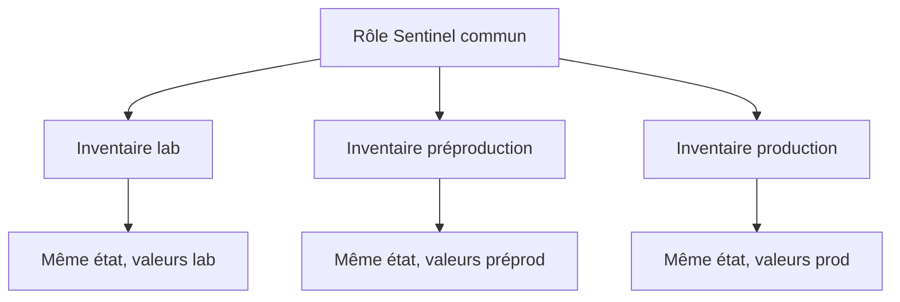

# Chapitre 9.9 — Industrialiser le projet Ansible

> **Campagne 9 — Déploiement avec Ansible**
>
> *« L'automatisation devient un produit collectif lorsqu'elle possède des versions, des tests, des propriétaires et des preuves. »*

## Vous êtes ici

```text
Partie II — Industrialiser la sécurité

Campagne 9 — Déploiement avec Ansible

      9.1 Architecture Ansible
      9.2 Composants et idempotence
      9.3 Inventaires
      9.4 Premiers playbooks
      9.5 Variables et templates
      9.6 Rôles Ansible
      9.7 Déploiement de Sentinel
      9.8 Intégration à FreeIPA
    ► 9.9 Industrialisation du projet
      9.10 Mission de déploiement
```

## Objectifs pédagogiques

À la fin de ce chapitre, vous serez capable de :

- organiser un dépôt Ansible maintenable ;
- séparer environnements, code, données et secrets ;
- épingler les dépendances et contrôler la configuration du moteur ;
- construire une chaîne de validation locale et CI ;
- produire des preuves d'exécution sans divulguer d'informations sensibles.

## Pourquoi ce chapitre existe

Un playbook exécuté avec succès sur le poste de son auteur n'est pas encore une automatisation d'entreprise. Il faut pouvoir expliquer la version d'Ansible, les collections chargées, l'inventaire ciblé, les contrôles réalisés et la personne qui a approuvé le changement.

Industrialiser ne signifie pas ajouter immédiatement une plateforme complexe. Cela signifie rendre les dépendances et le cycle de modification explicites.

## Une arborescence orientée responsabilités

Le laboratoire adopte :

```text
sentinel/labs/ansible/
├── .gitignore
├── README.md
├── ansible.cfg
├── requirements.yml
├── inventories/
│   └── lab/
│       ├── hosts.yml
│       ├── group_vars/
│       └── host_vars/
├── playbooks/
│   ├── deploy-sentinel.yml
│   ├── enroll-freeipa.yml
│   ├── site.yml
│   └── verify.yml
└── roles/
    └── sentinel/
```

Le dépôt contient la logique et les exemples non secrets. Les artefacts d'exécution, clés privées, mots de passe Vault en clair et caches n'y entrent pas.

## Un inventaire par environnement

Les environnements représentent des sources de vérité distinctes :

```text
inventories/
├── lab/
├── preproduction/
└── production/
```

Les rôles restent communs. Les groupes et variables décrivent les différences : noms DNS, adresses, nombres de serveurs ou politique de déploiement.

Évitez une variable `environment: production` qui déclenche de grands blocs conditionnels dans tous les rôles. Les données doivent piloter les différences réelles ; le rôle doit conserver le même contrat.



## Maîtriser `ansible.cfg`

Le fichier de projet fixe les comportements attendus :

```ini
[defaults]
inventory = inventories/lab/hosts.yml
roles_path = roles
host_key_checking = True
retry_files_enabled = False
interpreter_python = auto_silent

[privilege_escalation]
become = True
become_method = sudo
```

Vérifiez le fichier réellement chargé :

```bash
ansible --version
ansible-config dump --only-changed
```

Ansible recherche sa configuration selon un ordre défini. Un `ansible.cfg` inattendu dans le répertoire courant ou une variable d'environnement peut changer le comportement. La CI doit démarrer depuis la racine du projet avec une configuration connue.

N'inscrivez pas un mot de passe, une clé privée ou un chemin personnel dans `ansible.cfg`.

## Épingler les dépendances

`requirements.yml` versionne les collections :

```yaml
---
collections:
  - name: freeipa.ansible_freeipa
    version: "1.16.0"
```

Ansible lui-même doit aussi posséder une version maîtrisée par le paquet du contrôleur, un environnement Python verrouillé ou un *execution environment* construit et identifié.

Le couple « dépôt Git + dernière version disponible » n'est pas reproductible. Une mise à jour de dépendance passe par une PR, une lecture des changements et les mêmes tests que le code local.

## Gérer les secrets

Ansible Vault chiffre un fichier ou une variable :

```bash
ansible-vault create inventories/lab/group_vars/ipaclients/vault.yml
ansible-vault view inventories/lab/group_vars/ipaclients/vault.yml
ansible-vault rekey inventories/lab/group_vars/ipaclients/vault.yml
```

Un fichier `vault.example.yml` documente les noms attendus sans valeur réelle :

```yaml
---
vault_ipaadmin_password: CHANGE_ME_WITH_A_SECRET_SOURCE
```

Le secret de déchiffrement n'est jamais stocké à côté du coffre. En CI, utilisez le mécanisme secret de la plateforme ou un gestionnaire externe, avec une identité et une durée de vie limitées.

`no_log: true` évite certaines sorties, mais réduit aussi le diagnostic. Appliquez-le aux tâches qui manipulent réellement une valeur sensible, puis vérifiez les étapes non sensibles séparément.

⚔️ **Regard attaquant** — un coffre chiffré peut être copié et attaqué hors ligne. La robustesse de son secret, la rotation et la réduction du contenu restent importantes. Vault ne remplace pas un gestionnaire de secrets à identité forte et audit d'accès.

## La chaîne de validation

Un changement suit une progression de coût et de risque :


Commandes locales :

```bash
ansible-inventory --graph
ansible-playbook playbooks/site.yml --syntax-check
ansible-playbook playbooks/site.yml --list-hosts
ansible-playbook playbooks/site.yml --check --diff \
  --limit sentinel01.sentinel.example.test
```

Ajoutez `ansible-lint` dans l'environnement de développement ou de CI pour détecter FQCN manquants, commandes risquées et styles incohérents. Un linter signale des risques ; il ne prouve pas la conformité fonctionnelle de l'hôte.

## Tester l'idempotence en CI

La syntaxe peut être testée sans serveur. L'idempotence exige une cible contrôlée : VM éphémère, environnement de test ou image compatible avec les fonctions utilisées.

Le job d'intégration :

1. construit ou restaure une cible propre ;
2. installe les dépendances épinglées ;
3. exécute le playbook ;
4. exécute les tests fonctionnels ;
5. relance le playbook ;
6. échoue si le second récapitulatif contient un changement inattendu ;
7. détruit la cible et les secrets temporaires.

Un conteneur ne reproduit pas automatiquement systemd, SELinux, Firewalld ou l'enrôlement FreeIPA. Pour ces couches, une VM AlmaLinux est une cible plus fidèle.

## Revue et promotion

Le passage vers un environnement supérieur ne copie pas des fichiers modifiés à la main. Il promeut un commit ou un tag déjà testé et fournit l'inventaire autorisé.

Une PR doit répondre à :

- quels hôtes et objets peuvent changer ?
- quel diff de configuration est attendu ?
- quels handlers peuvent interrompre un service ?
- comment réduire le lot avec `serial` ou `--limit` ?
- quelles preuves déterminent le succès ?
- quel état connu permet le retour arrière ?

🧠 **Regard architecte** — une validation humaine reste nécessaire lorsque le diff change une frontière de confiance, une politique `sudo`, un SAN autorisé ou la stratégie de déploiement.

## Journaliser sans tout conserver

Les preuves utiles comprennent :

- commit et version des dépendances ;
- inventaire et motif ciblés, expurgés ;
- date, opérateur ou identité CI ;
- récapitulatif par hôte ;
- validations fonctionnelles ;
- incident et correction lorsqu'une tâche échoue.

N'archivez pas aveuglément la sortie verbeuse : elle peut contenir arguments de modules, noms internes, certificats ou secrets. Définissez une rétention et minimisez les données.

## Dérive et exécutions périodiques

Rejouer Ansible peut détecter et corriger certaines dérives, mais un passage automatique en production peut aussi écraser une modification d'urgence avant son analyse.

Séparez :

- **détection** : mode check, rapport et alerte ;
- **remédiation** : exécution approuvée selon le niveau de risque.

Une modification locale justifiée doit être reportée dans Git. Sinon, elle disparaîtra au prochain passage et l'équipe perdra son historique.

## Laboratoire — dossier de qualification

Pour une modification de `sentinel_listen_port`, produisez :

1. PR et justification ;
2. sortie de `ansible-config dump --only-changed` ;
3. versions d'Ansible et des collections ;
4. `--syntax-check` et `--list-hosts` ;
5. diff expurgé de `sentinel.conf` ;
6. premier passage ;
7. second passage `changed=0` ;
8. healthcheck ;
9. test Firewalld et absence d'AVC inattendu ;
10. procédure de retour au port précédent.

Échec attendu : ajoutez une variable non définie dans un template. La CI doit échouer avant le déploiement. N'ajoutez pas un `default` arbitraire pour masquer l'oubli.

## Impact sur Sentinel

Sentinel reste `0.6.0`. Son infrastructure reçoit désormais son propre cycle de qualité : dépendances épinglées, inventaires séparés, secrets externes, tests, promotion et audit d'exécution.

## Synthèse

- un dépôt Ansible sépare logique, inventaires, secrets et artefacts ;
- les rôles communs sont pilotés par des valeurs d'environnement explicites ;
- `ansible.cfg`, Ansible et les collections doivent être maîtrisés ;
- Vault protège au repos sans résoudre tout le cycle de vie d'un secret ;
- lint, syntaxe, check, déploiement, idempotence et acceptation prouvent des propriétés différentes ;
- la promotion porte un commit testé, pas des fichiers modifiés manuellement ;
- détection de dérive et remédiation ne possèdent pas toujours la même autorisation.

## Infographie de révision

```text
COMMIT
  code · inventaire · versions
      ↓
QUALIFICATION
  lint · syntaxe · check · diff
      ↓
LABORATOIRE
  passage 1 · tests · passage 2
      ↓
PROMOTION APPROUVÉE
  lot · preuves · retour arrière
      ↓
AUDIT ET DÉRIVE
```

## Pour aller plus loin

Tous les composants existent. La mission finale demande de reconstruire une plateforme Sentinel complète et de défendre chaque preuve devant un autre administrateur.

[Continuer vers le chapitre 9.10 — Mission de déploiement](9.10-mission-deploiement-sentinel.md)

Références : [Ansible configuration settings](https://docs.ansible.com/ansible/latest/reference_appendices/config.html), [Installing collections](https://docs.ansible.com/ansible/latest/collections_guide/collections_installing.html), [Ansible Vault](https://docs.ansible.com/ansible/latest/vault_guide/index.html) et [Testing strategies](https://docs.ansible.com/ansible/latest/reference_appendices/test_strategies.html).
