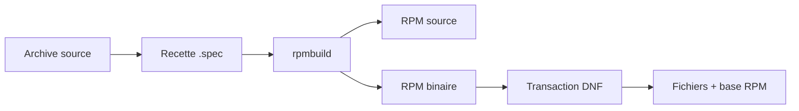
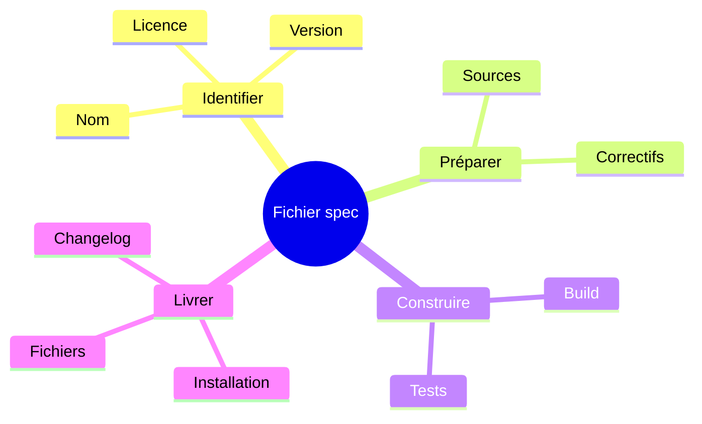
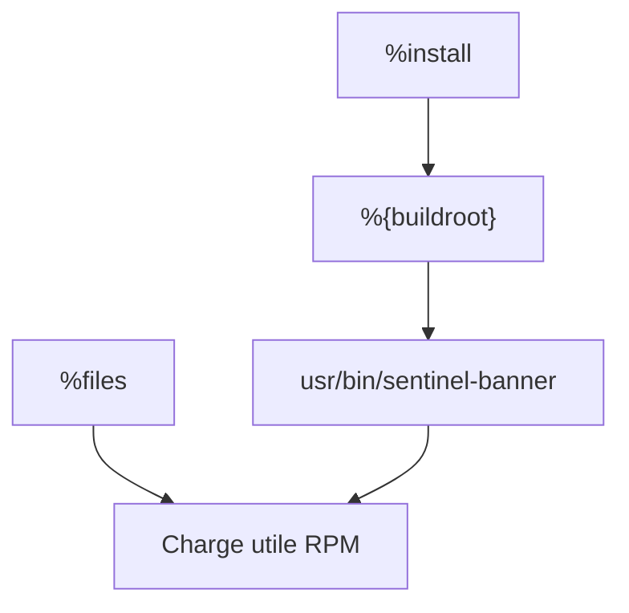
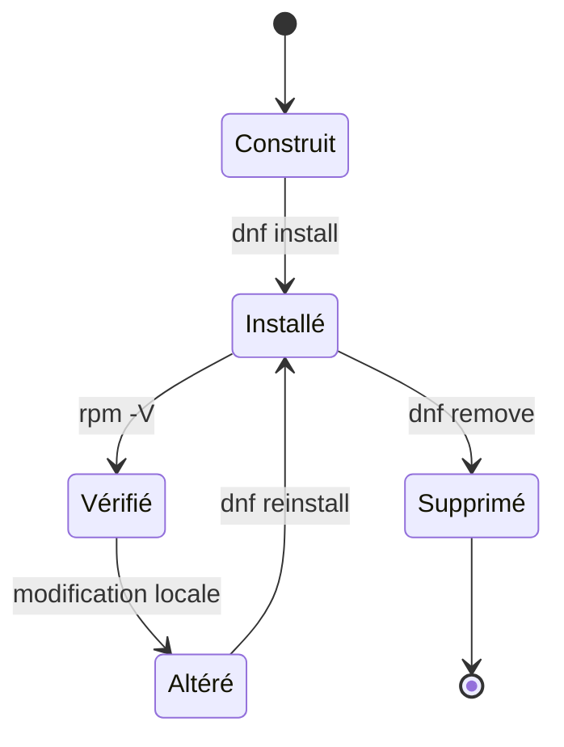

# Chapitre 10.1 — Construire un paquet RPM

> **Campagne 10 — RPM et cycle de vie**

> *« Un logiciel copié à la main est un fichier. Un logiciel empaqueté devient un composant administrable. »*

## Vous êtes ici

```text
PARTIE III — Industrialiser les déploiements

Campagne 10

► 10.1 Construire un paquet RPM
  10.2 Gérer les dépendances
  10.3 Gérer les fichiers de configuration
  10.4 Signer les paquets
  10.5 Exploiter un dépôt RPM privé
  10.6 Packager Sentinel
```

## Objectifs pédagogiques

À l'issue de ce chapitre, vous serez capable de :

- expliquer la différence entre une archive source, un SRPM et un RPM binaire ;
- préparer un espace de construction RPM sans utiliser le compte `root` ;
- lire les sections essentielles d'un fichier `.spec` ;
- construire, inspecter, installer et supprimer un premier paquet ;
- relier le contenu d'un paquet au cycle de vie du système.

## Pourquoi ce chapitre existe

Jusqu'ici, Sentinel a été installé par des commandes, des copies de fichiers et des automatisations Ansible. Cette méthode permet d'apprendre, mais elle ne fournit pas à AlmaLinux une réponse fiable à des questions simples :

- quelle version est installée ?
- quels fichiers appartiennent à l'application ?
- comment vérifier qu'ils n'ont pas été modifiés ?
- comment mettre à niveau ou désinstaller proprement l'ensemble ?

RPM transforme une livraison artisanale en **objet géré par le système**. Le paquet décrit les fichiers, leur destination, leurs métadonnées et les opérations nécessaires à sa construction. DNF pourra ensuite orchestrer son installation et ses mises à jour.

## Du code source au logiciel installé

RPM intervient à plusieurs étapes. Il faut distinguer les objets manipulés.



| Objet | Contenu | Usage principal |
|---|---|---|
| archive source | code, documentation, licence | matière première du build |
| fichier `.spec` | métadonnées et recette | décrire comment construire le paquet |
| SRPM | sources et recette | reconstruire et auditer la provenance |
| RPM binaire | fichiers installables et métadonnées | installer sur une machine cible |
| base RPM | état des paquets installés | interroger et vérifier le système |

Le RPM binaire n'est donc pas seulement une archive compressée. Il contient aussi le nom du paquet, sa version, son architecture, ses dépendances, ses sommes de contrôle et la liste exacte des fichiers à gérer.

> **Regard sécurité** — La reproductibilité ne garantit pas à elle seule la confiance. Elle permet cependant de rendre la fabrication observable, contrôlable et répétable. La signature sera ajoutée au chapitre 10.4.

## Le modèle mental du fichier `.spec`

Le fichier `.spec` répond à quatre questions.



Les sections les plus courantes sont les suivantes.

| Section | Rôle |
|---|---|
| en-tête | nom, version, release, licence, sources et architecture |
| `%description` | description fonctionnelle du paquet |
| `%prep` | décompression et préparation des sources |
| `%build` | compilation ou transformation du logiciel |
| `%install` | copie dans un faux système de fichiers, le `buildroot` |
| `%check` | tests exécutés avant la création du paquet |
| `%files` | manifeste des fichiers possédés par le paquet |
| `%changelog` | historique des versions de packaging |

### Le `buildroot` n'est pas la machine

Pendant `%install`, les fichiers ne doivent jamais être écrits directement dans `/usr` ou `/etc`. Ils sont placés sous `%{buildroot}`, une racine temporaire.



Ainsi, cette instruction :

```spec
install -Dpm 0755 sentinel-banner \
  %{buildroot}%{_bindir}/sentinel-banner
```

prépare le futur fichier `/usr/bin/sentinel-banner` sans modifier le poste de construction.

### Les macros évitent les chemins figés

RPM fournit des macros de chemins et de contexte.

```bash
rpm --eval '%{_bindir}'
rpm --eval '%{_sysconfdir}'
rpm --eval '%{_unitdir}'
rpm --eval '%{?dist}'
```

Sur AlmaLinux, `%{_bindir}` désigne normalement `/usr/bin` et `%{_sysconfdir}` désigne `/etc`. Utiliser les macros rend la recette plus lisible et plus portable dans la famille RPM.

## Préparer le poste de construction

Le build s'effectue avec un compte ordinaire. Le compte `root` n'améliore pas la qualité du paquet ; il augmente seulement l'impact d'une recette défectueuse ou hostile.

Installez les outils minimaux :

```bash
sudo dnf install rpm-build
```

Créez l'arborescence de travail :

```bash
mkdir -p ~/rpmbuild/{BUILD,BUILDROOT,RPMS,SOURCES,SPECS,SRPMS}
```

Elle a une responsabilité par répertoire.

```text
~/rpmbuild/
├── BUILD/       # sources préparées pendant le build
├── BUILDROOT/   # racines temporaires d'installation
├── RPMS/        # paquets binaires produits
├── SOURCES/     # archives et fichiers sources
├── SPECS/       # recettes .spec
└── SRPMS/       # paquets source produits
```

Le paquet `rpmdevtools`, lorsqu'il est disponible dans les dépôts activés, fournit également `rpmdev-setuptree`. La création manuelle ci-dessus reste suffisante pour le laboratoire.

## TP 1 — Construire `sentinel-banner`

Ce premier paquet installe une commande sans dépendance applicative. L'objectif est d'observer tout le pipeline avant d'ajouter la complexité de Sentinel.

### Créer les sources

```bash
mkdir -p /tmp/sentinel-banner-1.0.0

cat > /tmp/sentinel-banner-1.0.0/sentinel-banner <<'EOF'
#!/usr/bin/bash
echo "Sentinel packaging lab 1.0.0"
EOF

cat > /tmp/sentinel-banner-1.0.0/LICENSE <<'EOF'
MIT License — educational example
EOF

chmod 0755 /tmp/sentinel-banner-1.0.0/sentinel-banner
tar -C /tmp -czf ~/rpmbuild/SOURCES/sentinel-banner-1.0.0.tar.gz \
  sentinel-banner-1.0.0
```

L'archive contient un répertoire racine dont le nom correspond à `nom-version`. Cette convention permet à `%autosetup` de retrouver les sources.

### Écrire la recette

Créez `~/rpmbuild/SPECS/sentinel-banner.spec` :

```spec
Name:           sentinel-banner
Version:        1.0.0
Release:        1%{?dist}
Summary:        Bannière du laboratoire de packaging Sentinel
License:        MIT
Source0:        %{name}-%{version}.tar.gz
BuildArch:      noarch

%description
Commande pédagogique utilisée pour découvrir la construction et
le cycle de vie d'un paquet RPM sur AlmaLinux.

%prep
%autosetup

%build
# Aucun build : le projet contient un script prêt à installer.

%install
install -Dpm 0755 sentinel-banner \
  %{buildroot}%{_bindir}/sentinel-banner

%check
test -x %{buildroot}%{_bindir}/sentinel-banner
%{buildroot}%{_bindir}/sentinel-banner | grep -Fqx \
  'Sentinel packaging lab 1.0.0'

%files
%license LICENSE
%{_bindir}/sentinel-banner

%changelog
* Fri Jul 17 2026 Sentinel Training <rpm-signing@example.invalid> - 1.0.0-1
- Première version pédagogique
```

Le `Release` décrit la révision du packaging pour une même version du logiciel. Une correction de la recette donnerait `1.0.0-2`, tandis qu'une évolution fonctionnelle de l'application donnerait par exemple `1.1.0-1`.

### Construire le SRPM et le RPM

```bash
rpmbuild -ba ~/rpmbuild/SPECS/sentinel-banner.spec
```

L'option `-ba` construit **tous** les artefacts : paquet source et paquet binaire.

```bash
find ~/rpmbuild/{RPMS,SRPMS} -type f -name '*.rpm' -print
```

Résultat attendu, avec un suffixe de distribution susceptible de varier :

```text
/home/student/rpmbuild/RPMS/noarch/sentinel-banner-1.0.0-1.el9.noarch.rpm
/home/student/rpmbuild/SRPMS/sentinel-banner-1.0.0-1.el9.src.rpm
```

## TP 2 — Inspecter avant d'installer

Ne considérez jamais un build réussi comme une preuve suffisante. Interrogez l'artefact produit.

```bash
RPM=$(find ~/rpmbuild/RPMS -name 'sentinel-banner-*.rpm' | head -n1)

rpm -qpi "$RPM"
rpm -qpl "$RPM"
rpm -qpR "$RPM"
rpm -qp --scripts "$RPM"
```

| Commande | Question posée |
|---|---|
| `rpm -qpi` | quelles métadonnées annonce le paquet ? |
| `rpm -qpl` | quels chemins seront installés ? |
| `rpm -qpR` | quelles capacités sont requises ? |
| `rpm -qp --scripts` | des scripts seront-ils exécutés ? |

Le paquet ne doit contenir ni `/tmp`, ni `/home`, ni fichier inattendu. Son absence de scriptlet réduit aussi sa surface d'installation.

> **Piège classique** — Installer avec `rpm -i` contourne la résolution automatique des dépendances. Pour une transaction normale, préférez `dnf install ./paquet.rpm`.

## TP 3 — Exercer le cycle de vie

Installez le paquet local avec DNF :

```bash
sudo dnf install "$RPM"
sentinel-banner
rpm -q sentinel-banner
rpm -ql sentinel-banner
```

Vérifiez ensuite les fichiers installés :

```bash
rpm -V sentinel-banner
```

L'absence de sortie signifie qu'aucune divergence connue n'a été détectée.

Simulez une altération contrôlée :

```bash
sudo sh -c 'printf "# modification de laboratoire\n" >> /usr/bin/sentinel-banner'
rpm -V sentinel-banner
```

RPM doit signaler une différence de taille et de somme de contrôle. Restaurez puis retirez le paquet :

```bash
sudo dnf reinstall "$RPM"
rpm -V sentinel-banner
sudo dnf remove sentinel-banner
test ! -e /usr/bin/sentinel-banner
```



## Mission d'ingénieur — Qualifier un RPM inconnu

Un collègue vous transmet un paquet interne avant son déploiement. Sans l'installer, produisez une fiche contenant :

1. son nom, sa version, son release et son architecture ;
2. la liste de ses fichiers ;
3. ses dépendances ;
4. ses éventuels scripts d'installation ;
5. les chemins ou comportements qui nécessitent une revue de sécurité.

Votre décision finale doit être l'une des suivantes : **acceptable en laboratoire**, **revue complémentaire nécessaire** ou **refusé**. Justifiez-la avec les sorties de commandes, pas avec le nom du fichier.

## Impact sur Sentinel

Sentinel dispose désormais d'un modèle de livraison natif pour AlmaLinux. Le passage au RPM permettra progressivement de :

- remplacer les copies manuelles sous `/opt` par des chemins possédés et suivis ;
- associer une version installée à un artefact précis ;
- contrôler l'intégrité avec `rpm -V` ;
- effectuer une installation, une mise à niveau ou une suppression transactionnelle ;
- confier à DNF la résolution des dépendances et la sélection des versions.

Le paquet final n'est pas encore construit. Les cinq chapitres suivants ajouteront les règles nécessaires à une livraison exploitable en entreprise.

## Synthèse

- Un RPM binaire contient une charge utile et des métadonnées administrables.
- Un SRPM conserve les sources et la recette nécessaires à la reconstruction.
- Le fichier `.spec` décrit la préparation, le build, les tests et le manifeste.
- `%{buildroot}` isole l'installation préparatoire du système de construction.
- Un paquet se construit avec un compte ordinaire, puis s'inspecte avant toute installation.
- DNF gère la transaction ; RPM fournit les requêtes et la vérification détaillée.

## Infographie de révision

```text
SOURCE + SPEC
      │
      ▼
  rpmbuild -ba
      │
      ├──► SRPM : reconstruire / auditer
      │
      └──► RPM  : installer / mettre à jour
                    │
                    ▼
              DNF + base RPM
                    │
          ┌─────────┼─────────┐
          ▼         ▼         ▼
        requête  vérification suppression
        rpm -q     rpm -V     dnf remove

RÈGLE : construire sans root, inspecter avant d'installer.
```

## Pour aller plus loin

La [documentation Red Hat sur le packaging RPM](https://docs.redhat.com/en/documentation/red_hat_enterprise_linux/9/html/packaging_and_distributing_software/index) détaille l'espace de build, les fichiers `.spec` et les scénarios avancés. Le [manuel officiel RPM](https://rpm.org/docs/6.0.x/man/) décrit précisément les outils de requête et de construction.

Chapitre suivant : distinguer les dépendances nécessaires au build de celles nécessaires à l'exécution.

← [Campagne 9 — Industrialisation avec Ansible](../campagne_09/9.10-mission-deploiement-sentinel.md) · [10.2 — Gérer les dépendances](10.2-gerer-dependances-rpm.md) →
