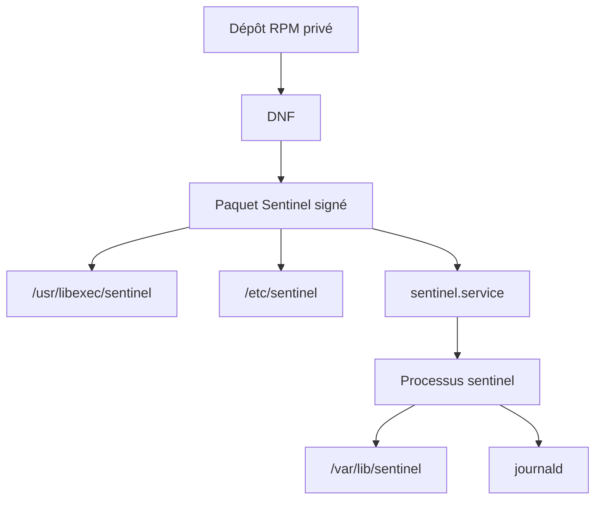
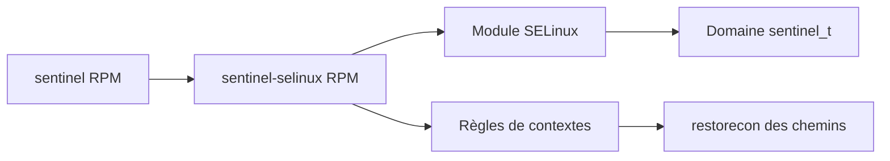
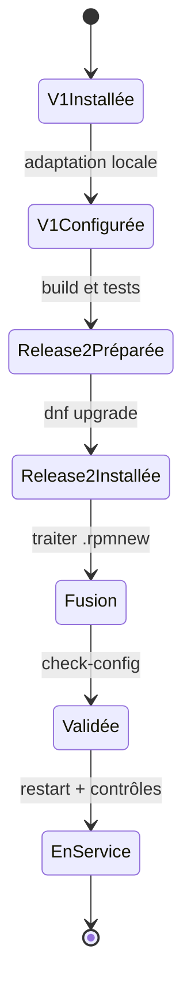
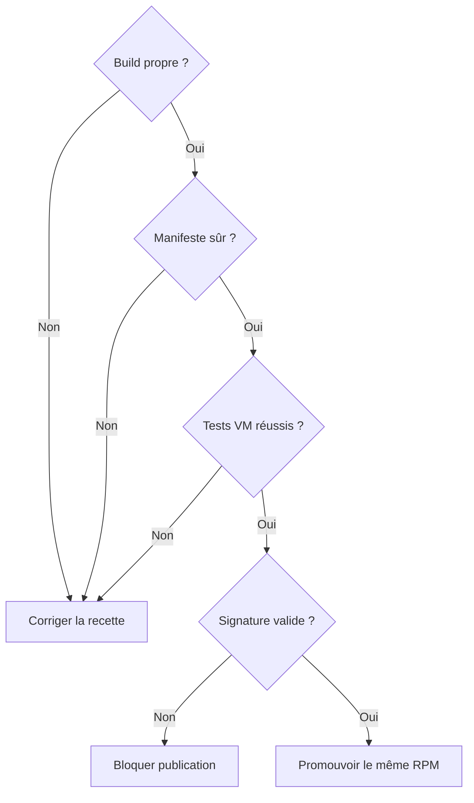

# Chapitre 10.6 — Packager Sentinel

> **Campagne 10 — RPM et cycle de vie**

> *« La livraison est terminée lorsque le système sait installer, vérifier, mettre à jour et retirer le service. »*

## Vous êtes ici

```text
PARTIE III — Industrialiser les déploiements

Campagne 10

  10.1 Construire un paquet RPM ✔
  10.2 Gérer les dépendances ✔
  10.3 Gérer les fichiers de configuration ✔
  10.4 Signer les paquets ✔
  10.5 Exploiter un dépôt RPM privé ✔
► 10.6 Packager Sentinel
```

## Objectifs pédagogiques

À l'issue de cette mission, vous serez capable de :

- concevoir l'arborescence RPM complète d'un service Sentinel ;
- empaqueter le code, la configuration et l'unité systemd ;
- créer le compte de service et utiliser les macros systemd ;
- tester installation, mise à niveau, vérification, réparation et suppression ;
- signer puis publier Sentinel dans le dépôt privé ;
- produire les preuves d'une livraison exploitable.

## Pourquoi ce chapitre existe

Les chapitres précédents ont isolé les mécanismes. Cette mission les assemble autour du fil rouge de la formation.

Sentinel ne sera plus un ensemble de fichiers copiés sous `/opt`. Il deviendra un composant natif du socle AlmaLinux : versionné, signé, distribué par DNF, supervisé par systemd et vérifiable par RPM.

## Jalon Sentinel — version 1.0.0

Le checkpoint 0.6.0 a déjà été déployé sur plusieurs hôtes. La campagne 10 ne réinvente pas ses fonctions : elle stabilise ses contrats et produit le premier artefact natif complet.

La version 1.0.0 doit conserver :

- `--version`, `--check-config`, `--healthcheck` et la commande `serve` ;
- `/health`, `/ready` et `/api/v1/status` ;
- l'écriture atomique de l'état ;
- l'arrêt propre, `sd_notify` et le watchdog ;
- le TLS/mTLS et l'autorisation par SAN DNS ;
- les tests cumulés des versions précédentes.

Le checkpoint de référence se trouve sous `sentinel/labs/sentinel-app/checkpoints/1.0.0/`. Il ajoute les fichiers `packaging/sentinel.conf` et `packaging/sentinel.service`, mais aucun RPM construit, certificat privé ou état d'exécution.

## Le cahier des charges

Le paquet final doit respecter les contraintes suivantes.

| Domaine | Exigence |
|---|---|
| identité | compte système `sentinel`, sans shell interactif |
| code | installé sous `/usr/libexec/sentinel/` |
| configuration | `/etc/sentinel/sentinel.conf`, protégée par `%config(noreplace)` |
| état | `/var/lib/sentinel`, créé par systemd |
| service | unité dans `/usr/lib/systemd/system/` |
| privilèges | aucun démarrage en `root`, capacités vides |
| journalisation | sortie vers journald |
| confiance | RPM signé et dépôt avec contrôles GPG actifs |
| cycle de vie | installation, mise à niveau, vérification, réparation et suppression testées |



## Une migration depuis l'installation historique

Les campagnes précédentes utilisaient `/opt/sentinel` et une unité créée sous `/etc/systemd/system`. Ces chemins convenaient à une installation manuelle. Le RPM introduit une séparation plus nette.

| Avant | Après packaging | Raison |
|---|---|---|
| `/opt/sentinel/bin/sentinel` | `/usr/libexec/sentinel/sentinel` | code privé du service géré par le paquet |
| `/opt/sentinel/config/` | `/etc/sentinel/` | configuration administrée |
| `/etc/systemd/system/sentinel.service` | `/usr/lib/systemd/system/sentinel.service` | unité fournie par un paquet |
| répertoire de logs applicatif | journald | centralisation et rotation système |
| création manuelle de l'état | `StateDirectory=sentinel` | cycle de vie confié à systemd |

Avant d'installer le RPM sur une machine déjà utilisée, sauvegardez la configuration puis retirez l'ancienne unité locale. Un fichier sous `/etc/systemd/system` a priorité sur l'unité du paquet et pourrait masquer la nouvelle version.

```bash
sudo systemctl disable --now sentinel.service
sudo cp -a /etc/sentinel /root/sentinel-config-backup 2>/dev/null || true
sudo rm /etc/systemd/system/sentinel.service
sudo systemctl daemon-reload
```

Cette suppression ne doit être réalisée qu'après vérification du chemin exact et de la sauvegarde dans votre laboratoire.

## Préparer le projet source

La mission utilise la structure suivante :

```text
sentinel-1.0.0/
├── LICENSE
├── README.md
├── src/
│   └── sentinel.py
└── packaging/
    ├── sentinel.conf
    └── sentinel.service
```

Créez un répertoire de travail avec le code Sentinel développé au fil de la formation. Pour rendre le build autonome, l'archive doit contenir tous les fichiers nécessaires et aucun secret.

Le programme doit au minimum accepter :

```text
sentinel --version
sentinel --config /etc/sentinel/sentinel.conf --check-config
sentinel --config /etc/sentinel/sentinel.conf --healthcheck
sentinel --config /etc/sentinel/sentinel.conf serve
```

Ces interfaces ont été introduites et testées avant le packaging. Si elles manquent, revenez au checkpoint concerné au lieu d'inventer une commande uniquement dans la recette RPM.

## Écrire une configuration initiale

Créez `packaging/sentinel.conf` :

```ini
[server]
listen_address = 127.0.0.1
listen_port = 8443

[identity]
allowed_dns_names = healthcheck.sentinel.example.test

[tls]
enabled = false
certificate = /etc/sentinel/tls/server.crt
private_key = /etc/sentinel/tls/server.key
client_ca = /etc/sentinel/tls/clients-ca.crt
require_client_certificate = true

[healthcheck]
server_name = sentinel.sentinel.lab
certificate = /etc/sentinel/tls/healthcheck.crt
private_key = /etc/sentinel/tls/healthcheck.key

[storage]
state_directory = /var/lib/sentinel

[logging]
level = INFO
```

Le service démarre dans un mode local et limité. L'exposition réseau et TLS seront activés par la configuration d'environnement après déploiement des certificats. `server_name` reste le nom vérifié dans le SAN du certificat serveur lorsque le healthcheck mTLS est activé ; il doit être résolu par le DNS du laboratoire.

## Écrire l'unité systemd durcie

Créez `packaging/sentinel.service` :

```ini
[Unit]
Description=Sentinel Security Platform
Documentation=file:///usr/share/doc/sentinel/README.md
After=network-online.target
Wants=network-online.target

[Service]
Type=notify
NotifyAccess=main
User=sentinel
Group=sentinel
ExecStartPre=/usr/libexec/sentinel/sentinel --config /etc/sentinel/sentinel.conf --check-config
ExecStart=/usr/libexec/sentinel/sentinel --config /etc/sentinel/sentinel.conf serve
ExecStartPost=/usr/libexec/sentinel/sentinel --config /etc/sentinel/sentinel.conf --healthcheck
WatchdogSec=10s
TimeoutStopSec=15s
Restart=on-failure
RestartSec=5s

StateDirectory=sentinel
StateDirectoryMode=0750
UMask=0027

NoNewPrivileges=true
PrivateTmp=true
PrivateDevices=true
ProtectSystem=strict
ProtectHome=true
ProtectKernelTunables=true
ProtectKernelModules=true
ProtectControlGroups=true
RestrictSUIDSGID=true
LockPersonality=true
CapabilityBoundingSet=
AmbientCapabilities=
RestrictAddressFamilies=AF_UNIX AF_INET AF_INET6

[Install]
WantedBy=multi-user.target
```

Le service n'a aucune capacité Linux et ne peut pas modifier `/usr` ou `/etc`. `StateDirectory` crée un espace inscriptible sous `/var/lib` avec l'identité du service.

> **Point d'adaptation** — Testez chaque directive avec la version de systemd de votre AlmaLinux. Un durcissement non compatible doit être diagnostiqué, pas supprimé en bloc.

## Construire l'archive source

Depuis le répertoire parent :

```bash
chmod 0755 sentinel-1.0.0/src/sentinel.py
tar --sort=name --owner=0 --group=0 --numeric-owner \
  --mtime='UTC 2026-07-17' \
  -czf ~/rpmbuild/SOURCES/sentinel-1.0.0.tar.gz \
  sentinel-1.0.0
```

Les options stabilisent l'ordre, les propriétaires et l'horodatage de l'archive pédagogique. Un pipeline réel utilisera une date liée au commit ou une variable `SOURCE_DATE_EPOCH` contrôlée.

## Écrire `sentinel.spec`

Créez `~/rpmbuild/SPECS/sentinel.spec` :

```spec
Name:           sentinel
Version:        1.0.0
Release:        1%{?dist}
Summary:        Service de détection du laboratoire Sentinel
License:        MIT
URL:            https://example.invalid/sentinel
Source0:        %{name}-%{version}.tar.gz
BuildArch:      noarch

BuildRequires:  python3
BuildRequires:  systemd-rpm-macros
Requires:       python3
Requires(pre):  shadow-utils
%{?systemd_requires}

%description
Sentinel est le service fil rouge de la formation AlmaLinux. Ce paquet
installe son code, sa configuration initiale et son unité systemd durcie.

%prep
%autosetup

%build
# Le programme Python est interprété ; aucune compilation applicative.

%install
install -Dpm 0755 src/sentinel.py \
  %{buildroot}%{_libexecdir}/sentinel/sentinel
install -Dpm 0640 packaging/sentinel.conf \
  %{buildroot}%{_sysconfdir}/sentinel/sentinel.conf
install -Dpm 0644 packaging/sentinel.service \
  %{buildroot}%{_unitdir}/sentinel.service

%check
python3 -m py_compile src/sentinel.py
python3 src/sentinel.py --version
python3 src/sentinel.py \
  --config packaging/sentinel.conf --check-config

%pre
getent group sentinel >/dev/null || groupadd -r sentinel
getent passwd sentinel >/dev/null || \
  useradd -r -g sentinel -d /var/lib/sentinel \
    -s /sbin/nologin -c 'Sentinel service account' sentinel
exit 0

%post
%systemd_post sentinel.service

%preun
%systemd_preun sentinel.service

%postun
%systemd_postun_with_restart sentinel.service

%files
%license LICENSE
%doc README.md
%dir %{_libexecdir}/sentinel
%{_libexecdir}/sentinel/sentinel
%dir %attr(0750,root,sentinel) %{_sysconfdir}/sentinel
%config(noreplace) %attr(0640,root,sentinel) \
  %{_sysconfdir}/sentinel/sentinel.conf
%{_unitdir}/sentinel.service

%changelog
* Fri Jul 17 2026 Sentinel Training <rpm-signing@example.invalid> - 1.0.0-1
- Premier paquet complet du service Sentinel
```

### Lire les décisions de la recette

- `BuildArch: noarch` est valide tant que le paquet ne contient que du Python portable et des fichiers texte ;
- `systemd-rpm-macros` fournit les macros et chemins utilisés par la recette ;
- `%pre` crée l'identité avant l'installation des fichiers appartenant au groupe `sentinel` ;
- les macros `%systemd_*` gèrent les interactions avec systemd pendant les transactions ;
- le compte n'est pas supprimé lors de la désinstallation afin de ne pas rendre orphelines les données persistantes ;
- l'unité appartient au paquet, tandis que la configuration locale est protégée.

Une plateforme dont les macros `systemd-sysusers` sont normalisées pourra remplacer le scriptlet de création de compte par un fichier `sysusers.d`. La recette ci-dessus reste explicite pour le laboratoire AlmaLinux.

## Ne pas perdre la politique SELinux

Le passage au RPM ne doit pas ramener Sentinel dans un domaine générique. La politique construite en campagne 6 reste un artefact versionné du service.

Deux stratégies sont possibles :

- livrer un sous-paquet `sentinel-selinux` construit avec les macros de `selinux-policy-devel` ;
- maintenir un paquet de politique séparé et déclarer sa version comme dépendance de Sentinel.



Dans le laboratoire, vous pouvez qualifier d'abord le paquet applicatif avec le module déjà produit en campagne 6. Avant une publication de production, transformez cette politique en paquet et évitez un `semodule -i` improvisé dans `%post` : les macros SELinux de la distribution gèrent mieux installation, mise à jour et retrait.

Après l'installation, contrôlez toujours :

```bash
sudo restorecon -RFv /usr/libexec/sentinel /etc/sentinel
ps -eZ | grep '[s]entinel'
sudo ausearch -m AVC,USER_AVC -ts recent
```

## TP 1 — Construire et inspecter Sentinel

Installez les dépendances de build puis construisez :

```bash
sudo dnf install dnf-plugins-core rpm-build
sudo dnf builddep ~/rpmbuild/SPECS/sentinel.spec
rpmbuild -ba ~/rpmbuild/SPECS/sentinel.spec
```

Interrogez l'artefact sans l'installer :

```bash
RPM=$(find ~/rpmbuild/RPMS -name 'sentinel-1.0.0-1*.rpm' | head -n1)
rpm -qpi "$RPM"
rpm -qpl "$RPM"
rpm -qpR "$RPM" | sort
rpm -qp --scripts "$RPM"
rpm -qpc "$RPM"
```

Critères de réussite :

- aucun fichier n'est installé sous `/home`, `/tmp` ou `/opt` ;
- la configuration est identifiée par `rpm -qpc` ;
- Python et les besoins systemd apparaissent dans les dépendances ;
- aucun secret n'est présent dans le RPM ;
- le scriptlet de compte est idempotent.

Vous pouvez extraire la charge utile dans un répertoire non privilégié pour la relire :

```bash
mkdir -p /tmp/sentinel-rpm-review
cd /tmp/sentinel-rpm-review
rpm2cpio "$RPM" | cpio -idmv
find . -type f -print
```

## TP 2 — Installer sur une VM AlmaLinux propre

Transférez le RPM non encore publié vers une VM de qualification. Installez-le avec DNF :

```bash
sudo dnf install ./sentinel-1.0.0-1.el9.noarch.rpm
getent passwd sentinel
rpm -q sentinel
rpm -ql sentinel
```

Validez l'unité avant de démarrer :

```bash
sudo systemd-analyze verify /usr/lib/systemd/system/sentinel.service
sudo -u sentinel /usr/libexec/sentinel/sentinel \
  --config /etc/sentinel/sentinel.conf --check-config
```

Démarrez et observez :

```bash
sudo systemctl enable --now sentinel.service
systemctl status sentinel.service --no-pager
journalctl -u sentinel.service -b --no-pager
sudo ss -lntp | grep ':8443'
```

Vérifiez le confinement :

```bash
systemctl show sentinel.service \
  -p User -p Group -p NoNewPrivileges -p ProtectSystem
systemd-analyze security sentinel.service
ls -ld /var/lib/sentinel
PID=$(systemctl show -p MainPID --value sentinel.service)
ps -o user,group,pid,cmd -p "$PID"
```

Le score de `systemd-analyze security` est un outil de comparaison, pas une certification. Toute recommandation doit rester compatible avec le comportement réel de Sentinel.

## Tester l'intégrité et la réparation

```bash
sudo sh -c 'printf "# altération laboratoire\n" >> /usr/libexec/sentinel/sentinel'
rpm -V sentinel
```

La vérification doit signaler le fichier applicatif. Réparez par une transaction contrôlée :

```bash
sudo dnf reinstall ./sentinel-1.0.0-1.el9.noarch.rpm
rpm -V sentinel
sudo systemctl restart sentinel.service
```

Une altération détectée sur un serveur réel déclencherait aussi une investigation : identité de l'auteur, journaux auditd, accès SSH, autres fichiers modifiés et intégrité de l'hôte. Réinstaller le paquet restaure un fichier ; cela n'explique pas l'incident.

## TP 3 — Construire et qualifier une nouvelle release RPM

Conservez le code applicatif `1.0.0`, améliorez un élément de packaging sans changer son contrat — par exemple un commentaire de configuration ou une directive systemd compatible — puis passez `Release` de `1` à `2`. Reconstruisez `sentinel-1.0.0-2`.

Ce choix est volontaire : une révision de recette ne doit pas prétendre être Sentinel 1.1.0. Cette version sera réservée à l'ajout réel de `/metrics` dans la campagne 12.

Avant la mise à niveau, personnalisez la configuration installée :

```bash
sudo sed -i 's/level = INFO/level = WARNING/' \
  /etc/sentinel/sentinel.conf
```

Installez la nouvelle version :

```bash
sudo dnf upgrade ./sentinel-1.0.0-2.el9.noarch.rpm
rpm -q sentinel
sudo ls -l /etc/sentinel/sentinel.conf*
sudo diff -u /etc/sentinel/sentinel.conf \
  /etc/sentinel/sentinel.conf.rpmnew || true
```

Procédure attendue :

1. comparer la configuration active et `.rpmnew` ;
2. intégrer la nouvelle option ;
3. exécuter `--check-config` ;
4. redémarrer uniquement après validation ;
5. contrôler l'état et les journaux ;
6. conserver la preuve de la transaction DNF.

```bash
sudo -u sentinel /usr/libexec/sentinel/sentinel \
  --config /etc/sentinel/sentinel.conf --check-config
sudo systemctl restart sentinel.service
systemctl is-active sentinel.service
dnf history info last
```



## Signer et publier le paquet final

Sur le poste de publication :

```bash
rpmsign --addsign ~/rpmbuild/RPMS/noarch/sentinel-1.0.0-2*.rpm
rpm -Kv ~/rpmbuild/RPMS/noarch/sentinel-1.0.0-2*.rpm
```

Placez l'artefact signé dans la zone de staging du dépôt, vérifiez-le, générez les métadonnées et leur signature, puis promouvez la publication.

Sur une nouvelle VM cliente :

```bash
sudo dnf clean metadata
sudo dnf install sentinel
rpm -q --qf '%{NAME} %{VERSION}-%{RELEASE} %{ARCH}\n' sentinel
rpm -V sentinel
systemctl is-active sentinel.service
```

Le test sur une nouvelle VM est indispensable : la VM de développement peut contenir des fichiers, comptes ou dépendances résiduels qui masquent un défaut du paquet.

## Test contrôlé depuis Kali

Depuis la VM Kali, exercez uniquement le laboratoire autorisé :

1. observez le service publié avec `nmap` sur le port configuré ;
2. confirmez que l'écoute par défaut reste limitée à `127.0.0.1` ;
3. après activation réseau explicite, vérifiez que firewalld limite les sources autorisées ;
4. tentez de substituer, dans une copie isolée du dépôt, un RPM non signé ;
5. confirmez que le client AlmaLinux refuse la transaction ;
6. altérez un fichier installé sur la VM cible et confirmez que `rpm -V sentinel` le détecte.

Le test ne doit ni désactiver `gpgcheck`, ni toucher un réseau ou un système hors du périmètre du laboratoire.

## Désinstallation et données persistantes

Testez la suppression :

```bash
sudo dnf remove sentinel
systemctl status sentinel.service --no-pager || true
test ! -e /usr/libexec/sentinel/sentinel
getent passwd sentinel
sudo ls -ld /var/lib/sentinel /etc/sentinel* 2>/dev/null || true
```

Le code et l'unité doivent disparaître. Le compte, l'état et une configuration modifiée peuvent rester afin d'éviter une perte de données implicite.

Décidez et documentez la politique de purge. RPM ne fournit pas une opération universelle équivalente à « supprimer toutes les données ». Une purge destructive doit être explicite, sauvegardée et distincte de la désinstallation normale.

## Livrables de la mission

Votre dossier de livraison contient :

1. l'archive source versionnée ;
2. le fichier `sentinel.spec` ;
3. le SRPM ;
4. le RPM binaire signé ;
5. la clé publique et son empreinte de référence ;
6. les sorties des tests de build ;
7. les preuves d'installation sur VM propre ;
8. le test de mise à niveau et de `.rpmnew` ;
9. les résultats `rpm -V` avant et après réparation ;
10. la procédure de publication et de retour arrière.

## Critères de réussite



La mission est réussie si :

- le build ne requiert pas `root` ;
- les dépendances sont déclarées et testées ;
- aucun secret n'est présent dans les artefacts ;
- l'installation crée un service fonctionnel sous l'identité `sentinel` ;
- la configuration locale survit à la mise à niveau ;
- l'intégrité et la signature sont vérifiables ;
- DNF refuse un paquet non approuvé ;
- la suppression retire le code sans détruire silencieusement les données ;
- une seconde personne peut reproduire la procédure à partir des livrables.

## Impact sur Sentinel

Sentinel franchit une étape d'industrialisation majeure.

Il n'est plus seulement un programme déployé par automatisation. Il possède désormais :

- une identité de paquet ;
- une version interrogeable ;
- un manifeste de fichiers ;
- un contrat de dépendances ;
- une politique de configuration ;
- une unité systemd livrée et maintenue ;
- une signature de publication ;
- un canal de distribution privé ;
- un cycle de mise à niveau et de réparation auditable.

La campagne 11 pourra conteneuriser Sentinel sans perdre ces enseignements : une image reste elle aussi un artefact à construire, signer, distribuer, configurer et maintenir.

## Synthèse

- Le paquet Sentinel assemble code, configuration et intégration systemd sans embarquer l'état ni les secrets.
- Les chemins sous `/usr`, `/etc` et `/var/lib` reflètent des responsabilités différentes.
- Les scriptlets doivent rester courts, idempotents et fondés sur les macros de la distribution.
- Un build réussi doit être suivi d'une inspection et d'un test sur VM propre.
- La mise à niveau inclut la fusion de configuration, la validation et le contrôle du service.
- L'artefact testé est celui qui doit être signé puis promu.
- La détection d'une altération exige une investigation en plus de la réparation.

## Infographie de révision

```text
              CYCLE DE VIE DE SENTINEL

 code + config + unité
          │
          ▼
     archive source ──► SPEC ──► build propre
                                      │
                         ┌────────────┴────────────┐
                         ▼                         ▼
                       SRPM                   RPM binaire
                                                   │
                              inspecter ─ tester ─ signer
                                                   │
                                                   ▼
                                          dépôt privé HTTPS
                                                   │
                                                   ▼
                                   DNF install / upgrade / remove
                                                   │
                         ┌────────────┬─────────────┼────────────┐
                         ▼            ▼             ▼            ▼
                       systemd      rpm -V       journald     historique

OBJECTIF : même artefact, preuves conservées, retour arrière préparé.
```

## Pour aller plus loin

Conservez la [documentation Red Hat sur le packaging RPM](https://docs.redhat.com/en/documentation/red_hat_enterprise_linux/9/html/packaging_and_distributing_software/index), le [manuel officiel RPM](https://rpm.org/docs/6.0.x/man/) et les [guidelines systemd de Fedora](https://docs.fedoraproject.org/en-US/packaging-guidelines/Systemd/) comme références de maintenance. Vérifiez toujours les macros disponibles sur la version AlmaLinux ciblée.

Campagne suivante : appliquer les mêmes exigences de cycle de vie à une image et à une exécution Podman rootless.

← [10.5 — Exploiter un dépôt RPM privé](10.5-exploiter-depot-rpm-prive.md) · [11.1 — Découvrir Podman](../campagne_11/11.1-decouvrir-podman.md) →
