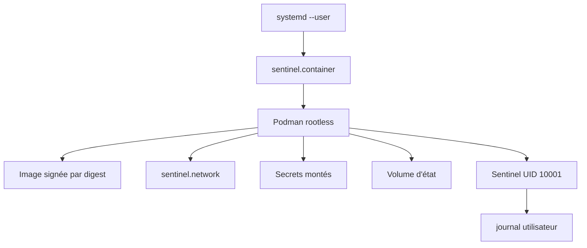
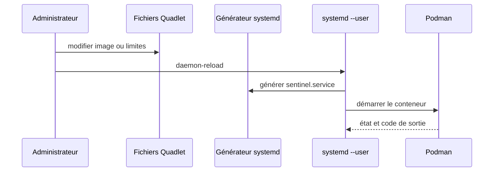
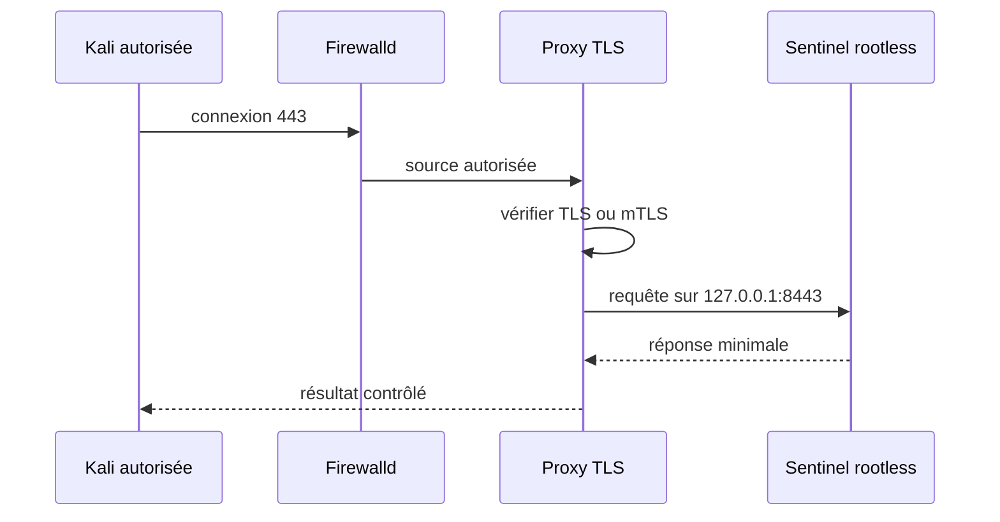
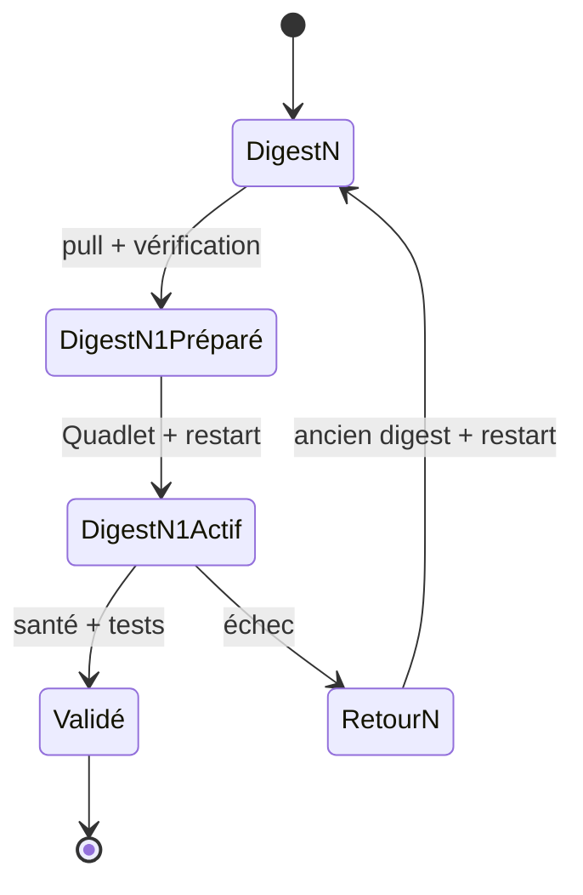
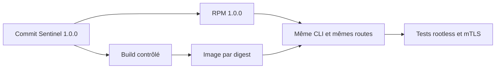
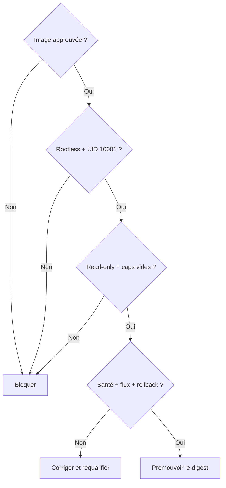

# Chapitre 11.6 — Exécuter Sentinel en sécurité

> **Campagne 11 — Conteneurisation**

> *« Un conteneur de production n'est pas une commande mémorisée : c'est une déclaration relisible, testable et réversible. »*

## Vous êtes ici

```text
PARTIE III — Industrialiser les déploiements

Campagne 11

  11.1 Découvrir Podman ✔
  11.2 Exécuter des conteneurs rootless ✔
  11.3 Construire des images sécurisées ✔
  11.4 Concevoir les réseaux de conteneurs ✔
  11.5 Gérer les secrets ✔
► 11.6 Exécuter Sentinel en sécurité
```

## Objectifs pédagogiques

À l'issue de cette mission, vous serez capable de :

- déclarer Sentinel avec Quadlet et systemd utilisateur ;
- assembler image par digest, réseau, volumes et secrets ;
- imposer lecture seule, absence de capacités et limites de ressources ;
- qualifier le service depuis AlmaLinux et Kali ;
- mettre à jour puis revenir au digest précédent ;
- produire les preuves d'un déploiement conteneurisé exploitable.

## Pourquoi ce chapitre existe

Les cinq chapitres précédents ont traité séparément le moteur, l'identité rootless, l'image, le réseau et les secrets. Une exploitation fiable doit maintenant réunir ces décisions dans une déclaration versionnée.

Podman recommande Quadlet pour confier les conteneurs à systemd. Les fichiers `.container`, `.network` et `.volume` sont lus par un générateur qui produit les unités de service correspondantes.

## Architecture cible



La responsabilité est répartie :

| Couche | Décision |
| --- | --- |
| image | code, interpréteur, UID, healthcheck |
| Podman rootless | namespaces, stockage, montages et ressources |
| Quadlet | déclaration reproductible du conteneur |
| systemd utilisateur | démarrage, redémarrage, ordre et journal |
| firewalld/proxy | exposition externe et TLS |
| SELinux | accès aux objets de l'hôte |

## Pourquoi Quadlet

L'ancienne commande `podman generate systemd` est dépréciée au profit de Quadlet. Quadlet conserve des fichiers courts proches du besoin métier et laisse le générateur produire l'unité technique.



> **Piège classique** — Ne modifiez pas l'unité générée dans `/run`. Elle sera recréée. La source d'autorité est le fichier Quadlet.

## Préparer le compte et les chemins

Sous `sentinel-container` :

```bash
install -d -m 0700 ~/.config/containers/systemd
install -d -m 0750 ~/.config/sentinel
install -d -m 0750 ~/.local/share/sentinel
```

Installez la configuration non secrète. Elle est lisible dans le conteneur, mais seul le compte propriétaire peut la modifier sur l'hôte :

```bash
install -m 0644 sentinel.conf ~/.config/sentinel/sentinel.conf
```

Assurez-vous que le linger a été autorisé par l'administrateur :

```bash
loginctl show-user sentinel-container -p Linger
```

## Déclarer le réseau

Créez `~/.config/containers/systemd/sentinel.network` :

```ini
[Network]
NetworkName=sentinel-net
Driver=bridge
```

Le générateur créera le réseau avant le conteneur qui le référence.

## Déclarer le volume

Créez `~/.config/containers/systemd/sentinel.volume` :

```ini
[Volume]
VolumeName=sentinel-state
```

Un volume nommé évite de gérer manuellement les UID d'un bind mount d'état. Sa sauvegarde et sa restauration restent à organiser.

## Préparer les secrets

```bash
podman secret ls
podman secret inspect sentinel-tls-cert
podman secret inspect sentinel-tls-key
```

Les secrets doivent exister avant le démarrage de l'unité. Le fichier Quadlet référence leurs noms, pas leurs valeurs.

## Déclarer le conteneur Sentinel

Créez `~/.config/containers/systemd/sentinel.container` :

```ini
[Unit]
Description=Sentinel rootless container

[Container]
ContainerName=sentinel
Image=registry.sentinel.lab/sentinel/sentinel@sha256:DIGEST_QUALIFIE
User=10001
Group=10001
Network=sentinel.network
Volume=sentinel.volume:/var/lib/sentinel:U,Z
Volume=/home/sentinel-container/.config/sentinel/sentinel.conf:/etc/sentinel/sentinel.conf:ro,Z
Secret=sentinel-tls-cert,type=mount,target=tls.crt,uid=10001,gid=10001,mode=0444
Secret=sentinel-tls-key,type=mount,target=tls.key,uid=10001,gid=10001,mode=0400
PublishPort=127.0.0.1:8443:8443
ReadOnly=true
ReadOnlyTmpfs=true
Tmpfs=/tmp:rw,noexec,nosuid,nodev,size=16m
NoNewPrivileges=true
DropCapability=all
PidsLimit=200
Memory=256m
PodmanArgs=--cpus=1

[Service]
Restart=on-failure
RestartSec=5s
TimeoutStopSec=30s

[Install]
WantedBy=default.target
```

Remplacez `DIGEST_QUALIFIE` par le digest signé et promu. Vérifiez chaque clé avec `man podman-systemd.unit` sur AlmaLinux : les capacités de Quadlet dépendent de la version Podman installée.

### Lecture de la politique

- `User=10001` et `Group=10001` conservent l'identité non-root de l'image ;
- `ReadOnly=true` protège la racine du conteneur ;
- `ReadOnlyTmpfs=true` fournit les pseudo-systèmes temporaires nécessaires ;
- `NoNewPrivileges=true` interdit l'acquisition de privilèges supplémentaires ;
- `DropCapability=all` commence avec un ensemble vide ;
- les limites empêchent une consommation illimitée de processus, mémoire et CPU ;
- `:U` adapte le propriétaire du volume nommé à l'UID du conteneur ;
- le port reste sur la boucle locale ;
- l'état est le seul espace durable inscriptible ;
- les secrets sont montés avec des modes explicites.

> **Point de compatibilité** — Si une clé Quadlet n'est pas reconnue, n'abandonnez pas le contrôle. Utilisez une option `PodmanArgs` équivalente documentée par la version locale, puis ajoutez un test qui prouve son application.

## Valider la génération avant de démarrer

```bash
systemctl --user daemon-reload
systemctl --user list-unit-files | grep sentinel
systemctl --user cat sentinel.service
systemd-analyze --user verify sentinel.service
```

Si l'unité n'est pas générée :

```bash
/usr/lib/systemd/system-generators/podman-system-generator --user --dryrun
journalctl --user -b --no-pager
```

Le chemin et les options du générateur peuvent varier. La commande `podman quadlet print` ou `podman quadlet list`, lorsqu'elle existe dans la version installée, facilite aussi le diagnostic.

## TP 1 — Démarrer et prouver le confinement

```bash
systemctl --user start sentinel.service
systemctl --user status sentinel.service --no-pager
podman ps
podman inspect sentinel
```

Validez l'identité et les capacités :

```bash
podman exec sentinel id
podman exec sentinel grep '^Cap' /proc/1/status
podman exec sentinel sh -c 'touch /usr/probe' || true
podman exec sentinel sh -c 'test -w /var/lib/sentinel'
```

Le fichier sous `/usr` doit être refusé ; l'état doit être inscriptible.

Validez les limites :

```bash
podman inspect --format '{{.HostConfig.PidsLimit}}' sentinel
podman stats --no-stream sentinel
systemctl --user show sentinel.service -p MemoryCurrent -p TasksCurrent
```

Contrôlez SELinux et les journaux :

```bash
ps -eZ | grep '[s]entinel\|[c]onmon'
journalctl --user -u sentinel.service -b --no-pager
sudo ausearch -m AVC,USER_AVC -ts recent
```

## TP 2 — Tester le service et sa surface réseau

Depuis AlmaLinux :

```bash
curl --fail --cacert /chemin/ca-lab.crt \
  https://127.0.0.1:8443/health
ss -lnt | grep ':8443'
```

Depuis Kali :

```bash
nmap -Pn -p 8443 ALMALINUX_IP
```

Le port 8443 doit rester inaccessible depuis le réseau. Testez ensuite le véritable point d'entrée TLS exposé par l'architecture, normalement le reverse proxy sur 443.

Depuis Kali, dans le périmètre autorisé :

1. vérifier la chaîne TLS ;
2. tenter une requête sans identité cliente si mTLS est requis ;
3. présenter un certificat valide ;
4. envoyer une requête malformée contrôlée ;
5. vérifier les journaux Sentinel et du proxy ;
6. confirmer qu'aucun détail de secret n'est retourné.



## Santé, redémarrage et boucle d'échec

Un redémarrage automatique ne doit pas masquer une configuration invalide.

```bash
podman healthcheck run sentinel
podman inspect --format '{{json .State.Health}}' sentinel
```

Provoquez une configuration invalide dans le laboratoire, rechargez le service et observez :

```bash
systemctl --user restart sentinel.service
systemctl --user status sentinel.service --no-pager
journalctl --user -u sentinel.service -n 50 --no-pager
```

La validation `--check-config` de Sentinel doit échouer clairement. Ajoutez si nécessaire un `ExecStartPre` dans `[Service]` ou conservez la validation dans l'entrypoint, sans afficher les secrets.

> **Regard défenseur** — Une boucle de redémarrage consomme des ressources et noie les journaux. `StartLimitIntervalSec` et `StartLimitBurst` peuvent limiter ce comportement dans `[Unit]`.

## TP 3 — Mettre à jour et revenir en arrière

Le déploiement référence un digest. Pour mettre à jour :

1. tirer et qualifier la nouvelle image ;
2. vérifier sa signature selon `policy.json` ;
3. sauvegarder l'état et la configuration ;
4. remplacer le digest dans `sentinel.container` ;
5. recharger et redémarrer ;
6. exécuter les tests de santé et fonctionnels.

```bash
podman pull registry.sentinel.lab/sentinel/sentinel@sha256:NOUVEAU_DIGEST
systemctl --user daemon-reload
systemctl --user restart sentinel.service
systemctl --user is-active sentinel.service
```

En cas d'échec, restaurez le digest précédent :

```bash
systemctl --user daemon-reload
systemctl --user restart sentinel.service
journalctl --user -u sentinel.service -n 100 --no-pager
```



Le retour du digest ne restaure pas automatiquement une migration de données incompatible. Toute évolution de schéma doit posséder sa propre stratégie de sauvegarde et de retour arrière.

## Mise à jour automatique ou promotion explicite

Quadlet et Podman peuvent automatiser certaines mises à jour par tag. Le parcours Sentinel retient le digest et la promotion explicite :

- le changement est relisible dans Git ;
- l'artefact exact a été qualifié ;
- le retour arrière connaît le digest précédent ;
- une dérive de tag ne modifie pas silencieusement le service.

Une politique d'auto-update n'est acceptable qu'avec signature imposée, tests post-déploiement, fenêtre de maintenance et retour arrière maîtrisé.

## Intégrer Ansible sans revenir aux commandes impératives

Le rôle Ansible de la campagne 9 évolue. Il doit :

- créer le compte rootless et ses plages subuid/subgid ;
- activer le linger ;
- déployer `policy.json` et les autorités de confiance ;
- installer les fichiers Quadlet ;
- provisionner les secrets depuis une source protégée ;
- exécuter `systemctl --user daemon-reload` dans le bon contexte ;
- attendre le healthcheck ;
- conserver le digest déployé comme preuve.

Ansible ne doit pas reconstruire l'image sur l'hôte cible ni placer les secrets en clair dans l'inventaire.

## Jalon Sentinel — application 1.0.0, image qualifiée

La conteneurisation n'exige aucune modification du programme : Sentinel 1.0.0 sait déjà rester au premier plan, journaliser sur la sortie standard, traiter `SIGTERM`, lire une configuration externe et exécuter `--healthcheck`.

Le jalon porte donc deux identités distinctes :

```text
version applicative : 1.0.0
image déployée      : référence@sha256:DIGEST_QUALIFIE
```

Ne créez pas Sentinel 1.1.0 uniquement pour modifier un `Containerfile`, un label OCI ou un fichier Quadlet. Une reconstruction de la même application reçoit un nouveau digest ; la version applicative change seulement lorsque son contrat change.

### Prouver que le binaire est le même

Comparez la CLI dans le RPM et dans l'image :

```bash
/usr/libexec/sentinel/sentinel --version
podman run --rm \
  REGISTRE/SENTINEL@sha256:DIGEST_QUALIFIE --version
```

Les deux commandes doivent annoncer `sentinel 1.0.0`. Conservez aussi l'empreinte du fichier source incorporé pendant le build et le lien vers le commit 1.0.0.

### Rejouer le contrat sous contraintes

Après démarrage par Quadlet, vérifiez :

1. `/health`, `/ready` et `/api/v1/status` avec une identité mTLS autorisée ;
2. `--healthcheck` depuis l'image ;
3. HTTP 403 avec un certificat de confiance non autorisé ;
4. échec d'une écriture sous `/usr` ou `/etc` dans la racine en lecture seule ;
5. persistance de `status.json` uniquement dans le volume prévu ;
6. arrêt propre par `systemctl --user stop` ;
7. redémarrage au boot grâce au linger, sans session ouverte.



La campagne 12 introduira la vraie version 1.1.0 en ajoutant `/metrics`. Elle devra alors produire et qualifier un nouveau RPM ainsi qu'une nouvelle image, sans perdre les preuves de 1.0.0.

## Mission d'ingénieur — Livraison complète

Produisez les livrables suivants :

1. `Containerfile` et `.containerignore` ;
2. digest de base et digest Sentinel ;
3. inventaire des paquets de l'image ;
4. résultat du scanner et décisions d'exception ;
5. preuve de signature et politique de pull ;
6. fichiers `sentinel.network`, `sentinel.volume` et `sentinel.container` ;
7. registre des secrets sans valeurs ;
8. matrice de flux ;
9. tests rootless, SELinux, capacités et lecture seule ;
10. procédure d'upgrade et de rollback ;
11. tests autorisés depuis Kali ;
12. procédure de sauvegarde de l'état ;
13. preuve que le RPM et l'image exécutent Sentinel 1.0.0 issu du même commit.

## Critères de réussite



La mission est réussie si :

- aucun `sudo podman` ni `--privileged` n'est nécessaire ;
- l'image est identifiée par un digest vérifié ;
- le processus interne utilise l'UID 10001 ;
- toutes les capacités sont retirées ;
- la racine du conteneur est en lecture seule ;
- seuls l'état et les pseudo-systèmes nécessaires sont inscriptibles ;
- les secrets sont absents de l'image et des journaux ;
- le port applicatif reste lié à la boucle locale ;
- SELinux reste enforcing sans AVC inexpliqué ;
- le service redémarre au boot sans session SSH ;
- une mise à jour et un rollback ont été exercés ;
- une autre personne peut reproduire la livraison.

## Impact sur Sentinel

Sentinel est désormais disponible sous deux formes industrielles complémentaires.

| RPM | Conteneur |
| --- | --- |
| intégration native à AlmaLinux | environnement applicatif regroupé |
| unité systemd système | Quadlet et systemd utilisateur |
| dépendances DNF | couches OCI |
| `%config(noreplace)` | configuration montée |
| signature RPM | signature d'image et politique de pull |

Dans les deux cas, les principes restent identiques : artefact précis, identité minimale, configuration externe, secrets séparés, signature imposée, observabilité et retour arrière.

## Synthèse

- Quadlet est la source déclarative du service Podman géré par systemd.
- Le déploiement combine un compte rootless et un UID applicatif non nul.
- Lecture seule, capacités vides et limites de ressources réduisent l'impact d'une compromission.
- Le réseau applicatif reste privé et le point d'entrée externe est contrôlé.
- Les secrets sont montés à l'exécution et renouvelés sans reconstruire l'image.
- La mise à jour change un digest qualifié ; le rollback restaure le digest précédent.
- Ansible déploie les déclarations et preuves, pas des commandes improvisées.

## Infographie de révision

```text
               SENTINEL CONTENEURISÉ EN PRODUCTION

IMAGE SIGNÉE @ DIGEST ───────────────┐
POLITIQUE DE PULL ───────────────────┤
COMPTE ROOTLESS + LINGER ────────────┤
QUADLET RÉSEAU/VOLUME/CONTENEUR ─────┼──► systemd --user
SECRETS /run/secrets ────────────────┤          │
SELINUX + CAPS VIDES + READ-ONLY ────┤          ▼
LIMITES CPU/MÉMOIRE/PIDS ────────────┘      SENTINEL UID 10001
                                                  │
                                127.0.0.1:8443 ───┤
                                /var/lib volume ──┤
                                journald ─────────┘

UPDATE   : qualifier nouveau digest → modifier Quadlet → tester
ROLLBACK : restaurer ancien digest → redémarrer → vérifier les données

OBJECTIF : déclaration relisible, privilèges minimaux, preuves conservées.
```

## Pour aller plus loin

La référence officielle [`podman-systemd.unit`](https://docs.podman.io/en/stable/markdown/podman-systemd.unit.5.html) décrit les fichiers Quadlet et leurs chemins. La documentation rappelle que [`podman generate systemd` est déprécié](https://docs.podman.io/en/stable/markdown/podman-generate-systemd.1.html) au profit de cette approche.

Campagne suivante : centraliser les journaux, auditer l'hôte et superviser Sentinel comme service critique.

← [11.5 — Gérer les secrets](11.5-gerer-secrets-podman.md) · Campagne 12 — Supervision et audit →
