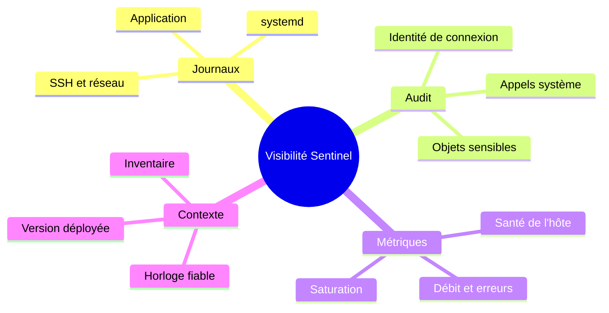
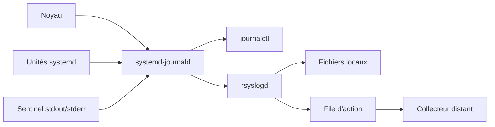
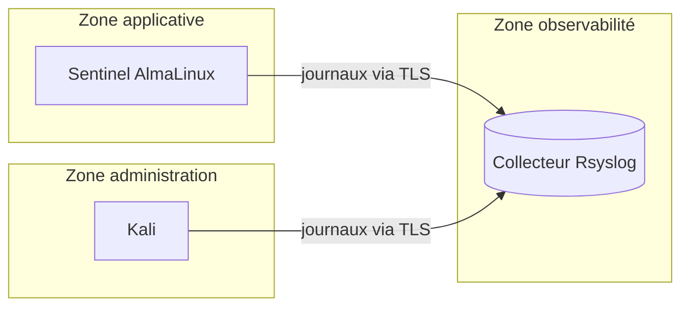
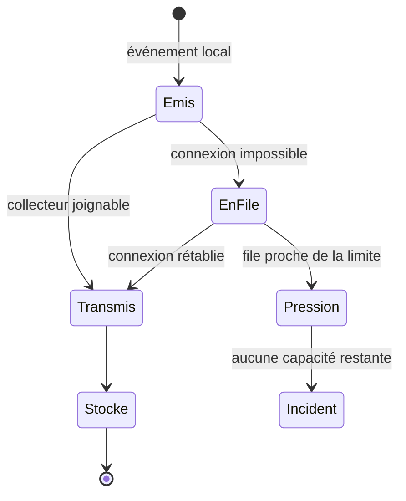

# Chapitre 12.1 — Centraliser les journaux avec Rsyslog

> **Campagne 12 — Supervision et audit**

> *« Un journal resté uniquement sur la machine compromise raconte l'histoire que l'attaquant a bien voulu laisser. »*

## Vous êtes ici

```text
PARTIE II — Industrialiser la sécurité

Campagne 12

► 12.1 Centraliser les journaux avec Rsyslog
  12.2 Auditer le système avec auditd
  12.3 Contrôler l'intégrité des fichiers avec AIDE
  12.4 Superviser Sentinel avec Prometheus
  12.5 Concevoir des alertes avec Alertmanager
  12.6 Construire le tableau de bord Sentinel
```

## Objectifs pédagogiques

À l'issue de ce chapitre, vous serez capable de :

- distinguer journal, événement de sécurité, trace d'audit et métrique ;
- expliquer la coopération entre `systemd-journald` et Rsyslog sur AlmaLinux ;
- concevoir une collecte distante avec authentification mutuelle, file d'attente et stockage par hôte ;
- valider une configuration Rsyslog avant son rechargement ;
- prouver la réception d'un événement et le comportement pendant une coupure ;
- définir une politique de rétention, de contrôle d'accès et de synchronisation temporelle.

## Pourquoi ce chapitre existe

Les campagnes précédentes ont rendu Sentinel plus difficile à attaquer, mais elles ont aussi multiplié les sources de traces : SSH, Firewalld, systemd, SELinux, Podman et l'application. Lire chaque machine séparément ralentit l'enquête et permet à une compromission locale d'effacer une partie de l'histoire.

La centralisation ne transforme pas automatiquement des journaux en preuves irréfutables. Elle réduit cependant la fenêtre de falsification locale, facilite la corrélation et donne un point de conservation soumis à une politique distincte. Ce chapitre construit ce premier étage avant d'introduire l'audit noyau et la supervision.

## Observer, journaliser et auditer

Ces mots sont proches mais ne répondent pas à la même question.

| Donnée | Question principale | Exemple | Limite |
| --- | --- | --- | --- |
| journal applicatif | que raconte le programme ? | requête refusée, erreur TLS | dépend de ce que le programme écrit |
| journal système | que racontent les services ? | démarrage, échec d'unité | peut manquer une action noyau précise |
| audit | qui a tenté quelle opération ? | écriture de `/etc/sentinel/sentinel.conf` | coûteux si la politique est trop large |
| métrique | comment une grandeur évolue-t-elle ? | taux d'erreurs, espace libre | peu adaptée au détail d'un événement |
| trace distribuée | par où une requête est-elle passée ? | proxy, API, base | nécessite une instrumentation dédiée |



> **💎 Le point d'expertise — La visibilité est une architecture**
>
> Collecter « tout » sans modèle produit beaucoup de stockage et peu de compréhension. Partez des scénarios : compromission d'un compte, modification de configuration, indisponibilité de Sentinel, saturation disque. Pour chacun, identifiez la source, le délai utile, le propriétaire et la durée de conservation.

## Comprendre la chaîne AlmaLinux

Sur AlmaLinux, `systemd-journald` reçoit les messages de services, du noyau et de la sortie standard des unités systemd. Rsyslog peut ensuite lire les messages du journal, les filtrer, les écrire dans des fichiers classiques ou les transmettre à un serveur.



Le Journal conserve des champs structurés comme `_SYSTEMD_UNIT`, `_PID` et `_UID`. Le protocole Syslog transporte traditionnellement un message, une date, un hôte, une facility et une sévérité. Certaines informations riches peuvent donc être reformattées ou perdues selon la configuration. Le collecteur central ne remplace pas `journalctl` pour tous les diagnostics locaux.

### Facility et sévérité

La facility décrit grossièrement l'origine logique (`authpriv`, `daemon`, `local0`…), tandis que la sévérité va de `emerg` à `debug`. Une priorité Syslog s'écrit `facility.severity`. L'expression `authpriv.*` sélectionne toutes les sévérités de la facility `authpriv`.

Une sévérité n'est pas une vérité universelle. Une application qui classe une panne critique en `info` restera mal classée après centralisation. La qualité commence à la source.

## Concevoir l'architecture du laboratoire

Le laboratoire utilise trois rôles :

| Hôte | Rôle | Adresse d'exemple |
| --- | --- | --- |
| `sentinel.sentinel.lab` | service et client Rsyslog | `192.0.2.10` |
| `observability.sentinel.lab` | collecteur Rsyslog | `192.0.2.20` |
| `kali.sentinel.lab` | poste de validation | `192.0.2.30` |

Les adresses du bloc `192.0.2.0/24` sont documentaires. Remplacez-les par celles du laboratoire.



Le flux de collecte va du client vers le collecteur. Le pare-feu du collecteur n'accepte le port choisi que depuis les hôtes autorisés. L'accès humain aux journaux utilise un autre canal, avec des droits en lecture.

## Choisir le transport

| Transport | Atout | Limite | Usage conseillé |
| --- | --- | --- | --- |
| UDP | simple et peu coûteux | pas d'accusé de réception, pertes possibles | réseau local tolérant la perte |
| TCP | livraison ordonnée par connexion | une connexion réussie ne garantit pas la conservation finale | base du laboratoire |
| TCP avec TLS | confidentialité et authentification | certificats et renouvellement à gérer | choix par défaut ici |
| RELP avec TLS | reprise et réduction du risque de perte | modules et exploitation supplémentaires | exigences de livraison élevées |

TLS protège le transport ; il ne rend pas le fichier final immuable. RELP améliore la livraison ; il ne remplace ni la capacité disque, ni la supervision du collecteur, ni une politique d'archivage.

## Préparer la confiance TLS

Le laboratoire réutilise la PKI conçue dans la campagne TLS ou les certificats issus de FreeIPA. Chaque certificat possède un nom DNS cohérent avec l'hôte. Les clés privées sont lisibles uniquement par le service concerné.

Sur les deux hôtes :

```bash
sudo dnf install -y rsyslog rsyslog-gnutls
sudo systemctl enable --now rsyslog
```

Placez les éléments fournis par la PKI dans des chemins explicites :

```text
/etc/pki/rsyslog/ca.crt
/etc/pki/rsyslog/collector.crt
/etc/pki/rsyslog/collector.key
/etc/pki/rsyslog/sentinel.crt
/etc/pki/rsyslog/sentinel.key
```

Vérifiez le propriétaire, les modes et les dates :

```bash
sudo stat -c '%U %G %a %n' /etc/pki/rsyslog/*
openssl x509 -in /etc/pki/rsyslog/sentinel.crt -noout \
  -subject -issuer -dates -ext subjectAltName
```

> **Piège classique — désactiver la vérification du pair**
>
> Chiffrer sans vérifier le nom du serveur protège mal contre un intermédiaire. Le client doit valider la chaîne de certification et l'identité DNS attendue. Ne remplacez pas ce contrôle par un mode anonyme pour « faire fonctionner le TP ».

## Configurer le collecteur

Créez `/etc/rsyslog.d/20-sentinel-collector.conf` sur `observability.sentinel.lab` :

```rainerscript
global(
  DefaultNetstreamDriverCAFile="/etc/pki/rsyslog/ca.crt"
  DefaultNetstreamDriverCertFile="/etc/pki/rsyslog/collector.crt"
  DefaultNetstreamDriverKeyFile="/etc/pki/rsyslog/collector.key"
)

module(load="imtcp"
       StreamDriver.Name="gtls"
       StreamDriver.Mode="1"
       StreamDriver.AuthMode="x509/name"
       PermittedPeer=["sentinel.sentinel.lab"])

template(name="RemoteByHost" type="string"
         string="/var/log/remote/%HOSTNAME%/%PROGRAMNAME%.log")

ruleset(name="RemoteStore") {
  action(type="omfile"
         dynaFile="RemoteByHost"
         createDirs="on"
         dirCreateMode="0750"
         fileCreateMode="0640")
  stop
}

input(type="imtcp" port="6514" ruleset="RemoteStore")
```

`PermittedPeer` doit correspondre au nom présenté dans le certificat client. Le stockage par nom d'hôte facilite la navigation, mais il faut maîtriser l'identité acceptée : un champ de message non fiable ne doit pas permettre d'écrire arbitrairement dans l'arborescence.

Autorisez le port dans SELinux et Firewalld si le laboratoire utilise `6514/tcp` :

```bash
sudo semanage port -a -t syslogd_port_t -p tcp 6514 2>/dev/null || \
  sudo semanage port -m -t syslogd_port_t -p tcp 6514
sudo firewall-cmd --permanent --zone=internal \
  --add-rich-rule='rule family="ipv4" source address="192.0.2.10/32" port port="6514" protocol="tcp" accept'
sudo firewall-cmd --reload
```

La zone et la source doivent être adaptées à la matrice de flux réelle.

## Configurer le client et sa file d'attente

Créez `/etc/rsyslog.d/60-sentinel-forward.conf` sur `sentinel.sentinel.lab` :

```rainerscript
global(
  DefaultNetstreamDriverCAFile="/etc/pki/rsyslog/ca.crt"
  DefaultNetstreamDriverCertFile="/etc/pki/rsyslog/sentinel.crt"
  DefaultNetstreamDriverKeyFile="/etc/pki/rsyslog/sentinel.key"
  workDirectory="/var/lib/rsyslog"
)

*.* action(
  type="omfwd"
  target="observability.sentinel.lab"
  port="6514"
  protocol="tcp"
  StreamDriver="gtls"
  StreamDriverMode="1"
  StreamDriverAuthMode="x509/name"
  StreamDriverPermittedPeers="observability.sentinel.lab"
  queue.type="LinkedList"
  queue.filename="sentinel-forward"
  queue.maxDiskSpace="512m"
  queue.saveOnShutdown="on"
  action.resumeRetryCount="-1"
)
```

La file d'action découple la production locale et la disponibilité du collecteur. `action.resumeRetryCount="-1"` demande de retenter indéfiniment ; `queue.filename` rend la file persistante lorsqu'elle doit utiliser le disque. La capacité reste finie : il faut superviser son répertoire et prévoir ce qui arrive lorsque les 512 Mio sont consommés.



## Valider avant de recharger

Sur chaque hôte :

```bash
sudo rsyslogd -N1
sudo systemctl restart rsyslog
sudo systemctl status rsyslog --no-pager
sudo journalctl -u rsyslog -b --no-pager
```

`rsyslogd -N1` valide la syntaxe et une partie de la configuration. Il ne prouve ni la confiance TLS, ni le pare-feu, ni l'écriture finale. La validation complète reste un test de bout en bout.

## TP 1 — Prouver une collecte chiffrée

Sur Sentinel, émettez un message identifiable :

```bash
logger --tag sentinel-lab --priority local0.notice \
  "event=centralization-test result=success campaign=12"
```

Sur le collecteur :

```bash
sudo find /var/log/remote -type f -name 'sentinel-lab.log' -print
sudo tail -n 5 /var/log/remote/sentinel.sentinel.lab/sentinel-lab.log
sudo ss -lntp | grep ':6514'
```

Capturez ensuite uniquement les métadonnées du flux, sans extraire de clé privée :

```bash
sudo tcpdump -ni any host 192.0.2.10 and tcp port 6514 -c 10
```

Le contenu applicatif ne doit pas apparaître en clair. Une capture opaque ne prouve toutefois pas à elle seule l'authentification du pair : conservez aussi la configuration et les journaux TLS.

## TP 2 — Tester la coupure et la reprise

Dans une fenêtre de maintenance du laboratoire, arrêtez temporairement le collecteur :

```bash
sudo systemctl stop rsyslog
```

Sur Sentinel, émettez une série bornée d'événements :

```bash
for i in $(seq 1 20); do
  logger --tag sentinel-queue "event=queue-test sequence=$i"
done
sudo du -sh /var/lib/rsyslog
sudo journalctl -u rsyslog --since '-5 min' --no-pager
```

Redémarrez le collecteur, puis comptez les séquences reçues :

```bash
sudo systemctl start rsyslog
sudo grep -c 'event=queue-test' \
  /var/log/remote/sentinel.sentinel.lab/sentinel-queue.log
```

Documentez le délai de reprise, le nombre reçu et la taille maximale de la file. Ne concluez pas à une garantie générale de « zéro perte » à partir de vingt messages : vous avez validé un scénario précis.

## TP 3 — Construire une requête d'enquête

Provoquez un échec de santé Sentinel, puis recherchez la même fenêtre sur les deux hôtes :

```bash
sudo journalctl -u sentinel --since '-10 min' --until 'now' -o short-iso
sudo grep -R 'sentinel' /var/log/remote/sentinel.sentinel.lab/
```

Relevez :

1. la date locale et la date centrale ;
2. le nom d'hôte ;
3. l'unité ou le programme ;
4. l'identifiant de processus ;
5. le message utile au diagnostic ;
6. les champs présents localement mais absents après transport.

Ce relevé définit le contrat minimal de journalisation de Sentinel.

## Exploiter sans créer un nouveau risque

### Horodatage

La corrélation suppose des horloges cohérentes. Vérifiez Chrony :

```bash
chronyc tracking
chronyc sources -v
timedatectl status
```

Une dérive de quelques minutes peut inverser l'ordre apparent d'une authentification, d'une modification et d'un redémarrage. En enquête, conservez le fuseau et préférez un format non ambigu comme ISO 8601.

### Rétention

La durée de conservation dépend du débit, des obligations et du temps nécessaire pour découvrir un incident. Mesurez avant de choisir :

```bash
sudo du -sh /var/log/remote
sudo find /var/log/remote -type f -printf '%s\n' | awk '{s+=$1} END {print s}'
```

Définissez ensuite rotation, compression, archivage et suppression. Une rotation sans surveillance peut effacer silencieusement la seule copie utile ; une conservation illimitée peut saturer le collecteur et accumuler des données sensibles.

### Confidentialité et moindre privilège

Les journaux peuvent contenir des noms d'utilisateur, adresses IP, chemins, paramètres et parfois des secrets écrits par erreur. Interdisez aux applications de journaliser les mots de passe, jetons et clés. Séparez les rôles :

- Rsyslog écrit ;
- l'équipe d'exploitation lit le périmètre utile ;
- l'administrateur de la plateforme gère la rétention ;
- la suppression suit une procédure tracée.

### Intégrité et externalisation

Un collecteur sur une machine distincte résiste mieux à l'effacement local, mais un administrateur du collecteur peut encore modifier les fichiers. Pour des exigences fortes, ajoutez un stockage append-only ou WORM, une empreinte signée, une duplication hors domaine d'administration et des contrôles réguliers de restauration.

## Mission d'ingénieur — Écrire le contrat de journalisation Sentinel

Produisez un dossier versionné comprenant :

1. une matrice des sources et événements attendus ;
2. le flux réseau exact, avec source, destination, port et authentification ;
3. les configurations serveur et client validées ;
4. le calcul de capacité pour 30 jours à partir d'une mesure de 24 heures ;
5. un test de coupure et de reprise avec critères de réussite ;
6. une règle de protection des données sensibles ;
7. une procédure de recherche pendant un incident ;
8. une limite explicitement non couverte par le dispositif.

Le livrable est recevable si un autre administrateur peut reproduire la collecte sans désactiver TLS, retrouver le message de test et expliquer ce qui se passe lorsque le collecteur ou son disque devient indisponible.

## Impact sur Sentinel

Sentinel possède désormais une copie distante de ses journaux système et applicatifs. Un arrêt, un refus SELinux, un échec SSH ou un redémarrage peut être corrélé sans ouvrir immédiatement une session sur l'hôte concerné.

Cette visibilité reste déclarative : elle dépend de ce que les services journalisent. Le chapitre suivant ajoute une source issue du noyau capable de conserver l'identité de connexion et les opérations sur des objets sensibles.

## Références techniques

- [Red Hat — Configuring a remote logging solution](https://docs.redhat.com/en/documentation/red_hat_enterprise_linux/9/html/security_hardening/assembly_configuring-a-remote-logging-solution_security-hardening) ;
- [Rsyslog — Documentation officielle](https://www.rsyslog.com/doc/) ;
- pages de manuel locales `rsyslogd(8)`, `rsyslog.conf(5)` et `logger(1)`.

## Synthèse

- `journald` collecte localement ; Rsyslog filtre, écrit et transmet ;
- centraliser réduit la dépendance à l'hôte, sans garantir l'immutabilité ;
- TCP limite certaines pertes, TLS protège le canal et RELP renforce la livraison ;
- une file persistante absorbe une indisponibilité temporaire mais possède une capacité finie ;
- le test `rsyslogd -N1` précède le rechargement, puis un test de bout en bout prouve le flux ;
- horloge, rétention, droits de lecture et capacité disque font partie de la sécurité du dispositif.

## Infographie de révision

```text
┌──────────────────── JOURNALISATION CENTRALISÉE ────────────────────┐
│ Sources       journald → Rsyslog client → file persistante         │
│ Transport     TCP + TLS mutuel ; RELP si exigence renforcée        │
│ Collecteur    identité vérifiée → stockage par hôte → rétention     │
│ Preuves       validation syntaxique + message test + coupure/reprise│
│ Vigilances    horloge, capacité, secrets, droits, effacement        │
└─────────────────────────────────────────────────────────────────────┘
```

## Pour aller plus loin

[Le chapitre 12.2](12.2-auditer-systeme-auditd.md) construit une politique `auditd` persistante afin d'attribuer les actions sensibles au compte qui a ouvert la session.
