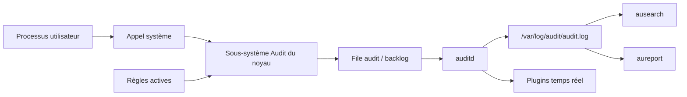
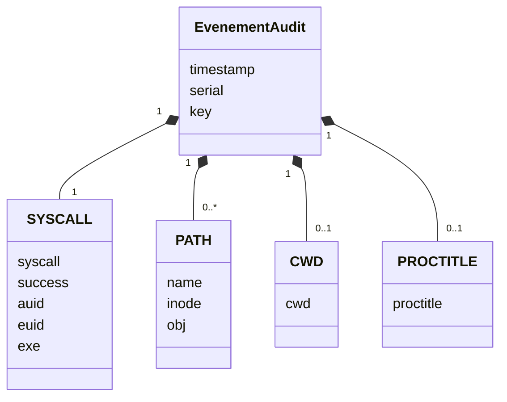
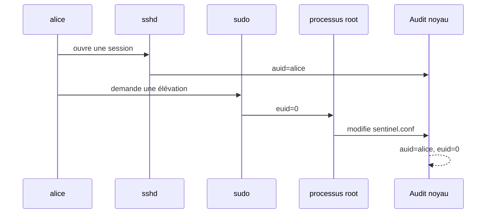
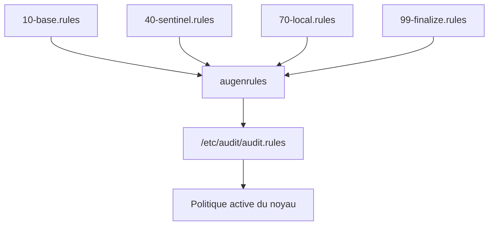
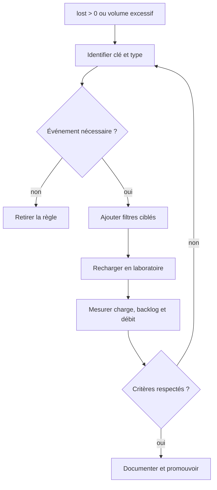

# Chapitre 12.2 — Auditer le système avec auditd

> **Campagne 12 — Supervision et audit**

> *« Un bon audit ne cherche pas à tout enregistrer ; il conserve les actions dont l'absence empêcherait de comprendre l'incident. »*

## Vous êtes ici

```text
PARTIE II — Industrialiser la sécurité

Campagne 12

  12.1 Centraliser les journaux avec Rsyslog ✔
► 12.2 Auditer le système avec auditd
  12.3 Contrôler l'intégrité des fichiers avec AIDE
  12.4 Superviser Sentinel avec Prometheus
  12.5 Concevoir des alertes avec Alertmanager
  12.6 Construire le tableau de bord Sentinel
```

## Objectifs pédagogiques

À l'issue de ce chapitre, vous serez capable de :

- expliquer le trajet d'un événement entre le noyau, `auditd` et les outils d'analyse ;
- distinguer `auid`, UID réel, UID effectif et contexte SELinux ;
- écrire des règles de surveillance de fichiers et d'appels système ;
- rendre une politique persistante avec `augenrules` ;
- rechercher et interpréter un événement composé de plusieurs enregistrements ;
- régler la capacité et le comportement de `auditd` en cas de pression disque ;
- mesurer les limites et le coût d'une politique d'audit.

## Pourquoi ce chapitre existe

Un journal applicatif peut annoncer « configuration rechargée » sans préciser quel compte a remplacé le fichier. Le journal de `sudo` peut montrer une élévation sans détailler tous les objets touchés. Linux Audit complète ces sources en observant des opérations au niveau du noyau et en conservant l'identité de connexion qui les a provoquées.

Cette puissance impose de la retenue. Une règle trop large produit un volume difficile à exploiter et peut augmenter la charge du système. Une règle trop étroite laisse un angle mort. Le travail consiste à traduire les scénarios de risque de Sentinel en événements ciblés et vérifiables.

## Architecture de Linux Audit

Linux Audit comporte une partie noyau et des outils en espace utilisateur. Le noyau confronte les événements aux règles actives, les place dans une file, puis `auditd` les écrit. `auditctl` administre les règles actives ; `ausearch` et `aureport` lisent les journaux.



Sur les systèmes Enterprise Linux 9, la fonction historique d'`audisp` est intégrée à `auditd` ; les plugins restent configurés dans `/etc/audit/plugins.d/`. La journalisation Rsyslog du chapitre précédent ne signifie donc pas que le fichier brut `audit.log` est automatiquement expédié.

### Un événement, plusieurs enregistrements

Une seule opération peut générer plusieurs lignes portant le même horodatage et le même identifiant d'événement :

| Type | Information typique |
| --- | --- |
| `SYSCALL` | appel, réussite, PID, identités et exécutable |
| `PATH` | chemin, inode, propriétaire et contexte SELinux |
| `CWD` | répertoire courant du processus |
| `PROCTITLE` | ligne de commande encodée |
| `EXECVE` | arguments d'une exécution |
| `USER_AUTH` | résultat d'une authentification utilisateur |



Ne lisez pas une ligne isolée comme un événement complet. `ausearch` rassemble les enregistrements partageant le même identifiant et peut interpréter les valeurs numériques avec `-i`.

## Comprendre les identités

L'UID effectif répond à la question « avec quels privilèges le processus agit-il maintenant ? ». L'Audit user ID, ou `auid`, répond plutôt à « quelle identité a ouvert la session à l'origine ? ». Il est attribué à la connexion et hérité par les processus, même après `sudo` ou `su`.



| Champ | Sens simplifié |
| --- | --- |
| `auid` | UID de connexion, conservé pendant la session |
| `uid` | UID réel du processus |
| `euid` | UID utilisé pour de nombreux contrôles de permission |
| `exe` | exécutable associé à l'événement |
| `comm` | nom court de la commande |
| `subj` | contexte SELinux du processus |
| `obj` | contexte SELinux de l'objet |

La valeur `4294967295` représente couramment une identité de connexion non définie. Les règles ciblant des utilisateurs connectés l'excluent souvent explicitement.

> **💎 Le point d'expertise — Attribution n'est pas non-répudiation**
>
> `auid` renforce l'attribution technique, mais un compte partagé, une clé SSH copiée ou une machine d'administration compromise affaiblit la conclusion. L'audit doit être corrélé avec l'authentification, la gestion des identités, l'heure, la provenance réseau et la protection des journaux.

## Prendre l'état initial

Installez les outils et vérifiez le service :

```bash
sudo dnf install -y audit
sudo systemctl enable auditd
sudo systemctl status auditd --no-pager
sudo auditctl -s
sudo auditctl -l
```

`auditctl -s` affiche notamment l'état, le PID, le taux limite, le backlog et les pertes. Toute valeur `lost` non nulle mérite une analyse : elle signale que des événements n'ont pas pu être conservés par la chaîne d'audit.

Sur Enterprise Linux, utilisez `service auditd <action>` pour les actions comme `restart`, `reload` ou `rotate`. La documentation réserve `systemctl` à `enable` et `status` afin que les opérations sur le démon soient elles-mêmes correctement attribuées.

## Écrire des règles ciblées

Les règles se répartissent en trois familles utiles au laboratoire.

### Surveiller un objet

```bash
sudo auditctl -w /etc/sentinel/sentinel.conf -p wa -k sentinel_config
```

`-p wa` demande les écritures et changements d'attributs. Ajouter `r` sur un fichier lu très fréquemment peut générer beaucoup de bruit. Ajouter `x` n'a de sens que pour un objet exécutable.

### Surveiller une arborescence de configuration

```bash
sudo auditctl -w /etc/systemd/system/sentinel.service.d/ \
  -p wa -k sentinel_systemd
```

Une surveillance de répertoire doit être testée avec les opérations réelles : création, remplacement atomique, renommage et changement d'attributs. Les montages imbriqués et chemins éphémères exigent une attention particulière.

### Surveiller des appels système

```bash
sudo auditctl -a always,exit -F arch=b64 \
  -S unlink -S unlinkat -S rename -S renameat \
  -F auid>=1000 -F auid!=4294967295 \
  -k user_file_delete
```

Les filtres réduisent le coût. Spécifier `arch=b64` évite l'ambiguïté d'architecture ; sur un système prenant en charge des exécutables 32 bits, une règle `b32` distincte peut être nécessaire. Regrouper plusieurs appels système dans une règle est généralement plus efficace que multiplier les règles identiques.

> **Piège classique — copier une politique de conformité entière**
>
> Les exemples de `/usr/share/audit/sample-rules/` sont des composants, pas une sélection à charger aveuglément. Une politique STIG ou PCI répond à un objectif précis et peut modifier le volume, le comportement en cas de panne et la disponibilité. Lisez, adaptez et testez.

## Rendre les règles persistantes

Les règles passées avec `auditctl` disparaissent au redémarrage. Créez `/etc/audit/rules.d/40-sentinel.rules` :

```text
-w /etc/sentinel/sentinel.conf -p wa -k sentinel_config
-w /etc/systemd/system/sentinel.service.d/ -p wa -k sentinel_systemd
-w /etc/containers/systemd/ -p wa -k sentinel_quadlet
```

Adaptez le chemin Quadlet au mode réellement utilisé : système ou utilisateur. Ne conservez pas une surveillance sur un répertoire absent sans expliquer le choix.

Compilez et chargez :

```bash
sudo augenrules --check
sudo augenrules --load
sudo auditctl -l
```

`augenrules` assemble les fichiers `.rules` par ordre naturel. Une convention fréquente place la base au début, les règles locales vers `70` et la finalisation immuable vers `90` ou `99`.



### Le mode immuable

La directive `-e 2`, placée en fin de politique, verrouille les règles jusqu'au redémarrage. Elle protège contre une modification à chaud, mais transforme aussi une erreur de règle en redémarrage de maintenance. Validez toute la politique et son coût avant de l'activer.

## Régler la conservation et la panne

`/etc/audit/auditd.conf` détermine la taille, la rotation, la synchronisation et les réactions au manque d'espace. Il n'existe pas une valeur universelle ; le débit et l'exigence métier décident.

| Paramètre | Question à trancher |
| --- | --- |
| `max_log_file` | quelle taille pour un fichier ? |
| `max_log_file_action` | tourner, conserver ou suspendre ? |
| `space_left` | quand prévenir avant la saturation ? |
| `space_left_action` | comment avertir l'exploitation ? |
| `admin_space_left` | quelle réserve laisser à l'administrateur ? |
| `admin_space_left_action` | faut-il passer en mode restreint ? |
| `disk_full_action` | arrêter, suspendre ou continuer sans preuve ? |
| `flush` et `freq` | quel compromis entre durabilité et performance ? |

Une politique stricte peut choisir `keep_logs`, puis `single` ou `halt` lorsque l'audit ne peut plus écrire. Ce choix améliore la conservation des preuves mais réduit la disponibilité. Il doit être validé par le propriétaire métier, pas ajouté furtivement pendant un TP.

Surveillez la partition séparément :

```bash
df -h /var/log/audit
sudo du -sh /var/log/audit
sudo auditctl -s
```

## Rechercher et interpréter

Recherche par clé :

```bash
sudo ausearch -k sentinel_config -ts recent -i
```

Recherche par identifiant d'événement :

```bash
sudo ausearch -a NUMERO_EVENEMENT -i
```

Échecs d'authentification récents :

```bash
sudo ausearch -m USER_AUTH,USER_LOGIN -sv no -ts today -i
```

Rapports synthétiques :

```bash
sudo aureport --login -i
sudo aureport --auth -i
sudo aureport --failed -i
```

L'option `-i` facilite la lecture, mais conservez aussi l'événement brut lors d'une enquête. L'interprétation dépend des bases de noms et du système au moment de la lecture.

## TP 1 — Attribuer une modification de configuration

1. Vérifiez que la règle `sentinel_config` est active.
2. Depuis une session nominative, modifiez une ligne non sensible avec `sudoedit`.
3. Validez la configuration Sentinel.
4. Restaurez la valeur initiale.
5. Recherchez les deux opérations.

```bash
sudo auditctl -l | grep sentinel_config
sudoedit /etc/sentinel/sentinel.conf
sudo ausearch -k sentinel_config -ts recent -i
```

Dans le compte rendu, identifiez `auid`, `euid`, `exe`, `name`, `success`, `subj` et le numéro d'événement. Expliquez pourquoi `euid=0` ne signifie pas nécessairement que la session a été ouverte directement par `root`.

## TP 2 — Tester la persistance

Créez la règle dans `/etc/audit/rules.d/40-sentinel.rules`, puis :

```bash
sudo augenrules --check
sudo augenrules --load
sudo auditctl -l | grep -E 'sentinel_(config|systemd|quadlet)'
```

Redémarrez uniquement la VM de laboratoire, puis répétez la dernière commande. Provoquez une modification contrôlée d'un drop-in systemd et recherchez-la :

```bash
sudo touch /etc/systemd/system/sentinel.service.d/audit-lab.conf
sudo ausearch -k sentinel_systemd -ts recent -i
sudo rm /etc/systemd/system/sentinel.service.d/audit-lab.conf
```

Le fichier vide est un artefact de laboratoire ; retirez-le et vérifiez que sa suppression apparaît également.

## TP 3 — Corréler Audit, sudo et journaux centraux

Choisissez une fenêtre de cinq minutes. Dans une session nominative :

1. exécutez une commande autorisée avec `sudo` ;
2. modifiez puis restaurez `sentinel.conf` ;
3. rechargez Sentinel ;
4. relevez l'heure exacte.

Recherchez ensuite :

```bash
sudo ausearch -k sentinel_config -ts recent -i
sudo journalctl _COMM=sudo --since '-5 min' -o short-iso
sudo journalctl -u sentinel --since '-5 min' -o short-iso
```

Sur le collecteur, retrouvez les messages Rsyslog de la même fenêtre. Construisez une chronologie distinguant : authentification, élévation, modification, rechargement et résultat applicatif.

## Diagnostiquer le bruit et les pertes

Pendant un test représentatif :

```bash
sudo auditctl -s
sudo ausearch -ts recent | wc -l
sudo aureport --summary
```

Si le volume explose, ne commencez pas par augmenter indéfiniment les limites. Identifiez la clé, l'appel ou le chemin responsable, puis resserrez les filtres. Si `lost` augmente, vérifiez le backlog, la charge, le disque et la vitesse de consommation par `auditd`.



## Mission d'ingénieur — Définir la politique Audit de Sentinel

À partir de cinq scénarios — modification de configuration, changement d'unité, changement de politique SELinux, installation logicielle et suppression de données — produisez :

1. la question d'enquête associée à chaque scénario ;
2. la règle minimale permettant d'y répondre ;
3. une clé stable et documentée ;
4. un test positif et un test négatif ;
5. une mesure du volume généré ;
6. la stratégie de stockage et de saturation ;
7. la procédure de recherche avec `ausearch` ;
8. la décision argumentée d'activer ou non `-e 2`.

La politique est acceptable si elle survit au redémarrage, attribue les opérations de test, ne surveille pas aveuglément tout le système et ne produit aucune perte pendant la charge de qualification.

## Impact sur Sentinel

Les changements sensibles de Sentinel ne reposent plus uniquement sur les messages de l'application. Une enquête peut relier l'identité de connexion, l'identité effective, l'exécutable, l'objet et le contexte SELinux.

Linux Audit ne dit pas si le contenu final est légitime. Il prouve qu'une opération a eu lieu selon les règles présentes. Le chapitre suivant compare l'état des fichiers à une référence approuvée afin de détecter les dérives de contenu et de métadonnées.

## Références techniques

- [Red Hat — Auditing the system](https://docs.redhat.com/en/documentation/red_hat_enterprise_linux/9/html/security_hardening/auditing-the-system_security-hardening) ;
- [Linux Audit Documentation](https://github.com/linux-audit/audit-documentation) ;
- pages de manuel locales `auditd(8)`, `auditctl(8)`, `audit.rules(7)`, `augenrules(8)`, `ausearch(8)` et `aureport(8)`.

## Synthèse

- le noyau filtre les événements, `auditd` les conserve et les outils `ausearch`/`aureport` les exploitent ;
- un événement peut regrouper plusieurs enregistrements portant le même numéro ;
- `auid` conserve l'identité de connexion tandis que `euid` décrit le privilège effectif ;
- les règles temporaires servent à qualifier ; `/etc/audit/rules.d/` et `augenrules` assurent la persistance ;
- `-e 2` verrouille la politique jusqu'au redémarrage et ne doit être activé qu'après validation ;
- le disque, le backlog, les pertes et le volume font partie du modèle de sécurité.

## Infographie de révision

```text
┌────────────────────────── LINUX AUDIT ──────────────────────────────┐
│ Action       processus → appel système → filtre noyau               │
│ Attribution  auid de connexion + uid/euid + exe + contexte SELinux │
│ Conservation auditd → audit.log → politique de capacité             │
│ Analyse      numéro d'événement → ausearch → aureport               │
│ Qualité      règle ciblée + clé stable + test + mesure des pertes    │
└─────────────────────────────────────────────────────────────────────┘
```

## Pour aller plus loin

[Le chapitre 12.3](12.3-controler-integrite-fichiers-aide.md) crée une baseline AIDE et organise la décision entre modification attendue et dérive suspecte.
