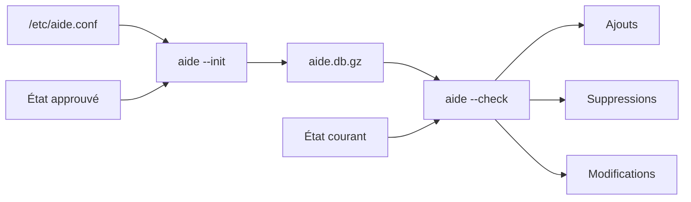
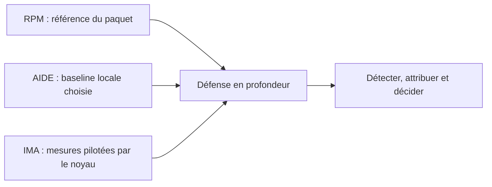
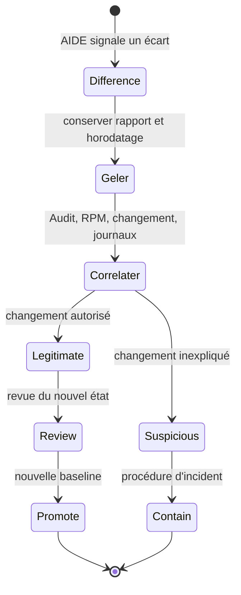
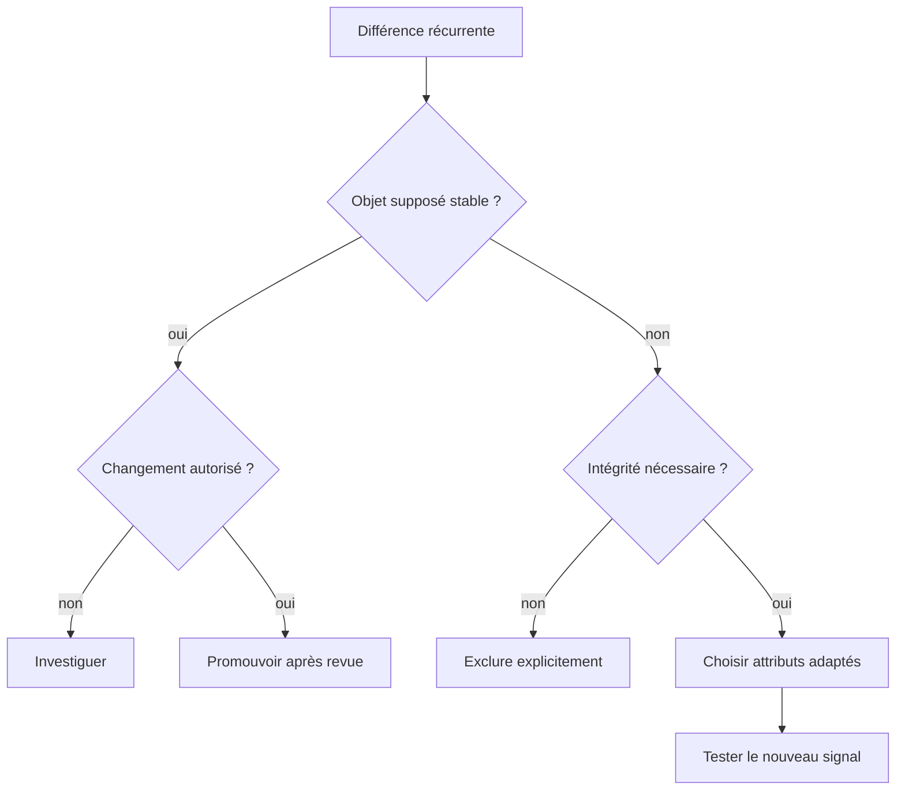

# Chapitre 12.3 — Contrôler l'intégrité des fichiers avec AIDE

> **Campagne 12 — Supervision et audit**

> *« Une empreinte ne dit pas qu'un fichier est bon ; elle dit qu'il est resté identique à une référence que vous avez décidé de croire. »*

## Vous êtes ici

```text
PARTIE II — Industrialiser la sécurité

Campagne 12

  12.1 Centraliser les journaux avec Rsyslog ✔
  12.2 Auditer le système avec auditd ✔
► 12.3 Contrôler l'intégrité des fichiers avec AIDE
  12.4 Superviser Sentinel avec Prometheus
  12.5 Concevoir des alertes avec Alertmanager
  12.6 Construire le tableau de bord Sentinel
```

## Objectifs pédagogiques

À l'issue de ce chapitre, vous serez capable de :

- expliquer ce qu'une baseline d'intégrité prouve et ne prouve pas ;
- choisir les fichiers Sentinel stables à contrôler et les données dynamiques à exclure ;
- initialiser, vérifier et mettre à jour une base AIDE ;
- interpréter les changements de contenu, droits, propriétaire, xattrs et contexte SELinux ;
- corréler AIDE, RPM et Linux Audit ;
- automatiser un contrôle périodique avec un timer systemd ;
- organiser une promotion de baseline soumise à revue.

## Pourquoi ce chapitre existe

Linux Audit répond bien à « quelle opération a été observée ? », mais sa réponse dépend des règles actives au moment de l'action. AIDE pose une autre question : « l'état actuel des objets correspond-il encore à la référence approuvée ? ». Il peut ainsi révéler une modification réalisée pendant une période mal couverte ou une dérive de métadonnées.

Cette détection est différée. Entre deux contrôles, une modification peut rester invisible. Si l'attaquant peut altérer simultanément les fichiers, la base et l'outil AIDE, le contrôle local perd sa valeur. L'architecture doit donc protéger la référence et traiter chaque mise à jour comme une décision de sécurité.

## Comprendre le modèle AIDE

AIDE parcourt les chemins sélectionnés, calcule les attributs demandés, puis les stocke dans une base. Un contrôle futur recalcule ces attributs et compare les deux états.



| Résultat | Exemple | Question à poser |
| --- | --- | --- |
| ajouté | nouveau drop-in systemd | changement autorisé ou persistance ? |
| supprimé | certificat de confiance absent | retrait planifié ou sabotage ? |
| modifié | hash de `sentinel.py` différent | paquet mis à jour ou altération ? |
| métadonnée modifiée | mode `0640` devenu `0666` | erreur d'exploitation ou élargissement malveillant ? |
| contexte modifié | type SELinux inattendu | relabellisation légitime ou contournement ? |

### Quels attributs contrôler ?

AIDE peut comparer, selon le système de fichiers et la configuration :

- type, permissions, inode et nombre de liens ;
- propriétaire et groupe ;
- taille et dates ;
- listes de contrôle d'accès ;
- attributs étendus ;
- contexte SELinux ;
- empreintes cryptographiques comme SHA-256 ou SHA-512.

Plus une règle est stricte, plus elle détecte, mais plus elle réagit aussi aux opérations normales. La date d'accès est par exemple très volatile ; la surveiller sur un fichier souvent lu crée peu de valeur.

> **💎 Le point d'expertise — La confiance vient avant le hash**
>
> Une empreinte calculée après compromission fige l'état compromis avec une précision parfaite. Initialisez la baseline après une installation qualifiée, contrôlez les paquets et configurations, puis copiez la base et sa configuration vers un emplacement protégé ou un autre domaine d'administration.

## AIDE, RPM et IMA : trois angles différents

| Mécanisme | Référence | Portée | Moment |
| --- | --- | --- | --- |
| `rpm -V` | métadonnées du paquet installé | fichiers gérés par RPM | à la demande |
| AIDE | base créée par l'organisation | fichiers paquetés et locaux choisis | contrôle périodique |
| IMA | mesures et xattrs liés au noyau | fichiers soumis à la politique IMA | accès ou exécution selon politique |

`rpm -V sentinel` est utile pour les fichiers installés par le paquet, mais ne connaît pas nécessairement les fichiers générés localement. AIDE peut couvrir `/etc/sentinel`, les unités, les certificats publics et les sources Quadlet. IMA apporte des mécanismes de mesure et, avec l'architecture appropriée, d'évaluation plus proche de l'accès. Ce chapitre reste centré sur AIDE ; IMA et Keylime sont des prolongements culturels, pas des synonymes.



## Définir le périmètre Sentinel

Classez les objets selon leur stabilité :

| Objet | Nature | Décision |
| --- | --- | --- |
| `/usr/libexec/sentinel/sentinel.py` | code paqueté | hash et métadonnées strictes |
| `/usr/lib/systemd/system/sentinel.service` | unité paquetée | hash, droits, propriétaire, SELinux |
| `/etc/sentinel/` | configuration locale | contenu et métadonnées |
| certificat public | confiance et identité | contenu, dates suivies séparément |
| clé privée | secret stable | métadonnées et contenu, avec accès AIDE maîtrisé |
| `/var/lib/sentinel/` | état applicatif | exclusion ou règle adaptée |
| `/run/sentinel/` | état volatil | exclusion |
| journaux | données en croissance | exclusion du contrôle de contenu |

Contrôler une base de données mutable avec un hash strict garantit presque une alerte à chaque exécution. Cela ne signifie pas qu'elle est sans importance ; elle nécessite une stratégie d'intégrité propre à son format, des sauvegardes et des contrôles applicatifs.

## Installer et examiner la configuration

```bash
sudo dnf install -y aide
rpm -q aide
sudo grep -Ev '^[[:space:]]*(#|$)' /etc/aide.conf | head -80
```

Avant la première initialisation, sauvegardez la configuration distribuée par le paquet et identifiez les inclusions éventuelles :

```bash
sudo cp --preserve=all /etc/aide.conf /etc/aide.conf.before-sentinel
sudo aide --config-check
```

Le nom exact de l'option de validation peut dépendre de la version. Vérifiez `aide --help` et `man aide` sur la VM ; une initialisation de laboratoire ne remplace pas la validation syntaxique disponible localement.

## Écrire une règle lisible

Ajoutez un groupe d'attributs dédié dans la zone locale de la configuration :

```text
SentinelStatic = p+i+n+u+g+s+m+c+acl+xattrs+selinux+sha512
SentinelSecret = p+i+n+u+g+s+acl+xattrs+selinux+sha512
```

Puis sélectionnez les objets :

```text
/usr/libexec/sentinel/sentinel.py                      SentinelStatic
/usr/lib/systemd/system/sentinel.service               SentinelStatic
/etc/sentinel/.*                                      SentinelStatic
/etc/pki/sentinel/.*                                  SentinelSecret
/etc/containers/systemd/sentinel\.(container|network)  SentinelStatic
!/var/lib/sentinel/.*
!/run/sentinel/.*
```

Ces expressions sont des exemples à adapter aux chemins réellement déployés. Un Sentinel rootless peut stocker son Quadlet sous le répertoire personnel du compte de service. Dans ce cas, surveillez la source versionnée et les droits du chemin, sans élargir AIDE à tous les répertoires personnels.

> **Piège classique — copier une règle sans vérifier ses attributs**
>
> Les groupes prédéfinis et attributs disponibles varient avec la version et les options de compilation. Utilisez `man aide.conf`, lancez un contrôle sur un petit périmètre et vérifiez que le rapport contient réellement les ACL, xattrs et contextes attendus.

## Construire la baseline

Prenez d'abord une preuve de l'état logiciel :

```bash
sudo rpm -V sentinel
sudo restorecon -RFvn /etc/sentinel /usr/libexec/sentinel
sudo systemd-analyze verify /usr/lib/systemd/system/sentinel.service
```

Une sortie de `rpm -V` doit être expliquée avant de continuer. L'option `-n` de `restorecon` simule la relabellisation sans modifier les contextes.

Initialisez ensuite :

```bash
sudo aide --init
sudo ls -lh /var/lib/aide/aide.db.new.gz
sudo sha256sum /var/lib/aide/aide.db.new.gz
```

Après revue du rapport et de l'état, activez la base :

```bash
sudo install -o root -g root -m 0600 \
  /var/lib/aide/aide.db.new.gz /var/lib/aide/aide.db.gz
```

Copiez l'empreinte et, si l'architecture le permet, la base vers le coffre de preuves du collecteur. Une simple copie sur le même système de fichiers protège peu contre un compte `root` compromis.

## Lire un rapport sans paniquer

```bash
sudo aide --check
```

Le résumé classe les entrées ajoutées, supprimées et modifiées. Le détail indique les attributs avant et après. Une différence est un signal, pas un verdict :



N'exécutez pas automatiquement `aide --update` après chaque différence. Vous détruiriez la séparation entre détection et approbation.

## Mettre à jour après un changement autorisé

Après un déploiement approuvé :

```bash
sudo rpm -V sentinel
sudo aide --check
sudo aide --update
```

`aide --update` crée une nouvelle base, généralement `aide.db.new.gz`. Comparez le rapport au ticket de changement, conservez l'ancienne base, puis promouvez :

```bash
stamp=$(date -u +%Y%m%dT%H%M%SZ)
sudo cp --preserve=all /var/lib/aide/aide.db.gz \
  "/var/lib/aide/archive/aide.db.$stamp.gz"
sudo install -o root -g root -m 0600 \
  /var/lib/aide/aide.db.new.gz /var/lib/aide/aide.db.gz
```

Créez et protégez `/var/lib/aide/archive` avant cette commande. Le nom horodaté facilite le retour à une référence précédente, mais la capacité et la rétention de l'archive restent à définir.

## Automatiser avec systemd

Créez `/etc/systemd/system/sentinel-aide-check.service` :

```ini
[Unit]
Description=Contrôle d'intégrité AIDE de Sentinel
ConditionPathExists=/var/lib/aide/aide.db.gz

[Service]
Type=oneshot
ExecStart=/usr/sbin/aide --check
Nice=19
IOSchedulingClass=idle
StandardOutput=journal
StandardError=journal
```

Créez `/etc/systemd/system/sentinel-aide-check.timer` :

```ini
[Unit]
Description=Planification du contrôle AIDE de Sentinel

[Timer]
OnCalendar=*-*-* 04:05:00
RandomizedDelaySec=15m
Persistent=true
Unit=sentinel-aide-check.service

[Install]
WantedBy=timers.target
```

Validez et activez :

```bash
sudo systemd-analyze verify \
  /etc/systemd/system/sentinel-aide-check.service \
  /etc/systemd/system/sentinel-aide-check.timer
sudo systemctl daemon-reload
sudo systemctl enable --now sentinel-aide-check.timer
systemctl list-timers sentinel-aide-check.timer
```

`Persistent=true` déclenche un passage manqué après le retour de la machine. `RandomizedDelaySec` évite que tous les hôtes sollicitent simultanément le stockage. Un résultat AIDE non nul rend l'unité en échec ; c'est utile pour l'alerte, à condition de distinguer différence et erreur d'exécution dans le runbook.

## TP 1 — Détecter et expliquer une dérive

Exécutez un contrôle de référence :

```bash
sudo aide --check
```

Modifiez uniquement un commentaire dans une copie de laboratoire de `/etc/sentinel/sentinel.conf`, puis relancez le contrôle. Relevez :

1. le fichier ;
2. les attributs modifiés ;
3. l'ancienne et la nouvelle empreinte ;
4. le statut de sortie ;
5. l'événement Audit correspondant.

Restaurez le fichier depuis la source approuvée et vérifiez qu'AIDE revient à un état sans différence. Ne mettez pas à jour la baseline pour effacer l'exercice.

## TP 2 — Comparer AIDE, RPM et Audit

Choisissez le fichier paqueté `sentinel.py`. Collectez l'état initial :

```bash
sudo rpm -V sentinel
sudo aide --check
sudo ausearch -k sentinel_code -ts recent -i
```

Si la politique Audit ne possède pas encore la clé `sentinel_code`, ajoutez en laboratoire une surveillance d'écriture sur le fichier, rendez-la persistante et testez-la.

Effectuez ensuite une altération contrôlée, sans exécuter le fichier, puis comparez les trois outils :

| Outil | Détecte le contenu ? | Attribue l'action ? | Référence |
| --- | --- | --- | --- |
| RPM | à vérifier | non | paquet installé |
| AIDE | à vérifier | non | base AIDE |
| Audit | selon règle | oui, selon session | événement au moment de l'action |

Réinstallez le paquet approuvé ou restaurez l'artefact qualifié, puis confirmez le retour à l'état attendu.

## TP 3 — Qualifier le timer et l'alerte

Déclenchez manuellement l'unité :

```bash
sudo systemctl start sentinel-aide-check.service
sudo systemctl status sentinel-aide-check.service --no-pager
sudo journalctl -u sentinel-aide-check.service -n 100 --no-pager
```

Provoquez une dérive bénigne, relancez et vérifiez que :

- le statut signale l'échec ;
- le rapport complet est dans le journal ;
- le timer reste planifié ;
- la centralisation Rsyslog reçoit l'événement ;
- le runbook explique comment revenir à l'état sain.

Restaurez la configuration et relancez une dernière fois.

## Réduire le bruit

Un rapport quotidien ignoré est pire qu'un contrôle plus petit réellement traité. Classez chaque différence récurrente :



Documentez chaque exclusion. Une exclusion silencieuse devient facilement un angle mort.

## Mission d'ingénieur — Organiser le cycle de vie de la baseline

Concevez le processus complet pour Sentinel :

1. inventaire des objets stables, mutables et volatils ;
2. règle AIDE et justification des attributs ;
3. critères préalables à l'initialisation ;
4. stockage protégé de la base, de sa configuration et de leurs empreintes ;
5. fréquence, fenêtre et budget de durée du contrôle ;
6. procédure d'analyse d'une différence ;
7. procédure de promotion après paquet ou changement approuvé ;
8. test de restauration d'une ancienne baseline ;
9. preuve de corrélation avec RPM, Audit et journaux centraux.

Le livrable est accepté si une dérive contrôlée est détectée, attribuée par Audit, restaurée sans promotion abusive et suivie d'un contrôle vert.

## Impact sur Sentinel

Sentinel dispose maintenant de trois regards complémentaires : ses journaux décrivent le comportement, Audit attribue les opérations sensibles et AIDE compare les objets stables à une référence.

Cette chaîne reste périodique et orientée événements. Le chapitre suivant ajoute des séries temporelles pour voir une tendance, mesurer une saturation et détecter une indisponibilité avant qu'un humain lise les journaux.

## Références techniques

- [Red Hat — Checking integrity with AIDE](https://docs.redhat.com/en/documentation/red_hat_enterprise_linux/9/html/security_hardening/checking-integrity-with-aide_security-hardening) ;
- [AIDE — Documentation officielle](https://aide.github.io/) ;
- pages de manuel locales `aide(1)`, `aide.conf(5)`, `rpm(8)` et `systemd.timer(5)`.

## Synthèse

- AIDE compare l'état courant à une baseline explicitement approuvée ;
- le choix des attributs et des exclusions détermine la qualité du signal ;
- RPM vérifie les fichiers paquetés, AIDE étend le périmètre et Audit attribue l'opération ;
- une différence déclenche une enquête, pas une mise à jour automatique ;
- la base, la configuration et l'outil doivent être protégés hors du seul domaine compromis ;
- un timer systemd automatise le contrôle, tandis qu'un runbook organise la décision.

## Infographie de révision

```text
┌──────────────────────────── AIDE ───────────────────────────────────┐
│ Référence     état qualifié → règle d'attributs → base protégée     │
│ Contrôle      état courant → comparaison → ajout/suppression/écart  │
│ Corrélation   AIDE + rpm -V + Audit + ticket de changement          │
│ Décision      suspect → incident | légitime → revue → promotion     │
│ Exploitation  timer systemd + rapport centralisé + test de retour   │
└─────────────────────────────────────────────────────────────────────┘
```

## Pour aller plus loin

[Le chapitre 12.4](12.4-superviser-sentinel-prometheus.md) introduit Prometheus, les métriques de l'hôte et un contrat d'instrumentation pour Sentinel.
