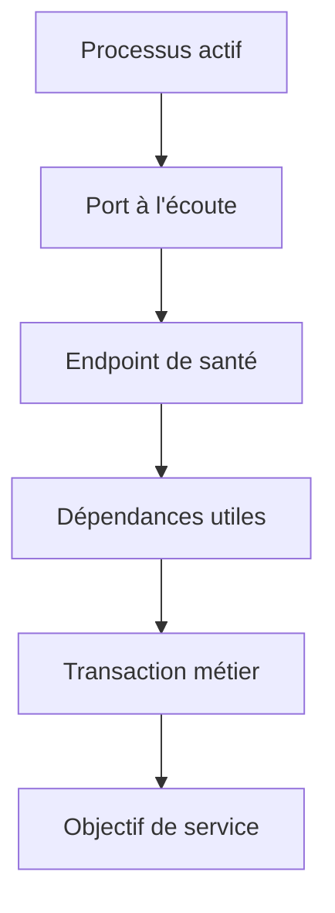
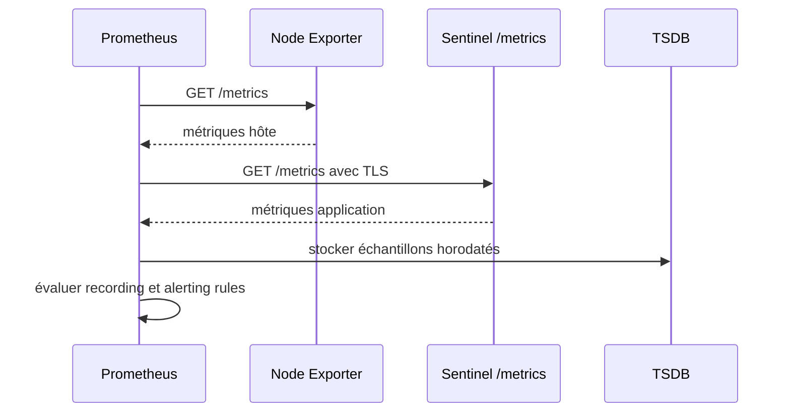
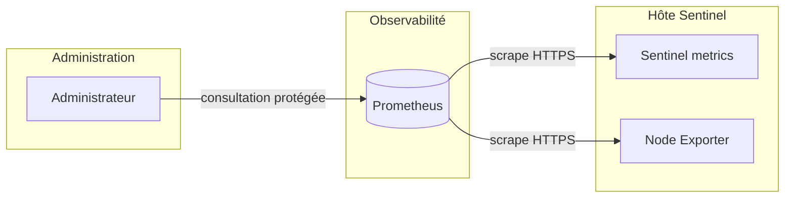

# Chapitre 12.4 — Superviser Sentinel avec Prometheus

> **Campagne 12 — Supervision et audit**

> *« Un service n'est pas sain parce que son processus existe ; il est sain lorsqu'il rend le service attendu dans des limites acceptables. »*

## Vous êtes ici

```text
PARTIE II — Industrialiser la sécurité

Campagne 12

  12.1 Centraliser les journaux avec Rsyslog ✔
  12.2 Auditer le système avec auditd ✔
  12.3 Contrôler l'intégrité des fichiers avec AIDE ✔
► 12.4 Superviser Sentinel avec Prometheus
  12.5 Concevoir des alertes avec Alertmanager
  12.6 Construire le tableau de bord Sentinel
```

## Objectifs pédagogiques

À l'issue de ce chapitre, vous serez capable de :

- distinguer disponibilité du processus, santé technique et service rendu ;
- expliquer le modèle pull, les cibles, les scrapes et les séries temporelles Prometheus ;
- choisir compteurs, jauges et histogrammes adaptés à Sentinel ;
- maîtriser les labels et prévenir l'explosion de cardinalité ;
- collecter les métriques de l'hôte avec Node Exporter ;
- sécuriser et valider une cible de collecte ;
- écrire des requêtes PromQL et des recording rules utiles à l'exploitation.

## Pourquoi ce chapitre existe

Les journaux et l'audit décrivent des événements précis. Ils sont indispensables pour comprendre, mais peu pratiques pour répondre rapidement à « le taux d'erreurs augmente-t-il ? », « combien d'espace reste-t-il ? » ou « depuis combien de temps Sentinel est-il indisponible ? ».

Prometheus stocke des valeurs horodatées identifiées par un nom de métrique et des labels. Il interroge périodiquement des endpoints HTTP et permet de calculer des taux, ratios et quantiles. Cette vision temporelle complète les preuves des chapitres précédents sans les remplacer.

## De la présence au service rendu

Une supervision utile combine plusieurs profondeurs :

| Niveau | Question | Exemple |
| --- | --- | --- |
| processus | l'unité tourne-t-elle ? | `systemctl is-active sentinel` |
| port | une socket écoute-t-elle ? | `ss -lnt` |
| santé | l'application répond-elle ? | `GET /health` |
| dépendance | les composants nécessaires répondent-ils ? | PKI, stockage, identité |
| service | un utilisateur obtient-il le résultat attendu ? | transaction synthétique |
| expérience | latence et erreurs restent-elles acceptables ? | p95 et taux 5xx |



Un service peut avoir un PID et refuser toutes les requêtes. À l'inverse, une sonde trop profonde peut déclarer Sentinel indisponible à cause d'une dépendance secondaire. Définissez séparément :

- **liveness** : le processus peut-il continuer ou faut-il le redémarrer ? ;
- **readiness** : peut-il recevoir du trafic maintenant ? ;
- **transaction synthétique** : le chemin critique fonctionne-t-il de l'extérieur ?.

## Comprendre le modèle Prometheus

Prometheus utilise principalement un modèle pull : le serveur vient lire périodiquement les endpoints `/metrics`. Chaque lecture est un scrape. Les cibles sont regroupées en jobs.



Prometheus ajoute notamment les labels `job` et `instance`. La métrique synthétique `up` vaut `1` lorsque le scrape réussit et `0` lorsqu'il échoue. Elle prouve l'accessibilité de l'endpoint de métriques, pas le bon fonctionnement métier complet.

### Série, échantillon et label

```text
sentinel_http_requests_total{method="GET",route="/health",code="200"} 1842
```

Le nom et l'ensemble exact de labels identifient une série. Changer une valeur de label crée une autre série. Les échantillons successifs donnent l'évolution de cette série.

> **💎 Le point d'expertise — Chaque label a un coût multiplicatif**
>
> Un label `user_id`, une URL complète, un identifiant de requête ou une adresse IP non bornée peut créer une série par valeur. Ces dimensions appartiennent aux journaux ou aux traces. Les métriques utilisent des catégories bornées : méthode, route normalisée, classe de code et instance.

## Choisir les types de métriques

| Type | Comportement | Exemple Sentinel | Fonction PromQL |
| --- | --- | --- | --- |
| compteur | augmente, sauf redémarrage | requêtes, erreurs, octets | `rate()`, `increase()` |
| jauge | monte et descend | requêtes en cours, taille de file | valeur, `max_over_time()` |
| histogramme | compte des observations par buckets | durée des requêtes | `histogram_quantile()` |
| info | valeur constante avec labels bornés | version et révision | égalité, jointure prudente |

Un compteur porte le suffixe `_total`. Une durée utilise l'unité de base seconde et le suffixe `_seconds`. Une taille utilise `_bytes`. Un ratio est exporté entre 0 et 1 ou calculé à la requête.

### Contrat minimal Sentinel

| Métrique | Type | Utilité |
| --- | --- | --- |
| `sentinel_build_info{version,revision}` | gauge info | version réellement servie |
| `sentinel_http_requests_total{method,route,code}` | compteur | trafic et erreurs |
| `sentinel_http_request_duration_seconds` | histogramme | distribution de latence |
| `sentinel_http_requests_in_flight` | jauge | concurrence instantanée |
| `sentinel_dependency_up{name}` | jauge | dépendances bornées |
| `sentinel_last_success_unixtime` | jauge | date de la dernière opération réussie |

Le nom de compte, le jeton, le chemin de fichier demandé et l'exception complète ne sont pas des labels. Ils restent dans les journaux structurés corrélés par un identifiant de requête.

## Architecture du laboratoire

Le serveur Prometheus partage l'hôte d'observabilité, mais écoute seulement sur la boucle locale ou le réseau d'administration. Node Exporter écoute sur l'adresse de supervision de l'hôte Sentinel et le pare-feu n'autorise que Prometheus. Les métriques applicatives passent par le point d'entrée TLS contrôlé.



> **Règle de sécurité**
>
> Les endpoints Prometheus exposent des informations sur le système et peuvent être coûteux à interroger. Ils ne doivent pas être publiés sur Internet. Restreignez réseau, pare-feu, authentification et capacité de requête selon le modèle de menace.

## Préparer les artefacts sans contourner la chaîne de confiance

Prometheus et Node Exporter ne sont pas supposés provenir d'un `curl | sh`. Le laboratoire fournit des artefacts officiels dont l'empreinte a été vérifiée, puis des RPM internes construits selon la campagne 10. Le manifeste de livraison contient :

```text
prometheus-VERSION-RELEASE.arch.rpm
node_exporter-VERSION-RELEASE.arch.rpm
SHA256SUMS
provenance.txt
```

Vérifiez avant installation :

```bash
sha256sum -c SHA256SUMS
rpm -K prometheus-*.rpm node_exporter-*.rpm
sudo dnf install ./node_exporter-*.rpm
```

Si votre organisation utilise un dépôt interne signé, préférez `dnf install node_exporter` depuis ce dépôt. La version précise est un paramètre de plateforme ; les commandes doivent être confrontées à `--help` et aux unités réellement livrées.

## Déployer Node Exporter

Node Exporter expose les métriques Linux : CPU, mémoire, systèmes de fichiers, réseau et plusieurs statistiques noyau. Il ne connaît pas la santé métier de Sentinel.

Inspectez l'unité avant de modifier ses options :

```bash
sudo systemctl cat node_exporter
node_exporter --help | less
```

Configurez une écoute sur l'adresse de supervision, par exemple :

```text
--web.listen-address=192.0.2.10:9100
--collector.textfile.directory=/var/lib/node_exporter/textfile
```

Le mécanisme exact — fichier `/etc/sysconfig`, argument d'unité ou drop-in — dépend du RPM interne. Utilisez un drop-in plutôt que d'éditer `/usr/lib/systemd/system/node_exporter.service`.

Restreignez le flux :

```bash
sudo firewall-cmd --permanent --zone=internal \
  --add-rich-rule='rule family="ipv4" source address="192.0.2.20/32" port port="9100" protocol="tcp" accept'
sudo firewall-cmd --reload
sudo systemctl enable --now node_exporter
sudo ss -lntp | grep ':9100'
```

Depuis Prometheus :

```bash
curl --fail --silent http://192.0.2.10:9100/metrics | head
```

Depuis Kali, le même port doit être filtré ou refusé.

## Configurer les scrapes Prometheus

Sur `observability.sentinel.lab`, créez une configuration contrôlée :

```yaml
global:
  scrape_interval: 15s
  evaluation_interval: 15s

rule_files:
  - /etc/prometheus/rules/*.yml

scrape_configs:
  - job_name: node
    static_configs:
      - targets:
          - 192.0.2.10:9100
        labels:
          environment: lab
          service: sentinel

  - job_name: sentinel
    scheme: https
    metrics_path: /metrics
    tls_config:
      ca_file: /etc/prometheus/pki/ca.crt
      cert_file: /etc/prometheus/pki/prometheus.crt
      key_file: /etc/prometheus/pki/prometheus.key
      server_name: sentinel.sentinel.lab
    static_configs:
      - targets:
          - sentinel.sentinel.lab:443
        labels:
          environment: lab
```

Les labels statiques décrivent des dimensions stables. Ne recopiez pas des secrets dans le YAML. Les fichiers de clé ont des permissions minimales et sont lisibles par le compte Prometheus.

Validez avant rechargement :

```bash
sudo -u prometheus promtool check config /etc/prometheus/prometheus.yml
sudo systemctl reload prometheus
sudo journalctl -u prometheus -n 50 --no-pager
```

Si l'unité n'implémente pas `reload`, utilisez le mécanisme documenté par le RPM : signal `SIGHUP` ou endpoint `/-/reload` uniquement lorsqu'il est explicitement activé et protégé.

## Interroger avec PromQL

### Disponibilité du scrape

```promql
up{job="sentinel"}
```

### Utilisation CPU hors idle

```promql
1 - avg by (instance) (
  rate(node_cpu_seconds_total{job="node",mode="idle"}[5m])
)
```

### Mémoire disponible

```promql
1 - (
  node_memory_MemAvailable_bytes{job="node"}
  /
  node_memory_MemTotal_bytes{job="node"}
)
```

### Espace disponible sur les systèmes de fichiers

```promql
node_filesystem_avail_bytes{
  job="node",
  fstype!~"tmpfs|overlay",
  mountpoint!~"/run.*"
}
/
node_filesystem_size_bytes{
  job="node",
  fstype!~"tmpfs|overlay",
  mountpoint!~"/run.*"
}
```

### Taux de requêtes Sentinel

```promql
sum by (code) (
  rate(sentinel_http_requests_total[5m])
)
```

### Latence p95

```promql
histogram_quantile(
  0.95,
  sum by (le) (
    rate(sentinel_http_request_duration_seconds_bucket[5m])
  )
)
```

Le p95 agrégé n'est correct que si les buckets sont compatibles. Il signifie que 95 % des observations de la fenêtre se situent sous la valeur estimée, pas que chaque utilisateur a obtenu cette latence.

## Enregistrer les requêtes récurrentes

Créez `/etc/prometheus/rules/sentinel-recording.yml` :

```yaml
groups:
  - name: sentinel.recording
    interval: 30s
    rules:
      - record: job:sentinel_http_requests:rate5m
        expr: sum(rate(sentinel_http_requests_total[5m]))

      - record: job:sentinel_http_errors:ratio_rate5m
        expr: |
          sum(rate(sentinel_http_requests_total{code=~"5.."}[5m]))
          /
          clamp_min(sum(rate(sentinel_http_requests_total[5m])), 1e-9)

      - record: job:sentinel_http_request_duration_seconds:p95_rate5m
        expr: |
          histogram_quantile(
            0.95,
            sum by (le) (
              rate(sentinel_http_request_duration_seconds_bucket[5m])
            )
          )
```

Validez :

```bash
sudo -u prometheus promtool check rules \
  /etc/prometheus/rules/sentinel-recording.yml
```

Les recording rules réduisent le coût des dashboards et donnent un nom partagé aux indicateurs. Elles ne corrigent pas une mauvaise métrique source.

## TP 1 — Qualifier Node Exporter

1. Installez le RPM interne signé.
2. Liez l'écoute à l'adresse de supervision.
3. Autorisez uniquement Prometheus dans Firewalld.
4. Vérifiez la cible depuis Prometheus.
5. Testez l'interdiction depuis Kali.

Collectez comme preuves :

```bash
rpm -qi node_exporter
systemctl cat node_exporter
systemctl status node_exporter --no-pager
ss -lntp | grep ':9100'
firewall-cmd --list-all
```

Relevez une métrique CPU, mémoire, disque et réseau. Expliquez pourquoi leur présence ne prouve pas que Sentinel répond.

## TP 2 — Qualifier le contrat de métriques Sentinel

Déployez la version instrumentée de Sentinel fournie par le laboratoire ou ajoutez l'instrumentation au code versionné. Puis :

```bash
curl --fail --silent --cert prometheus.crt --key prometheus.key \
  --cacert ca.crt https://sentinel.sentinel.lab/metrics | \
  grep '^sentinel_'
```

Générez un trafic borné sur `/health` et un endpoint volontairement invalide. Vérifiez :

- l'augmentation du compteur de requêtes ;
- la présence des classes de statut attendues ;
- l'histogramme de durée ;
- l'absence d'identifiant de requête ou d'utilisateur dans les labels ;
- la stabilité du nombre de séries avant et après le test.

Comparez `count({__name__=~"sentinel_.+"})` avant et après. Une croissance permanente après un petit jeu d'utilisateurs révèle probablement une cardinalité non bornée.

## TP 3 — Simuler une indisponibilité

Dans la fenêtre de maintenance du laboratoire :

```bash
sudo systemctl stop sentinel
```

Observez `up{job="sentinel"}`, puis distinguez trois moments :

1. dernière collecte réussie ;
2. premier scrape en échec ;
3. retour à `1` après redémarrage.

```bash
sudo systemctl start sentinel
```

Recherchez en parallèle les journaux centraux et Audit. Produisez une chronologie expliquant la différence entre « endpoint de métriques inaccessible » et « service métier indisponible ».

## Le textfile collector

Node Exporter peut lire des fichiers `.prom` produits atomiquement par des tâches locales. C'est utile pour la date de la dernière sauvegarde ou du dernier contrôle AIDE validé.

```text
sentinel_aide_last_check_unixtime 1784505600
sentinel_aide_last_check_changes 0
```

Écrivez d'abord dans un fichier temporaire situé sur le même système de fichiers, puis renommez-le vers le répertoire textfile. N'exposez ni chemin sensible, ni nom d'utilisateur. Une tâche bloquée doit exporter la date du dernier succès, pas un trompeur « temps écoulé » recalculé localement.

## Mission d'ingénieur — Définir la stratégie de supervision

Pour Sentinel et son hôte, construisez une matrice :

| Besoin | Métrique ou sonde | Requête | Seuil envisagé | Action |
| --- | --- | --- | --- | --- |
| disponibilité | à définir | à définir | à définir | à définir |
| erreurs | à définir | à définir | à définir | à définir |
| latence | à définir | à définir | à définir | à définir |
| saturation disque | à définir | à définir | à définir | à définir |
| contrôle AIDE ancien | à définir | à définir | à définir | à définir |

Le dossier contient aussi :

1. le schéma de flux ;
2. la provenance des binaires ;
3. la configuration validée par `promtool` ;
4. le budget de cardinalité ;
5. un test de panne et un test de retour ;
6. les limites connues, notamment la différence entre `up` et service rendu.

## Impact sur Sentinel

Sentinel expose désormais un contrat quantitatif : trafic, erreurs, latence, concurrence, version et dépendances. L'hôte publie ses ressources sans ouvrir Node Exporter à Kali ou à Internet.

Prometheus sait calculer les conditions anormales, mais une courbe rouge n'avertit personne seule. Le chapitre suivant transforme les symptômes durables en alertes routées, groupées et testées.

## Références techniques

- [Prometheus — Getting started](https://prometheus.io/docs/tutorials/getting_started/) ;
- [Prometheus — Data model](https://prometheus.io/docs/concepts/data_model/) ;
- [Prometheus — Metric and label naming](https://prometheus.io/docs/practices/naming/) ;
- [Prometheus — Instrumentation practices](https://prometheus.io/docs/practices/instrumentation/) ;
- [Prometheus — Security model](https://prometheus.io/docs/operating/security/) ;
- [Node Exporter — dépôt officiel](https://github.com/prometheus/node_exporter).

## Synthèse

- métriques, journaux et audit répondent à des questions complémentaires ;
- `up` prouve un scrape réussi, pas une transaction métier complète ;
- compteurs, jauges et histogrammes imposent des requêtes différentes ;
- chaque combinaison de labels crée une série et doit rester bornée ;
- Node Exporter décrit l'hôte, tandis que Sentinel doit exposer ses indicateurs métier ;
- `promtool`, le pare-feu, TLS et les tests de panne font partie de la qualification.

## Infographie de révision

```text
┌────────────────────────── PROMETHEUS ───────────────────────────────┐
│ Cibles       Node Exporter + Sentinel /metrics                      │
│ Modèle       scrape périodique → labels bornés → séries temporelles │
│ Indicateurs  disponibilité + trafic + erreurs + latence + saturation│
│ Sécurité     réseau dédié + TLS + endpoints non publics             │
│ Qualité      promtool + budget cardinalité + test de panne/retour    │
└─────────────────────────────────────────────────────────────────────┘
```

## Pour aller plus loin

[Le chapitre 12.5](12.5-concevoir-alertes-alertmanager.md) transforme les indicateurs PromQL en alertes actionnables et organise leur acheminement avec Alertmanager.
