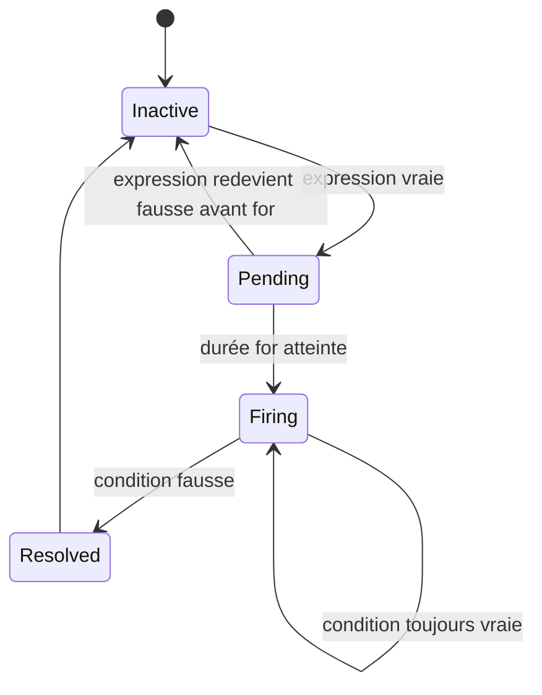
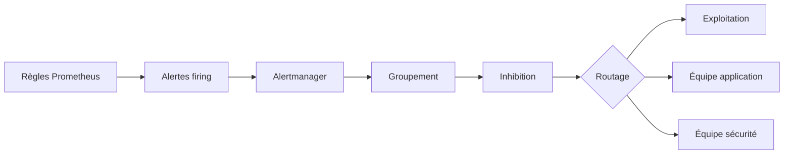
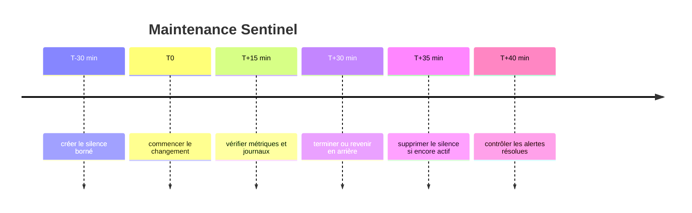
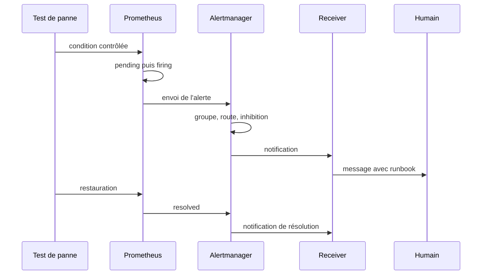

# Chapitre 12.5 — Concevoir des alertes avec Alertmanager

> **Campagne 12 — Supervision et audit**

> *« Une alerte utile nomme un symptôme, explique son impact et conduit à une action ; le reste est du bruit envoyé plus vite. »*

## Vous êtes ici

```text
PARTIE II — Industrialiser la sécurité

Campagne 12

  12.1 Centraliser les journaux avec Rsyslog ✔
  12.2 Auditer le système avec auditd ✔
  12.3 Contrôler l'intégrité des fichiers avec AIDE ✔
  12.4 Superviser Sentinel avec Prometheus ✔
► 12.5 Concevoir des alertes avec Alertmanager
  12.6 Construire le tableau de bord Sentinel
```

## Objectifs pédagogiques

À l'issue de ce chapitre, vous serez capable de :

- distinguer condition PromQL, état d'alerte et notification ;
- définir des alertes orientées symptômes avec durée de confirmation ;
- utiliser labels et annotations sans créer de cardinalité inutile ;
- expliquer le groupement, le routage, l'inhibition et les silences ;
- valider et tester des règles avec `promtool` ;
- valider une configuration Alertmanager avec `amtool` ;
- construire un runbook et mesurer la qualité d'un catalogue d'alertes.

## Pourquoi ce chapitre existe

Un tableau de bord suppose qu'une personne le regarde au bon moment. Une alerte automatise la détection d'une condition et l'achemine vers un destinataire. Mal conçue, elle réveille pour un pic sans impact, se répète pendant une panne connue ou ne contient aucune information permettant d'agir.

Prometheus décide **quand** une condition devient active. Alertmanager décide **comment** regrouper, dédupliquer, inhiber et acheminer les alertes. Le canal de notification décide **qui** est informé. Garder ces responsabilités séparées rend les règles testables et les routes modifiables sans réécrire le diagnostic.

## Le cycle de vie d'une alerte



La clause `for` filtre les anomalies trop courtes. Elle n'est pas un remède universel : une indisponibilité critique peut exiger deux minutes, tandis qu'une saturation progressive peut être confirmée pendant quinze minutes. Une durée trop longue retarde l'action ; trop courte, elle crée du bruit.

La clause `keep_firing_for`, lorsqu'elle est prise en charge par la version installée, maintient l'état firing pendant une courte durée après disparition de la condition. Elle réduit les bascules répétées, sans remplacer le traitement de la cause.

## Concevoir une alerte actionnable

Une alerte de qualité répond à six questions :

| Élément | Question | Exemple |
| --- | --- | --- |
| nom | quel symptôme stable ? | `SentinelTargetDown` |
| expression | quelle preuve quantitative ? | `up == 0` |
| durée | combien de temps avant action ? | `for: 2m` |
| labels | qui possède et quelle sévérité ? | `team`, `severity` |
| annotations | que se passe-t-il ? | résumé et description |
| runbook | que faire et comment vérifier ? | URL versionnée |

Évitez les noms de cause non prouvée comme `DatabaseBroken` si la métrique dit seulement que Sentinel ne répond plus. Préférez le symptôme observé, puis laissez le runbook guider le diagnostic.

> **💎 Le point d'expertise — Pagez sur l'impact, investiguez avec les causes**
>
> Une alerte de garde doit généralement correspondre à un impact utilisateur ou à une menace imminente. CPU élevé, redémarrage ou log d'erreur sont souvent des indices utiles au diagnostic, pas toujours des raisons de réveiller. La sévérité dépend de l'action attendue et du délai acceptable.

## Écrire le premier catalogue Sentinel

Créez `/etc/prometheus/rules/sentinel-alerts.yml` :

```yaml
groups:
  - name: sentinel.availability
    interval: 30s
    rules:
      - alert: SentinelTargetDown
        expr: up{job="sentinel"} == 0
        for: 2m
        labels:
          severity: critical
          service: sentinel
          category: availability
          team: platform
        annotations:
          summary: "La cible Sentinel {{ $labels.instance }} est inaccessible"
          description: "Prometheus ne collecte plus /metrics depuis 2 minutes."
          runbook_url: "https://runbooks.sentinel.lab/sentinel-target-down"

      - alert: SentinelHighErrorRatio
        expr: |
          job:sentinel_http_errors:ratio_rate5m > 0.05
          and
          job:sentinel_http_requests:rate5m > 0.1
        for: 10m
        labels:
          severity: warning
          service: sentinel
          category: availability
          team: application
        annotations:
          summary: "Taux d'erreurs Sentinel supérieur à 5 %"
          description: "Le ratio vaut {{ $value | humanizePercentage }}."
          runbook_url: "https://runbooks.sentinel.lab/sentinel-errors"

      - alert: SentinelHighLatency
        expr: job:sentinel_http_request_duration_seconds:p95_rate5m > 0.5
        for: 10m
        labels:
          severity: warning
          service: sentinel
          category: performance
          team: application
        annotations:
          summary: "Latence p95 Sentinel supérieure à 500 ms"
          description: "Le p95 courant vaut {{ $value | humanizeDuration }}."
          runbook_url: "https://runbooks.sentinel.lab/sentinel-latency"

  - name: sentinel.host
    rules:
      - alert: SentinelFilesystemLowSpace
        expr: |
          (
            node_filesystem_avail_bytes{
              job="node",
              fstype!~"tmpfs|overlay",
              mountpoint!~"/run.*"
            }
            /
            node_filesystem_size_bytes{
              job="node",
              fstype!~"tmpfs|overlay",
              mountpoint!~"/run.*"
            }
          ) < 0.15
        for: 15m
        labels:
          severity: warning
          service: sentinel
          category: capacity
          team: platform
        annotations:
          summary: "Moins de 15 % d'espace sur {{ $labels.mountpoint }}"
          description: "L'instance {{ $labels.instance }} approche de la saturation."
          runbook_url: "https://runbooks.sentinel.lab/filesystem-low-space"

      - alert: SentinelAideCheckStale
        expr: time() - sentinel_aide_last_check_unixtime > 93600
        for: 15m
        labels:
          severity: warning
          service: sentinel
          category: security
          team: security
        annotations:
          summary: "Le contrôle AIDE Sentinel date de plus de 26 heures"
          description: "La tâche est absente, bloquée ou n'a pas publié son succès."
          runbook_url: "https://runbooks.sentinel.lab/aide-stale"
```

Le seuil de trafic empêche un ratio d'erreurs de devenir critique sur une activité presque nulle. Les 26 heures laissent une marge autour d'un contrôle quotidien randomisé. Ces valeurs sont des hypothèses de laboratoire à remplacer par des objectifs documentés.

## Labels et annotations

Les **labels** participent à l'identité de l'alerte, au groupement et au routage. Les **annotations** transportent du texte qui peut changer sans créer une nouvelle identité.

| Mettre en label | Mettre en annotation |
| --- | --- |
| service stable | valeur numérique courante |
| équipe propriétaire | phrase de diagnostic |
| environnement | lien vers runbook |
| sévérité | contexte détaillé |
| catégorie bornée | identifiant de ticket |

N'ajoutez pas une valeur fluctuante comme `current_value` dans les labels : chaque variation produirait une nouvelle alerte aux yeux d'Alertmanager.

## Valider et tester les règles

Validation syntaxique :

```bash
sudo -u prometheus promtool check rules \
  /etc/prometheus/rules/sentinel-alerts.yml
```

Un test unitaire permet de vérifier la durée `for`. Créez `sentinel-alerts.test.yml` dans le dépôt de règles :

```yaml
rule_files:
  - sentinel-alerts.yml

evaluation_interval: 1m

tests:
  - name: sentinel down devient critique après deux minutes
    interval: 1m
    input_series:
      - series: 'up{job="sentinel",instance="sentinel.sentinel.lab:443"}'
        values: '1 0 0 0'
    alert_rule_test:
      - eval_time: 1m
        alertname: SentinelTargetDown
        exp_alerts: []
      - eval_time: 3m
        alertname: SentinelTargetDown
        exp_alerts:
          - exp_labels:
              alertname: SentinelTargetDown
              instance: sentinel.sentinel.lab:443
              job: sentinel
              severity: critical
              service: sentinel
              category: availability
              team: platform
            exp_annotations:
              summary: "La cible Sentinel sentinel.sentinel.lab:443 est inaccessible"
              description: "Prometheus ne collecte plus /metrics depuis 2 minutes."
              runbook_url: "https://runbooks.sentinel.lab/sentinel-target-down"
```

Exécutez :

```bash
promtool test rules sentinel-alerts.test.yml
```

Le test protège contre une modification involontaire de l'expression, de la durée ou des métadonnées. Ajoutez aussi un cas où la cible revient avant `for` et ne doit jamais devenir firing.

## Comprendre Alertmanager

Prometheus envoie périodiquement les alertes actives à Alertmanager. Alertmanager :

1. déduplique les répétitions du même ensemble de labels ;
2. groupe les alertes proches ;
3. choisit une route ;
4. applique les inhibitions et silences ;
5. transmet au receiver ;
6. renvoie une notification de résolution si configuré.



## Configurer le routage

Créez `/etc/alertmanager/alertmanager.yml` :

```yaml
global:
  resolve_timeout: 5m

route:
  receiver: platform-webhook
  group_by:
    - alertname
    - service
    - environment
  group_wait: 30s
  group_interval: 5m
  repeat_interval: 4h
  routes:
    - receiver: security-webhook
      matchers:
        - category="security"
    - receiver: application-webhook
      matchers:
        - team="application"

inhibit_rules:
  - source_matchers:
      - alertname="SentinelTargetDown"
      - severity="critical"
    target_matchers:
      - service="sentinel"
      - severity="warning"
    equal:
      - instance

receivers:
  - name: platform-webhook
    webhook_configs:
      - url: https://notifications.sentinel.lab/platform
        send_resolved: true

  - name: application-webhook
    webhook_configs:
      - url: https://notifications.sentinel.lab/application
        send_resolved: true

  - name: security-webhook
    webhook_configs:
      - url: https://notifications.sentinel.lab/security
        send_resolved: true
```

Le laboratoire utilise un service de notification interne sans secret dans l'URL. En production, configurez TLS, authentification et secrets avec les mécanismes compatibles avec la version locale ; ne placez pas de jeton directement dans Git.

Validez :

```bash
sudo -u alertmanager amtool check-config \
  /etc/alertmanager/alertmanager.yml
sudo systemctl reload alertmanager
sudo journalctl -u alertmanager -n 50 --no-pager
```

Inspectez `amtool --help` et l'unité du paquet interne pour le mécanisme de rechargement disponible.

### Groupement

`group_wait` laisse arriver des alertes liées avant la première notification. `group_interval` régit les nouvelles alertes d'un groupe déjà notifié. `repeat_interval` évite de répéter en permanence une alerte toujours active.

Un groupement trop large cache les détails ; trop fin, il produit une notification par instance. Testez avec une panne multiple.

### Inhibition

L'inhibition supprime une alerte cible lorsqu'une alerte source plus explicative est active. Ici, si la cible Sentinel est complètement indisponible, les alertes warning du même service et de la même instance sont peu utiles.

N'inhibez pas une alerte de sécurité indépendante sous prétexte que l'application est en panne. L'égalité des labels doit refléter une dépendance réelle.

### Silence

Un silence est une règle temporaire fondée sur des matchers. Il convient à une maintenance planifiée. Il possède un créateur, une justification et une échéance.



Un silence ne répare rien et ne doit jamais être sans échéance. Un accusé de réception humain n'est pas non plus un silence : il signifie que quelqu'un prend en charge l'incident.

## Sécurité : métrique ou événement ?

Prometheus est adapté aux quantités bornées : nombre d'échecs, âge du dernier contrôle, volume d'événements perdus. Il est mal adapté à une série par utilisateur ou adresse IP attaquante.

| Besoin | Support principal |
| --- | --- |
| AIDE n'a pas réussi depuis 26 h | métrique et alerte |
| nombre d'échecs SSH augmente | métrique agrégée |
| quel compte et quelle IP ont échoué ? | journaux et Audit |
| quelle commande a modifié le fichier ? | Audit |
| corrélation multi-événements complexe | moteur de logs ou SIEM |

Ne transformez pas Prometheus en base d'événements de sécurité à haute cardinalité.

## Tester la chaîne complète

Une règle valide mais jamais notifiée est inutile. Testez chaque étage :



Mesurez le délai entre chaque étape. Le temps de détection est approximativement lié au scrape, à l'évaluation, à `for` et à `group_wait`.

## TP 1 — Tester pending, firing et resolved

Validez d'abord les règles avec `promtool`. Arrêtez ensuite Sentinel pendant une fenêtre de laboratoire :

```bash
sudo systemctl stop sentinel
```

Observez :

1. `up` passe à `0` ;
2. `SentinelTargetDown` devient pending ;
3. après deux minutes, elle devient firing ;
4. Alertmanager la route vers `platform-webhook`.

Redémarrez :

```bash
sudo systemctl start sentinel
```

Vérifiez la résolution et calculez le délai total. Conservez les captures des états et les journaux des trois services.

## TP 2 — Tester routes et inhibition

Utilisez la commande de test de routage disponible dans `amtool config routes test --help` pour trois jeux de labels :

```text
service=sentinel category=availability team=platform severity=critical
service=sentinel category=performance team=application severity=warning
service=sentinel category=security team=security severity=warning
```

Les receivers attendus sont respectivement plateforme, application et sécurité. Déclenchez ensuite une indisponibilité accompagnée d'une alerte de latence ou d'erreur et vérifiez l'inhibition de la warning sur la même instance.

Documentez une alerte qui ne doit jamais être inhibée par `SentinelTargetDown` et expliquez pourquoi.

## TP 3 — Encadrer une maintenance

Créez un silence de vingt minutes correspondant seulement à :

```text
service="sentinel"
environment="lab"
```

Ajoutez votre identité, le ticket de laboratoire et la raison. Provoquez une alerte, puis vérifiez qu'elle reste visible dans Alertmanager mais ne déclenche pas de notification. Terminez la maintenance, restaurez Sentinel et supprimez le silence sans attendre son expiration.

Contrôlez qu'une alerte `service="node"` ou d'un autre environnement n'a pas été masquée.

## Le runbook minimal

Le runbook `SentinelTargetDown` contient :

1. impact et urgence ;
2. vérification depuis Prometheus et depuis le réseau de supervision ;
3. état de l'unité ou du conteneur ;
4. derniers journaux centraux ;
5. changements Audit récents ;
6. capacité disque et certificat ;
7. critères de redémarrage ;
8. procédure de rollback ;
9. preuve de retour : scrape, santé et transaction.

Une commande destructive ou un redémarrage automatique ne doit pas être la première ligne sans diagnostic ni garde-fou.

## Mission d'ingénieur — Construire le catalogue d'alertes

Produisez un catalogue limité à huit alertes couvrant :

- disponibilité ;
- taux d'erreurs ;
- latence ;
- saturation hôte ;
- expiration ou âge d'un contrôle ;
- panne du dispositif de supervision lui-même.

Pour chaque alerte, fournissez :

1. symptôme et impact ;
2. expression et seuil ;
3. justification de `for` ;
4. équipe, sévérité et catégorie ;
5. runbook ;
6. test unitaire ;
7. test de notification ;
8. condition de résolution ;
9. risque de faux positif et d'angle mort.

Mesurez sur une journée de laboratoire le nombre de transitions et notifications. Toute alerte non actionnable doit être supprimée, transformée en information de tableau de bord ou réécrite.

## Impact sur Sentinel

Sentinel possède désormais une chaîne de détection quantitative : Prometheus évalue les symptômes durables, Alertmanager réduit le bruit et route vers l'équipe capable d'agir, tandis que les runbooks relient métriques, journaux, Audit et changement.

Le dernier chapitre assemble ces indicateurs dans une vue exploitable et versionnée. Le tableau de bord ne remplacera pas les alertes ; il donnera le contexte nécessaire pour comprendre et piloter l'incident.

## Références techniques

- [Prometheus — Alerting rules](https://prometheus.io/docs/prometheus/latest/configuration/alerting_rules/) ;
- [Prometheus — Unit testing for rules](https://prometheus.io/docs/prometheus/latest/configuration/unit_testing_rules/) ;
- [Prometheus — Alertmanager](https://prometheus.io/docs/alerting/latest/alertmanager/) ;
- [Prometheus — Alertmanager configuration](https://prometheus.io/docs/alerting/latest/configuration/) ;
- pages de manuel ou aides locales `promtool --help` et `amtool --help`.

## Synthèse

- Prometheus détermine l'état ; Alertmanager groupe, inhibe, réduit le bruit et route ;
- `for` confirme une condition durable, mais ajoute un délai de détection ;
- les labels identifient et routent ; les annotations expliquent et lient le runbook ;
- les règles et routes doivent être validées puis testées de bout en bout ;
- silences et inhibitions sont ciblés, justifiés et bornés ;
- une alerte de sécurité agrège un signal ; le détail reste dans les journaux et Audit.

## Infographie de révision

```text
┌────────────────────── ALERTE ACTIONNABLE ──────────────────────────┐
│ Détection     expression PromQL → pending → for → firing            │
│ Contexte      labels stables + annotations + runbook                │
│ Traitement    groupement → inhibition → route → receiver            │
│ Maintenance   silence ciblé + auteur + raison + expiration          │
│ Qualité       promtool + amtool + test notification + résolution    │
└─────────────────────────────────────────────────────────────────────┘
```

## Pour aller plus loin

[Le chapitre 12.6](12.6-construire-tableau-bord-sentinel.md) provisionne Grafana et construit une vue Sentinel orientée diagnostic, capacité et sécurité.
