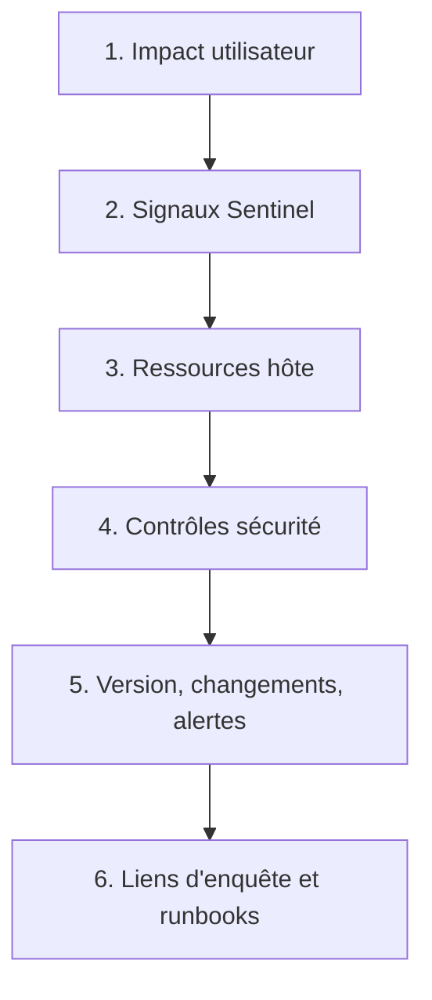
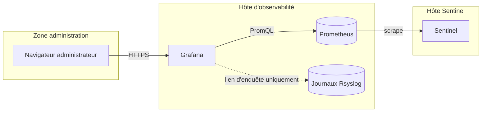
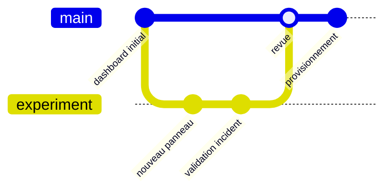
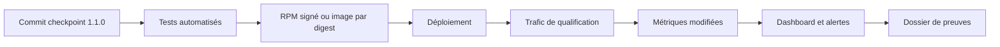
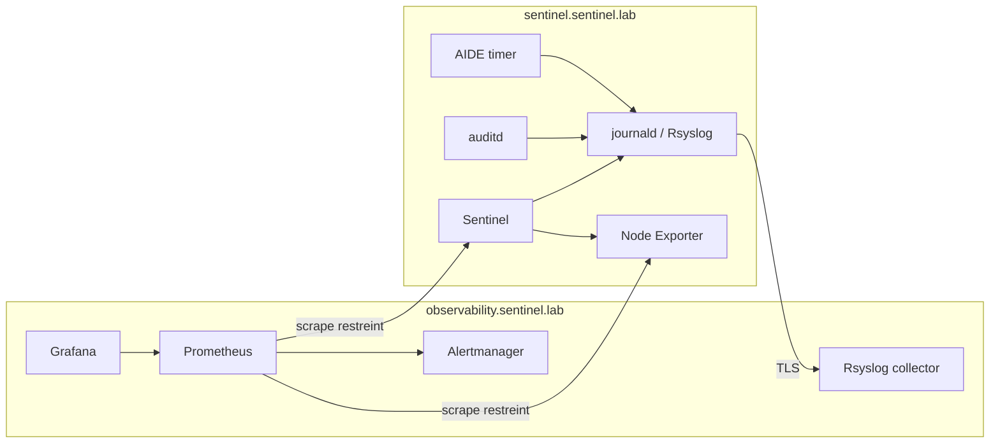
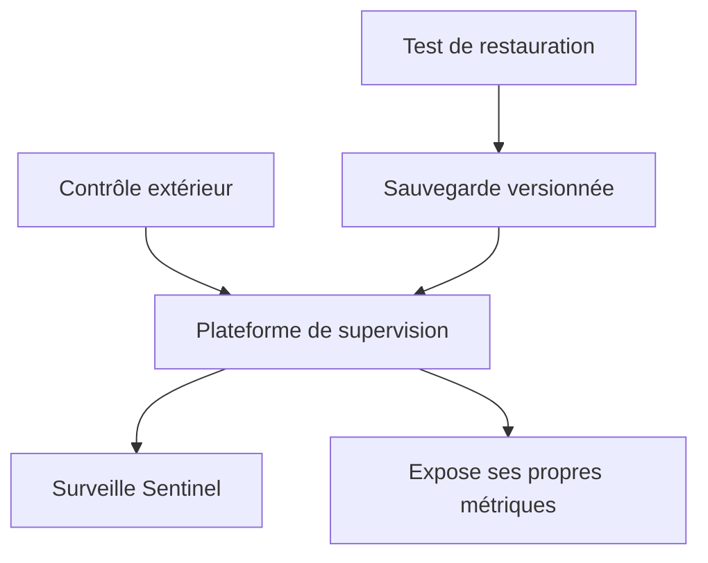

# Chapitre 12.6 — Construire le tableau de bord Sentinel

> **Campagne 12 — Supervision et audit**

> *« Un tableau de bord n'est pas un mur de courbes : c'est un chemin de décision préparé avant l'incident. »*

## Vous êtes ici

```text
PARTIE II — Industrialiser la sécurité

Campagne 12

  12.1 Centraliser les journaux avec Rsyslog ✔
  12.2 Auditer le système avec auditd ✔
  12.3 Contrôler l'intégrité des fichiers avec AIDE ✔
  12.4 Superviser Sentinel avec Prometheus ✔
  12.5 Concevoir des alertes avec Alertmanager ✔
► 12.6 Construire le tableau de bord Sentinel
```

## Objectifs pédagogiques

À l'issue de cette mission, vous serez capable de :

- transformer les questions d'exploitation en panneaux Grafana ;
- organiser une vue de synthèse puis des diagnostics plus détaillés ;
- provisionner une source Prometheus et un dashboard versionné ;
- choisir unités, intervalles, seuils et variables sans tromper le lecteur ;
- sécuriser l'accès à Grafana et comprendre la portée réelle du rôle Viewer ;
- relier alertes, runbooks, journaux, Audit et changements ;
- qualifier la chaîne complète pendant plusieurs scénarios d'incident.

## Pourquoi ce chapitre existe

Prometheus sait répondre à une requête, et Alertmanager sait prévenir. Pendant un incident, l'opérateur a pourtant besoin d'un contexte stable : impact, début, portée, saturation, version et signaux de sécurité. Un tableau de bord rassemble ces réponses dans l'ordre du diagnostic.

Grafana ne collecte pas les métriques et ne rend pas Rsyslog interrogeable par magie. Il interroge des sources de données. Dans le laboratoire, la source principale est Prometheus. Les journaux centralisés restent des fichiers Rsyslog ; ils sont consultés par les commandes et runbooks tant qu'un backend de logs comme Loki ou Elasticsearch n'a pas été conçu, sécurisé et ajouté.

## Partir des questions

Avant de choisir un type de panneau, écrivez la question.

| Question | Indicateur | Vue |
| --- | --- | --- |
| Sentinel répond-il ? | `up`, santé externe | stat et historique |
| les utilisateurs échouent-ils ? | ratio 5xx | série temporelle |
| la latence se dégrade-t-elle ? | p50, p95 | série temporelle |
| l'hôte sature-t-il ? | CPU, mémoire, disque | séries et jauges |
| quelle version sert le trafic ? | `sentinel_build_info` | table |
| AIDE et Audit fonctionnent-ils ? | âge, pertes, dernier succès | stat et état |
| quelles alertes sont actives ? | `ALERTS` | tableau ou state timeline |



L'ordre va du général au particulier. Un opérateur peut s'arrêter dès que la réponse est suffisante ou descendre vers le niveau suivant.

> **💎 Le point d'expertise — Le dashboard répond, le runbook fait agir**
>
> Un panneau ne doit pas contenir toute la procédure. Il expose un signal avec unité, seuil et contexte, puis conduit vers le runbook. Mélanger diagnostic et commandes d'urgence dans une visualisation augmente la charge cognitive au mauvais moment.

## Concevoir la vue Sentinel

Le dashboard cible une seule instance sélectionnable et un environnement. Il comporte cinq rangées.

### Rangée 1 — Service rendu

| Panneau | Requête | Présentation |
| --- | --- | --- |
| collecte | `up{job="sentinel",instance="$instance"}` | stat 0/1 |
| trafic | `job:sentinel_http_requests:rate5m` | req/s |
| erreurs | `job:sentinel_http_errors:ratio_rate5m` | pourcentage |
| latence | `job:sentinel_http_request_duration_seconds:p95_rate5m` | secondes |

### Rangée 2 — Ressources hôte

- CPU utilisé, normalisé entre 0 et 1 ;
- mémoire utilisée à partir de `MemAvailable` ;
- espace disponible par système de fichiers ;
- débit réseau et erreurs ;
- redémarrages ou changements de processus si la métrique existe.

### Rangée 3 — Contrôles de sécurité

- âge du dernier contrôle AIDE ;
- nombre de différences au dernier contrôle ;
- compteur d'événements Audit perdus exporté par textfile collector ;
- âge de la dernière collecte distante confirmée ;
- expiration du certificat en jours, produite par un exporter ou une tâche locale bornée.

### Rangée 4 — Contexte

- version et révision Sentinel ;
- état des dépendances ;
- alertes pending et firing ;
- dernière heure de déploiement ;
- liens vers les changements récents et la source versionnée.

### Rangée 5 — Navigation d'incident

- runbook de disponibilité ;
- runbook de saturation ;
- commande de recherche Rsyslog ;
- commande `ausearch` par clé ;
- procédure AIDE ;
- politique de retour arrière.

## Éviter les visualisations trompeuses

| Erreur | Risque | Correction |
| --- | --- | --- |
| axe tronqué sans le signaler | variation exagérée | unité et plage explicites |
| CPU brut entre machines différentes | comparaison fausse | normaliser par nombre de cœurs |
| empiler des ratios | somme sans sens | séries séparées |
| rafraîchir toutes les secondes | charge inutile | cohérence avec le scrape |
| agréger toutes les instances | panne locale masquée | variable et vue par instance |
| couleur sans seuil métier | rouge décoratif | seuil documenté |
| panneau sans description | interprétation variable | question, unité et source |

Un refresh de 30 secondes suffit si Prometheus scrape toutes les 15 secondes. Rafraîchir plus vite ne crée pas de nouveaux échantillons.

## Architecture Grafana du laboratoire



La dernière liaison est conceptuelle : le dashboard fournit des liens d'enquête, mais aucun datasource de logs n'est configuré dans cette campagne. Ne prétendez pas afficher les fichiers Rsyslog tant qu'un composant ne les indexe pas.

Grafana et Prometheus restent sur le réseau d'observabilité. Grafana est publié derrière le point d'entrée HTTPS d'administration ; Prometheus peut rester sur `127.0.0.1:9090` puisque Grafana l'interroge depuis le même hôte.

## Installer et durcir Grafana

Le laboratoire utilise le RPM officiel introduit dans le dépôt interne signé. Vérifiez provenance et signature avant installation :

```bash
sudo dnf install grafana
rpm -qi grafana
sudo systemctl enable --now grafana-server
```

Dans `/etc/grafana/grafana.ini`, définissez au minimum une écoute non publique et désactivez l'accès anonyme :

```ini
[server]
http_addr = 127.0.0.1
http_port = 3000
domain = grafana.sentinel.lab
root_url = https://grafana.sentinel.lab/
enforce_domain = true

[auth.anonymous]
enabled = false
hide_version = true

[users]
allow_sign_up = false

[security]
cookie_secure = true
cookie_samesite = lax
disable_gravatar = true
```

`cookie_secure` suppose un accès HTTPS. `cookie_samesite = strict` renforce la protection CSRF mais peut casser les redirections OAuth ou SAML ; le laboratoire retient donc `lax` pour permettre l'intégration à l'IdP. Le reverse proxy ou le point d'entrée TLS doit transmettre les en-têtes nécessaires et restreindre le réseau source. Lorsque l'IdP le permet, exigez aussi la MFA.

> **Piège classique — confondre permission de dashboard et permission de donnée**
>
> Un Viewer Grafana peut généralement envoyer ses propres requêtes au datasource accessible dans son organisation, pas seulement voir les requêtes des panneaux autorisés. Ne mettez pas des données secrètes dans Prometheus en supposant qu'un dossier Grafana les cachera. Séparez organisations, sources et périmètres lorsque la confidentialité l'exige.

## Provisionner Prometheus

Créez `/etc/grafana/provisioning/datasources/prometheus.yml` :

```yaml
apiVersion: 1

deleteDatasources:
  - name: Prometheus
    orgId: 1

datasources:
  - name: Prometheus
    uid: prometheus-sentinel
    orgId: 1
    type: prometheus
    access: proxy
    url: http://127.0.0.1:9090
    isDefault: true
    editable: false
    jsonData:
      timeInterval: 15s
```

Le proxy signifie que Grafana interroge Prometheus côté serveur. Le navigateur n'a pas besoin d'un accès réseau direct à `9090`.

Redémarrez puis vérifiez :

```bash
sudo systemctl restart grafana-server
sudo journalctl -u grafana-server -n 100 --no-pager
curl --fail --silent http://127.0.0.1:3000/api/health
```

L'API de santé locale ne valide ni l'authentification externe ni l'accès au datasource. Testez aussi une requête depuis l'interface avec un compte Viewer de laboratoire.

## Provisionner les dashboards

Créez `/etc/grafana/provisioning/dashboards/sentinel.yml` :

```yaml
apiVersion: 1

providers:
  - name: sentinel
    orgId: 1
    folder: Sentinel
    folderUid: sentinel
    type: file
    disableDeletion: false
    allowUiUpdates: false
    updateIntervalSeconds: 30
    options:
      path: /var/lib/grafana/dashboards/sentinel
      foldersFromFilesStructure: false
```

Créez le répertoire avec un propriétaire permettant la lecture par Grafana, puis placez-y le JSON versionné :

```bash
sudo install -d -o root -g grafana -m 0750 \
  /var/lib/grafana/dashboards/sentinel
sudo install -o root -g grafana -m 0640 \
  sentinel-overview.json \
  /var/lib/grafana/dashboards/sentinel/sentinel-overview.json
```

`allowUiUpdates: false` affirme que Git est la source d'autorité. Les expérimentations se font dans une instance ou un dashboard de test, puis le JSON exporté est revu avant promotion.



## Construire le JSON de manière reproductible

Le format JSON évolue avec Grafana. La méthode la plus robuste pour le laboratoire est :

1. construire un prototype sur la version cible ;
2. exporter le modèle JSON compatible ;
3. retirer l'`id` local ;
4. fixer un `uid` stable ;
5. remplacer les références de datasource par l'UID provisionné ;
6. mettre le fichier en version ;
7. redéployer dans une instance propre.

Le squelette contient au minimum :

```json
{
  "id": null,
  "uid": "sentinel-overview",
  "title": "Sentinel — Vue opérationnelle",
  "tags": ["sentinel", "production", "security"],
  "timezone": "utc",
  "refresh": "30s",
  "schemaVersion": 0,
  "version": 1,
  "templating": {
    "list": [
      {
        "name": "environment",
        "type": "query",
        "datasource": {
          "type": "prometheus",
          "uid": "prometheus-sentinel"
        },
        "query": "label_values(up{job=\"sentinel\"}, environment)"
      },
      {
        "name": "instance",
        "type": "query",
        "datasource": {
          "type": "prometheus",
          "uid": "prometheus-sentinel"
        },
        "query": "label_values(up{job=\"sentinel\",environment=\"$environment\"}, instance)"
      }
    ]
  },
  "panels": []
}
```

Remplacez `schemaVersion: 0` par la valeur exportée par la version Grafana cible. Ce squelette n'est pas un dashboard fini : il rend explicites l'UID, la source et les variables avant l'ajout des panneaux.

## Définir les panneaux

### Disponibilité

Requête :

```promql
up{
  job="sentinel",
  environment="$environment",
  instance="$instance"
}
```

Paramètres :

- visualisation Stat ;
- valeur `1` = disponible pour le scrape ;
- valeur `0` = indisponible ;
- lien vers le runbook `SentinelTargetDown` ;
- description rappelant que `up` n'est pas la transaction métier.

### Taux d'erreurs

```promql
job:sentinel_http_errors:ratio_rate5m{
  environment="$environment"
}
```

Unité : pourcentage 0–1. Seuil warning à 5 % seulement si ce seuil est cohérent avec l'alerte et le volume minimal.

### Latence

```promql
job:sentinel_http_request_duration_seconds:p95_rate5m{
  environment="$environment"
}
```

Unité : secondes. Affichez le seuil de 0,5 s utilisé dans la règle, afin que dashboard et alerte racontent la même histoire.

### Santé AIDE

```promql
time() - sentinel_aide_last_check_unixtime{instance="$instance"}
```

Unité : durée. Le rouge commence à 26 heures. Un second panneau montre `sentinel_aide_last_check_changes`, sans considérer automatiquement toute différence comme compromission.

### Alertes actives

```promql
ALERTS{
  service="sentinel",
  alertstate=~"pending|firing"
}
```

Utilisez une table ou une state timeline avec `alertname`, `severity`, `instance` et `alertstate`. Les annotations complètes et le runbook restent disponibles via Alertmanager.

## Relier sans tout centraliser dans Grafana

Ajoutez un panneau texte versionné :

```markdown
## Enquête Sentinel

- Journaux : sudo grep -R sentinel /var/log/remote/sentinel.sentinel.lab/
- Audit : sudo ausearch -k sentinel_config -ts recent -i
- Intégrité : sudo aide --check
- Service : systemctl status sentinel
- Runbooks : https://runbooks.sentinel.lab/
```

Ces commandes sont des points d'entrée. Le runbook précise les privilèges, la fenêtre temporelle, la collecte de preuves et les critères de restauration.

## TP 1 — Reproduire le dashboard depuis Git

Sur une instance Grafana propre :

1. installez le RPM approuvé ;
2. appliquez `grafana.ini` ;
3. provisionnez le datasource ;
4. déployez le provider et le JSON ;
5. redémarrez Grafana ;
6. vérifiez le dashboard avec un compte Viewer.

Collectez :

```bash
systemctl status grafana-server --no-pager
journalctl -u grafana-server -n 100 --no-pager
ss -lntp | grep ':3000'
rpm -V grafana
```

Le résultat est réussi si aucun ajout manuel de datasource ou de panneau n'est nécessaire.

## TP 2 — Conduire un diagnostic chronométré

Provoquez une panne contrôlée de Sentinel. À partir de la notification, mesurez :

1. temps jusqu'à l'ouverture du dashboard ;
2. temps jusqu'à l'identification de l'instance ;
3. temps jusqu'au premier indice explicatif ;
4. temps jusqu'à la décision de restauration ;
5. temps jusqu'à la résolution de l'alerte.

Le diagnostic doit utiliser au moins :

- une métrique de service ;
- une métrique d'hôte ;
- un journal central ;
- un événement Audit ou la preuve de son absence ;
- l'état AIDE ;
- le dernier changement connu.

Si le dashboard n'aide pas à décider dans les premières minutes, simplifiez ou réordonnez ses panneaux.

## TP 3 — Vérifier la séparation des droits

Créez ou utilisez trois comptes de laboratoire :

| Rôle | Attendu |
| --- | --- |
| Viewer | consulter et requêter le datasource autorisé |
| Editor de test | modifier un dashboard expérimental |
| Admin | provisionnement et gestion des sources |

Vérifiez qu'un Viewer ne peut pas modifier le dashboard provisionné, mais constatez qu'il peut formuler des requêtes sur le datasource accessible. Vérifiez aussi :

- accès anonyme désactivé ;
- port `3000` non publié directement ;
- cookie sécurisé via HTTPS ;
- source Prometheus non éditable ;
- aucun secret dans le JSON exporté ;
- journalisation des connexions Grafana centralisée.

Documentez la frontière réelle des rôles au lieu de supposer qu'un dossier masque les données.

## Jalon Sentinel — accepter la version 1.1.0

La livraison finale part du checkpoint `sentinel/labs/sentinel-app/checkpoints/1.1.0/`. Elle ne se contente pas de brancher Prometheus sur une cible fictive : elle construit Sentinel depuis un commit identifié, exécute les tests, produit l'artefact retenu puis déploie ce même code.

Conservez deux identités complémentaires :

- la version applicative `1.1.0` et la révision exposées par `sentinel_build_info` ;
- pour un conteneur, le tag lisible et surtout le digest immuable de l'image ; pour un RPM, le NEVRA du paquet signé.

Avant le scénario de panne, effectuez plusieurs requêtes sur `/health`, `/ready` et une route inconnue. Vérifiez que les compteurs et histogrammes changent réellement, que les chemins arbitraires restent regroupés sous `route="unknown"` et que le panneau de version affiche `1.1.0`. Un dashboard alimenté par des constantes ou par une autre révision ne valide pas Sentinel.



## Mission finale — Rendre Sentinel observable et auditable

Assemblez tous les chapitres de la campagne dans une livraison unique.

### Architecture attendue



Le lien `auditd → journaux centraux` doit refléter l'implémentation réelle. Si seuls les messages de service sont transmis et que `audit.log` reste local, indiquez cette limite au lieu de dessiner une centralisation inexistante.

### Scénarios d'acceptation

1. tests automatisés de Sentinel `1.1.0` réussis ;
2. RPM ou image relié au même commit et version confirmée par `sentinel_build_info` ;
3. trafic de qualification visible dans les compteurs et l'histogramme ;
4. accès mTLS autorisé, identité non autorisée refusée et labels bornés ;
5. message Rsyslog reçu sur le collecteur ;
6. collecteur arrêté puis reprise de la file ;
7. modification de `sentinel.conf` attribuée par Audit ;
8. dérive détectée par AIDE puis restaurée ;
9. endpoint Sentinel indisponible puis alerte firing ;
10. notification routée avec runbook ;
11. dashboard montrant impact, ressources, version et contrôle de sécurité ;
12. retour au vert sans silence résiduel.

### Livrables

- commit du checkpoint `1.1.0`, résultats des tests et journal de construction ;
- NEVRA du RPM signé ou tag et digest de l'image, reliés à la révision exposée ;
- diagramme et matrice de flux ;
- configurations versionnées et dépourvues de secrets ;
- inventaire des certificats et dates d'expiration ;
- règles Audit et AIDE ;
- configuration Prometheus et recording rules ;
- règles d'alerte et tests `promtool` ;
- configuration Alertmanager validée ;
- provisioning Grafana et dashboard JSON ;
- runbooks ;
- rapport d'essais avec heure, résultat, preuve et restauration ;
- registre des limites et risques résiduels.

### Critères de réussite

- aucune interface d'observabilité n'est publique ;
- les configurations échouent à la validation avant d'être rechargées si elles sont incorrectes ;
- les tests négatifs prouvent les refus réseau ;
- les règles d'alerte ont un propriétaire et un runbook ;
- une différence AIDE n'est pas promue automatiquement ;
- le dashboard est reproductible depuis les fichiers versionnés ;
- les valeurs de métriques évoluent sous trafic et leurs labels restent bornés ;
- la version et la révision affichées correspondent à l'artefact réellement déployé ;
- un autre apprenant peut rejouer les scénarios sans décision implicite.

## Exploiter le système de supervision lui-même

La supervision possède ses propres pannes : Prometheus arrêté, disque TSDB plein, Alertmanager inaccessible, Grafana indisponible ou collecteur Rsyslog saturé. Ajoutez une surveillance externe minimale :

- sonde de présence Prometheus ;
- alerte cœur mort reçue par un système extérieur ;
- métriques de Prometheus, Alertmanager et Grafana ;
- sauvegarde des configurations, règles et dashboards ;
- test de restauration ;
- contrôle de capacité et de rétention.



Un Prometheus qui s'arrête ne peut pas envoyer l'alerte annonçant son propre arrêt. Le contrôle extérieur ferme cet angle mort.

## Impact sur Sentinel

Sentinel est désormais observable à plusieurs niveaux et ses changements sensibles sont auditables. Le tableau de bord dirige le diagnostic, les alertes déclenchent l'attention, les journaux racontent les événements, Audit attribue les opérations et AIDE compare l'état.

Cette campagne ne crée pas un SIEM complet ni une preuve juridique automatique. Elle construit une chaîne cohérente, testable et suffisamment explicite pour aborder les scénarios offensifs de la campagne 13 sans découvrir les outils pendant l'incident.

## Références techniques

- [Grafana — Provisioning](https://grafana.com/docs/grafana/latest/administration/provisioning/) ;
- [Grafana — Prometheus data source](https://grafana.com/docs/grafana/latest/datasources/prometheus/) ;
- [Grafana — Dashboard best practices](https://grafana.com/docs/grafana/latest/visualizations/dashboards/build-dashboards/best-practices/) ;
- [Grafana — Security hardening](https://grafana.com/docs/grafana/latest/setup-grafana/configure-security/configure-security-hardening/) ;
- [Prometheus — Security model](https://prometheus.io/docs/operating/security/).

## Synthèse

- un dashboard commence par des questions et suit le chemin impact → diagnostic → action ;
- Grafana interroge une source ; il ne collecte ni métriques ni fichiers Rsyslog seul ;
- les unités, plages, seuils, agrégations et intervalles peuvent rendre une vue honnête ou trompeuse ;
- provisioning et JSON versionné rendent la vue reproductible et révisable ;
- le rôle Viewer n'est pas une restriction fine des requêtes au datasource ;
- la qualification finale teste panne, détection, notification, enquête, restauration et retour au vert ;
- la plateforme de supervision doit elle-même être surveillée depuis l'extérieur.

## Infographie de révision

```text
┌─────────────────────── SENTINEL OBSERVABLE ────────────────────────┐
│ Événements    journald/Rsyslog + Audit + AIDE                      │
│ Tendances     Node Exporter + métriques Sentinel + Prometheus      │
│ Attention     règles testées + Alertmanager + runbooks             │
│ Décision      Grafana : impact → diagnostic → contexte → action    │
│ Confiance     TLS + réseau fermé + Git + preuves de restauration   │
└─────────────────────────────────────────────────────────────────────┘
```

## Pour aller plus loin

La campagne 13 utilise cette chaîne pendant des scénarios de reconnaissance, brute force, élévation, persistance et exfiltration. Chaque attaque devra produire une détection, une chronologie, une contre-mesure et une preuve de retour à l'état sûr.
