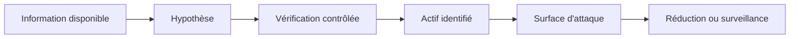
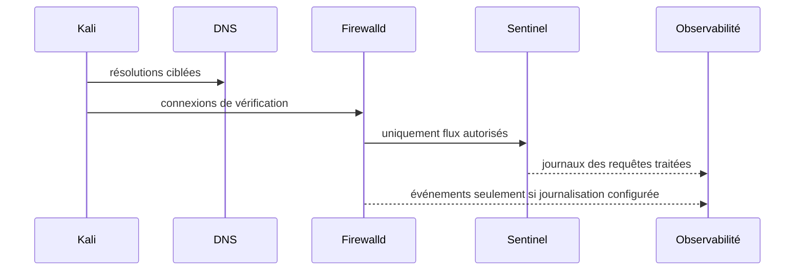

# Chapitre 13.1 — Reconnaissance

> **Campagne 13 — Attaques et défense**
>
> *« Avant de chercher une faille, l'attaquant cherche surtout à réduire l'incertitude. »*
## Vous êtes ici

```text
PARTIE III — Mise en situation

Campagne 13 — Attaques et défense

► 13.1 Reconnaissance
  13.2 Scan réseau
  13.3 Brute force SSH
  13.4 Escalade de privilèges
  13.5 Mouvements latéraux
  13.6 Persistance
  13.7 Exfiltration
  13.8 Étude de cas complète
```

## Objectifs pédagogiques

À l'issue de ce chapitre, vous serez capable de :

- expliquer ce que l'attaquant cherche pendant une phase de reconnaissance ;
- distinguer information publique, découverte locale et interaction active avec une cible ;
- recueillir dans le laboratoire des informations sur DNS, certificats, services et exposition sans lancer d'exploitation ;
- identifier les traces réellement produites par cette phase et celles qui peuvent rester invisibles ;
- réduire les informations inutiles exposées par le socle ;
- vérifier qu'une mesure de réduction de surface ne casse pas l'exploitation légitime.

## Pourquoi ce chapitre existe

Une attaque ne commence pas nécessairement par un exploit. Elle commence souvent par des questions : quels noms existent, quelles adresses répondent, quel service écoute, quel certificat révèle une identité, quelles conventions de nommage permettent de deviner d'autres hôtes ?

La reconnaissance est donc un excellent premier exercice défensif. Elle force à regarder le système depuis l'extérieur et à distinguer **ce qui est nécessairement visible** de **ce qui est exposé sans nécessité**. Une adresse IP, un port d'administration ou le nom d'un certificat ne sont pas des vulnérabilités par eux-mêmes ; ils deviennent utiles à l'attaquant lorsqu'ils réduisent suffisamment l'espace de recherche.

Dans cette campagne, toutes les commandes sont exécutées uniquement dans le laboratoire Sentinel sur des machines appartenant à l'apprenant.

## Le modèle : information, hypothèse, vérification

La reconnaissance transforme des indices en hypothèses puis en vérifications bornées.



Exemples :

| Indice | Hypothèse | Vérification |
| --- | --- | --- |
| `sentinel.sentinel.lab` existe | un service applicatif est publié | résolution DNS puis connexion sur le port attendu |
| certificat SAN `sentinel.sentinel.lab` | TLS est utilisé sur ce nom | `openssl s_client` |
| PTR `observability.sentinel.lab` | un hôte de supervision existe | résolution inverse puis vérification de son exposition |
| bannière SSH | administration distante active | connexion TCP sur 22, sans authentification |

> **Point d'expertise — La discrétion n'est pas l'absence de traces**
>
> Une requête DNS peut être observée par le résolveur, une connexion TCP par le pare-feu et une négociation TLS par le service. À l'inverse, une information déjà publiée dans un dépôt, un certificat public ou un inventaire compromis peut être consommée sans toucher la cible. La détection ne doit donc pas être conçue comme si toute reconnaissance déclenchait forcément un événement local.

## Préconditions du laboratoire

Utilisez au minimum :

| Hôte | Rôle |
| --- | --- |
| `kali.sentinel.lab` | poste d'observation |
| `sentinel.sentinel.lab` | service Sentinel `1.1.0` |
| `observability.sentinel.lab` | collecte Rsyslog et supervision |

Les noms et adresses sont adaptés au réseau isolé. Le DNS, Firewalld, SSH, la journalisation centralisée et la supervision doivent être fonctionnels avant le TP.

Prenez une photographie de départ :

```bash
date -u
getent hosts sentinel.sentinel.lab
getent hosts observability.sentinel.lab
sudo firewall-cmd --list-all
sudo ss -lntp
sudo systemctl is-active sentinel
```

**Résultat attendu :** le service et les protections sont actifs, et l'heure est cohérente entre les hôtes.

**Interprétation :** cette baseline permet d'attribuer les différences observées au scénario et non à un état préalable inconnu.

## Étape 1 — Observer le DNS

Depuis Kali :

```bash
dig +short sentinel.sentinel.lab A
dig +short observability.sentinel.lab A
dig -x SENTINEL_IP +short
dig -x OBSERVABILITY_IP +short
```

Si le laboratoire utilise FreeIPA DNS, interrogez aussi les enregistrements de découverte déjà étudiés :

```bash
dig +short _kerberos._udp.sentinel.example.test SRV
dig +short _ldap._tcp.sentinel.example.test SRV
```

**Résultat attendu :** les enregistrements réellement publiés sont visibles ; un enregistrement absent retourne une réponse vide ou négative.

**Interprétation :** le DNS rend volontairement certaines relations découvrables. Le but défensif n'est pas de masquer ce dont le protocole a besoin, mais d'éviter les entrées historiques, les noms trop descriptifs et les zones accessibles au-delà de leur périmètre.

### Scénario négatif

Interrogez un nom inexistant :

```bash
dig does-not-exist.sentinel.lab A
```

Une réponse négative est normale. Ne créez pas une entrée DNS uniquement pour rendre une commande « verte ».

## Étape 2 — Lire ce que révèle TLS

Sur le port TLS réellement publié :

```bash
openssl s_client   -connect sentinel.sentinel.lab:443   -servername sentinel.sentinel.lab   -showcerts </dev/null
```

Puis isolez le certificat serveur si nécessaire :

```bash
openssl s_client   -connect sentinel.sentinel.lab:443   -servername sentinel.sentinel.lab </dev/null 2>/dev/null | openssl x509 -noout -subject -issuer -dates -ext subjectAltName
```

Le certificat peut révéler :

- le nom DNS du service ;
- l'autorité émettrice ;
- sa période de validité ;
- d'autres SAN éventuellement nécessaires.

Il ne doit pas révéler une clé privée, un mot de passe ou une topologie interne inutile.

## Étape 3 — Observer les en-têtes et contrats HTTP existants

Sentinel `1.1.0` ne possède que quatre routes documentées : `/health`, `/ready`, `/api/v1/status` et `/metrics`. N'inventez aucune interface supplémentaire.

Lorsque le mTLS autorise le client Kali ou un client de test :

```bash
curl --cacert CA.crt   --cert CLIENT.crt   --key CLIENT.key   https://sentinel.sentinel.lab/health
```

Un client sans certificat doit échouer avant HTTP lorsque `require_client_certificate` est actif. Un certificat signé mais non autorisé doit recevoir `403`.

La reconnaissance doit conserver ces distinctions : un refus TLS prouve une barrière différente d'un refus applicatif.

## Traces à rechercher

Sur Sentinel :

```bash
sudo journalctl -u sentinel --since "-10 min" --no-pager
sudo journalctl -u sshd --since "-10 min" --no-pager
sudo ausearch -ts recent -m USER_AUTH,USER_LOGIN -i
```

Sur le collecteur Rsyslog :

```bash
sudo grep -R "sentinel" /var/log/remote/ 2>/dev/null | tail -50
```

Pour le réseau, utilisez les compteurs Firewalld ou les journaux que vous avez réellement activés en campagne 3. N'affirmez pas qu'un scan ou une simple requête est journalisé si aucune règle ne le prévoit.

### Ce que vous devez constater

- une requête applicative autorisée laisse une trace Sentinel ;
- une simple résolution DNS peut ne laisser aucune trace sur l'hôte Sentinel ;
- un accès à un port non journalisé peut n'apparaître que dans un équipement ou une règle réseau dédiée ;
- la centralisation améliore la conservation, mais ne crée pas des événements que la source n'a jamais produits.

## Détection : chercher un comportement, pas un nom d'outil

Une alerte « `nmap` détecté » est fragile : l'outil peut changer. Cherchez plutôt des comportements :

- nombreuses connexions brèves vers plusieurs ports ;
- requêtes vers de nombreux noms inexistants ;
- échecs TLS répétés depuis la même source ;
- accès successifs à des services rarement utilisés ;
- reconnaissance d'un réseau d'administration depuis une zone qui ne devrait pas l'atteindre.



## Réduire la surface d'information

Vérifiez quatre familles de fuite :

1. **DNS** : entrées obsolètes, noms d'hôtes inutilement descriptifs, reverse incohérent ;
2. **certificats** : SAN surnuméraires ou certificats trop largement réutilisés ;
3. **services** : ports d'administration accessibles depuis Kali alors qu'ils devraient rester dans une zone dédiée ;
4. **bannières** : informations de version inutiles lorsque le service permet de les limiter sans casser le protocole.

Pour Sentinel, le code fixe `server_version` à la version applicative. Ne modifiez pas l'application dans cette campagne uniquement pour masquer ce champ. La priorité est la segmentation, le patching et la surveillance ; le « banner hiding » ne corrige pas une vulnérabilité.

## TP — Réduire une exposition inutile

Choisissez **une** exposition réellement inutile observée dans votre laboratoire, par exemple un port d'administration accessible depuis Kali.

1. conservez la preuve initiale ;
2. identifiez la règle ou le service responsable ;
3. appliquez la correction minimale ;
4. rechargez proprement la configuration ;
5. répétez le test depuis Kali ;
6. vérifiez l'accès depuis la zone légitime ;
7. conservez les journaux avant/après.

Exemple de vérification Firewalld :

```bash
sudo firewall-cmd --check-config
sudo firewall-cmd --reload
sudo firewall-cmd --list-all
```

Ne supprimez pas une règle dont vous ne comprenez pas le propriétaire. Une fermeture réussie depuis Kali mais qui bloque Prometheus, FreeIPA ou l'administration n'est pas une amélioration.

## Impact sur Sentinel

Sentinel reste en version `1.1.0`. La campagne ne modifie pas le code Python. Elle exploite ses interfaces existantes et les couches construites autour de lui pour produire des preuves de reconnaissance et de réduction de surface.

## Remise en état

- restaurez toute règle réseau modifiée uniquement pour le TP ;
- supprimez les fichiers temporaires de certificat créés pour inspection ;
- vérifiez `systemctl is-active sentinel` ;
- rejouez `/health`, `/ready` et le scrape `/metrics` depuis les clients légitimes ;
- vérifiez que les alertes et dashboards reviennent à leur état normal.

## Synthèse

- la reconnaissance réduit l'incertitude avant toute exploitation ;
- DNS, certificats et services exposent des informations parfois nécessaires ;
- la défense consiste surtout à limiter l'exposition inutile et à segmenter ;
- toutes les actions de reconnaissance ne laissent pas une trace locale ;
- une détection robuste recherche des comportements observables ;
- Sentinel `1.1.0` reste inchangé : cette campagne exerce les contrôles existants.

## Navigation

[← 12.6 — Construire le tableau de bord Sentinel](../campagne_12/12.6-construire-tableau-bord-sentinel.md) · [13.2 — Scan réseau →](13.2-scan-reseau.md)
