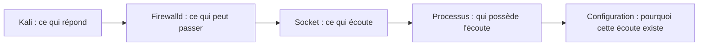
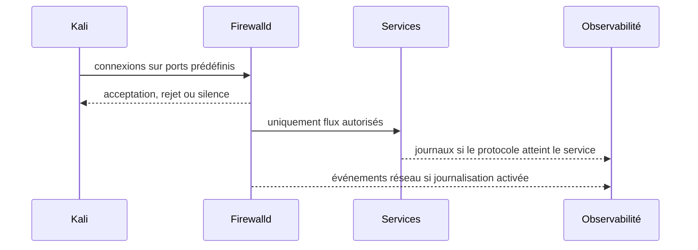

# Chapitre 13.2 — Scan réseau

> **Campagne 13 — Attaques et défense**
>
> *« Un port ouvert n'est pas encore une faille ; c'est une hypothèse à expliquer. »*

## Vous êtes ici

```text
PARTIE III — Mise en situation

Campagne 13 — Attaques et défense

  13.1 Reconnaissance
► 13.2 Scan réseau
  13.3 Brute force SSH
  13.4 Escalade de privilèges
  13.5 Mouvements latéraux
  13.6 Persistance
  13.7 Exfiltration
  13.8 Étude de cas complète
```

## Objectifs pédagogiques

À l'issue de ce chapitre, vous serez capable de :

- distinguer découverte d'hôtes, découverte de ports et identification d'un service ;
- réaliser un scan **borné** sur les machines du laboratoire Sentinel ;
- comparer la vue depuis Kali avec l'état réel de l'hôte ;
- relier un port visible à Firewalld, à une socket et à un processus ;
- rechercher les traces laissées par des connexions répétées ;
- réduire une exposition inutile puis prouver que le service légitime reste disponible.

## Pourquoi ce chapitre existe

La reconnaissance du chapitre précédent répondait à la question « que peut-on apprendre ? ». Le scan réseau ajoute une question plus précise : **qu'est-ce qui est réellement joignable depuis une position donnée ?**

Cette distinction est essentielle. Un processus peut écouter sans être accessible depuis Kali, un port peut être autorisé par le pare-feu sans qu'aucun service n'écoute, et un service peut être publié uniquement sur `127.0.0.1`. L'attaquant voit le résultat de plusieurs couches ; le défenseur doit être capable de les expliquer.

Toutes les manipulations suivantes sont limitées aux adresses du laboratoire Sentinel. Aucun balayage d'un réseau tiers, d'Internet ou d'une plage non administrée n'est nécessaire à l'exercice.

## Trois vues d'une même exposition



Une analyse correcte confronte ces vues au lieu de s'arrêter au résultat d'un outil.

| Vue | Question | Outil typique |
| --- | --- | --- |
| extérieure | le port est-il joignable depuis Kali ? | `nmap`, `nc`, `curl` |
| pare-feu | la politique autorise-t-elle le flux ? | `firewall-cmd` |
| système | une socket écoute-t-elle réellement ? | `ss` |
| service | quel processus et quelle configuration sont responsables ? | `systemctl`, journaux |

## Préconditions et périmètre

Définissez explicitement la cible avant toute commande :

```bash
TARGET=sentinel.sentinel.lab
```

Depuis Sentinel, capturez la réalité locale :

```bash
sudo ss -lntup
sudo firewall-cmd --get-active-zones
sudo firewall-cmd --list-all
sudo systemctl is-active sentinel sshd
```

Conservez cette sortie dans votre dossier de preuves.

## Étape 1 — Tester uniquement les ports attendus

Depuis Kali, commencez par une liste courte dérivée de l'architecture du laboratoire :

```bash
nmap -Pn -p 22,443,8443,9100 "$TARGET"
```

L'objectif n'est pas de « trouver le maximum », mais de comparer une **matrice d'exposition attendue** à la réalité.

Exemple :

| Port | Usage possible | Attendu depuis Kali |
| --- | --- | --- |
| 22/TCP | administration SSH | selon la politique du laboratoire |
| 443/TCP | frontal TLS éventuel | ouvert uniquement s'il est publié |
| 8443/TCP | Sentinel direct | souvent local ou restreint |
| 9100/TCP | Node Exporter | normalement non exposé à Kali |

Un état `filtered` ne signifie pas qu'aucun service n'existe ; il indique surtout que le scanner n'obtient pas la réponse attendue. Un état `closed` indique généralement que l'hôte répond mais qu'aucune socket n'accepte la connexion sur ce port.

## Étape 2 — Vérifier un port avec le protocole approprié

Un scan ne prouve pas que l'application fonctionne. Pour un service HTTPS légitime, utilisez le contrat déjà construit :

```bash
curl -vk --connect-timeout 3 https://sentinel.sentinel.lab/health
```

Si le mTLS est obligatoire, l'échec sans certificat est **attendu**. Rejouez ensuite le test avec un client autorisé selon la configuration de la campagne 7.

Pour SSH, une simple connexion TCP suffit à confirmer l'exposition sans tenter de mot de passe :

```bash
nc -vz -w 3 "$TARGET" 22
```

Ne confondez pas « TCP joignable » et « authentification possible ».

## Étape 3 — Expliquer le résultat depuis l'hôte

Sur Sentinel :

```bash
sudo ss -lntp
sudo firewall-cmd --list-all
sudo systemctl status sentinel --no-pager
sudo systemctl status sshd --no-pager
```

Pour chaque port détecté, documentez :

1. l'adresse d'écoute (`127.0.0.1`, adresse précise ou toutes interfaces) ;
2. le processus propriétaire ;
3. la règle Firewalld qui autorise ou bloque le trafic ;
4. l'usage métier ou d'administration ;
5. la justification de son exposition depuis Kali.

## Étape 4 — Observer les traces

Un scan borné produit plusieurs connexions courtes. Selon la configuration, elles peuvent apparaître dans le pare-feu, le service ou ne laisser qu'une trace réseau externe.

Sur Sentinel :

```bash
sudo journalctl -u sshd --since "-10 min" --no-pager
sudo journalctl -u sentinel --since "-10 min" --no-pager
sudo journalctl -k --since "-10 min" --no-pager | tail -100
```

Si la journalisation Firewalld a été configurée en campagne 3, recherchez les événements correspondants. N'activez pas une journalisation massive uniquement pour « voir le scan » : elle risquerait de créer plus de bruit que de signal.

## Détection : chercher la dynamique

Un scanner n'est qu'une manière de générer un comportement. Les signaux utiles sont plutôt :

- plusieurs ports contactés dans une fenêtre courte ;
- grand nombre de connexions très brèves ;
- source inhabituelle pour un service d'administration ;
- accès à un port qui n'est jamais utilisé dans le fonctionnement normal ;
- séquence reconnaissance puis authentifications en échec.



## TP — Fermer une exposition non justifiée

Choisissez **un port réellement accessible depuis Kali mais non nécessaire depuis cette zone**.

Avant modification :

```bash
nmap -Pn -p PORT "$TARGET"
```

Identifiez d'abord la cause sur l'hôte :

```bash
sudo ss -lntp
sudo firewall-cmd --list-all
```

Corrigez la couche responsable : adresse d'écoute, service inutile ou règle Firewalld. Ne cumulez pas trois changements en même temps.

Puis :

```bash
sudo firewall-cmd --check-config
sudo firewall-cmd --reload
```

Rejouez exactement le même test depuis Kali et un test depuis la zone légitime.

**Critère de réussite :** le flux inutile n'est plus accessible depuis Kali et la fonction légitime continue de fonctionner.

## Scénario de panne contrôlé

Une fermeture de port peut être techniquement efficace mais opérationnellement mauvaise. Si vous bloquez accidentellement un flux nécessaire :

1. identifiez le test fonctionnel devenu rouge ;
2. restaurez la dernière règle connue ;
3. rechargez Firewalld ;
4. vérifiez l'application ;
5. documentez la cause.

La capacité de revenir à un état sûr fait partie de l'exercice.

## Impact sur Sentinel

Sentinel reste en `1.1.x`. Aucun code n'est ajouté. Ce chapitre vérifie uniquement la cohérence entre son écoute, sa publication réseau et les politiques du socle.

## Synthèse

- un scan décrit une visibilité réseau, pas à lui seul une vulnérabilité ;
- la vue de Kali doit être corrélée à Firewalld, aux sockets et aux processus ;
- un test ciblé est plus utile qu'un balayage indiscriminé ;
- la détection recherche surtout des comportements anormaux dans le temps ;
- une correction n'est valide que si elle réduit l'exposition sans casser le flux légitime.

## Navigation

[← 13.1 — Reconnaissance](13.1-reconnaissance.md) · [13.3 — Brute force SSH →](13.3-brute-force-ssh.md)
