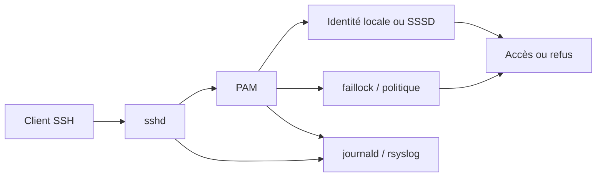
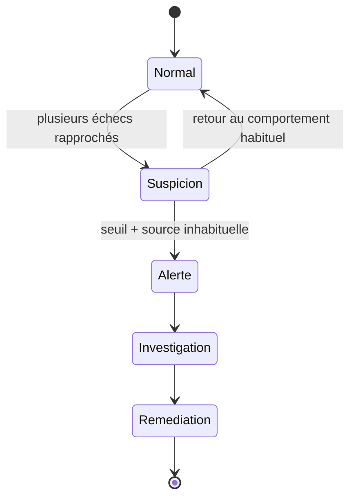

# Chapitre 13.3 — Brute force SSH

> **Campagne 13 — Attaques et défense**
>
> *« Une défense utile ne cherche pas seulement à bloquer : elle distingue l'erreur humaine du comportement anormal. »*

## Vous êtes ici

```text
PARTIE III — Mise en situation

Campagne 13 — Attaques et défense

  13.1 Reconnaissance
  13.2 Scan réseau
► 13.3 Brute force SSH
  13.4 Escalade de privilèges
  13.5 Mouvements latéraux
  13.6 Persistance
  13.7 Exfiltration
  13.8 Étude de cas complète
```

## Objectifs pédagogiques

À l'issue de ce chapitre, vous serez capable de :

- expliquer ce qu'est une pression d'authentification répétée sur SSH ;
- générer dans le laboratoire quelques échecs contrôlés sans automatiser une attaque de mots de passe ;
- localiser les événements SSH, PAM et `faillock` correspondants ;
- distinguer échec d'authentification, compte verrouillé et refus par politique ;
- vérifier qu'une défense limite les tentatives sans supprimer le chemin d'administration légitime ;
- construire une règle de détection basée sur la fréquence et le contexte.

## Pourquoi ce chapitre existe

Le terme **brute force** désigne ici une succession de tentatives d'authentification visant à trouver un secret valide. Dans un environnement réel, l'automatisation et les listes d'identifiants peuvent transformer ce comportement en attaque à grande échelle.

Ce chapitre ne reproduit pas cette industrialisation. Le laboratoire utilise **quelques échecs manuels et bornés**, suffisants pour étudier les contrôles de SSH, PAM, `faillock`, la journalisation et les réactions attendues.

L'objectif pédagogique est défensif : savoir reconnaître une pression d'authentification et vérifier que l'architecture rend cette pression coûteuse, visible et limitée.

## Les couches qui participent à la décision



Un même message « accès refusé » peut donc cacher plusieurs causes.

## Préconditions

Utilisez un compte de laboratoire **non privilégié**, par exemple `alice`, dont vous connaissez le mécanisme d'authentification. Conservez une session d'administration séparée et fonctionnelle avant de tester un verrouillage.

Sur Sentinel :

```bash
sudo sshd -T | grep -E 'passwordauthentication|pubkeyauthentication|maxauthtries|permitrootlogin'
authselect current
sudo faillock --user alice
sudo journalctl -u sshd --since "-5 min" --no-pager
```

Si l'authentification par mot de passe est déjà désactivée, ne la réactivez pas uniquement pour fabriquer un scénario. Utilisez alors un compte ou une machine de laboratoire spécifiquement prévus pour observer PAM, ou concentrez le TP sur les refus de méthode d'authentification.

## Étape 1 — Produire quelques échecs contrôlés

Depuis Kali, effectuez **au maximum quelques tentatives manuelles** avec un mot de passe volontairement incorrect sur le compte de test :

```bash
ssh alice@sentinel.sentinel.lab
```

Interrompez l'exercice dès que vous disposez de plusieurs événements observables. Il n'est pas nécessaire d'utiliser un outil automatisé, une liste de mots de passe ni une boucle shell.

**Résultat attendu :** l'accès échoue et les événements apparaissent dans les journaux selon la pile d'authentification réellement configurée.

## Étape 2 — Lire les journaux SSH et PAM

Sur Sentinel :

```bash
sudo journalctl -u sshd --since "-10 min" --no-pager
sudo journalctl --since "-10 min" | grep -Ei 'pam|authentication|failed|faillock'
sudo faillock --user alice
```

Cherchez notamment :

- l'identité ciblée ;
- la source réseau ;
- l'heure ;
- la méthode d'authentification ;
- l'éventuel compteur d'échec ;
- le résultat final.

Évitez de copier des mots de passe, clés ou secrets dans les preuves.

## Étape 3 — Distinguer trois types de refus

### Mauvais secret

L'identité existe, la méthode est autorisée, mais la preuve fournie est incorrecte.

### Politique d'authentification

La méthode elle-même est désactivée, par exemple lorsque `PasswordAuthentication no` impose l'usage de clés.

### Verrouillage temporaire

Une politique PAM peut considérer qu'un nombre défini d'échecs justifie un verrouillage temporaire.

Ces trois cas ne doivent pas déclencher exactement la même réponse opérationnelle.

## Étape 4 — Vérifier `faillock` sans se verrouiller hors du serveur

Inspectez la politique active :

```bash
grep -R "pam_faillock" /etc/pam.d/ /etc/authselect/ 2>/dev/null
sudo faillock --user alice
```

Si votre profil de laboratoire possède un seuil, vérifiez qu'il correspond à la politique documentée. Ne réduisez pas artificiellement ce seuil à une valeur extrême sur un serveur dont vous dépendez pour l'administration.

Après le TP, si le compte de test est verrouillé et que la procédure de laboratoire le prévoit :

```bash
sudo faillock --user alice --reset
```

Cette commande est une action d'administration ; elle doit être tracée dans votre dossier de preuves.

## Détection : compter dans une fenêtre de temps

Un échec isolé est courant. Le signal apparaît dans la **répétition** et le **contexte**.



Une règle de détection peut s'appuyer sur :

- nombre d'échecs pour une même source ;
- nombre de comptes différents ciblés ;
- compte administrateur ciblé ;
- heure ou zone réseau inhabituelle ;
- succès d'authentification juste après une série d'échecs.

Le dernier cas mérite une attention particulière : un succès après plusieurs erreurs peut être un utilisateur qui se souvient enfin de son mot de passe, ou un indice de compromission. La corrélation doit donc rester contextualisée.

## Réduction du risque

Les contrôles les plus efficaces sont complémentaires :

1. **ne pas exposer SSH inutilement** ;
2. **privilégier l'authentification par clés** ;
3. **désactiver la connexion directe de `root`** ;
4. **limiter les comptes ou groupes autorisés** ;
5. **appliquer une politique PAM raisonnable** ;
6. **centraliser les journaux** ;
7. **alerter sur les comportements répétitifs**.

La protection ne doit pas devenir un déni de service auto-infligé : une politique de verrouillage trop agressive peut permettre à un tiers de bloquer volontairement des comptes connus.

## TP — Prouver la défense avant/après

Constituez une matrice :

| Test | Avant | Après | Preuve |
| --- | --- | --- | --- |
| mauvaise authentification | refus | refus | journal SSH/PAM |
| répétition bornée | visible | visible + contrôle attendu | `faillock`, journaux |
| clé valide utilisateur légitime | succès | succès | journal + session |
| connexion directe root | refus attendu | refus attendu | `sshd -T`, test |

L'objectif est de montrer que la défense **réduit le risque sans casser l'administration autorisée**.

## Impact sur Sentinel

Sentinel n'est pas modifié. SSH protège l'administration de l'hôte qui l'exécute ; la campagne observe donc un contrôle du socle plutôt qu'une fonctionnalité applicative.

## Remise en état

- réinitialisez uniquement le compte de test si nécessaire ;
- vérifiez que la configuration SSH n'a pas été modifiée accidentellement ;
- testez une connexion par clé depuis le chemin d'administration légitime ;
- vérifiez `systemctl is-active sshd sentinel` ;
- conservez les journaux utiles dans le dossier de preuves.

## Synthèse

- une attaque par brute force est surtout caractérisée par la répétition des tentatives ;
- quelques échecs contrôlés suffisent pour étudier la chaîne défensive ;
- SSH, PAM, identité et `faillock` participent à la décision ;
- la détection doit tenir compte de la fréquence, de la source et du compte ciblé ;
- une bonne défense bloque l'abus tout en conservant un chemin d'administration légitime.

## Navigation

[← 13.2 — Scan réseau](13.2-scan-reseau.md) · [13.4 — Escalade de privilèges →](13.4-escalade-privileges.md)
