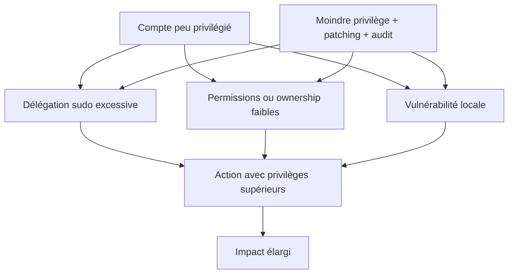
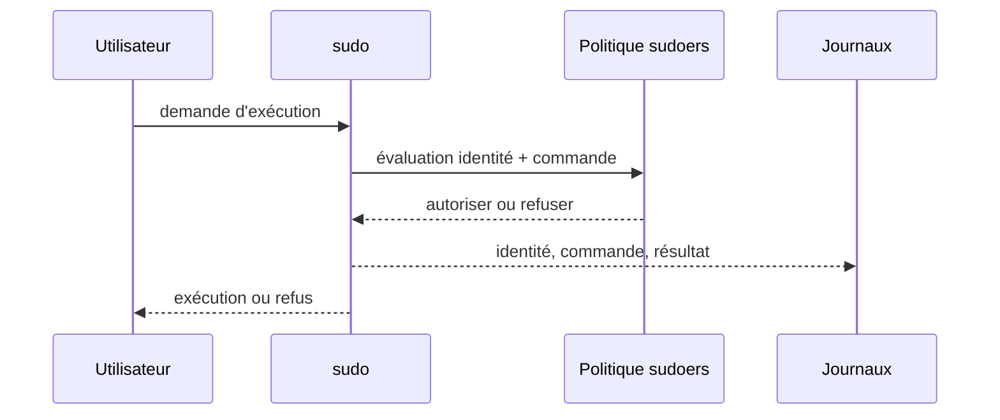
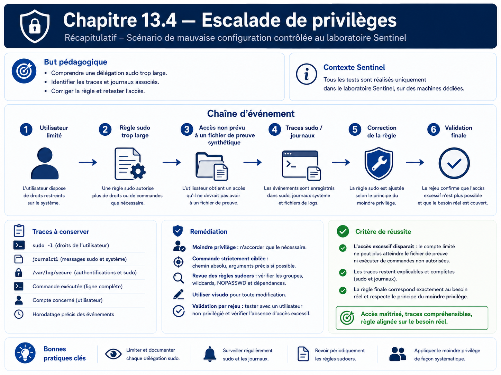

# Chapitre 13.4 — Escalade de privilèges

> **Campagne 13 — Attaques et défense**
>
> *« Le moindre privilège ne se prouve pas par une intention, mais par ce qu'un compte peut réellement faire. »*

## Vous êtes ici

```text
PARTIE III — Mise en situation

Campagne 13 — Attaques et défense

  13.1 Reconnaissance
  13.2 Scan réseau
  13.3 Brute force SSH
► 13.4 Escalade de privilèges
  13.5 Mouvements latéraux
  13.6 Persistance
  13.7 Exfiltration
  13.8 Étude de cas complète
```

## Objectifs pédagogiques

À l'issue de ce chapitre, vous serez capable de :

- expliquer ce qu'est une escalade de privilèges locale ;
- distinguer vulnérabilité logicielle, mauvaise permission et délégation excessive ;
- auditer les droits effectifs d'un compte de laboratoire ;
- démontrer sans exploit une délégation sudo volontairement trop large ;
- identifier les traces produites par l'élévation ;
- réduire la délégation puis vérifier que la tâche métier reste possible.

## Pourquoi ce chapitre existe

Une compromission initiale n'accorde pas nécessairement les privilèges les plus élevés. La sécurité du socle dépend donc de la capacité à **contenir** un compte ou un processus déjà compromis.

Dans ce chapitre, aucune vulnérabilité noyau ni chaîne d'exploitation n'est utilisée. Le laboratoire étudie un cas plus courant et plus facile à auditer : une délégation administrative excessive. L'objectif est de comprendre comment un droit apparemment pratique peut agrandir le périmètre d'un incident.

## Trois chemins conceptuels vers davantage de privilèges



Le cours se concentre sur les deux premiers chemins, observables avec les mécanismes déjà étudiés.

## Préconditions

Utilisez un compte de test non administrateur, par exemple `alice` :

```bash
id alice
sudo -l -U alice
```

Depuis une session `alice` :

```bash
id
sudo -l
```

Conservez la sortie comme état initial.

## Étape 1 — Auditer les droits effectifs

Recherchez d'abord les accès explicites :

```bash
id
sudo -l
find /etc/sudoers.d -maxdepth 1 -type f -print 2>/dev/null
```

Puis inspectez uniquement des emplacements pertinents pour Sentinel :

```bash
namei -l /etc/sentinel
namei -l /var/lib/sentinel
systemctl show sentinel -p User -p Group
```

Le but n'est pas de parcourir tout le système à la recherche d'un « exploit », mais de vérifier que les frontières construites dans les campagnes précédentes sont cohérentes.

## Étape 2 — Créer une délégation volontairement trop large mais inoffensive

Sur la machine de laboratoire, l'administrateur crée un fichier de preuve sans secret :

```bash
printf '%s\n' 'preuve-laboratoire-sentinel' | sudo tee /root/sentinel-lab-proof.txt >/dev/null
sudo chmod 600 /root/sentinel-lab-proof.txt
```

Créez ensuite temporairement une règle sudo permettant au compte de test d'exécuter **une seule commande de lecture sur ce fichier précis** :

```bash
sudo visudo -f /etc/sudoers.d/sentinel-lab-escalation
```

Contenu de laboratoire :

```text
alice ALL=(root) /usr/bin/cat /root/sentinel-lab-proof.txt
```

Validez :

```bash
sudo visudo -cf /etc/sudoers.d/sentinel-lab-escalation
```

Depuis `alice` :

```bash
sudo /usr/bin/cat /root/sentinel-lab-proof.txt
```

Cette démonstration prouve un changement de privilège réel mais **strictement borné** : aucune shell root, aucun contournement, aucun secret réel.

## Étape 3 — Lire la décision sudo

Sur Sentinel :

```bash
sudo journalctl --since "-10 min" | grep -Ei 'sudo|COMMAND='
sudo ausearch -ts recent -m USER_CMD,USER_START,USER_END -i 2>/dev/null
```

Selon la configuration d'audit, les événements peuvent apparaître dans journald, `/var/log/secure`, auditd ou le collecteur central.

Documentez :

- qui a demandé l'élévation ;
- quelle commande exacte a été autorisée ;
- sous quelle identité elle a été exécutée ;
- quand ;
- depuis quelle session.

## Étape 4 — Comprendre pourquoi une délégation générique est dangereuse

Une règle sudo n'est sûre que si la commande déléguée possède un comportement suffisamment prévisible. Certaines commandes permettent d'éditer des fichiers arbitraires, de lancer des sous-commandes ou d'ouvrir un interpréteur ; leur délégation revient parfois à déléguer bien plus que prévu.

Dans ce laboratoire, ne cherchez pas à transformer une commande en shell privilégié. Analysez plutôt la question suivante :

> « La commande autorisée peut-elle agir sur un objet différent de celui pour lequel le besoin a été formulé ? »

Exemples de contrôles :

- chemin absolu de la commande ;
- arguments nécessaires et suffisamment contraints ;
- fichiers modifiables par l'utilisateur ;
- environnement transmis ;
- possibilité de charger une configuration externe ;
- nécessité réelle de l'identité `root`.

## Étape 5 — Corriger la délégation

Une fois la preuve collectée, supprimez la règle temporaire :

```bash
sudo rm -f /etc/sudoers.d/sentinel-lab-escalation
sudo visudo -c
```

Depuis `alice`, rejouez :

```bash
sudo -l
sudo /usr/bin/cat /root/sentinel-lab-proof.txt
```

**Résultat attendu :** la commande n'est plus autorisée.

## Vérifier que l'exploitation légitime reste possible

Le moindre privilège ne consiste pas à supprimer tous les droits. Si un opérateur doit consulter l'état de Sentinel, préférez une interface adaptée :

```bash
systemctl status sentinel --no-pager
sentinel status --format text
```

Lorsque ces commandes n'exigent pas `root`, ne créez pas de délégation sudo supplémentaire.

## Détection et investigation

Un événement sudo isolé peut être normal. Les signaux plus intéressants sont :

- commande rarement utilisée ;
- élévation depuis un compte qui n'administre habituellement pas la machine ;
- succession rapide de commandes privilégiées ;
- modification de `/etc/sudoers` ou `/etc/sudoers.d/` ;
- élévation suivie d'une modification de service, de pare-feu ou de configuration sensible.



## TP — Revue de moindre privilège Sentinel

Produisez une petite matrice :

| Tâche | Identité attendue | sudo nécessaire ? | Preuve |
| --- | --- | --- | --- |
| consulter l'état du service | opérateur | idéalement non | `systemctl status` |
| modifier `/etc/sentinel/` | administrateur | oui | permissions + journal |
| lire une clé privée TLS | service strictement autorisé | non via sudo utilisateur | `stat`, ACL/SELinux |
| redémarrer Sentinel | rôle d'exploitation défini | éventuellement | sudoers ciblé + journal |

Chaque droit doit être relié à une tâche explicite.

## Impact sur Sentinel

Le code Sentinel reste inchangé. Le chapitre vérifie que l'identité de service et les comptes humains ne peuvent pas franchir inutilement les frontières de privilèges du socle.

## Remise en état

```bash
sudo rm -f /etc/sudoers.d/sentinel-lab-escalation
sudo rm -f /root/sentinel-lab-proof.txt
sudo visudo -c
sudo systemctl is-active sentinel
```

Conservez uniquement les preuves nécessaires à l'exercice.

## Synthèse

- l'escalade de privilèges agrandit l'impact d'une compromission initiale ;
- une délégation excessive peut être aussi importante qu'une vulnérabilité logicielle ;
- `sudo -l`, les permissions et les journaux permettent d'auditer les droits effectifs ;
- la démonstration peut être réelle sans donner un shell privilégié ;
- le moindre privilège consiste à conserver seulement les droits nécessaires à une tâche précise.

## Navigation

[← 13.3 — Brute force SSH](13.3-brute-force-ssh.md) · [13.5 — Mouvements latéraux →](13.5-mouvements-lateraux.md)

## Schéma récapitulatif


