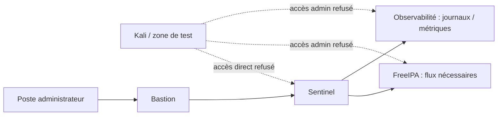
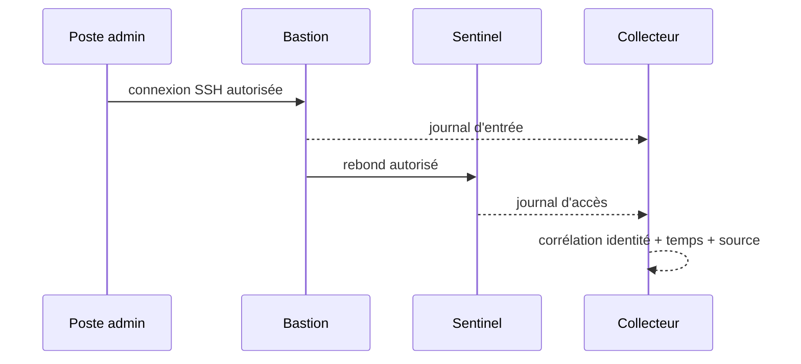

# Chapitre 13.5 — Mouvements latéraux

> **Campagne 13 — Attaques et défense**
>
> *« Une compromission devient systémique quand les frontières internes cessent d'exister. »*

## Vous êtes ici

```text
PARTIE III — Mise en situation

Campagne 13 — Attaques et défense

  13.1 Reconnaissance
  13.2 Scan réseau
  13.3 Brute force SSH
  13.4 Escalade de privilèges
► 13.5 Mouvements latéraux
  13.6 Persistance
  13.7 Exfiltration
  13.8 Étude de cas complète
```

## Objectifs pédagogiques

À l'issue de ce chapitre, vous serez capable de :

- expliquer le principe du mouvement latéral ;
- distinguer accès légitime entre hôtes et propagation d'un incident ;
- vérifier la segmentation entre Kali, Sentinel, bastion, FreeIPA et observabilité ;
- démontrer l'importance d'un bastion sans réutiliser ni voler d'identifiants ;
- rechercher les traces d'une connexion inter-hôtes ;
- prouver qu'un chemin direct interdit reste bloqué tandis que le chemin d'administration prévu fonctionne.

## Pourquoi ce chapitre existe

Un attaquant qui contrôle une machine cherche souvent à atteindre d'autres ressources : serveur d'identité, collecteur de journaux, machine d'administration ou autres applications. Cette progression est appelée **mouvement latéral**.

Le risque ne vient pas uniquement des identifiants. Il vient aussi de la topologie : réseaux trop plats, pare-feu internes permissifs, services d'administration accessibles partout, comptes partagés ou relations de confiance trop larges.

Ce chapitre ne met pas en scène le vol de secrets. Il utilise les accès de laboratoire déjà autorisés pour mesurer les frontières réseau et montrer ce qu'une segmentation correcte empêche.

## Le modèle de confiance attendu



Chaque flèche doit correspondre à un besoin documenté. L'absence de flèche est aussi une décision de sécurité.

## Préconditions

Adaptez les noms au laboratoire :

```text
bastion.sentinel.lab
sentinel.sentinel.lab
ipa.sentinel.lab
observability.sentinel.lab
kali.sentinel.lab
```

Sur chaque hôte pertinent, capturez :

```bash
ip -brief address
ip route
sudo firewall-cmd --get-active-zones
sudo firewall-cmd --list-all
sudo ss -lntp
```

## Étape 1 — Construire la matrice de flux

Avant de tester, écrivez les attentes :

| Source | Destination | Service | Attendu | Justification |
| --- | --- | --- | --- | --- |
| poste admin | bastion | SSH | autorisé | entrée d'administration |
| bastion | Sentinel | SSH | autorisé | rebond contrôlé |
| Kali | Sentinel | SSH | refusé ou restreint | pas de chemin admin direct |
| Sentinel | FreeIPA | DNS/Kerberos/LDAP selon architecture | autorisé | identité centralisée |
| Sentinel | observabilité | Rsyslog | autorisé | centralisation des traces |
| Kali | observabilité | administration | refusé | surface sensible |

Cette matrice sert de contrat de test.

## Étape 2 — Vérifier les refus directs

Depuis Kali, testez seulement les ports définis dans la matrice :

```bash
nc -vz -w 3 sentinel.sentinel.lab 22
nc -vz -w 3 observability.sentinel.lab 22
nc -vz -w 3 ipa.sentinel.lab 22
```

Un refus ou un timeout peut être attendu selon la politique. N'essayez pas d'autres comptes, d'autres secrets ni de techniques de contournement.

## Étape 3 — Vérifier le chemin légitime via bastion

Depuis le poste d'administration autorisé :

```bash
ssh admin@bastion.sentinel.lab
```

Puis, si le laboratoire utilise `ProxyJump` :

```bash
ssh -J admin@bastion.sentinel.lab admin@sentinel.sentinel.lab
```

Le point important n'est pas la commodité de `-J`, mais le fait que le chemin soit **prévu, limité et traçable**.

## Étape 4 — Corréler les journaux

Sur le bastion :

```bash
sudo journalctl -u sshd --since "-10 min" --no-pager
```

Sur Sentinel :

```bash
sudo journalctl -u sshd --since "-10 min" --no-pager
```

Sur le collecteur :

```bash
sudo grep -R "sshd" /var/log/remote/ 2>/dev/null | tail -100
```

Cherchez une chaîne temporelle cohérente :

```text
poste admin → bastion → Sentinel
```

La traçabilité doit permettre de reconstruire le chemin sans dépendre d'un seul hôte.

## Étape 5 — Tester une mauvaise segmentation de manière contrôlée

Choisissez **un seul flux** qui devrait être interdit, par exemple Kali → SSH Sentinel.

Si ce flux est actuellement autorisé alors qu'il ne devrait pas l'être :

1. conservez la preuve initiale ;
2. identifiez la zone Firewalld responsable ;
3. corrigez la règle ;
4. rechargez ;
5. rejouez le test direct ;
6. rejouez le chemin via bastion.

```bash
sudo firewall-cmd --check-config
sudo firewall-cmd --reload
```

**Résultat attendu :** le flux direct devient impossible, mais l'administration prévue reste fonctionnelle.

## Ce qui transforme un accès légitime en risque de mouvement latéral

Plusieurs anti-patterns sont particulièrement importants :

- même compte partagé sur plusieurs machines ;
- clé privée copiée partout ;
- agent forwarding activé sans nécessité ;
- SSH autorisé de n'importe quelle zone vers tous les serveurs ;
- comptes de service utilisables comme comptes interactifs ;
- accès direct au serveur d'identité depuis des zones non nécessaires ;
- absence de journalisation centralisée.

Le bon modèle réduit la **portée d'une identité** autant que la portée d'un réseau.

## Détection : corréler les sauts

Un mouvement latéral peut ressembler à une administration normale. La différence vient du contexte :

- source inhabituelle ;
- compte utilisé sur plusieurs hôtes dans un intervalle court ;
- accès à une machine rarement administrée ;
- connexion directe alors que le bastion est normalement obligatoire ;
- succès après des échecs d'authentification sur un autre hôte ;
- modification de règles réseau suivie d'un nouvel accès.



## TP — Prouver une architecture anti-propagation

Produisez les preuves suivantes :

1. accès direct Kali → Sentinel refusé ;
2. accès Kali → administration observabilité refusé ;
3. accès admin → bastion réussi ;
4. accès bastion → Sentinel réussi ;
5. journaux visibles sur les deux hôtes ;
6. traces centralisées ;
7. Sentinel `/health` et `/metrics` restent disponibles pour les clients légitimes.

Documentez les exceptions. Une architecture réelle peut autoriser un accès direct depuis une zone d'administration précise ; l'important est que ce choix soit explicite.

## Impact sur Sentinel

Sentinel reste inchangé. La protection étudiée est extérieure au code : segmentation, bastion, identités et journalisation limitent la propagation d'une compromission.

## Remise en état

- restaurez uniquement les règles modifiées pour le TP ;
- vérifiez les accès via bastion ;
- vérifiez les flux Sentinel → FreeIPA et observabilité ;
- contrôlez `systemctl is-active sentinel sshd` ;
- archivez la matrice de flux mise à jour.

## Synthèse

- le mouvement latéral exploite les relations de confiance entre systèmes ;
- une topologie plate amplifie fortement l'impact d'un incident ;
- le bastion matérialise un chemin d'administration contrôlé ;
- les refus directs sont aussi importants à tester que les accès autorisés ;
- la détection repose sur la corrélation des identités, sources, hôtes et horaires.

## Navigation

[← 13.4 — Escalade de privilèges](13.4-escalade-privileges.md) · [13.6 — Persistance →](13.6-persistance.md)
