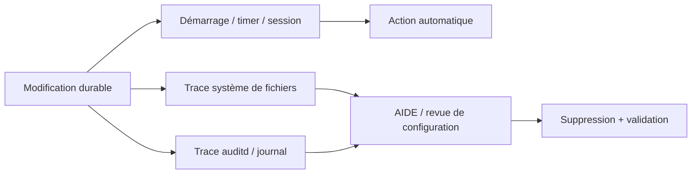
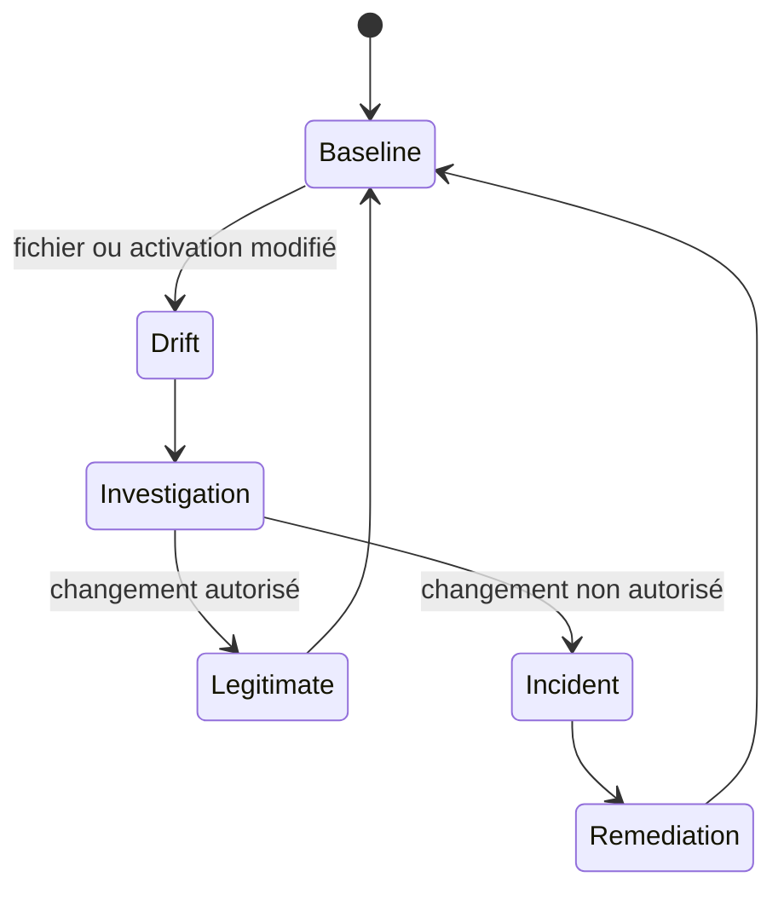
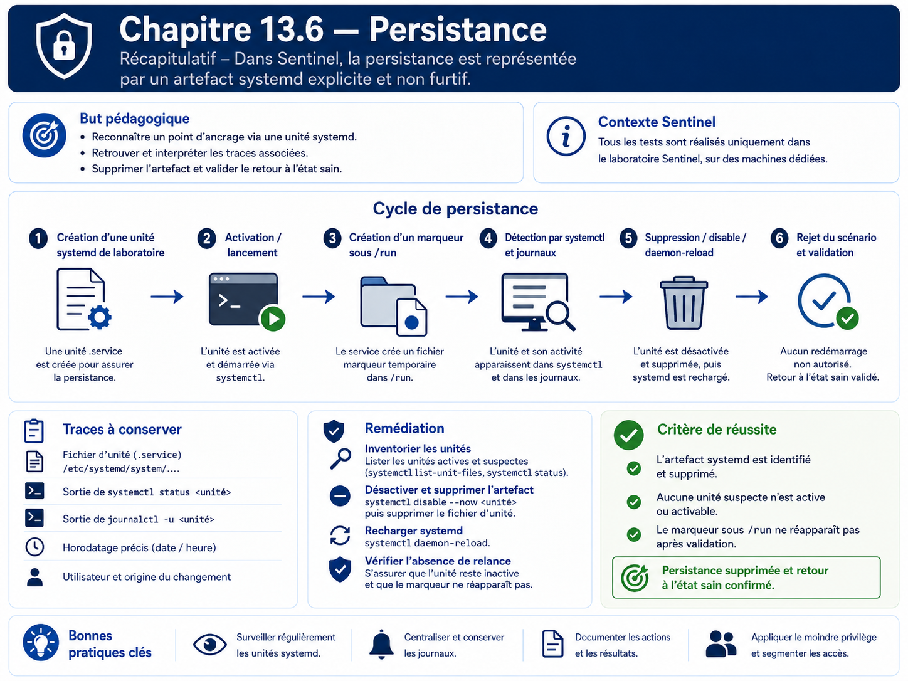

# Chapitre 13.6 — Persistance

> **Campagne 13 — Attaques et défense**
>
> *« La persistance n'est pas seulement une technique d'attaque : c'est une modification durable qu'il faut savoir retrouver. »*

## Vous êtes ici

```text
PARTIE III — Mise en situation

Campagne 13 — Attaques et défense

  13.1 Reconnaissance
  13.2 Scan réseau
  13.3 Brute force SSH
  13.4 Escalade de privilèges
  13.5 Mouvements latéraux
► 13.6 Persistance
  13.7 Exfiltration
  13.8 Étude de cas complète
```

## Objectifs pédagogiques

À l'issue de ce chapitre, vous serez capable de :

- expliquer ce que signifie persister sur un système ;
- distinguer mécanisme de démarrage légitime et modification non autorisée ;
- créer une persistance **de laboratoire explicite et inoffensive** avec systemd ;
- observer les traces laissées dans le système de fichiers, journald, auditd et AIDE ;
- retirer proprement la modification ;
- vérifier qu'aucune trace active de la simulation ne subsiste.

## Pourquoi ce chapitre existe

Un accès ponctuel disparaît avec la session. Une persistance cherche au contraire à survivre à un redémarrage, à une déconnexion ou à un changement d'utilisateur. Les mécanismes utilisés peuvent être parfaitement légitimes : unités systemd, timers, tâches planifiées, clés SSH, profils shell ou services de démarrage.

Le problème n'est donc pas le mécanisme lui-même, mais **qui l'a modifié, pourquoi et avec quelle autorisation**.

Ce chapitre ne construit pas de persistance furtive. Il utilise une unité systemd clairement nommée qui se contente d'écrire un marqueur dans `/run`. Cela suffit pour exercer les mécanismes de détection et de remise en état.

## Modèle de persistance et de détection



## Préconditions

Avant le TP :

```bash
sudo systemctl is-active sentinel
sudo systemctl list-unit-files --state=enabled | head -50
sudo ausearch -ts recent -k sentinel 2>/dev/null | tail -20
```

Si AIDE est installé et sa base à jour, conservez également l'état de référence.

## Étape 1 — Créer une unité de laboratoire visible

Créez `/etc/systemd/system/sentinel-lab-persistence.service` :

```ini
[Unit]
Description=Sentinel lab persistence marker

[Service]
Type=oneshot
ExecStart=/usr/bin/touch /run/sentinel-lab-persistence.marker
RemainAfterExit=yes

[Install]
WantedBy=multi-user.target
```

Puis :

```bash
sudo systemctl daemon-reload
sudo systemctl enable --now sentinel-lab-persistence.service
```

Vérifiez :

```bash
systemctl status sentinel-lab-persistence.service --no-pager
ls -l /run/sentinel-lab-persistence.marker
```

Le marqueur est volontairement sans effet métier et disparaîtra au redémarrage si le service n'est plus activé.

## Étape 2 — Identifier ce qui rend la modification persistante

```bash
systemctl is-enabled sentinel-lab-persistence.service
systemctl cat sentinel-lab-persistence.service
find /etc/systemd/system -maxdepth 2 -lname '*sentinel-lab-persistence*' -ls
```

Une unité activée crée généralement un lien dans un répertoire `*.wants/`. Cette relation est souvent plus importante que le simple fichier `.service` : elle explique **quand** l'unité sera déclenchée.

## Étape 3 — Rechercher les traces système

```bash
sudo journalctl --since "-10 min" | grep -F 'sentinel-lab-persistence'
sudo journalctl -u sentinel-lab-persistence.service --no-pager
```

Si auditd surveille `/etc/systemd/system` :

```bash
sudo ausearch -f /etc/systemd/system/sentinel-lab-persistence.service -i
```

Si AIDE couvre `/etc` :

```bash
sudo aide --check
```

Ne concluez pas qu'AIDE « a échoué » si la modification est détectée : c'est précisément le comportement attendu.

## Étape 4 — Chercher les mécanismes, pas le nom de la simulation

Dans un incident réel, le nom du fichier ne contiendrait pas forcément `persistence`. La revue doit donc porter sur les emplacements et les changements :

```bash
systemctl list-unit-files --state=enabled
systemctl list-timers --all
find /etc/systemd/system -type f -o -type l
find /etc/cron.d /etc/cron.daily -maxdepth 1 -type f -ls 2>/dev/null
```

Pour les comptes d'administration, contrôlez aussi les changements de clés autorisées :

```bash
find /home -path '*/.ssh/authorized_keys' -type f -ls 2>/dev/null
```

Cette commande sert à l'inventaire défensif. Elle ne doit pas être utilisée pour copier des clés ou secrets.

## Étape 5 — Retirer la persistance de laboratoire

```bash
sudo systemctl disable --now sentinel-lab-persistence.service
sudo rm -f /etc/systemd/system/sentinel-lab-persistence.service
sudo rm -f /run/sentinel-lab-persistence.marker
sudo systemctl daemon-reload
sudo systemctl reset-failed
```

Vérifiez ensuite :

```bash
systemctl status sentinel-lab-persistence.service --no-pager
find /etc/systemd/system -name '*sentinel-lab-persistence*' -print
ls -l /run/sentinel-lab-persistence.marker
```

Les commandes doivent confirmer que la simulation n'est plus active.

## Détection : construire une baseline durable

Une persistance est plus facile à détecter lorsque l'on connaît l'état attendu :

- unités activées ;
- timers ;
- tâches cron ;
- clés SSH autorisées ;
- fichiers de profil ;
- paquets installés ;
- services réseau ;
- propriétaires et permissions des fichiers sensibles.



Le contrôle d'intégrité ne remplace pas la gestion de configuration : il signale un écart, puis l'opérateur doit décider s'il est légitime.

## TP — Corréler quatre sources de preuve

Pour la création puis la suppression de l'unité, collectez :

1. sortie `systemctl` ;
2. métadonnées du fichier et du lien d'activation ;
3. événements journald/auditd disponibles ;
4. résultat AIDE si configuré.

Construisez une chronologie avec horodatages. L'objectif est de montrer qu'un seul événement peut être visible sous plusieurs angles.

## Impact sur Sentinel

Sentinel `1.1.x` reste inchangé. Le mécanisme de laboratoire est volontairement séparé de son service afin de ne pas introduire de comportement vulnérable dans l'application fil rouge.

## Remise en état

La remise en état est une exigence du chapitre :

```bash
sudo systemctl disable --now sentinel-lab-persistence.service 2>/dev/null || true
sudo rm -f /etc/systemd/system/sentinel-lab-persistence.service
sudo rm -f /run/sentinel-lab-persistence.marker
sudo systemctl daemon-reload
sudo systemctl is-active sentinel
```

Si AIDE est utilisé, ne mettez à jour sa baseline qu'après avoir confirmé que le système est revenu à l'état légitime.

## Synthèse

- la persistance exploite souvent des mécanismes d'administration parfaitement légitimes ;
- une baseline permet de distinguer état attendu et dérive ;
- systemd, journald, auditd et AIDE fournissent des preuves complémentaires ;
- une simulation pédagogique peut être durable sans être furtive ni dangereuse ;
- la suppression doit être suivie d'une preuve que le mécanisme n'est plus actif.

## Navigation

[← 13.5 — Mouvements latéraux](13.5-mouvements-lateraux.md) · [13.7 — Exfiltration →](13.7-exfiltration.md)

## Schéma récapitulatif


