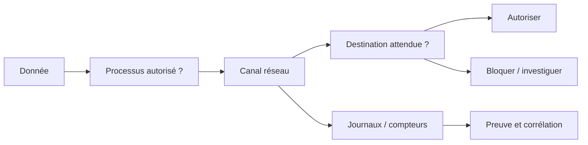
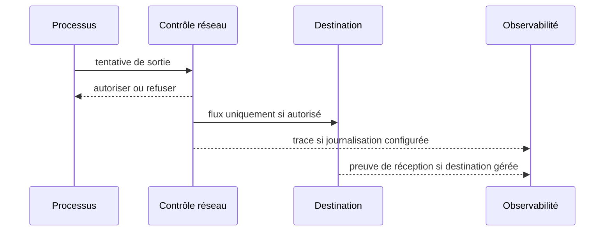
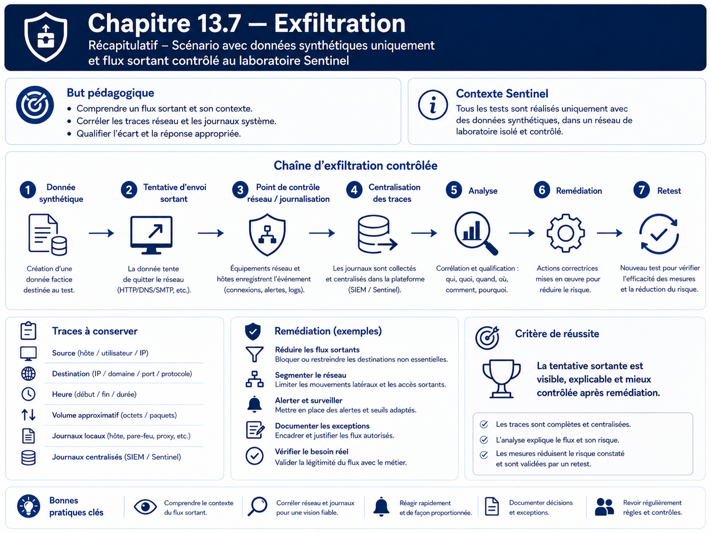

# Chapitre 13.7 — Exfiltration

> **Campagne 13 — Attaques et défense**
>
> *« Une donnée sensible qui quitte son périmètre devient un incident, même si le service continue de fonctionner. »*

## Vous êtes ici

```text
PARTIE III — Mise en situation

Campagne 13 — Attaques et défense

  13.1 Reconnaissance
  13.2 Scan réseau
  13.3 Brute force SSH
  13.4 Escalade de privilèges
  13.5 Mouvements latéraux
  13.6 Persistance
► 13.7 Exfiltration
  13.8 Étude de cas complète
```

## Objectifs pédagogiques

À l'issue de ce chapitre, vous serez capable de :

- expliquer ce qu'est une exfiltration et pourquoi elle concerne aussi les flux sortants ;
- identifier les données et secrets qui ne doivent jamais quitter l'hôte ;
- simuler un transfert **inoffensif et borné** avec une donnée synthétique ;
- observer les traces réseau et applicatives disponibles ;
- vérifier qu'une politique de sortie réduit les destinations autorisées ;
- distinguer prévention, détection et preuve d'exfiltration.

## Pourquoi ce chapitre existe

Les campagnes précédentes se sont surtout intéressées à ce qui **entre** dans le système : connexions, authentification, privilèges. Une compromission devient cependant critique lorsque des données sensibles peuvent quitter l'environnement sans contrôle.

Le terme exfiltration couvre des réalités variées : copie de fichiers, requête applicative, synchronisation vers un service externe ou détournement d'un protocole autorisé. Ce chapitre ne reproduit pas de technique de contournement ni de canal furtif. Il utilise uniquement une **donnée synthétique**, une destination contrôlée du laboratoire et un transfert de très petite taille.

## Classifier les données avant de parler de réseau

Pour Sentinel, distinguez au minimum :

| Donnée | Exemple | Sortie autorisée ? |
| --- | --- | --- |
| publique | version applicative | selon besoin |
| exploitation | métriques agrégées | vers Prometheus uniquement |
| journalisation | événements système | vers le collecteur Rsyslog |
| sensible | configuration interne | seulement selon usage explicite |
| secret | clé privée TLS, mot de passe, jeton | jamais comme donnée applicative sortante |

Une politique de sortie n'est utile que si l'on sait d'abord **ce que l'on protège**.

## Modèle : donnée, canal, destination, preuve



## Préconditions

Créez une donnée synthétique qui ne ressemble pas à un secret réel :

```bash
printf '%s\n' 'SENTINEL-LAB-DATA-DO-NOT-USE-AS-SECRET' > /tmp/sentinel-lab-data.txt
sha256sum /tmp/sentinel-lab-data.txt
```

La destination de test doit être une machine du laboratoire explicitement prévue, par exemple `observability.sentinel.lab`.

Ne copiez jamais dans cet exercice `/etc/shadow`, une clé privée, un jeton, un certificat client avec sa clé ou une donnée personnelle réelle.

## Étape 1 — Inventorier les sorties légitimes

Sur Sentinel :

```bash
sudo ss -ntup
sudo firewall-cmd --list-all
sudo systemctl status sentinel --no-pager
```

Documentez les destinations nécessaires au fonctionnement :

- DNS ;
- FreeIPA selon le déploiement ;
- collecteur Rsyslog ;
- éventuelles dépendances explicitement prévues.

Prometheus fonctionne généralement en **scrape entrant** vers `/metrics` : Sentinel n'a donc pas besoin d'ouvrir arbitrairement des connexions sortantes vers Prometheus pour publier ses métriques.

## Étape 2 — Simuler une sortie contrôlée

Le laboratoire utilise un transfert de texte synthétique vers un service de collecte que vous administrez. Si aucun récepteur HTTP de laboratoire n'existe déjà, ne créez pas un nouvel outil ad hoc : utilisez simplement un mécanisme légitime déjà disponible dans l'architecture, par exemple la journalisation Rsyslog.

Émettez un marqueur :

```bash
logger -t sentinel-lab-egress 'SENTINEL-LAB-EGRESS-MARKER'
```

Puis vérifiez sur le collecteur :

```bash
sudo grep -R 'SENTINEL-LAB-EGRESS-MARKER' /var/log/remote/ 2>/dev/null
```

Cette étape représente une **sortie de donnée contrôlée** sans transmettre de secret ni construire un canal d'exfiltration générique.

## Étape 3 — Comprendre ce que la preuve signifie réellement

La présence du marqueur sur le collecteur prouve :

- que le chemin Rsyslog est fonctionnel ;
- que le message a quitté l'hôte source ;
- que la destination l'a reçu et conservé.

Elle ne prouve pas qu'un autre canal serait bloqué. Pour cela, il faut tester la politique réseau elle-même.

## Étape 4 — Vérifier une destination non autorisée

Choisissez dans le laboratoire **une destination et un port de test qui ne doivent pas être utilisés par Sentinel**. Effectuez uniquement un test de connexion, sans envoyer de fichier :

```bash
nc -vz -w 3 DESTINATION_TEST PORT_TEST
```

Si la politique de sortie est effectivement restrictive, la connexion doit échouer. Si elle réussit, ne concluez pas immédiatement à une vulnérabilité : identifiez d'abord si cette ouverture répond à un autre besoin du système.

## Contrôler les sorties sans casser l'exploitation

Une politique restrictive peut s'appuyer sur plusieurs couches :

- segmentation réseau ;
- règles Firewalld ;
- architecture de proxy ou de passerelle ;
- DNS contrôlé ;
- restrictions propres aux services ;
- SELinux pour certains accès locaux et réseau ;
- comptes de service séparés.

Le filtrage de sortie doit être conçu à partir de la matrice de flux, pas en ajoutant des blocages au hasard.

## Détection : chercher l'écart par rapport au comportement normal

Les signaux utiles peuvent inclure :

- nouvelle destination externe ou interne inhabituelle ;
- volume de sortie anormal ;
- processus qui initie soudainement des connexions alors qu'il ne le faisait pas ;
- connexion vers un port non prévu ;
- archivage ou lecture inhabituelle de fichiers sensibles avant une sortie ;
- désactivation préalable des journaux ou du pare-feu.



Une absence de journal n'est pas une preuve d'absence de transfert. Il faut connaître les points réellement instrumentés.

## TP — Construire une matrice d'egress Sentinel

Complétez :

| Processus/source | Destination | Port/protocole | Besoin | Décision |
| --- | --- | --- | --- | --- |
| système | DNS | 53 | résolution | autoriser selon architecture |
| système/Sentinel | FreeIPA | selon services utilisés | identité/certificats | autoriser précisément |
| rsyslog | collecteur | 6514/TCP si TLS | journaux | autoriser |
| Sentinel | destination inconnue | quelconque | aucun | refuser/investiguer |

Pour chaque ligne autorisée, ajoutez un test fonctionnel. Pour chaque ligne refusée, ajoutez un test de non-accessibilité.

## Scénario de correction

Si vous découvrez une sortie non nécessaire :

1. conservez la preuve ;
2. identifiez le processus et la règle réseau ;
3. vérifiez qu'aucun service légitime ne dépend du flux ;
4. appliquez la correction minimale ;
5. rejouez le test de refus ;
6. rejouez `/health`, `/ready`, l'intégration FreeIPA et la centralisation des journaux.

La sécurité d'egress ne doit pas casser les dépendances documentées.

## Impact sur Sentinel

Sentinel reste en `1.1.x`. Aucune fonction de transfert supplémentaire n'est ajoutée au code. Le chapitre s'appuie sur les flux existants et une donnée de laboratoire explicitement synthétique.

## Remise en état

```bash
rm -f /tmp/sentinel-lab-data.txt
sudo systemctl is-active sentinel rsyslog
```

Restaurez toute règle réseau temporaire et vérifiez la réception normale des journaux.

## Synthèse

- l'exfiltration concerne les données qui quittent le périmètre de confiance ;
- contrôler les sorties exige de connaître les flux légitimes ;
- les secrets réels n'ont aucune place dans un TP d'exfiltration ;
- une simulation avec donnée synthétique suffit pour étudier preuve et détection ;
- la défense combine matrice de flux, segmentation, journalisation et tests fonctionnels.

## Navigation

[← 13.6 — Persistance](13.6-persistance.md) · [13.8 — Étude de cas complète →](13.8-etude-cas-complete.md)

## Schéma récapitulatif


