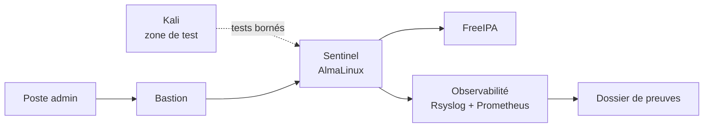
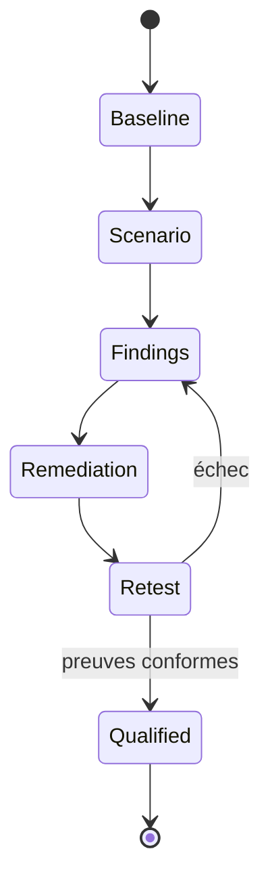
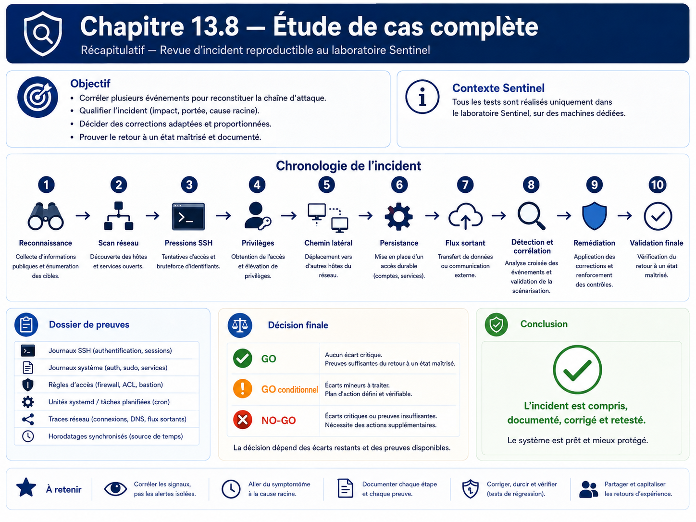

# Chapitre 13.8 — Étude de cas complète

> **Campagne 13 — Attaques et défense**
>
> *« Un incident n'est compris que lorsque les actions, les traces et les décisions racontent la même histoire. »*

## Vous êtes ici

```text
PARTIE III — Mise en situation

Campagne 13 — Attaques et défense

  13.1 Reconnaissance
  13.2 Scan réseau
  13.3 Brute force SSH
  13.4 Escalade de privilèges
  13.5 Mouvements latéraux
  13.6 Persistance
  13.7 Exfiltration
► 13.8 Étude de cas complète
```

## Objectifs pédagogiques

À l'issue de ce chapitre, vous serez capable de :

- conduire un scénario d'incident de bout en bout dans le laboratoire ;
- réutiliser les démonstrations bornées des chapitres 13.1 à 13.7 sans introduire de nouvelle technique offensive ;
- construire une chronologie à partir de plusieurs sources de journaux ;
- distinguer fait observé, hypothèse et conclusion ;
- corriger les faiblesses mises en évidence puis rejouer les tests ;
- produire un dossier d'incident exploitable par une équipe d'exploitation ou de sécurité.

## Pourquoi ce chapitre existe

Un contrôle isolé peut fonctionner et l'ensemble rester fragile. À l'inverse, une alerte isolée peut sembler grave alors que la chronologie complète montre un test légitime ou un incident contenu.

Cette étude de cas assemble donc les compétences acquises : reconnaissance, exposition réseau, authentification, privilèges, segmentation, persistance, flux sortants, journaux, audit et supervision.

Le scénario ne cherche pas à « compromettre pour compromettre ». Il met en scène des **événements contrôlés et connus à l'avance**, puis demande au défenseur de reconstruire ce qui s'est passé et de prouver que les corrections fonctionnent.

## Règles du scénario

Le périmètre est strict :

- uniquement les VM du laboratoire Sentinel ;
- uniquement les comptes de test prévus ;
- aucune donnée réelle ;
- aucune liste de mots de passe ;
- aucun exploit de vulnérabilité ;
- aucun mécanisme furtif ;
- aucune tentative de contournement d'un refus ;
- toutes les modifications temporaires sont documentées et supprimées à la fin.

## Architecture de référence



## Préparer le dossier d'incident

Créez une arborescence locale sur votre poste d'administration :

```text
incident-13.8/
├── 00-contexte/
├── 01-baseline/
├── 02-evenements/
├── 03-journaux/
├── 04-chronologie/
├── 05-corrections/
└── 06-retest/
```

Chaque preuve doit préciser :

- hôte ;
- heure UTC ;
- commande ou source ;
- résultat ;
- interprétation.

## Phase 0 — Baseline

Avant le scénario, collectez :

Sur Sentinel :

```bash
date -u
hostnamectl
sudo ss -lntup
sudo firewall-cmd --list-all
sudo systemctl is-active sentinel sshd rsyslog
sudo sshd -T | grep -E 'permitrootlogin|passwordauthentication|pubkeyauthentication|maxauthtries'
```

Pour l'application :

```bash
sentinel --version
sentinel status --format text
```

Depuis un client légitime, vérifiez `/health`, `/ready` et `/metrics` selon la configuration TLS/mTLS active.

La baseline doit être **verte avant de commencer**.

## Phase 1 — Reconnaissance bornée

Depuis Kali :

```bash
dig +short sentinel.sentinel.lab A
openssl s_client -connect sentinel.sentinel.lab:443 -servername sentinel.sentinel.lab </dev/null
```

Si le service est publié sur un autre port dans votre laboratoire, utilisez ce port réel.

**Question d'analyse :** quelles informations sont nécessaires au protocole et lesquelles pourraient être réduites ?

## Phase 2 — Vérification de l'exposition réseau

Toujours depuis Kali :

```bash
nmap -Pn -p 22,443,8443,9100 sentinel.sentinel.lab
```

Ne scannez pas d'autres plages. Comparez immédiatement le résultat à la baseline `ss` + Firewalld.

**Événement à consigner :** tout port accessible depuis Kali qui n'était pas attendu dans la matrice de flux.

## Phase 3 — Échecs d'authentification contrôlés

Utilisez le compte de test prévu au chapitre 13.3 et produisez seulement quelques échecs manuels. Arrêtez dès que les journaux permettent l'analyse.

Puis, sur Sentinel :

```bash
sudo journalctl -u sshd --since "-10 min" --no-pager
sudo faillock --user alice
```

**Question d'analyse :** le comportement est-il visible, contenu et distinguable d'un refus par politique ?

## Phase 4 — Délégation excessive de laboratoire

Reprenez le scénario borné du chapitre 13.4 : une règle sudo temporaire autorise uniquement la lecture de `/root/sentinel-lab-proof.txt` avec `/usr/bin/cat`.

Collectez :

```bash
sudo -l -U alice
sudo journalctl --since "-10 min" | grep -Ei 'sudo|COMMAND='
```

Puis retirez immédiatement la règle temporaire après la preuve.

**Question d'analyse :** le droit était-il proportionné au besoin ?

## Phase 5 — Test de segmentation

Vérifiez deux chemins :

1. un accès direct qui doit être refusé ;
2. le chemin d'administration via bastion qui doit réussir.

Exemples :

```bash
nc -vz -w 3 sentinel.sentinel.lab 22
ssh -J admin@bastion.sentinel.lab admin@sentinel.sentinel.lab
```

Adaptez l'attendu à votre architecture réelle.

## Phase 6 — Persistance explicite de laboratoire

Créez puis activez l'unité `sentinel-lab-persistence.service` définie au chapitre 13.6. Vérifiez son marqueur, ses journaux et, si disponible, sa détection par auditd/AIDE.

Puis supprimez-la complètement.

**Question d'analyse :** quelles sources permettent de prouver la création, l'activation et la suppression ?

## Phase 7 — Sortie de donnée synthétique

Émettez uniquement le marqueur Rsyslog défini au chapitre 13.7 :

```bash
logger -t sentinel-lab-egress 'SENTINEL-LAB-EGRESS-MARKER'
```

Sur le collecteur :

```bash
sudo grep -R 'SENTINEL-LAB-EGRESS-MARKER' /var/log/remote/ 2>/dev/null
```

**Question d'analyse :** quelle différence existe entre « un flux sortant autorisé » et « une exfiltration » ?

La réponse doit mentionner au minimum la nature de la donnée, l'autorisation, la destination et le contexte.

## Phase 8 — Construire la chronologie

Rassemblez les événements dans un tableau unique :

| Heure UTC | Source | Hôte | Événement | Preuve | Interprétation |
| --- | --- | --- | --- | --- | --- |
| T0 | baseline | Sentinel | services actifs | `systemctl` | état sain |
| T1 | Kali | Sentinel | reconnaissance TLS | journal/service | observation |
| T2 | Kali | Sentinel | connexions multiports bornées | réseau | scan contrôlé |
| T3 | Kali | Sentinel | échecs SSH | journald/PAM | pression auth |
| T4 | alice | Sentinel | commande sudo autorisée | sudo/audit | délégation test |
| T5 | admin | bastion/Sentinel | accès via rebond | sshd centralisé | chemin légitime |
| T6 | root lab | Sentinel | unité temporaire | systemd/audit/AIDE | persistance simulée |
| T7 | rsyslog | observabilité | marqueur synthétique | collecteur | sortie autorisée |

N'utilisez pas les heures approximatives si les journaux permettent mieux.

## Phase 9 — Formuler les constats

Chaque constat suit ce modèle :

```text
ID : F-01
Fait observé : ...
Risque : ...
Cause : ...
Contrôle existant : ...
Correction proposée : ...
Preuve attendue après correction : ...
```

Classez les constats par impact et vraisemblance. Un événement de laboratoire prévu n'est pas une vulnérabilité ; il peut néanmoins révéler qu'un contrôle manque ou produit trop peu de traces.

## Phase 10 — Corriger

Les corrections restent minimales et ciblées :

- fermer un flux non nécessaire ;
- restreindre une délégation sudo ;
- renforcer une politique SSH déjà prévue ;
- compléter une règle de journalisation ou d'audit utile ;
- supprimer une activation systemd inattendue ;
- documenter une dépendance réseau légitime.

Ne modifiez pas Sentinel Python pour compenser une faiblesse qui appartient à Firewalld, SSH, sudo ou systemd.

## Phase 11 — Retester exactement les mêmes scénarios

Le retest doit reprendre les mêmes commandes et les mêmes attentes.



Le dossier final doit montrer :

- ce qui échouait ou était trop exposé avant ;
- la correction ;
- le résultat après ;
- l'absence de régression sur les fonctions légitimes.

## Vérifications de non-régression

À la fin :

```bash
sudo systemctl is-active sentinel sshd rsyslog
sudo firewall-cmd --check-config
sudo visudo -c
sentinel --version
sentinel status --format text
```

Puis vérifiez selon votre architecture :

- `/health` ;
- `/ready` ;
- `/metrics` ;
- authentification mTLS légitime ;
- intégration FreeIPA ;
- centralisation Rsyslog ;
- supervision Prometheus ;
- accès d'administration via bastion.

## Livrables

Le rendu de la campagne 13 contient :

1. la baseline initiale ;
2. la matrice de flux ;
3. la chronologie ;
4. les journaux sélectionnés ;
5. les constats ;
6. les corrections ;
7. les résultats de retest ;
8. une conclusion de qualification.

### Conclusion de qualification

Utilisez trois états :

- **GO** : contrôles conformes, scénarios bornés détectés ou contenus comme attendu ;
- **GO conditionnel** : écarts résiduels documentés avec risque accepté et action planifiée ;
- **NO-GO** : contrôle essentiel absent, contourné par un scénario du laboratoire ou impossible à prouver.

## Jalon Sentinel

**État de départ :** Sentinel `1.1.0`, avec TLS/mTLS, intégration au socle, packaging/déploiement et métriques déjà disponibles.

**Besoin :** produire et corréler des traces d'incident sur des scénarios d'attaque contrôlés.

**Modification applicative :** aucune modification Python requise. Les éventuels changements portent sur les politiques du socle et la configuration d'infrastructure.

**Preuves :** journaux SSH/PAM, sudo, systemd, auditd, AIDE, Rsyslog, Firewalld et métriques selon les scénarios.

**Échec attendu :** les chemins non autorisés restent refusés ; les modifications temporaires sont détectables ; les contrôles légitimes continuent de fonctionner.

**Livrable :** dossier d'incident complet et environnement remis en état.

## Impact sur Sentinel

Cette campagne valide la capacité de l'environnement Sentinel à **contenir, observer et expliquer** des événements hostiles ou anormaux sans introduire volontairement de vulnérabilité dans le produit.

Elle prépare directement la campagne 14 : le projet final pourra réutiliser les preuves et les méthodes de test sans dépendre d'un environnement volontairement compromis.

## Remise en état finale

Avant de clôturer :

- aucune règle sudo de laboratoire ;
- aucune unité `sentinel-lab-persistence` ;
- aucun fichier `/tmp/sentinel-lab-*` ;
- aucun marqueur de test actif ;
- Firewalld conforme à la matrice validée ;
- comptes de test déverrouillés si nécessaire ;
- Sentinel, SSH, Rsyslog et supervision opérationnels.

Conservez les preuves hors des emplacements de production du service.

## Synthèse

- la campagne 13 étudie une attaque comme une chaîne d'événements, pas comme une collection d'outils ;
- chaque scénario offensif est volontairement borné et sert à exercer un contrôle défensif ;
- les preuves doivent être corrélées entre réseau, identité, système et observabilité ;
- une correction n'est acceptée qu'après retest et contrôle de non-régression ;
- Sentinel reste en `1.1.x` et ne devient jamais une application volontairement vulnérable.

## Navigation

[← 13.7 — Exfiltration](13.7-exfiltration.md) · [14.1 — Déployer Sentinel sur une AlmaLinux minimale →](../campagne_14/14.1-deployer-sentinel-almalinux-minimale.md)

## Schéma récapitulatif


