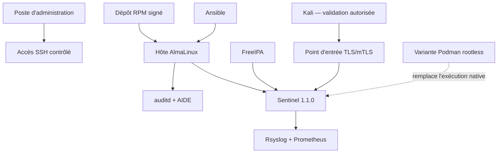

# Chapitre 14.1 — Déployer Sentinel sur une AlmaLinux minimale

> **Campagne 14 — Projet final**
>
> *« Un projet final commence par un état connu : ce qui n'est pas inventorié ne peut pas être qualifié. »*

## Vous êtes ici

```text
PARTIE III — Mise en situation

Campagne 14 — Projet final

► 14.1 Déployer Sentinel sur une AlmaLinux minimale
  14.2 Sécuriser l'hôte
  14.3 Intégrer FreeIPA
  14.4 Déployer avec Ansible
  14.5 Packager avec RPM
  14.6 Conteneuriser avec Podman
  14.7 Superviser et auditer
  14.8 Audit final et tests depuis Kali
```

## Objectifs pédagogiques

À l'issue de ce chapitre, vous serez capable de :

- transformer un besoin d'entreprise en architecture et critères d'acceptation ;
- préparer une AlmaLinux minimale sans supposer les composants des campagnes précédentes ;
- déployer le checkpoint Sentinel `1.1.0` dans un état de qualification initial ;
- distinguer installation classique, paquet RPM, automatisation Ansible et variante conteneurisée ;
- constituer un dossier de preuves dès le début du projet ;
- définir des scénarios d'échec et un retour arrière avant de durcir la plateforme.

## Pourquoi ce chapitre existe

Les campagnes précédentes ont étudié séparément le socle, les identités, le réseau, systemd, SELinux, TLS, FreeIPA, Ansible, RPM, Podman et l'observabilité. Le projet final ne doit pas recopier toutes ces procédures. Il doit démontrer qu'elles peuvent être **assemblées sans contradiction** et qu'un autre administrateur peut vérifier le résultat.

L'entreprise fictive **Asterion Services** prépare la mise en production interne de Sentinel. L'équipe sécurité exige un service reproductible, exploitable et auditable. Le système doit pouvoir être livré sous plusieurs formes, sans confondre leurs responsabilités.

## Le contrat du projet final

Le dépôt fournit aujourd'hui Sentinel `1.1.0`. Cette version expose uniquement les contrats déjà acquis :

```text
sentinel --version
sentinel status [--format text|json]
sentinel --config CHEMIN --check-config
sentinel --config CHEMIN serve
sentinel --config CHEMIN --healthcheck
```

et les routes :

```text
GET /health
GET /ready
GET /api/v1/status
GET /metrics
```

Le projet final **ne crée aucune nouvelle route, option CLI ou métrique**. Le jalon attendu est une qualification de l'assemblage, pas une évolution artificielle du code Python.

> **Décision de projet** — Sentinel reste en version applicative `1.1.0`. Le dossier de projet, les configurations, les artefacts RPM, Ansible, Podman et d'observabilité sont versionnés séparément.

## Architecture cible



Les chemins de livraison se répartissent ainsi :

| Approche | Rôle dans le projet | Relation aux autres |
| --- | --- | --- |
| installation classique | référence pédagogique et dépannage | base de comparaison |
| RPM | artefact natif, versionné et vérifiable | peut être installé manuellement ou par Ansible |
| Ansible | orchestration de l'état des hôtes | peut déployer le RPM, la configuration et les politiques |
| Podman | variante d'exécution isolée | remplace l'exécution native du service, ne s'y superpose pas |

Ansible et RPM se complètent naturellement : RPM possède les fichiers du logiciel, Ansible exprime l'état de la machine. Podman constitue en revanche une **variante de runtime** : une instance de qualification choisit soit le service natif, soit le conteneur pour un même point d'entrée fonctionnel.

## État initial du laboratoire

Préparez au minimum :

| Hôte | Rôle |
| --- | --- |
| `sentinel.sentinel.lab` | AlmaLinux minimale et service à qualifier |
| `ipa01.sentinel.example.test` | FreeIPA DNS, Kerberos, LDAP et CA |
| `control01.sentinel.lab` | nœud de contrôle Ansible |
| `observability.sentinel.lab` | Rsyslog, Prometheus, Alertmanager et Grafana |
| `kali.sentinel.lab` | tests externes autorisés |

Les noms et adresses sont adaptés au réseau isolé. N'utilisez pas les adresses documentaires des chapitres comme si elles étaient imposées.

### Prendre la baseline

Sur l'hôte Sentinel :

```bash
cat /etc/almalinux-release
uname -r
date -u
hostnamectl
ip -brief address
ip route
rpm -qa | sort > /root/packages-before.txt
systemctl --failed
getenforce
sudo firewall-cmd --state 2>/dev/null || true
```

**Résultat attendu :** aucun service Sentinel n'est supposé présent ; l'état réel de la VM est enregistré.

**Interprétation :** le projet doit pouvoir distinguer ce qu'il a ajouté de ce qui existait déjà.

## Préparer l'arborescence de preuves

Le dossier de preuves reste séparé du code applicatif :

```text
campagne-14-preuves/
├── 00-inventaire/
├── 01-hote/
├── 02-freeipa/
├── 03-ansible/
├── 04-rpm/
├── 05-podman/
├── 06-observabilite/
├── 07-audit-final/
├── incidents/
├── decisions/
└── risques-acceptes.md
```

N'enregistrez jamais de clé privée, mot de passe, fichier Vault déchiffré, ticket Kerberos ou secret Podman dans ce dossier.

## Déployer la référence classique

L'installation classique sert de point de qualification avant les méthodes industrialisées. Copiez le checkpoint `1.1.0` dans un espace de travail contrôlé puis suivez le contrat historique des installations manuelles.

```bash
sudo useradd --system --home-dir /var/lib/sentinel \
  --shell /sbin/nologin sentinel 2>/dev/null || true
sudo install -d -m 0750 -o root -g sentinel /opt/sentinel/src
sudo install -d -m 0750 -o root -g sentinel /etc/sentinel
sudo install -d -m 0750 -o sentinel -g sentinel /var/lib/sentinel
```

Copiez le contenu de `checkpoints/1.1.0/src/` vers `/opt/sentinel/src/` et la configuration de référence vers `/etc/sentinel/sentinel.conf`, en adaptant `state_directory` à `/var/lib/sentinel`.

### Qualifier le code avant le service

```bash
python3 /opt/sentinel/src/sentinel.py --version
python3 /opt/sentinel/src/sentinel.py \
  --config /etc/sentinel/sentinel.conf --check-config
```

**Résultat attendu :** la version annoncée est `1.1.0` et la configuration est acceptée.

**Interprétation :** le code et son contrat de configuration fonctionnent avant l'ajout de systemd, du réseau et de FreeIPA.

## Premiers critères d'acceptation

Conservez les preuves suivantes :

- version d'AlmaLinux et noyau ;
- inventaire des interfaces et routes ;
- paquets présents avant modification ;
- hash ou commit du checkpoint `1.1.0` utilisé ;
- résultat de `--version` et `--check-config` ;
- propriétaires et modes de `/opt/sentinel`, `/etc/sentinel` et `/var/lib/sentinel` ;
- absence de secret dans le dépôt et le dossier de preuves.

## Scénario d'échec — configuration non qualifiée

Introduisez dans une **copie temporaire** une valeur invalide, par exemple un port hors plage, puis exécutez :

```bash
python3 /opt/sentinel/src/sentinel.py \
  --config /tmp/sentinel-invalid.conf --check-config
```

Le contrôle doit échouer avant que le fichier actif ne soit remplacé.

**Interprétation :** un projet exploitable valide la configuration avant activation. Une erreur de saisie ne doit pas devenir une panne de production.

## Retour arrière de l'étape

Avant les chapitres suivants, le retour arrière consiste à :

1. arrêter le service s'il a été démarré pour un test ;
2. retirer uniquement les fichiers créés par cette étape ;
3. supprimer le compte `sentinel` seulement si aucune autre installation ne l'utilise ;
4. comparer la liste de paquets avec `packages-before.txt` ;
5. vérifier `systemctl --failed`, le réseau et l'accès d'administration.

Un snapshot peut accélérer le laboratoire, mais il ne remplace pas une procédure documentée.

## Livrables du chapitre

```text
00-inventaire/
├── architecture.md
├── matrice-hotes.md
├── versions.txt
├── packages-before.txt
└── checkpoint-sentinel.txt

decisions/
└── modes-de-deploiement.md
```

`modes-de-deploiement.md` doit indiquer explicitement quelle instance servira à qualifier l'installation native et laquelle, le cas échéant, servira à la variante Podman.

## Synthèse

- le projet final commence par une baseline et des critères, pas par du durcissement improvisé ;
- Sentinel reste en `1.1.0` tant que son contrat applicatif ne change pas ;
- RPM et Ansible peuvent se compléter ; Podman est une variante d'exécution ;
- le dossier de preuves est créé avant les opérations techniques ;
- une configuration invalide doit être refusée avant activation ;
- chaque étape possède un retour arrière explicite.

## Infographie de révision

```text
BESOIN ENTREPRISE
       ↓
ARCHITECTURE + MATRICE DE FLUX
       ↓
BASELINE ALMALINUX
       ↓
SENTINEL 1.1.0 QUALIFIÉ
       ↓
DOSSIER DE PREUVES
       ↓
DURCISSEMENT → IDENTITÉS → INDUSTRIALISATION → AUDIT
```

## Navigation

[← 13.1 — Reconnaissance](../campagne_13/13.1-reconnaissance.md) · [14.2 — Sécuriser l'hôte →](14.2-securiser-hote.md)