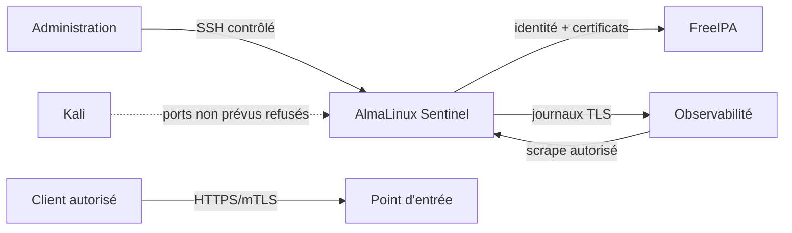

# Chapitre 14.2 — Sécuriser l'hôte

> **Campagne 14 — Projet final**
>
> *« Durcir un serveur n'est pas empiler des options : c'est réduire les capacités inutiles sans casser le service attendu. »*
## Vous êtes ici

```text
PARTIE III — Mise en situation

Campagne 14 — Projet final

  14.1 Déployer Sentinel sur une AlmaLinux minimale ✔
► 14.2 Sécuriser l'hôte
  14.3 Intégrer FreeIPA
  14.4 Déployer avec Ansible
  14.5 Packager avec RPM
  14.6 Conteneuriser avec Podman
  14.7 Superviser et auditer
  14.8 Audit final et tests depuis Kali
```

## Objectifs pédagogiques

À l'issue de ce chapitre, vous serez capable de :

- transformer l'inventaire initial en politique de durcissement vérifiable ;
- maintenir AlmaLinux à jour sans désactiver les mécanismes de sécurité pour résoudre un incident ;
- réduire l'exposition SSH et Firewalld selon une matrice de flux ;
- exploiter le sandboxing systemd et SELinux autour de Sentinel ;
- provoquer des refus contrôlés afin de vérifier que les protections sont réellement actives ;
- documenter les dépendances entre durcissement, disponibilité et retour arrière.

## Pourquoi ce chapitre existe

Un service sécurisé ne compense pas un hôte mal maîtrisé. À l'inverse, un durcissement trop agressif peut rendre impossible l'administration, la collecte des métriques, le renouvellement des certificats ou le démarrage de Sentinel.

Le projet final exige donc une démarche de qualification : **mesurer l'état, appliquer une décision, observer le résultat et conserver la preuve**.

## Construire la matrice de flux avant Firewalld

Complétez une matrice correspondant au laboratoire réel.

| Source | Destination | Service | Décision |
| --- | --- | --- | --- |
| administration | hôte Sentinel | SSH | autorisé depuis le réseau d'administration uniquement |
| client Sentinel | point d'entrée | HTTPS/mTLS | autorisé selon le besoin métier |
| Sentinel | FreeIPA | DNS, Kerberos, LDAP/LDAPS, CA selon architecture | autorisé |
| observabilité | Sentinel | métriques | autorisé depuis l'hôte de supervision |
| Sentinel | collecteur | Syslog TLS | autorisé |
| Kali | ports d'administration | SSH, métriques internes, Podman | refusés sauf scénario explicitement prévu |



Ne créez pas une règle parce qu'un chapitre antérieur utilisait un port. Chaque flux doit avoir un propriétaire et une justification dans l'architecture finale.

## Qualifier les mises à jour

Prenez l'état des dépôts et mises à jour :

```bash
sudo dnf repolist
sudo dnf check-update || true
rpm -q kernel systemd openssh-server firewalld selinux-policy
```

Appliquez les mises à jour dans la fenêtre de laboratoire :

```bash
sudo dnf upgrade --refresh
```

Si un nouveau noyau est installé, redémarrez dans le laboratoire puis vérifiez :

```bash
uname -r
systemctl --failed
getenforce
sudo firewall-cmd --state
```

**Résultat attendu :** l'hôte reste administrable, SELinux reste `Enforcing` et Firewalld actif.

**Interprétation :** une mise à jour n'est qualifiée qu'après redémarrage et tests de service lorsque le composant modifié l'exige.

## Réduire la surface de services

Inventoriez les unités actives et les sockets :

```bash
systemctl --type=service --state=running
systemctl list-sockets
sudo ss -lntup
```

Pour chaque écoute, classez-la :

```text
nécessaire au service
nécessaire à l'administration
nécessaire à l'observabilité
temporaire de laboratoire
inconnue → investigation obligatoire
```

Un service inconnu n'est pas supprimé à l'aveugle. Identifiez le paquet, sa dépendance et son rôle avant décision.

## Durcir SSH sans perdre l'accès

Conservez une console de secours avant toute modification. Vérifiez la configuration effective :

```bash
sudo sshd -T | sort
sudo sshd -t
```

Le projet doit au minimum démontrer :

- pas de connexion SSH directe de `root` ;
- authentification par clés pour les comptes d'administration prévus ;
- permissions correctes des fichiers de clés ;
- exposition réseau limitée à la zone d'administration ;
- journalisation des succès et refus ;
- délégation `sudo` minimale plutôt qu'un shell root permanent.

Après modification :

```bash
sudo sshd -t
sudo systemctl reload sshd
sudo journalctl -u sshd -n 50 --no-pager
```

Testez une **nouvelle** session avant de fermer la session de secours.

## Appliquer Firewalld selon la matrice

Photographiez d'abord l'état :

```bash
sudo firewall-cmd --get-active-zones
sudo firewall-cmd --list-all-zones
```

Appliquez les règles nécessaires, puis contrôlez la cohérence :

```bash
sudo firewall-cmd --check-config
sudo firewall-cmd --reload
sudo firewall-cmd --get-active-zones
```

Depuis chaque zone significative, vérifiez les flux autorisés **et les refus attendus**. Le test depuis Kali du chapitre 14.8 reprendra cette matrice.

> **Piège classique** — Un port filtré depuis Kali ne prouve pas que le service n'écoute pas. Associez toujours test externe et `ss -lntup` sur l'hôte.

## Réinstaller le service systemd durci

Lorsque l'installation native est utilisée, reprenez le contrat de l'unité fourni avec Sentinel `1.1.0`. Les propriétés essentielles sont :

```text
User=sentinel
Group=sentinel
Type=notify
NoNewPrivileges=true
PrivateTmp=true
PrivateDevices=true
ProtectSystem=strict
ProtectHome=true
ProtectKernelTunables=true
ProtectKernelModules=true
ProtectControlGroups=true
RestrictSUIDSGID=true
LockPersonality=true
CapabilityBoundingSet=
AmbientCapabilities=
RestrictAddressFamilies=AF_UNIX AF_INET AF_INET6
```

Validez l'unité :

```bash
sudo systemd-analyze verify /etc/systemd/system/sentinel.service
sudo systemctl daemon-reload
sudo systemctl enable --now sentinel.service
sudo systemctl status sentinel.service --no-pager
sudo systemd-analyze security sentinel.service
```

`systemd-analyze security` produit un indicateur heuristique, pas une certification. L'important est de justifier les permissions nécessaires au processus.

## Vérifier les permissions Linux

```bash
namei -l /etc/sentinel/sentinel.conf
namei -l /var/lib/sentinel
sudo -u sentinel test -r /etc/sentinel/sentinel.conf
sudo -u sentinel test -w /var/lib/sentinel
sudo -u sentinel test ! -w /etc/sentinel/sentinel.conf
```

**Résultat attendu :** Sentinel lit sa configuration, écrit son état et ne modifie ni la configuration ni son code.

## Maintenir SELinux en Enforcing

```bash
getenforce
ls -Zd /opt/sentinel /etc/sentinel /var/lib/sentinel 2>/dev/null || true
ls -Zd /usr/libexec/sentinel /usr/lib/systemd/system/sentinel.service 2>/dev/null || true
sudo ausearch -m AVC,USER_AVC -ts recent
```

Les chemins dépendent du mode natif choisi. Restaurez les contextes définis par la politique :

```bash
sudo restorecon -RFv /etc/sentinel /var/lib/sentinel
```

Ajoutez le chemin du code correspondant au déploiement actif.

Un AVC doit être diagnostiqué : processus, objet, type source, type cible, opération et besoin métier. **Ne passez pas SELinux en permissif comme correction.**

## Scénario d'échec — écriture interdite

Avec le compte de service :

```bash
sudo -u sentinel sh -c 'echo probe >> /etc/sentinel/sentinel.conf' || true
```

**Résultat attendu :** l'écriture échoue.

Vérifiez qu'aucune modification n'a eu lieu :

```bash
sudo stat /etc/sentinel/sentinel.conf
sudo -u sentinel /opt/sentinel/src/sentinel.py \
  --config /etc/sentinel/sentinel.conf --check-config 2>/dev/null || true
```

Adaptez la dernière commande à `/usr/libexec/sentinel/sentinel` si le RPM est déjà utilisé.

## Scénario d'échec — flux réseau non autorisé

Depuis Kali, testez uniquement un port qui doit être refusé, par exemple le port interne 8443 si l'architecture publie uniquement 443 :

```bash
nc -vz SENTINEL_IP 8443
```

Le refus doit être cohérent avec la politique. Depuis le client légitime, le véritable point d'entrée doit continuer à fonctionner.

## Preuves à conserver

```text
01-hote/
├── versions-apres-maj.txt
├── services-actifs.txt
├── sockets.txt
├── sshd-effectif.txt
├── firewalld.txt
├── systemd-sentinel.txt
├── permissions.txt
├── selinux.txt
└── tests-refus.txt
```

Ajoutez une note expliquant chaque exception de durcissement. Une exception documentée et bornée vaut mieux qu'une directive copiée dont personne ne connaît l'impact.

## Retour arrière

Pour chaque changement, conservez :

1. fichier ou état précédent ;
2. commande de validation avant activation ;
3. commande de restauration ;
4. accès de secours si SSH ou Firewalld sont concernés ;
5. test fonctionnel à rejouer après restauration.

Une règle de pare-feu ou une directive SSH qui bloque la gestion de la VM doit pouvoir être annulée depuis la console, pas uniquement via le canal qu'elle vient de casser.

## Synthèse

- la politique de durcissement découle des flux et responsabilités réels ;
- mises à jour, SSH, Firewalld, systemd et SELinux doivent être qualifiés ensemble ;
- le compte Sentinel lit sa configuration et écrit seulement son état ;
- SELinux reste `Enforcing` pendant les diagnostics ;
- les refus sont des preuves lorsque le service légitime continue à fonctionner ;
- chaque changement critique possède une voie de retour arrière.

## Navigation

[← 14.1 — Déployer Sentinel sur une AlmaLinux minimale](14.1-deployer-sentinel-almalinux-minimale.md) · [14.3 — Intégrer FreeIPA →](14.3-integrer-freeipa.md)