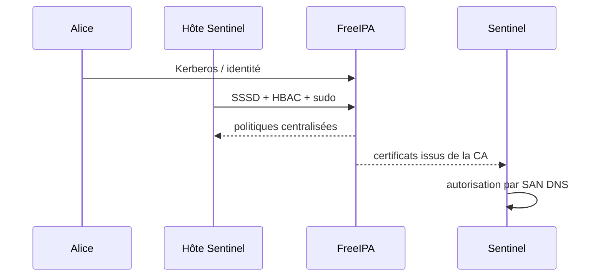
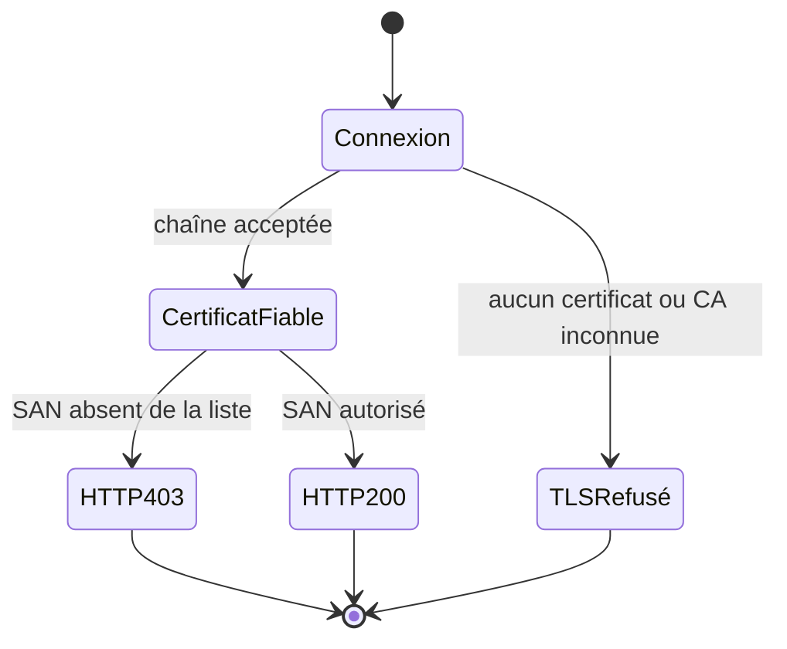

# Chapitre 14.3 — Intégrer FreeIPA

> **Campagne 14 — Projet final**
>
> *« Une identité centralisée n'a de valeur que si les autorisations et les refus restent lisibles. »*

## Vous êtes ici

```text
PARTIE III — Mise en situation

Campagne 14 — Projet final

  14.1 Déployer Sentinel sur une AlmaLinux minimale ✔
  14.2 Sécuriser l'hôte ✔
► 14.3 Intégrer FreeIPA
  14.4 Déployer avec Ansible
  14.5 Packager avec RPM
  14.6 Conteneuriser avec Podman
  14.7 Superviser et auditer
  14.8 Audit final et tests depuis Kali
```

## Objectifs pédagogiques

À l'issue de ce chapitre, vous serez capable de :

- intégrer l'hôte Sentinel au domaine FreeIPA déjà étudié ;
- vérifier séparément DNS, Kerberos, SSSD, HBAC et `sudo` ;
- obtenir et suivre les certificats nécessaires avec la CA FreeIPA ;
- activer mTLS sans confondre confiance cryptographique et autorisation Sentinel ;
- conserver des preuves sans exposer de `keytab`, clé privée ou secret ;
- retirer proprement l'intégration en cas d'échec.

## Pourquoi ce chapitre existe

La campagne 8 a construit les mécanismes. Le projet final doit maintenant démontrer qu'ils s'intègrent au serveur durci sans ouvrir de privilèges génériques.

Le modèle retenu conserve les acteurs pédagogiques déjà présents :

- `alice`, opératrice autorisée à administrer Sentinel dans un périmètre limité ;
- `claire`, auditrice en lecture ;
- `agent01`, client mTLS autorisé ;
- `agent02`, client signé par la même CA mais volontairement non autorisé par Sentinel.



## Préconditions

Avant l'enrôlement :

```bash
hostname -f
getent hosts ipa01.sentinel.example.test
dig +short _kerberos._udp.sentinel.example.test SRV
dig +short _ldap._tcp.sentinel.example.test SRV
timedatectl
```

Le FQDN, la résolution directe et inverse et l'heure doivent être cohérents. Un domaine Kerberos tolère mal une horloge incorrecte ; ne corrigez pas un problème de temps en élargissant les politiques d'authentification.

## Enrôler l'hôte

Utilisez la procédure FreeIPA déjà qualifiée dans la campagne 8 et les options adaptées au domaine réel. Après enrôlement, conservez uniquement les métadonnées non secrètes :

```bash
ipa-client-install --unattended [OPTIONS_VALIDÉES_DU_LABORATOIRE]
sssctl domain-status sentinel.example.test
id alice
getent group sentinel-operators
```

Ne capturez pas le contenu de `/etc/krb5.keytab`.

### Vérifier Kerberos

Depuis un compte de test :

```bash
kinit alice
klist
```

**Résultat attendu :** un TGT valide est obtenu pour le royaume attendu.

Supprimez le ticket à la fin de la preuve :

```bash
kdestroy
```

## Appliquer HBAC et `sudo`

La matrice finale doit exprimer les actions, pas des profils vagues.

| Identité | Cible | Action | Résultat |
| --- | --- | --- | --- |
| `alice` | SSH Sentinel | connexion | autorisée |
| `alice` | Sentinel | status/restart prévus | autorisés via `sudo` |
| `alice` | `sshd` | restart | refusé |
| `claire` | dossier de preuves | lecture | autorisée selon le stockage choisi |
| `claire` | Sentinel | restart | refusé |
| utilisateur hors groupe | SSH Sentinel | connexion | refusée par HBAC |

Validez avant de retirer une règle de secours :

```bash
ipa hbactest --user=alice --host=sentinel.sentinel.lab --service=sshd
sudo -l -U alice
```

Depuis une session Alice :

```bash
sudo systemctl status sentinel.service
sudo systemctl restart sentinel.service
sudo systemctl restart sshd.service
```

La dernière commande doit être refusée.

> **Règle de projet** — Ni `sudo ALL`, ni une règle HBAC générale ne sont acceptables comme solution à un problème de qualification.

## Émettre les certificats

Le projet réutilise le modèle de la campagne 8 : clés privées créées sur les hôtes qui les consomment, certificats suivis avec `certmonger` et CA FreeIPA.

Les identités minimales sont :

```text
sentinel.sentinel.lab        → certificat serveur
healthcheck.sentinel.example.test → certificat client de santé
agent01.sentinel.example.test     → client autorisé
agent02.sentinel.example.test     → client fiable mais non autorisé
```

Après émission, vérifiez sans afficher les clés :

```bash
getcert list
openssl x509 -in /etc/sentinel/tls/server.crt \
  -noout -subject -issuer -dates -ext subjectAltName
stat -c '%U %G %a %n' /etc/sentinel/tls/*
```

La demande utile doit être en état de suivi normal, par exemple `MONITORING` selon la version de `certmonger`.

## Configurer Sentinel pour mTLS

La configuration doit conserver les paramètres réellement supportés par `1.1.0` :

```ini
[tls]
enabled = true
certificate = /etc/sentinel/tls/server.crt
private_key = /etc/sentinel/tls/server.key
client_ca = /etc/ipa/ca.crt
require_client_certificate = true

[healthcheck]
server_name = sentinel.sentinel.lab
certificate = /etc/sentinel/tls/healthcheck.crt
private_key = /etc/sentinel/tls/healthcheck.key

[identity]
allowed_dns_names = healthcheck.sentinel.example.test, agent01.sentinel.example.test
```

Validez **avant** redémarrage :

```bash
sudo -u sentinel CHEMIN_SENTINEL \
  --config /etc/sentinel/sentinel.conf --check-config
sudo systemctl restart sentinel.service
sudo systemctl status sentinel.service --no-pager
```

`CHEMIN_SENTINEL` vaut le lanceur du mode de déploiement actif, par exemple `/usr/libexec/sentinel/sentinel` après installation RPM.

## Campagne d'acceptation mTLS



Exécutez quatre cas distincts.

| Test | Résultat attendu | Couche prouvée |
| --- | --- | --- |
| aucun certificat client | échec TLS | authentification mutuelle |
| certificat d'une CA inconnue | échec TLS | chaîne de confiance |
| `agent02` signé | HTTP `403` | autorisation Sentinel |
| `agent01` signé sur `/health` | HTTP `200` | identité autorisée |

Exemple pour le client autorisé :

```bash
curl --fail --cacert CA.crt \
  --cert agent01.crt --key agent01.key \
  https://sentinel.sentinel.lab/health
```

Pour `agent02`, ne passez pas `--fail` si vous souhaitez conserver explicitement le code HTTP :

```bash
curl --cacert CA.crt --cert agent02.crt --key agent02.key \
  -o /dev/null -sS -w '%{http_code}\n' \
  https://sentinel.sentinel.lab/health
```

**Résultat attendu :** `403`.

## Vérifier les traces

```bash
sudo journalctl -u sentinel --since '-10 min' --no-pager
sudo journalctl -u sshd --since '-10 min' --no-pager
sudo ausearch -ts recent -m USER_AUTH,USER_LOGIN -i
```

Le refus TLS peut apparaître dans une couche différente d'un `403` applicatif. Le dossier de preuves doit conserver cette distinction.

## Scénario d'échec — certificat non encore disponible

Désactivez temporairement le chemin vers une copie de certificat de laboratoire ou utilisez une configuration de test qui référence un fichier inexistant. Exécutez uniquement :

```bash
sudo -u sentinel CHEMIN_SENTINEL \
  --config /tmp/sentinel-mtls-invalid.conf --check-config
```

Le fichier actif ne doit pas être remplacé si la validation échoue.

## Preuves à conserver

```text
02-freeipa/
├── dns-et-temps.txt
├── enrôlement.txt
├── sssd.txt
├── hbac.txt
├── sudo.txt
├── certificats-metadonnees.txt
├── certmonger.txt
├── mtls-acceptation.txt
└── traces.txt
```

Expurgez toute donnée qui révélerait une clé, un ticket ou un secret. Une preuve de permissions (`stat`) suffit ; le contenu privé n'est jamais une preuve à remettre.

## Retour arrière

Le retrait suit l'ordre des dépendances :

1. restaurer la configuration Sentinel précédente et valider le service ;
2. arrêter les suivis de certificats devenus inutiles, puis révoquer si nécessaire ;
3. retirer les autorisations applicatives ;
4. retirer les règles `sudo` et HBAC spécifiques ;
5. désenrôler l'hôte seulement si le projet exige réellement de quitter le domaine ;
6. vérifier DNS, SSH local de secours et service Sentinel.

Une identité compromise n'est jamais « restaurée » par simple retour à un ancien fichier : elle doit être renouvelée ou révoquée.

## Synthèse

- DNS et heure sont des préconditions de l'identité centralisée ;
- Kerberos, SSSD, HBAC et `sudo` se valident séparément ;
- les clés privées restent sur leurs hôtes de consommation ;
- une CA fiable ne signifie pas qu'un client est autorisé par Sentinel ;
- `agent02 → 403` est une preuve essentielle de cette séparation ;
- l'intégration possède une procédure de retrait et de renouvellement.

## Infographie de révision

```text
DNS + TEMPS
    ↓
ENRÔLEMENT IPA
    ↓
KERBEROS + SSSD
    ↓
HBAC + SUDO
    ↓
CERTIFICATS SUIVIS
    ↓
MTLS
    ↓
AUTORISATION SENTINEL PAR SAN
```

## Navigation

[← 14.2 — Sécuriser l'hôte](14.2-securiser-hote.md) · [14.4 — Déployer avec Ansible →](14.4-deployer-ansible.md)