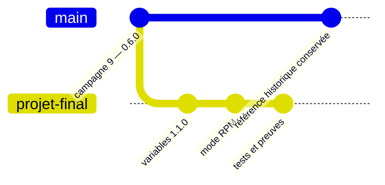
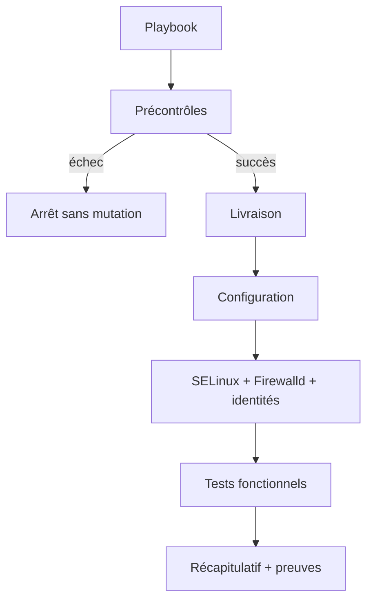

# Chapitre 14.4 — Déployer avec Ansible

> **Campagne 14 — Projet final**
>
> *« Automatiser ne signifie pas rejouer plus vite une procédure fragile ; cela signifie rendre l'état attendu explicite et vérifiable. »*

## Vous êtes ici

```text
PARTIE III — Mise en situation

Campagne 14 — Projet final

  14.1 Déployer Sentinel sur une AlmaLinux minimale ✔
  14.2 Sécuriser l'hôte ✔
  14.3 Intégrer FreeIPA ✔
► 14.4 Déployer avec Ansible
  14.5 Packager avec RPM
  14.6 Conteneuriser avec Podman
  14.7 Superviser et auditer
  14.8 Audit final et tests depuis Kali
```

## Objectifs pédagogiques

À l'issue de ce chapitre, vous serez capable de :

- réutiliser le projet Ansible de la campagne 9 sans casser son jalon historique `0.6.0` ;
- créer une adaptation dédiée au projet final et au checkpoint `1.1.0` ;
- choisir clairement entre copie de sources et installation du RPM ;
- automatiser configuration, service, FreeIPA et contrôles sans transporter les clés privées ;
- démontrer l'idempotence par un second passage `changed=0` ;
- préserver l'ancien état lorsqu'une validation préalable échoue.

## Pourquoi ce chapitre existe

Le répertoire `sentinel/labs/ansible/` est une implémentation de référence de la campagne 9. Il est volontairement configuré pour Sentinel `0.6.0`, installé sous `/opt/sentinel`. Modifier directement ses valeurs par défaut en `1.1.0` rendrait la campagne 9 non reproductible.

Le projet final doit donc **réutiliser sans réécrire l'histoire** : copiez la structure dans un espace de travail séparé ou créez une couche de variables/playbooks dédiée à la campagne 14.



## Définir la stratégie de livraison

Deux stratégies natives sont acceptables, mais le dossier doit n'en retenir qu'une comme cible principale.

### Variante A — Ansible copie le checkpoint

Cette variante prolonge directement la campagne 9 :

```text
Ansible → compte + chemins → sources 1.1.0 → configuration → systemd
```

Elle reste pédagogique, mais le système de paquets ne possède pas les fichiers applicatifs.

### Variante B — Ansible installe le RPM

Cette variante est recommandée pour l'assemblage final :

```text
Build RPM → signature → dépôt DNF → Ansible → dnf install sentinel → configuration → politiques
```

RPM devient propriétaire du code et de l'unité ; Ansible orchestre la version installée, les paramètres d'environnement, Firewalld, FreeIPA, certificats et observabilité.

> **Décision d'architecture** — Ne copiez pas les mêmes fichiers avec Ansible et RPM. Deux outils ne doivent pas se croire simultanément propriétaires de `/usr/libexec/sentinel/` ou de l'unité paquetée.

## Préparer une adaptation du projet

Conservez le projet original intact :

```bash
cp -a sentinel/labs/ansible ~/sentinel-campagne-14-ansible
cd ~/sentinel-campagne-14-ansible
```

Versionnez cette adaptation dans le dépôt de travail de l'apprenant, pas nécessairement dans le dépôt public de la formation si elle contient un inventaire réel.

Les variables publiques peuvent devenir :

```yaml
sentinel_version: "1.1.0"
sentinel_delivery_mode: rpm
sentinel_package_name: sentinel
sentinel_config_path: /etc/sentinel/sentinel.conf
sentinel_state_directory: /var/lib/sentinel
sentinel_listen_address: 127.0.0.1
sentinel_listen_port: 8443
sentinel_tls_enabled: true
```

Les noms de variables sont un contrat du **projet final de l'apprenant**. Ils ne supposent pas qu'ils existent déjà dans le laboratoire historique.

## Qualifier le contrôleur

Avant toute modification distante :

```bash
ansible --version
ansible-config dump --only-changed
ansible-galaxy collection list
ansible-inventory --graph
ansible all -m ansible.builtin.ping
```

Conservez également `requirements.yml` avec des versions ou plages maîtrisées selon la politique du projet.

L'option suivante est interdite comme solution de facilité :

```text
host_key_checking = False
```

La confiance SSH du contrôleur fait partie du modèle de sécurité.

## Précontrôles obligatoires

Le playbook doit échouer avant mutation si un élément essentiel manque :

- FQDN incohérent avec l'inventaire ;
- plateforme non supportée ;
- variable obligatoire absente ;
- dépôt RPM indisponible en mode RPM ;
- certificat attendu absent avant activation mTLS ;
- configuration Sentinel invalide ;
- domaine FreeIPA non découvrable lorsque l'enrôlement est demandé.



## Exemple de lot RPM avec Ansible

Lorsque le paquet est publié dans le dépôt privé :

```yaml
- name: Installer la version qualifiée de Sentinel
  ansible.builtin.dnf:
    name: "sentinel-{{ sentinel_version }}"
    state: present
```

N'utilisez une version exacte que si le dépôt et la politique de mise à niveau sont conçus pour cela. Dans un autre modèle, un dépôt de promotion distinct peut exprimer la version autorisée sans verrouiller chaque tâche.

La configuration d'environnement reste gérée par un template :

```yaml
- name: Déployer la configuration Sentinel
  ansible.builtin.template:
    src: sentinel.conf.j2
    dest: /etc/sentinel/sentinel.conf
    owner: root
    group: sentinel
    mode: "0640"
    validate: >-
      /usr/libexec/sentinel/sentinel
      --config %s --check-config
  notify: Redémarrer Sentinel
```

La validation précède le remplacement du fichier actif.

## FreeIPA et certificats

Réutilisez les rôles et collections de la campagne 9 pour :

1. vérifier DNS et heure ;
2. enrôler l'hôte si nécessaire ;
3. appliquer les groupes, HBAC et délégations prévues ;
4. demander localement les certificats avec le mécanisme FreeIPA/certmonger ;
5. attendre leur disponibilité ;
6. activer seulement ensuite la configuration mTLS ;
7. valider `/health`, `/ready` et les refus attendus.

La clé privée ne doit pas être copiée depuis `control01`. L'automatisation configure la demande ; l'hôte produit et conserve son matériau privé.

## Vérifier le résultat du playbook

Un playbook réussi ne suffit pas. Ajoutez des tâches ou un playbook de vérification qui démontre :

```bash
sentinel --version
systemctl is-active sentinel.service
getenforce
firewall-cmd --state
```

et, selon le mode installé :

```bash
rpm -q sentinel
rpm -V sentinel
```

Pour les tests applicatifs :

```bash
/usr/libexec/sentinel/sentinel \
  --config /etc/sentinel/sentinel.conf --check-config
/usr/libexec/sentinel/sentinel \
  --config /etc/sentinel/sentinel.conf --healthcheck
```

## Prouver l'idempotence

Exécutez le déploiement une première fois :

```bash
ansible-playbook playbooks/site.yml --limit sentinel_servers
```

Sans changer le commit, l'inventaire, les variables ni les dépendances, rejouez exactement la même commande.

**Critère obligatoire :** le second passage converge vers :

```text
changed=0
failed=0
```

Si une tâche change encore, ne masquez pas le problème avec `changed_when: false` sauf lorsque l'opération est réellement une lecture dont le module ne peut pas déduire l'état. Identifiez la première dérive et corrigez le contrat.

## Scénario d'échec — configuration invalide

Dans une branche de test, fournissez une valeur invalide. Le `validate` du template doit empêcher le remplacement :

```bash
ansible-playbook playbooks/site.yml --limit sentinel_servers
```

Conservez ensuite :

```bash
systemctl is-active sentinel.service
sha256sum /etc/sentinel/sentinel.conf
```

**Résultat attendu :** le playbook est en échec, mais le service et la configuration précédemment qualifiés restent actifs.

## Scénario d'échec — hôte hors contrat

Ajoutez une VM témoin dont le FQDN ou le domaine ne correspond pas aux préconditions. Les assertions doivent l'arrêter avant installation ou enrôlement partiel.

Le rapport doit répondre à :

```text
symptôme :
couche :
précontrôle déclenché :
état laissé sur la cible :
correction :
test après correction :
```

## Preuves à conserver

```text
03-ansible/
├── version-ansible.txt
├── collections.txt
├── inventaire.txt
├── syntax-check.txt
├── premier-passage.txt
├── second-passage-idempotent.txt
├── verify.txt
├── echec-configuration.txt
└── dependances.md
```

Les sorties sont expurgées des secrets. Un `--diff` peut révéler des valeurs sensibles : ne l'activez pas globalement sans revue des tâches.

## Retour arrière

Le projet définit le dernier commit Ansible connu, la version RPM précédente éventuelle et l'ordre de restauration :

1. arrêter la promotion de la version fautive ;
2. restaurer les variables ou le paquet précédents ;
3. rejouer le playbook depuis le commit qualifié ;
4. ne jamais restaurer une clé privée compromise ;
5. rejouer les tests fonctionnels, mTLS et d'observabilité ;
6. vérifier de nouveau l'idempotence.

## Synthèse

- le laboratoire Ansible de la campagne 9 reste figé sur son jalon `0.6.0` ;
- le projet final crée une adaptation séparée pour `1.1.0` ;
- RPM et Ansible se complètent lorsqu'un seul outil possède chaque type d'objet ;
- les clés privées restent sur leurs hôtes ;
- la validation doit précéder la mutation ;
- un second passage `changed=0` est une preuve obligatoire de convergence.

## Infographie de révision

```text
RÉFÉRENCE CAMPAGNE 9 (0.6.0)
            │
            └──► ADAPTATION PROJET FINAL (1.1.0)
                         ↓
                  PRÉCONTRÔLES
                         ↓
                RPM + CONFIG + IPA
                         ↓
                 TESTS FONCTIONNELS
                         ↓
                 SECOND PASSAGE
                    changed=0
```

## Navigation

[← 14.3 — Intégrer FreeIPA](14.3-integrer-freeipa.md) · [14.5 — Packager avec RPM →](14.5-packager-rpm.md)